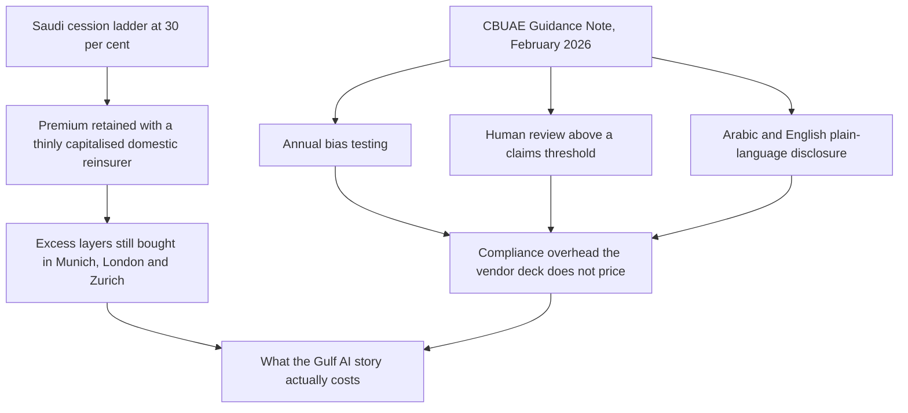

"The InsurAI is more than just a platform, it's a statement of intent," Tawuniya's chief technology officer told the audience at the Riyadh event where the Cooperative Insurance Company launched its accelerator programme. He was, in that phrasing, doing what Gulf executives do well: turning a procurement decision into a policy stance. Read alongside two harder-edged documents from the same country, and one from across the border, the statement of intent takes on a shape that the compliance department has to actually cost out.

The two Saudi documents are the [Insurance Authority's licensing of Riyadh Reinsurance Company on 10 November 2025 with SAR 550m of capital](https://www.globalreinsurance.com/home/riyadh-re-launches-with-146m-capital-to-build-saudi-reinsurance-hub/1456892.article), and the [mandatory cession ladder that reached 30 per cent on 1 January 2025](https://www.insurancebusinessmag.com/reinsurance/news/breaking-news/sandp-upgrades-saudi-re-outlook-as-mandatory-cessions-drive-accelerated-growth-558110.aspx). The ladder took 20 per cent of every reinsurance treaty in 2023 and 25 per cent in 2024. It stands at 30 per cent now. Backwards, the sequence gives the strategy: the Kingdom is trying to keep more of the premium at home, build a domestic reinsurer to absorb it, and grow the sector's [share of non-oil GDP from 2.59 per cent in 2024 toward 4.3 per cent by 2030](https://english.aawsat.com/business/5232425-saudi-arabia%E2%80%99s-national-insurance-strategy-new-engine-non-oil-gdp-growth). Forwards, it gives the AI story from the underwriter's chair instead of the CTO's.

## Where the cession ladder hurts

A retention ratio is a balance-sheet decision fixed by a reinsurance treaty. When the regulator moves the local retention floor from 20 per cent to 30 per cent in three years, every ceding company in Saudi Arabia is doing the same calculation: how much of my aggregate limit am I now legally required to hand to a local counterparty, and can that counterparty write me at competitive terms? [S&P Global assigned Riyadh Re an 'A-' financial-strength rating at launch](https://www.spglobal.com/ratings/en/regulatory/article/-/view/type/HTML/id/3475601), decent enough to satisfy ceding companies for standard motor and property lines. Thin capital, though, for the catastrophe covers Vision 2030's infrastructure build will eventually need.

The reinsurance chorus a Saudi risk manager sings from is well known to anyone who reads the numbers. Gross written premiums of SAR 76.1bn in 2024. A market forecast to grow at [5.9 per cent CAGR through 2030 per the Alpen Capital 2026 GCC Insurance Industry report](https://alpencapital.com/wp-content/uploads/2026/05/Alpen-Capital_GCC-Insurance-Industry_final.pdf), the highest single-market growth rate in the region. A regional aggregate GWP that Alpen projects at US$61.8bn by decade end. Against that growth, the [Swiss Re sigma issued 15 July 2026](https://www.swissre.com/institute/research/sigma-research/sigma-2026-07-world-insurance.html) has the global industry slowing to 0.6 per cent real non-life growth in 2026, and warns that geopolitical fragmentation has become "a structural feature." A growing regional book, a stagnant global book, a mandated local counterparty of thin capitalisation. The AI question rides on top of that.

## The Guidance Note the underwriter has to price

On 11 February 2026, the [Central Bank of the UAE published a Guidance Note on the responsible use of AI and ML by licensed financial institutions](https://rulebook.centralbank.ae/en/rulebook/guidance-note-consumer-protection-and-responsible-adoption-and-use-artificial-intelligence). Not legally binding, its authors were careful to say. Anyone who has read a "not legally binding" supervisory expectation from a Gulf central bank knows what that phrase is worth: it is the audit basis every internal-audit function will now write against, and the standard the supervisory dialogue will proceed on.

The note lands on the actuarial function in three places, and each one is a line item. Human oversight is mandatory in "high-impact decision-making," which in insurer language means claims denials, underwriting refusals, and pricing decisions above a threshold. Fully automated denials without human review are, per the guidance, unlikely to meet supervisory expectations. Bias testing must be run at least annually and after any model upgrade, on representative training data. And disclosure has to be in plain-language Arabic and English, with telephone support in all major UAE languages. None of that shows up in the AI vendor demo.

For a carrier writing motor in Sharjah and health in Riyadh, that Guidance Note translates into something concrete: the "InsurAI" statement of intent has to be paired with a bias-testing pipeline, a documented human-review threshold, and an Arabic-dialect NLP capability that most vendors still cannot deliver at scale. The [Tawuniya–SAS fraud-detection partnership on health claims](https://www.samenacouncil.org/samena_daily_news?news=82346) is a good example of what the compliant version looks like: a named vendor, a scoped line of business, and a human reviewer at the decision point. The non-compliant version is any of the dozen agent proofs-of-concept that get shown at GITEX every year with no clear owner for the model-risk register.

## Governance is where the AI story fails first

[Grant Thornton's 2026 industry survey](https://www.insurancejournal.com/news/national/2026/04/30/867821.htm), reported in Insurance Journal on 30 April 2026, found that 44 per cent of insurance executives said governance or compliance issues had contributed to AI project failure or underperformance. Only 24 per cent were very confident they could pass an independent AI governance review inside 90 days. Those numbers come from a global sample, and I would not read them as evidence against Riyadh Re's underwriting book directly. But they name the failure mode the CBUAE guidance is trying to prevent, and the mode a Saudi supervisor reading the same wire will worry about. An [older SSRN paper by Rishabha Garg on tiered intelligence architecture for GCC insurance](https://papers.ssrn.com/sol3/papers.cfm?abstract_id=6716458) makes the point more sharply: the GCC insurance sector does not lack models, it lacks the alignment between decision structure, system maturity, and data governance that would let those models be safely deployed. The paper predates this year's supervisory push, which is why it is worth reading. The structural gap was there before the regulator noticed it.

The Saudi Insurance Authority is trying to build reinsurance capacity at home while the CBUAE is raising the compliance cost of the automation that would otherwise help fund that build. Riyadh Re opens with a domestic subsidy in the form of the mandatory cession, and a strong parent balance sheet. The question its CFO cannot yet answer is what the model-risk capital charge will look like on the day the Saudi regulator adopts a version of the CBUAE line. The Kingdom's insurance strategy has already put technology and artificial intelligence among its 11 formal programmes; the timing question is when the governance workstream catches up to the deployment workstream.

The capital treatment is where the story finally becomes numeric. Under Solvency II analogues that most GCC regulators now cite in supervisory dialogue, an operational-risk capital charge is calibrated to the frequency and severity of loss events at the process the model actually touches. A pricing model that gets audit-flagged for undocumented drift, or a claims-triage agent that gets clawed back for undisclosed automation, moves the operational-risk line item in the SCR calculation. A Gulf CFO who owns that line item watches the ORSA review the way a treasurer watches a covenant. In the last four quarterly disclosures from the major GCC carriers, the model-risk capital charge is either absent or folded into an operational-risk line item that hides the number. The silence is itself the datum: the charge is either small enough to be embarrassing, or being worked on quietly.

## What a Gulf carrier is really buying

The picture underneath the phrasing is prosaic. A Saudi carrier ceding to Riyadh Re at 30 per cent is buying domestic capacity for its base treaty and going to Munich, London and Zurich for the excess layers. A UAE carrier deploying an underwriting-automation platform under the CBUAE guidance is buying a supervised system, with an Arabic-language disclosure, an annual bias test, and a documented human reviewer above a claims threshold. The AI tailwind is smaller than the vendor deck claims. It comes with a compliance overhead the vendor deck does not price. Neither purchase is glamorous. Both are the actual shape of the AI story in Gulf insurance in 2026, much closer to a treaty renewal cycle than to a keynote.

## Note from the treaty desk

For the underwriter in Riyadh or Abu Dhabi looking at Q3 renewals, the practical implication is small and specific. The domestic cession piece has hardened into a regulatory floor, and the negotiation now happens above that floor. The Guidance Note carries the force of supervisory expectation without the force of law, and it will become the basis on which the internal-audit function grades the AI stack. The macro tailwind is real: a 4.9 per cent regional CAGR, a Vision 2030 push to nearly double the sector's non-oil-GDP share, and the highest single-market growth rate in the GCC. The reinsurer opens at A-, the guidance note opens at "not binding," and the sector opens the second half of 2026 doing what insurance always does under uncertainty: buying capacity, watching claims, and writing what it can defend to an auditor.

---

Tarry Singh is the founder and CEO of [Real AI](https://realai.eu), an enterprise AI advisory and deployment firm working with global enterprises on production agent systems, model risk, and AI sovereignty strategy. He also leads [Earthscan](https://earthscan.io) for Energy AI startup, and is a founding contributor to the EU-funded HCAIM and PANORAIMA programmes for responsible AI education across European universities. He writes at [tarrysingh.com](https://tarrysingh.com).
