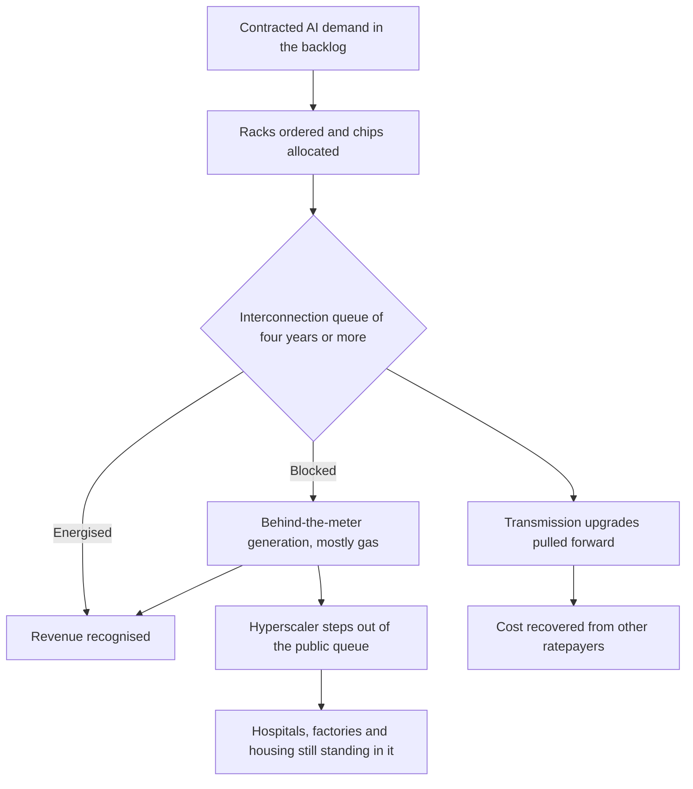

# Short of Space or Power

Microsoft is sitting on roughly $80 billion of Azure orders it cannot fill. The demand has never been stronger and the chips are buyable. It cannot get the power. On its most recent earnings call the company was unusually plain about it: the constraint was space and electricity, not silicon, and executives told analysts the shortage would run through at least the end of the fiscal year in June 2026 ([Directions on Microsoft](https://www.directionsonmicrosoft.com/microsoft-q1-fy26-earnings-cloud-supply-constraints-to-last-through-at-least-june-2026/)).

The most valuable company on Earth, with functionally unlimited capital and first call on every advanced accelerator Nvidia ships, is capacity-constrained by the electrical grid. The GPU was the bottleneck everyone spent 2024 fighting over. What decides who gets to build now is a transformer, a transmission line, and a queue.

## The backlog Microsoft cannot energise

Microsoft's spend shows where the pain is. The company is tracking toward $120 billion or more of capital expenditure in fiscal 2026, having already put $37.5 billion to work in a single quarter, of which $11.1 billion went to data-centre leases alone ([DCD](https://www.datacenterdynamics.com/en/news/microsoft-spent-111bn-on-data-center-leases-alone-in-q1-2026/)). The contracted commercial backlog, the orders on the books waiting to be served, was reported at around $627 billion. And still, $80 billion of it cannot be energised, a figure Microsoft itself has attributed to power availability rather than any softness in demand ([Latitude Media](https://www.latitudemedia.com/news/microsoft-plans-80b-for-data-centers-as-power-constraints-loom/)).

Those numbers together are uncomfortable for anyone still modelling AI as a compute-supply story. Capital is available. Chips, mostly, are available. Grid capacity for a quarter-megawatt rack of new demand is not.

This should also reframe the tired argument about an AI bubble. A bubble bursts when demand turns out to be imaginary. Microsoft is describing the opposite failure mode: demand it can prove, contracted and signed and sitting in the backlog, that it physically cannot serve. The near-term risk to these businesses is that revenue gets capped by how quickly a utility can build a substation. That is a stranger and more durable constraint than overbuilding, and it does not clear with a quarter or two of financial discipline.

## Chips were the story we could see

There is a reason we all missed this. A GPU is countable, glamorous and financeable. You can put a number on a slide and a purchase order behind it. A grid interconnection is none of those things. It is a multi-year queue managed by a regional transmission operator, and it does not care how much money you have.

In the major American markets the wait to connect a large new load now stretches beyond four years, and the historically obvious places to build, Northern Virginia's Data Center Alley and swathes of Texas, have started turning projects away because the local grid is simply full ([Data Center Knowledge](https://www.datacenterknowledge.com/next-gen-data-centers/microsoft-ai-surge-exposes-data-center-capacity-gap)). You cannot buy your way to the front of that line the way you can pay a premium for allocation on next quarter's accelerators.

The macro picture makes the constraint concrete. The IEA's *Energy and AI* report puts global data-centre electricity consumption on course to roughly double to about 945 terawatt-hours by 2030, a little more than Japan consumes today, with the United States accounting for nearly half of its own electricity-demand growth over that window. By the end of the decade, on the IEA's numbers, America is set to use more electricity running data centres than it uses to make aluminium, steel, cement and chemicals combined ([IEA](https://www.iea.org/reports/energy-and-ai/executive-summary)). That is heavy-industry energy demand wearing a technology logo.

And the IEA adds the quiet line that Microsoft's $80 billion already made loud: on current grid constraints, roughly a fifth of planned data-centre projects worldwide are at risk of delay. The polite macro forecast and the blunt corporate disclosure are describing the same wall.

None of this is the sort of constraint that capital dissolves quickly. A grid connection is high-voltage transformers with multi-year lead times, transmission corridors that need permitting through counties that get a vote, and a queue run by an operator whose remit is keeping the lights on for everyone. Accelerating one customer's growth curve sits outside that remit. You can will a fab into existence in three years if you spend enough. You cannot will a transmission line through a town that does not want one.

## So the hyperscalers are becoming utilities

If you cannot get power from the grid on the grid's timetable, you stop asking the grid. You build your own. That is why the behind-the-meter story has gone from fringe to standard in eighteen months: on-site gas turbines, fuel cells, long-term nuclear offtake, and the entire small-modular-reactor prospectus. In the near term the winner is unambiguous: natural gas. The IEA models gas generation expanding by around 175 terawatt-hours largely to feed American data centres. The reactor announcements are real contracts wrapped around mostly fictional timelines; nothing at meaningful scale arrives before the 2030s, so any slide promising a data-centre SMR in 2027 is marketing.

This vertical integration is entirely rational for each hyperscaler and quietly corrosive for everyone else. A firm that builds its own generation steps out of the queue that a hospital, a factory, or a housing development still has to stand in. Where it stays on the public system, its load pulls forward transmission upgrades whose cost has a way of landing on every other ratepayer's bill. That dynamic is precisely why Microsoft has had to start publicly committing to "full electricity cost recovery" in the communities that host it ([POWER Magazine](https://www.powermag.com/microsoft-commits-to-full-electricity-cost-recovery-in-data-center-communities/)). A company the size of a small nation has had to promise it will pay for the power it uses. That tells you what the default was.

The scale is bigger than one firm. The top hyperscalers are set to spend somewhere between $600 and $690 billion on infrastructure in 2026, roughly three-quarters of it aimed at AI ([Futurum](https://futurumgroup.com/insights/ai-capex-2026-the-690b-infrastructure-sprint/)). They are collectively committing the capital expenditure of a mid-sized economy to buildings they cannot always switch on.

## Planning capacity in 2026

Power is the primary capacity constraint now, ahead of GPUs. Whether your cloud provider can sell you reserved capacity in a given region next year is an electrical-engineering question before it is a commercial one. Ask where the capacity physically sits, ask when the substation upgrade energises, and ask, in writing, what happens to your commitments if it slips, because it will.

Interrogate the energy story behind any "AI-ready" facility the way you already interrogate a vendor benchmark. A handsome power-purchase agreement with a wind farm three states away does not keep an inference cluster warm at six o'clock on a windless January evening. Dispatchable power does, and today that mostly means gas. Know what is actually behind the meter.

For the Europeans reading, the grid arithmetic is a sovereignty arithmetic. A continent that cannot connect a gigawatt of new load inside an investment horizon cannot host the compute, whatever its declared ambitions, and will end up renting it from whoever can. The chip export-control debate gets the headlines. The interconnection queue decides the result.

## The constraint moved

For two years the contest was who could buy the most silicon. For the next two it is who can move the most electrons to a specific patch of ground by a specific date. Microsoft, with more money than almost any entity alive, has just admitted it cannot always win that race.

The bottleneck left the fab and moved to the substation, and most strategy decks have not caught up. The ones that do will stop counting accelerators and start reading grid-interconnection queues. That slide is duller than an accelerator count, and finally an honest one.

---

Tarry Singh is the founder and CEO of Real AI (realai.eu), an enterprise AI advisory and deployment firm working with global enterprises on production agent systems, model risk, and AI sovereignty strategy. He also leads Earthscan (earthscan.io) for Energy AI, and is a founding contributor to the EU-funded HCAIM and PANORAIMA programmes for responsible AI education across European universities. He writes at tarrysingh.com.
