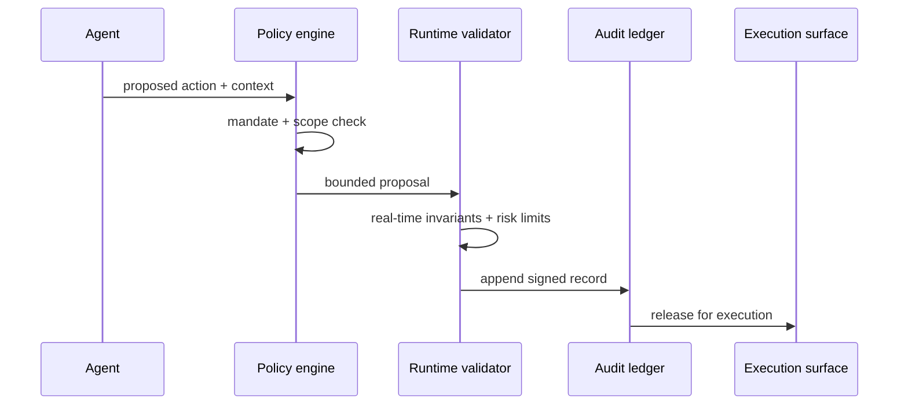

The most useful document I have read on agentic AI this year came from a central bank: [Safeguards for Agentic Finance at Runtime](https://www.mas.gov.sg/-/media/mas-media-library/development/fintech/ai-safr/safr.pdf), the SAFR whitepaper the Monetary Authority of Singapore published on 3 July 2026. It runs to 30-odd pages, is industry-drafted, sober in register, and it does something the entire agent-safety literature has struggled to do. It names the checkpoints, at runtime, that sit between an autonomous agent's proposed action and the ledger. For a practitioner who has spent the last two years watching agent demos work in labs and stall in production, this is the first regulator-authored document I have not wanted to argue with.

That surprised me. What I expected was another paper telling banks to write more model cards and hold more governance committees. SAFR describes something closer to a runtime control plane. There is a defined set of gates that an agent must pass before it can move money, book a trade, or update a customer record. Policy-bound execution. Real-time validation against pre-agreed mandates. Auditability. Interoperability with existing risk plumbing. If that sounds obvious, very few actual deployments enforce any of it end to end.

## where SAFR comes from

SAFR did not arrive out of nowhere. It sits on the [FEAT principles](https://www.mas.gov.sg/~/media/MAS/News%20and%20Publications/Monographs%20and%20Information%20Papers/FEAT%20Principles%20Final.pdf) MAS co-authored with the Singapore financial industry in November 2018, when the vocabulary was still Fairness, Ethics, Accountability, Transparency, and the systems in question were classical machine learning and rule-based scoring. It sits also on the [Project MindForge](https://www.sgpc.gov.sg/api/file/getfile/Media%20release_MAS%20Partners%20Industry%20to%20Develop%20AI%20Risk%20Management%20Toolkit%20for%20the%20Financial%20Sector.pdf?path=%2Fsgpcmedia%2Fmedia_releases%2Fmas%2Fpress_release%2FP-20260320-2%2Fattachment%2FMedia+release_MAS+Partners+Industry+to+Develop+AI+Risk+Management+Toolkit+for+the+Financial+Sector.pdf) consortium work that produced the AI Risk Management Toolkit in March 2026. Twenty-four institutions co-wrote the operationalisation handbook: DBS, OCBC, UOB, GIC, HSBC, Standard Chartered, BlackRock, Temasek, and the four major cloud and chip vendors sitting alongside them. That composition matters. The runtime primitives SAFR describes were negotiated by the same teams that have to implement them.

The people who drafted this will have to defend the resulting exam finding. It reads that way.

SAFR names three scoped use cases for version 1.0. Agent-assisted payments and treasury workflows. Wealth-management document review. Controlled client-engagement flows. Not coincidentally, those are the places where MAS-supervised entities are already shipping agents fastest. The whitepaper documents what is already happening.

Here is the runtime pattern SAFR proposes, stripped down:

There is no "human in the loop" as a general escape hatch. Humans are involved when the policy engine or the validator says they should be. That posture is honest about the operating reality. An agent that requires a human to co-sign every action is a very expensive keystroke assistant. The framework treats human intervention as a specific control point, not a moral gesture.

## the field evidence from Singapore's biggest bank

Behind the whitepaper is a set of deployments that has made it credible. [DBS's 2025 annual report](https://www.dbs.com/annualreports/2025/i/pdf/dbs-ar-2025.pdf) discloses that the bank ran more than 430 AI use cases on over 2,000 models during the year, and quantifies the associated economic value at roughly S$1 billion, benchmarked against control groups rather than self-reported by product teams. That last detail is the one I stopped on. Very few banks measure AI value against controls. Most run pilots where the counterfactual is undefined and the winner is whoever files the case study first.

DBS's PURE framework (Purposeful, Unsurprising, Respectful, Explainable) is now the on-paper reference for how a supervised entity operationalises AI risk in Singapore. It includes runtime kill switches wired to metric breaches, a Responsible AI Committee that pre-clears deployments, and role-based access controls on the internal LLM (DBS-GPT) that indexes the bank's four million policy pages. The specific mechanism that matters is the tie between the metrics and the kill switch: if any live-service metric breaches a pre-defined threshold, the model is pulled from production automatically and re-runs against a shadow environment. It is a mundane engineering pattern in adtech and gaming, and it has been almost entirely absent from bank AI governance until this year. SAFR's runtime pattern maps almost cleanly onto what DBS already runs. When Tan Su Shan and CFO Chng Sok Hui walked the Street through the [Q1 2026 results](https://seekingalpha.com/article/4896350-dbs-group-holdings-ltd-dbsdy-q1-2026-earnings-call-transcript), they described the pivot from deterministic models to generative to agentic as a continuum. That is a useful posture. Most banks still speak about agents as a science fiction category. In DBS's case they are already the connective tissue between credit-memo drafting, customer servicing, and treasury tooling.

OCBC has moved on a narrower front, and more sharply. Its [April 2026 press release](https://www.ocbc.com/group/media/release/2026/ocbc-launches-generative-ai-powered-skills-training-for-all-wealth-advisors) describes a generative AI training programme deployed to all 900 wealth advisors in Singapore, with results that would be aggressive even for a vendor case: a doubling of weekly client appointments and a 50% uplift in revenue for advisors who completed the programme in the first three months. I do not fully believe those numbers as written. The comparison window is short, the comparator cohort is loose, and any advisor who volunteers for a new AI tool is probably self-selecting on hustle. But the direction is real. So is OCBC's decision to lift annual technology spending above S$771 million under new CEO Tan Teck Long, which is disclosed and dated, and reflects the same pattern as DBS. The AI budget is now a capital allocation line item.

## the platform players are quieter and further ahead

The banks get the headlines. Grab has probably shipped more AI-driven credit decisions than any of them. [FICO's February 2026 release](https://fico.gcs-web.com/news-releases/news-release-details/grab-finance-expands-credit-access-across-southeast-asia-using) describes 22 decision workflows across six countries, credit-offer eligibility rising by roughly half, and behavioural signals from ride frequency, merchant revenues, and payment history feeding real-time pre-approval into the superapp surface. Grab Finance runs alongside GXS Bank in Singapore and GXBank in Malaysia. Between them, this is where a lot of the actual assets are being priced. When you underwrite tens of millions of thin-file borrowers with alternative data, model risk stops being a compliance exercise and becomes a P&L line. Grab's discipline on this front has been quieter than DBS's marketing, but the pipeline sees more decisions.

That combination of deep-pocketed incumbents and a platform lender with genuinely differentiated data is why Southeast Asia is a better place to think about agentic finance than New York or Frankfurt. In New York, the agents are pitch decks. In Frankfurt, working groups. In Singapore, they are running.

## the other regulators are moving too

MAS is not alone. Indonesia's Financial Services Authority, [OJK, issued its own AI Governance framework](https://ojk.go.id/en/Publikasi/Roadmap-dan-Pedoman/Perbankan/Pages/Indonesia-Artificial-Intelligence-Governance-for-Banking.aspx) for banks on 29 April 2025. It covers the full AI lifecycle from design through decommissioning and layers data-protection duties from UU No.27/2022 on top. It requires board-level sign-off on high-impact models and independent model validation. Closer to SR 11-7 than most people realise.

Malaysia moved the same week I started drafting this essay. [Bank Negara Malaysia](https://www.businesstoday.com.my/2026/07/08/bnm-calls-banks-to-put-ai-on-the-board-agenda-as-adoption-surpasses-70/) told Malaysian banks on 8 July 2026 to move AI off the technology-committee agenda and onto the board agenda, citing adoption above 70% of institutions and the amendments to its Risk Management in Technology policy issued in December 2025. BNM is treating AI as a governance risk. Vietnam's State Bank is on a slower timeline but the direction is consistent. The country's Law on Digital Technology Industry took effect on 1 January 2026, with an AI Law promised through the year, and VPBank has already deployed more than 60 end-to-end digital experiences that push classical bank operations into agentic territory.

Across that map (MAS, OJK, BNM, State Bank of Vietnam) the ASEAN response has been faster, more concrete and more implementation-focused than either the US or the EU. The EU AI Act phases in through 2026 and 2027, with GPAI provider obligations doing most of the heavy lifting. In Singapore the equivalent conversation is already about which runtime primitives you must implement by exam time.

## the honest disconfirming case

I would be lying if I said this was all upside. The [Bank for International Settlements' Annual Economic Report 2026](https://www.bis.org/publ/arpdf/ar2026e1.htm) argues that the current AI capex cycle, running to over $1 trillion of hyperscaler capex across 2025 and 2026, bears an uncomfortable resemblance to previous investment booms that ended in economy-wide reversals. The concern BIS raises is with the capital structure funding the AI build-out: fragile, and increasingly opaque, with a lot of the debt showing up in off-balance-sheet structures that regulators cannot see cleanly.

That matters for the SAFR story. If your competitive advantage as DBS rests on the assumption that underlying model capacity keeps getting cheaper, a capex reversal changes the arithmetic. That does not undo what DBS has built. It should still change how anyone models the S$1 billion economic value going forward. Treat it as durable at present run-rate and haircut it heavily on any forward projection.

Gary Marcus has been making a related point in a different register. The models are still not reliable enough to be run without verification, and when banks or auditors trust generative output without checking it, the failure mode belongs to the institution. A [June 2026 review of US supervisory practice](https://www.techtimes.com/articles/318340/20260613/bank-ai-oversight-expands-every-exam-generative-ai-bypasses-sr-26-2-kill-switch-gap-grows.htm) reported that a majority of surveyed banks had no tested kill-switch procedures for their generative AI deployments, even as adoption expanded. That is the gap SAFR closes on paper and DBS already closes in production. Marcus is right that verification is the hard part. SAFR is one of the few frameworks that treats verification as a runtime obligation rather than a documentation exercise. The distinction matters because a documentation exercise can pass an audit while a runtime obligation fails one immediately if the plumbing is missing. That is precisely why the whitepaper reads differently from the last decade of guidance PDFs. It is what an examiner will actually test against on-site.

## beyond Singapore

The natural question a European or American reader will ask is whether SAFR is a Singapore-specific curiosity. It is not.

The runtime gates SAFR names (policy engine, validator, audit ledger, execution surface) describe what any bank running a serious agent in production has to build anyway. The whitepaper's contribution is to make these supervisory expectations rather than vendor differentiators. Standardisation lowers the cost of running audits, training risk teams, and, eventually, plugging in third-party agents.

MAS guidance has repeatedly leaked upward into international bodies. The FEAT vocabulary shows up in Financial Stability Board language. The MindForge risk taxonomy has already been referenced by the BIS Consultative Group on Risk Management. If you are drafting an SR 11-7 update in Washington or a supervisory statement in Frankfurt, you will read SAFR whether or not you cite it.

The productive geography of agentic finance is shifting. Singapore is running the most complex agentic pilots today, at volumes and with use cases that European private banks have not begun to approach. In practice, running an agent inside a supervised entity today means arguing more with runtime validators than with model-card templates. That is a healthier place to be spending governance time.

## the checks worth running before a bank scales agents

A short list. The SAFR runtime pattern implemented across the agent estate before the estate is expanded. An audit ledger signed on-write instead of retrofitted after go-live; the retrofit is the failure mode SR 11-7 was supposed to prevent, and agentic velocity makes it worse. Economic value measured against a real control group in the DBS style, because any AI benefit claim without a named counterfactual should be rejected. And a two-year forward capex projection haircut against the BIS scenario instead of the vendor pitch deck.

And stop pretending that model cards alone are governance. They never were. SAFR is the first document I have read from a supervisor that describes what the alternative looks like in production.

## for the model risk officer on Monday morning

If you are the model-risk officer at a Singapore, Kuala Lumpur or Jakarta bank on Monday morning, your inbox will fill with vendor decks explaining why their agent framework is SAFR-compliant, and roughly half of them will be wrong. The whitepaper is short. Read it before you read the decks. Bring the runtime-gates diagram to your next committee, sketched by hand if you have to. Ask the engineering team where the policy engine sits today, whether the runtime validator is a service or a wrapper, and where the append-only audit ledger is stored. If those three things do not have owners with names and pager rotations, you do not yet have an agent estate you can defend to an examiner. Start there.

---

Tarry Singh is the founder and CEO of Real AI ([realai.eu](https://realai.eu)), an enterprise AI advisory and deployment firm working with global enterprises on production agent systems, model risk, and AI sovereignty strategy. He also leads Earthscan ([earthscan.io](https://earthscan.io)) for Energy AI startup, and is a founding contributor to the EU-funded HCAIM and PANORAIMA programmes for responsible AI education across European universities. He writes at [tarrysingh.com](https://tarrysingh.com).
