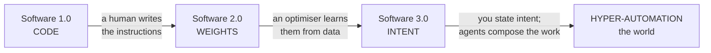

{/* ===================================================================
    BUILD SCAFFOLD — draft:true until ≥15,000 words + all instruments land.
    Word budgets per section sum to ≈15,300. Plate tags are added as each
    component is built + registered in mdx-components.tsx.
   =================================================================== */}

By the spring of 2040, the word *company* has quietly changed what it means, and you can watch the change happen at dawn.

Consider one morning. In a converted bakery in Lisbon, a woman named Inês wakes at six and *reads* — not writes, reads — the overnight work of the firm she founded. It serves a little over forty million people. It has, depending on how you count, between one and four employees: Inês; her partner, who handles the few things that still need a human signature; and two specialists who drop in for a handful of hours a week. Everything else — the code behind the product, the support that answers in nineteen languages, the design, the bookkeeping, the slow grind of compliance across forty jurisdictions — is carried out by a standing population of software agents she does not manage so much as *conduct*. She states intent; they compose the execution. While she slept, they shipped a feature that in 2027 would have taken a team of thirty an entire quarter.

None of this is science fiction, and that is the unsettling part. Every component already exists in 2026 — in prototype, at a price falling by an order of magnitude a year. What changes between now and 2040 is not the arrival of some new miracle but the *compounding* of curves we can already measure: the cost of intelligence, the cost of energy, the price-performance of computation, bending downward year after year until quantity becomes a difference in kind. A thing that is a thousand times cheaper is not the same thing, cheaper. <PullQuote>A thing that is a thousand times cheaper is not the same thing, cheaper. It is a new thing.</PullQuote> It is a new thing.

Widen the lens past Inês and the same dawn is breaking everywhere at once. On a night shift in a factory outside Zagreb, a humanoid robot finishes a task no one rostered a person for, because at its price the arithmetic of hiring it has quietly inverted. In a clinic in Nairobi a doctor reads a patient's whole genome, sequenced overnight for less than the cost of the coffee on her desk. A few hundred kilometres overhead, a rack of processors trains a model in uninterrupted sunlight, cooled by the vacuum, because the cheapest place to put a data centre has — improbably, and only at the margin — started to be off the planet. The automation has left the screen. It is in the building, in the body, in orbit.

I want to be honest about the texture of that world, because the breathless version is a lie. The same forces that let Inês reach forty million people emptied the floor that used to hold her thirty-person team, and the people on that floor did not all become founders. Whole categories of work that anchored the middle of the income distribution thinned out inside a decade, faster than the institutions built to cushion such things could move. The genome in Nairobi is cheap; the question of who is allowed to act on what it says is not settled. The robot in Zagreb works the night shift the union spent forty years making humane. None of the curves in this essay care about any of that, which is exactly why the curves are not the whole story.

So this is not a utopia, and it is not the apocalypse the doom literature keeps promising either. It is something stranger and, I will argue, more plausible than both: an age of **hyper-automation** in which the marginal cost of intelligence, and then of a great many physical things downstream of intelligence, falls toward zero — and in which the decisive question stops being *will there be enough* and becomes *who owns the abundance, and what, then, are people for.* The answer the loudest voices give — a universal cheque that turns most of humanity into the managed pensioners of a small ownership class — is only one branch of the tree, and to my eye the least imaginative one. There is a better branch. Reaching it is a choice, not a fate.

This essay is the case for that branch, and it is built like an instrument rather than an argument you take on trust. Every leap is pinned to a curve you can drag with your own hand. So before the argument, the map. The dial below is the whole essay in one figure: six rings — code, models, agents, robots, biology, and the frontier off-world — crossed with the years from now to 2040, and a conductor's core that never moves, because it is the one thing the machine turns around. Drag the year-hand and the future arrives ring by ring, each forecast attributed to whoever was rash enough to make it. Then we will walk the rings, one at a time, and I will show you why the most boring, best-measured trend lines in the world add up to something that ought to take your breath away.

<TwentyFortyPlanisphere />

## Software 1.0, 2.0, 3.0

The clearest way into all of this was drawn, almost in passing, by the engineer Andrej Karpathy — and once you have seen it you cannot unsee it.

For most of computing's history there was only one kind of software, the kind we now have to call **Software 1.0**: explicit instructions, written by a human, in a language the machine can follow. *If the balance is below zero, refuse the transaction.* Every rule that governs the program is a rule somebody typed. This is the software that built the modern world, and it has a ceiling everyone who has worked in a large codebase has felt in their bones — the ceiling of what a human can specify, line by line, before the system grows too large for any single mind to hold.<Sidenote>The widening gap between a system's complexity and any one person's capacity to comprehend it is the subject of an [earlier essay](/blog/a-nervous-system-for-software) — and the reason the next two layers of software had to be invented.</Sidenote>

In 2017 Karpathy named the thing that was beginning to replace it. **Software 2.0** is not written; it is *trained.* The program is the set of weights inside a neural network, and those weights are found rather than authored — wrung out of data by an optimiser running on a great deal of compute. The programmer's job shifts from writing the logic to curating the dataset and shaping the objective; the source code, in a real sense, becomes the data. AlexNet, in 2012, was the proof of concept. By the early 2020s, 2.0 had swallowed image recognition, translation, speech and protein folding whole. Nobody wrote a cat detector. They showed a network ten million cats.

Then, around 2025, Karpathy named the third era — the one we have just entered. **Software 3.0** is programmed in English. The program is a *prompt* — a specification of intent in ordinary language — and the runtime that executes it is a large language model. The remarkable, slightly vertiginous consequence is that the population of people who can now command a computer to do something genuinely new is no longer the few million who can write code; it is, in principle, everyone who can describe what they want. The interface to computation has become the most widely held human skill there is: language.

Switch the eras in the figure below and watch the same program change phase — a lattice of hand-written code, then a mesh of learned weights, then a single point of stated intent radiating out into the agents that carry it out. The thing being represented does not change. What changes is *who writes it*: a human engineer, then an optimiser fed on data, then you, in a sentence.
<ThreeErasOfSoftware />

Notice what each step does to the *bottleneck.* In 1.0, the scarce resource is engineers — people who can translate intent into precise instructions. In 2.0, the scarce resource shifts to data and compute. In 3.0, the bottleneck moves again, and this is the move that matters for everything that follows: once intent is the interface, the scarce resource becomes *intent itself* — taste, judgement, the knowing of what is worth doing. Execution, the thing we have organised entire economies and educations and identities around, falls in price toward the cost of the electricity it takes to run the model.

This is why I do not think "Software 3.0" is merely a better way to write apps, and why the title of this essay pairs it with a second phrase. **Hyper-automation** is what happens when the 3.0 pattern — state intent, let a machine compose the execution — stops being confined to the screen and crosses into the physical world. An agent that can write the software to run a warehouse is one short step from an agent that can direct the robots *in* the warehouse; a model that can read every paper on a protein is one step from a system that can run the wet-lab robotics to test what it proposes; a planner that can schedule a data centre's workloads is one step from one that can site the data centre itself — on the ground, or, as we will see, in orbit. The same descending signal — a stated intent, a small specification, a "make it so" — reaches further down the stack each year, from code into models, into agents, into machines, into biology, into the off-world frontier. Each ring of the dial is the same gesture, reaching one shell further out.

That is the whole thesis in one sentence: *the interface to the world is collapsing to intent, and everything downstream of intent is becoming automatable.* The rest of this essay is the evidence — and, just as importantly, the places where the evidence runs out. But to believe any of it you first have to believe that the trend has legs, that it is not about to flatten into the disappointing S-curve that every previous wave of automation eventually became. For that, we have to go back to a machine built in 1958, and trace the seventy-year arc that brought us here.

## From Rosenblatt to Hinton to now

{/* ~1,700w — the small 70-year tour (perceptron → winters → backprop → AlexNet → Transformer → agents). */}
<AILongArc />

## The two curves that make it inevitable

{/* ~1,600w — compute price-performance + cost-of-intelligence collapse; the curve must bend to a floor; Jevons/token-cost illusion. */}
<ComputePricePerformance />

<CostOfIntelligence />

## The firm reinvented

{/* ~1,800w — workflows → agents → 10×/100× micro-companies; mass entrepreneurship, not mass unemployment. */}
<FirmMorph />

<OutputPerPerson />

## Automation leaves the screen

{/* ~1,600w — humanoids & embodied AI; ARK $26T bull case + consensus counter. */}
<HumanoidAdoption />

## Biology becomes engineering

{/* ~1,500w — multi-omics, the genome cost curve, AI drug discovery, longevity. */}
<GenomeCostCurve />

## The industrial base goes off-world

{/* ~1,700w — orbital AI data centres → lunar ISRU → Mars/terraforming long horizon (sober). */}
<OffWorldStack />

{/* MERMAID: the hyper-automation stack — intent → agents → tools → robots → world */}

## The near-zero-marginal-cost economy

{/* ~1,800w — abundance, deflation; why not UBI-dependency nor doom; broadened ownership / who holds the deed. */}
<AbundanceProjection />

## Honest uncertainty

{/* ~1,100w — what could break it: energy, regulation, geopolitics, alignment, social rupture. */}

## Coda — the silver lining

{/* ~800w — AI as the thread; 2040 a waypoint, not a finish; human meaning. One italic close. */}

---

## Go deeper

{/* Footer links: /synaptic/symphony · /blog/a-nervous-system-for-software · the two curves' sources · etc. */}
