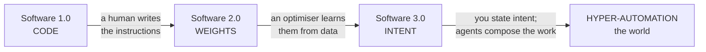
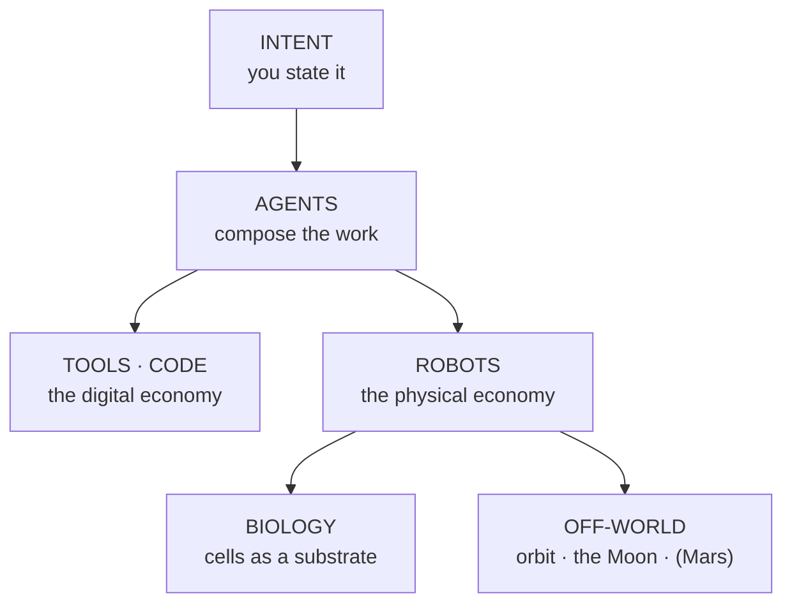

{/* ===================================================================
    BUILD SCAFFOLD — draft:true until ≥15,000 words + all instruments land.
    Word budgets per section sum to ≈15,300. Plate tags are added as each
    component is built + registered in mdx-components.tsx.
   =================================================================== */}

By the spring of 2040, the word *company* has quietly changed what it means, and you can watch the change happen at dawn.

Consider one morning. In a converted bakery in Lisbon, a woman named Inês wakes at six and *reads* — not writes, reads — the overnight work of the firm she founded. It serves a little over forty million people. It has, depending on how you count, between one and four employees: Inês; her partner, who handles the few things that still need a human signature; and two specialists who drop in for a handful of hours a week. Everything else — the code behind the product, the support that answers in nineteen languages, the design, the bookkeeping, the slow grind of compliance across forty jurisdictions — is carried out by a standing population of software agents she does not manage so much as *conduct*. She states intent; they compose the execution. While she slept, they shipped a feature that in 2027 would have taken a team of thirty an entire quarter.

None of this is science fiction, and that is the unsettling part. Every component already exists in 2026 — in prototype, at a price falling by an order of magnitude a year. What changes between now and 2040 is not the arrival of some new miracle but the *compounding* of curves we can already measure: the cost of intelligence, the cost of energy, the price-performance of computation, bending downward year after year until quantity becomes a difference in kind. A thing that is a thousand times cheaper is not the same thing, cheaper. <PullQuote>A thing that is a thousand times cheaper is not the same thing, cheaper. It is a new thing.</PullQuote> It is a new thing.

Widen the lens past Inês and the same dawn is breaking everywhere at once. On a night shift in a factory outside Zagreb, a humanoid robot finishes a task no one rostered a person for, because at its price the arithmetic of hiring it has quietly inverted. In a clinic in Nairobi a doctor reads a patient's whole genome, sequenced overnight for less than the cost of the coffee on her desk. A few hundred kilometres overhead, a rack of processors trains a model in uninterrupted sunlight, cooled by the vacuum, because the cheapest place to put a data centre has — improbably, and only at the margin — started to be off the planet. The automation has left the screen. It is in the building, in the body, in orbit.

I want to be honest about the texture of that world, because the breathless version is a lie. The same forces that let Inês reach forty million people emptied the floor that used to hold her thirty-person team, and the people on that floor did not all become founders. Whole categories of work that anchored the middle of the income distribution thinned out inside a decade, faster than the institutions built to cushion such things could move. The genome in Nairobi is cheap; the question of who is allowed to act on what it says is not settled. The robot in Zagreb works the night shift the union spent forty years making humane. None of the curves in this essay care about any of that, which is exactly why the curves are not the whole story.

So this is not a utopia, and it is not the apocalypse the doom literature keeps promising either. It is something stranger and, I will argue, more plausible than both: an age of **hyper-automation** in which the marginal cost of intelligence, and then of a great many physical things downstream of intelligence, falls toward zero — and in which the decisive question stops being *will there be enough* and becomes *who owns the abundance, and what, then, are people for.* The answer the loudest voices give — a universal cheque that turns most of humanity into the managed pensioners of a small ownership class — is only one branch of the tree, and to my eye the least imaginative one. There is a better branch. Reaching it is a choice, not a fate.

This essay is the case for that branch, and it is built like an instrument rather than an argument you take on trust. Every leap is pinned to a curve you can drag with your own hand. So before the argument, the map. The dial below is the whole essay in one figure: six rings — code, models, agents, robots, biology, and the frontier off-world — crossed with the years from now to 2040, and a conductor's core that never moves, because it is the one thing the machine turns around. Drag the year-hand and the future arrives ring by ring, each forecast attributed to whoever was rash enough to make it. Then we will walk the rings, one at a time, and I will show you why the most boring, best-measured trend lines in the world add up to something that ought to take your breath away.

<TwentyFortyPlanisphere />

## Software 1.0, 2.0, 3.0

The clearest way into all of this was drawn, almost in passing, by the engineer Andrej Karpathy — and once you have seen it you cannot unsee it.

For most of computing's history there was only one kind of software, the kind we now have to call **Software 1.0**: explicit instructions, written by a human, in a language the machine can follow. *If the balance is below zero, refuse the transaction.* Every rule that governs the program is a rule somebody typed. This is the software that built the modern world, and it has a ceiling everyone who has worked in a large codebase has felt in their bones — the ceiling of what a human can specify, line by line, before the system grows too large for any single mind to hold.<Sidenote>The widening gap between a system's complexity and any one person's capacity to comprehend it is the subject of an [earlier essay](/blog/a-nervous-system-for-software) — and the reason the next two layers of software had to be invented.</Sidenote>

In 2017 Karpathy named the thing that was beginning to replace it. **Software 2.0** is not written; it is *trained.* The program is the set of weights inside a neural network, and those weights are found rather than authored — wrung out of data by an optimiser running on a great deal of compute. The programmer's job shifts from writing the logic to curating the dataset and shaping the objective; the source code, in a real sense, becomes the data. AlexNet, in 2012, was the proof of concept. By the early 2020s, 2.0 had swallowed image recognition, translation, speech and protein folding whole. Nobody wrote a cat detector. They showed a network ten million cats.

Then, around 2025, Karpathy named the third era — the one we have just entered. **Software 3.0** is programmed in English. The program is a *prompt* — a specification of intent in ordinary language — and the runtime that executes it is a large language model. The remarkable, slightly vertiginous consequence is that the population of people who can now command a computer to do something genuinely new is no longer the few million who can write code; it is, in principle, everyone who can describe what they want. The interface to computation has become the most widely held human skill there is: language.

Switch the eras in the figure below and watch the same program change phase — a lattice of hand-written code, then a mesh of learned weights, then a single point of stated intent radiating out into the agents that carry it out. The thing being represented does not change. What changes is *who writes it*: a human engineer, then an optimiser fed on data, then you, in a sentence.
<ThreeErasOfSoftware />

Notice what each step does to the *bottleneck.* In 1.0, the scarce resource is engineers — people who can translate intent into precise instructions. In 2.0, the scarce resource shifts to data and compute. In 3.0, the bottleneck moves again, and this is the move that matters for everything that follows: once intent is the interface, the scarce resource becomes *intent itself* — taste, judgement, the knowing of what is worth doing. Execution, the thing we have organised entire economies and educations and identities around, falls in price toward the cost of the electricity it takes to run the model.

This is why I do not think "Software 3.0" is merely a better way to write apps, and why the title of this essay pairs it with a second phrase. **Hyper-automation** is what happens when the 3.0 pattern — state intent, let a machine compose the execution — stops being confined to the screen and crosses into the physical world. An agent that can write the software to run a warehouse is one short step from an agent that can direct the robots *in* the warehouse; a model that can read every paper on a protein is one step from a system that can run the wet-lab robotics to test what it proposes; a planner that can schedule a data centre's workloads is one step from one that can site the data centre itself — on the ground, or, as we will see, in orbit. The same descending signal — a stated intent, a small specification, a "make it so" — reaches further down the stack each year, from code into models, into agents, into machines, into biology, into the off-world frontier. Each ring of the dial is the same gesture, reaching one shell further out.

That is the whole thesis in one sentence: *the interface to the world is collapsing to intent, and everything downstream of intent is becoming automatable.* The rest of this essay is the evidence — and, just as importantly, the places where the evidence runs out. But to believe any of it you first have to believe that the trend has legs, that it is not about to flatten into the disappointing S-curve that every previous wave of automation eventually became. For that, we have to go back to a machine built in 1958, and trace the seventy-year arc that brought us here.

## From Rosenblatt to Hinton to now

The reason to trust the trend is that it has already survived its own funeral. Twice.

In 1958 a Cornell psychologist named Frank Rosenblatt described the Perceptron, the first machine that could *learn* — adjust itself from examples rather than follow instructions a human had written out in advance. Two years later he wired up a physical version, the Mark I, a cabinet of motors and photocells that taught itself to tell shapes apart, and the press did what the press still does. *The New York Times*, briefed by the Navy that funded it, announced the perceptron as the embryo of a computer that would one day walk, talk, see, write, reproduce itself and be conscious of its existence. The year was 1958. The hype cycle is older than most of the people now warning about it.

In 1969 the hype met its first wall. Marvin Minsky and Seymour Papert, two founders of the field, published *Perceptrons*, a book that proved with cold rigour that a single-layer network could not learn even the simple logical operation called *exclusive-or.* The proof was correct; the conclusion the field drew from it — that the whole approach was a dead end — was not, but that hardly mattered. Funding evaporated. The first **AI winter** set in, and for the better part of two decades the idea that you could build something like intelligence by training networks of simple units was, in respectable computer science, faintly embarrassing.

The thaw came from people who kept working through the cold. The mathematics that answered Minsky and Papert — *backpropagation*, a way to train networks of many layers — was derived by Paul Werbos in a 1974 doctoral thesis that sat largely unread, and made famous in 1986 by David Rumelhart, Geoffrey Hinton and Ronald Williams in a short paper in *Nature.* Deep networks could learn after all. But the machines of the 1980s were too slow and the datasets too small to show what the idea could do; the expert-systems boom that had crowded it out collapsed commercially; and the field slid into a **second winter.** Twice now, the thing had been pronounced finished.

What ended the second winter was not a cleverer idea. It was scale. In 2012 a network called **AlexNet** — built by Hinton and two of his students, Alex Krizhevsky and Ilya Sutskever, and trained on a pair of gaming graphics cards — won the ImageNet image-recognition contest by a margin so wide it stopped resembling a contest. The lesson, which the researcher Richard Sutton would later call the *bitter lesson*, was that general methods which scale with computation beat clever methods hand-tuned by humans, and beat them not by a little. Five years later, in 2017, a team at Google published *Attention Is All You Need* and handed that scaling a near-perfect engine: the **Transformer**, an architecture that got better — reliably, predictably — the more data and compute you fed it.

Trace the whole seventy-year arc in the spiral below. It winds outward from a 1958 seed at the core; the early decades crowd the tight inner coils, dimmed through the two winters; and then, from 2012, the modern era fans across the rim, each year a longer stride than the one before.

<AILongArc />

After the Transformer the story accelerates so fast it is hard to credit that it is only nine years long. **GPT-1**, in 2018, showed that a Transformer pre-trained on raw text learned language in general rather than one task at a time. **GPT-3**, in 2020, made the machine a *few-shot* learner — describe a task in the prompt and it would attempt it — and in the same year a quiet, consequential paper by Jared Kaplan and colleagues established the **scaling laws**: the finding that a model's capability improves as a smooth, predictable function of its size, its data and its compute. That is the sentence that changed the industry's psychology. Capability stopped being a breakthrough you hoped for and became a resource you could budget. In 2022 a DeepMind team refined the recipe — the *Chinchilla* result, that data and model size should grow in step — and at the end of that November, OpenAI wrapped the technology in a chat box. **ChatGPT** reached a hundred million people faster than any consumer product in history, and the seventy-year argument about whether any of this would ever amount to anything was, for most of the public, settled over a single weekend.

There is a human thread running through all of it, and his name is Geoffrey Hinton. He is on the 1986 backpropagation paper; he is on AlexNet in 2012; and in 2024 he was awarded the Nobel Prize in Physics for the body of work that made neural networks possible — having, the year before, left Google so that he could warn, without commercial conflict, about where the thing he had spent his life building might be heading. That one career should span the popularising of the method, its scaling breakthrough, its highest honour and its most credible alarm tells you how compressed this history really is. It is not an ancient field. The whole arc fits inside a single working life.

And the most recent turn is the one that matters most here. Since 2023 the frontier has moved from systems that *answer* to systems that *act* — models that reason in steps, call tools, write and run their own code, and chain those abilities into agents that pursue a goal across many moves without a human approving each one. This is the agentic turn, and it is what makes "Software 3.0" more than a slogan: it is the moment the machine stopped being a thing you query and became a thing you *delegate to.*

I have rushed through seventy years because the details are not the point; the *shape* is. Twice the field was buried, and twice it came back — faster, on the back of more computation and more data rather than more genius. That is the single most useful fact for anyone trying to forecast the next fifteen years, because it tells you exactly what to watch. The question is not whether the cleverness keeps arriving; cleverness is unpredictable. The question is whether the *inputs* keep getting cheaper — compute, data, energy. And that, it turns out, is not a question about genius at all. It is a question about two of the most relentless curves in the history of technology.

## The two curves that make it inevitable

The two curves are the price of computation and the price of intelligence. Once you have looked at them honestly — neither flinching at the magnitude nor pretending they run on forever — almost everything else in this essay follows.

Begin with computation. Ray Kurzweil has spent forty years plotting a single line: the number of calculations per second that a thousand dollars will buy, across the whole twentieth century and into ours. The striking thing about the line is that it is smooth through five entirely different underlying technologies — electromechanical relays, vacuum tubes, discrete transistors, integrated circuits, and the parallel silicon of the present — as if the substrate were merely the costume and the exponential the actor underneath. Moore's Law, the famous doubling of transistors on a chip, turns out to be just the fifth act of a much older play. Read off the line and a striking crossover arrives around 2023: a thousand dollars now buys roughly the raw operations-per-second of a single human brain. Kurzweil's reading of where the line points is famous and unembarrassed — human-level AI by 2029, a "singularity" by 2045.

I plot his curve below because it is the right backbone for the argument, and I want to be just as clear about how to read it as he is not. It is an order-of-magnitude sketch, not a precision instrument; the y-axis spans thirty decades and the eye should treat the trend, not the points. And the dates are the most contested thing in futurism: skeptics from Paul Allen to the textbook authors Russell and Norvig argue that exponentials are really the early half of S-curves that flatten, and Kurzweil's own scorecard is mixed — his information-technology predictions have aged well, his timelines for artificial general intelligence, nanomedicine and radical longevity rather less so. The honest summary is that the *trajectory* has been right for a century and the *dates* run optimistic. Hold both in your head at once.

<ComputePricePerformance />

But raw compute per dollar is the input, not the thing anyone actually buys. What a person or a company buys is *intelligence* — a unit of useful cognitive work, a passable draft, a correct answer, a solved ticket. And when you measure the price of *that*, the recent numbers are so steep they look like a typo.

<CostOfIntelligence />

Hold a level of capability fixed — say, the quality of the original GPT-3 — and ask what it costs to buy it. In late 2021 it ran about sixty dollars per million words of output. Three years later you could buy the same quality for six cents. That is a thousandfold collapse in thirty-six months, roughly tenfold a year, and the venture firm Andreessen Horowitz gave it a fittingly absurd name: *LLMflation.* It is the single most important number in this essay, and it is also where I have to spend my honesty, because the naïve thing to do with a tenfold-a-year curve is extend it to 2040, and the naïve thing is wrong in two different ways.

The first is the floor. Extend ten-times-a-year out to 2040 and you reach prices with eighteen zeros after the decimal point — numbers so small they would imply running a civilisation's worth of thought on less energy than a light bulb, which physics does not permit. Every act of computation has to move electrons and shed heat, and below some price the curve stops being about cleverness and starts being about joules and silicon. So the real curve must **bend**: it keeps falling, but it flattens toward an energy-and-materials floor it has not yet reached. The faint ghost line plunging off the bottom of the figure is the fantasy; the curve that bends above it is the forecast. Intelligence becomes astonishingly cheap. It does not become free.

The second is subtler and, for the thesis, more important. Cheaper per unit has never meant *less spent in total.* In 1865 the economist William Stanley Jevons noticed that more efficient steam engines did not reduce Britain's coal consumption — they increased it, because cheaper steam made steam worth using for a thousand things it had never been worth using for before. The same thing is happening to thought. As intelligence got cheaper per token, we did not buy less of it; we built agents that chew through hundreds of thousands of tokens to do a task where a chatbot once spent two thousand, and Goldman Sachs already projects total token demand rising some twenty-four-fold by 2030 even as the unit price keeps falling. <PullQuote>Abundance does not arrive as "intelligence becomes free." It arrives as intelligence becoming so cheap, per unit, that we point it at a million things we never could before.</PullQuote> This is what abundance actually looks like, and it is worth saying slowly, because almost everyone gets it backwards. Abundance does not arrive as *intelligence becomes free.* It arrives as intelligence becoming so cheap, per unit, that we point it at a million problems it was never economic to touch. The deflation is in the price of a unit; the explosion is in the number of units. The two together are the engine of everything downstream.

So "inevitable," in my title's spirit, does not mean infinite, and it does not mean soon-and-smooth. It means something narrower and far sturdier: the two inputs that gate every frontier in this essay — computation, and the intelligence built on top of it — have been getting cheaper for decades, and will keep getting cheaper for years yet, bending toward a floor we are nowhere near. You do not need a singularity to remake an economy. You need only a few more turns of a curve that is visibly still turning. And the first place those turns show up is not in a laboratory or a benchmark. It is in the most basic unit of economic life — the firm.

## The firm reinvented

Why does the firm exist at all? The cleanest answer is still the one Ronald Coase gave in 1937: a firm exists because using the market is not free. Every time you coordinate work through prices — finding the right person, negotiating, contracting, checking what comes back — you pay a *transaction cost*, and when that cost is high enough it becomes cheaper to bring the work inside a bounded organisation and coordinate it by management instead. The size and shape of every company you have ever worked for is, in Coase's telling, a standing answer to one question: which is cheaper here, the market or the manager?

Hyper-automation rewrites that answer, because the cost it attacks most directly is the cost of coordination itself. An agent can do the finding, the drafting, the checking and the chasing — the connective tissue that used to require a department. As the cost of coordinating a unit of work falls toward zero, the organisation that the cost was holding together has less and less reason to be large. A bounded firm of sixty people stops being the cheapest way to make the thing, and a small core of humans, each amplified by a private workforce of agents, becomes cheaper. This is what people are gesturing at, a little breathlessly, when they talk about the "ten-times" or "hundred-times" company. The figure below is the clearest way I know to see it: slide the leverage up, and watch a single bounded firm dissolve into a swarm of tiny constellations, each a few humans orbited by many machines.

<FirmMorph />

The extreme case has a name now — the one-person, billion-dollar company. Sam Altman has described a standing bet among founders on the year it first happens, with a median guess around 2028. Treat that as a prediction rather than a fact, but notice that the direction is already legible in the revenue-per-employee numbers, which are the real tell. A traditional software firm turns over perhaps two hundred thousand dollars per employee. The image company Midjourney, by various outside estimates — it is private, so these are journalists' figures, not audited accounts — was reportedly nearer a few *million* dollars per employee, with a team you could fit on a bus and no venture capital at all. Multiply that by a decade of cheaper agents and the question of who actually needs to be in the room changes shape entirely.

Here is the reframe the doom literature consistently misses: fewer employees per firm is not the same thing as fewer jobs. It can mean far *more firms.* If one person and a fleet of agents can do what thirty people did, the barrier to starting something collapses, and the binding constraint on new enterprise stops being capital or headcount and becomes the scarcer resource — an idea worth pursuing and the taste to pursue it well. The same force that thins the large firm can thicken the long tail of small ones. That is the whole difference between the pessimist's story (the firm sheds people, full stop) and the one I am telling (the firm sheds people, who are now cheap enough to arm that a great many of them start firms of their own). Which of those dominates is an empirical question, and the most honest thing I can show you is that the serious forecasters disagree about it by a factor of several.

<OutputPerPerson />

Sit with that fork, because it is the real state of knowledge. Goldman Sachs estimates that generative AI could raise global GDP by around 7% — some seven trillion dollars a year — and lift productivity growth by 1.5 points over a decade, with roughly 300 million jobs exposed to automation worldwide. McKinsey puts the recurring prize at $2.6 to $4.4 trillion a year. ARK, the most bullish voice in the room, projects world growth accelerating to 7.3% by 2030, more than double the IMF's baseline. And then there is the most credible skeptic, the Nobel laureate Daron Acemoglu, who actually counts the tasks that are cheaply automatable this decade, arrives at about five percent of them, and concludes the whole effect is a modest 1.1% of GDP — a rounding error beside the trillion-dollar forecasts. They cannot all be right. The two-to-fourfold spread between them is not a failure of analysis; it *is* the analysis. We are standing at the fork, and anyone who tells you the future is obvious is reading only one line on the chart.

I lean toward the optimistic branch, but Acemoglu's deepest objection is the one I want to carry forward intact, because it is not really about the size of the pie. His warning is distributional: that AI is poised to hollow out precisely the mid-skill, clerical and routine-cognitive work that anchors the middle of the income distribution — hitting workers with less education, and in his analysis women, hardest — and that it is entirely possible for GDP to rise while welfare falls, for the aggregate line to climb while the median life gets harder. He is right that this can happen. I will argue, much later and on his own ground, that it does not have to. But hold onto the shape of his point, because it is the hinge of the entire essay: the objection is not about technology at all. It is about *ownership*. Even the consensus, for what it is worth, has been drifting toward the brighter branch as the picture clarifies — the World Economic Forum's jobs report swung from projecting a net loss of work in 2023 to a net gain of seventy-eight million jobs by 2030 in its 2025 edition. The body did not get more optimistic by temperament. The data moved.

All of this, though — the dissolving firm, the swarm of micro-companies, the fight over the gains — is still happening *on the screen.* It is code and support and design and the digital connective tissue of commerce. The deeper shift, the one that earns the prefix in *hyper*-automation, is the moment the same gesture reaches off the screen and into the physical world. And that is already happening — on a night shift, in a factory outside Zagreb.

## Automation leaves the screen

For sixty years there have been robots in factories, and for sixty years they have been bolted to the floor, blind, repeating one pre-taught motion behind a safety cage. The *general-purpose* robot — the one that can walk into an unstructured room and do what you ask of it — has been ten years away for fifty years, and it is worth being precise about what was actually missing all that time. It was not the body. Actuators, batteries and materials quietly got good. The thing that was missing was the *mind*: the ability to perceive a messy, unlabelled world and plan inside it. Which is to say the thing that was missing is exactly the thing the curves of the last two sections have been making cheap. Embodied AI is what you get when you drop a Software 3.0 mind into a Software-1.0-era body. The hard half was solved on the screen first; now it is being ported into the world.

The economic trigger is brutally simple, and the engineers state it without sentiment: the net-present-value crossover. A worker in a rich economy costs something like forty-six dollars an hour all-in — call it five hundred and fifty thousand dollars over ten years in present-value terms. A humanoid robot becomes worth buying the instant its lifetime cost falls below the lifetime cost of the labour it covers, and the leading manufacturers are aiming at machines priced in the low tens of thousands. When that line is crossed, adoption does not creep. It inflects — because every rational operator faces the identical arithmetic at the same moment. The figure below puts the crossover somewhere around 2028 to 2030, and shows what an honest version of the famous "humanoid opportunity" looks like.

<HumanoidAdoption />

ARK's figure — twenty-six trillion dollars a year — is the single largest number in this essay, and I have plotted it directly against the consensus precisely so you can see the size of the disagreement: it sits roughly a thousandfold above estimates like Goldman's thirty-eight-billion-dollar humanoid market by 2035. That gap is not an error. It is a *methodology.* ARK counts the unpaid labour of the world — the cooking, the cleaning, the caring that the formal economy never put a price on — as a market that a robot could one day address, which is a perfectly defensible way to size the ceiling of a possibility and a thoroughly misleading way to forecast a 2030 product line. Read the twenty-six trillion as the size of the ocean, not the size of next year's catch. The sober claim underneath it is narrower and, I think, hard to dodge: somewhere in the 2030s general-purpose robots cross from demonstration to deployment — first in the structured edges of the physical economy, the warehouses and factories and loading bays, and then, more slowly and far more contestably, into homes and hospitals and care.

Why does this matter so much for the larger argument? Because everything up to here — even the dissolving firm — was still digital. Embodiment is the moment cheap intelligence acquires *hands*, and the deflation that has been confined to bits begins, for the first time, to reach atoms. A robot is, in economic terms, a machine for converting cheap intelligence and cheap energy into cheap physical work. Once you can do that conversion at scale, the cost curves of the screen start to propagate into the cost of *made things* — and that is the bridge to the two frontiers that sound the most like science fiction and are, I will argue, the most underrated of all: the engineering of biology, and the extension of the industrial base clean off the surface of the planet.

I do not want to wave the cost away as if it were free of weight. The night shift outside Zagreb is one a union spent forty years making humane, and the displacement that embodiment brings, though slower than the digital kind because atoms resist in a way bits do not, lands on the people with the fewest alternatives. And robots remain genuinely hard: dexterity, reliability, and the long tail of edge cases in an unstructured world are nowhere near solved, and anyone who tells you the general-purpose home robot is two years away is selling you something. The S-curve in the figure is drawn dashed and labelled *illustrative* for exactly that reason. But the *direction* is not seriously in question — and in this essay the direction is the whole of the point.

## Biology becomes engineering

The pattern of this essay is that cheap intelligence reaches one shell further out each year — from code, to models, to agents, to robots — and the fourth shell is the one inside us. Biology is turning into an engineering discipline, and it is doing so on the back of a cost curve even steeper than the one for intelligence.

Sequencing a human genome cost about 2.7 billion dollars in 2003 — the Human Genome Project, a decade of work and an international consortium. By 2023 it cost roughly two hundred dollars. As I write, it is slipping under a hundred, and ARK projects it reaching the price of a sandwich — a dollar to ten — by 2030. That is a ten-billion-fold collapse in two decades, which is *faster than Moore's Law*, and it is the sentence geneticists tend to say with a kind of vertigo. The figure plots the real curve against the Moore's-Law line it long ago left behind. When the cost of reading a thing falls by ten orders of magnitude, the thing stops being a science and becomes a *substrate* — something you read as casually as you would a log file.

<GenomeCostCurve />

Reading is only half of it. *Writing* DNA — synthesis — has fallen a hundred-thousand-fold already, with a further ten-million-fold drop projected by 2030. Read cheaply and write cheaply, and biology becomes a read-write medium: an information technology with the same deflationary physics as everything else in this essay. And the genome is merely the first layer. The real frontier is *multi-omics* — reading not just the genome but the proteome, the transcriptome and the metabolome, the entire molecular state of a living cell at once — where the performance you get per dollar is projected to improve a thousandfold by the end of the decade.

Now fold the intelligence back in. The same deep-learning wave that produced language models also produced AlphaFold, the system from DeepMind that effectively cracked the fifty-year-old problem of predicting how a protein folds from its sequence — work recognised with the 2024 Nobel Prize in *Chemistry*, the sister prize to Hinton's in Physics, awarded in the very same year.<Sidenote>That two of one year's science Nobels went, in effect, to neural networks is not a coincidence. It is the tide coming in.</Sidenote> The loop this closes is the important thing. An AI proposes a molecule; cheap multi-omics reads what it actually does in a cell; and — the callback to embodiment — robotic wet-labs run the experiments without a human at the bench, so the system that *designs* an intervention can also *test* it, around the clock, and learn from the result. ARK's figures for AI-designed drugs are the kind that quietly reset an industry: roughly four times cheaper to develop, from about $2.4 billion down toward $0.6 billion; some forty percent faster to market; five times the return on research and development.

What this adds up to is the deflation arriving at the most personal frontier there is — health, and perhaps the length of a life. Molecular diagnostics that detect a cancer from a blood draw and then monitor it continuously; screening an order of magnitude more productive; one-shot genetic cures for conditions that used to be *managed*, expensively, across a lifetime. The clinician in Nairobi reading a whole genome over her morning coffee was not a rhetorical flourish. She is the leading edge of medicine becoming an information service, and being priced like one.

I want to be heavier with the honesty here than anywhere else in the essay, because biology has gates that silicon does not. The cost curve itself is the least controversial in the whole deck — the genomics industry agrees on its shape, and only the dollar-to-ten endpoint is ARK's extrapolation rather than measurement. But a cheaper genome does not settle *who is allowed to act on what it says* — the insurer, the employer, the state — and that is a fight cheap sequencing makes more urgent, not less. Worse, cheap DNA synthesis is dual-use in the most literal sense the word has: the same falling cost that lets a small team design a cancer therapy lets an ever-smaller team design a pathogen. Biosecurity is the one place in this essay where I believe the abundance is running genuinely ahead of our institutions' capacity to govern it, and I will not pretend otherwise. The right posture toward engineered biology is not the breathless one. It is the posture you would take toward fire: indispensable, and never to be left unattended.

From bits, to atoms, to cells — three frontiers where cheap intelligence has crossed off the screen and into the substance of the world. There is one frontier left, and it is the one that looks most absurd written down, which is precisely why I want to handle it with the most care. The industrial base is beginning to leave the planet.

## The industrial base goes off-world

The instinct to roll your eyes at the phrase "data centres in space" is a healthy guard against hype, and a poor guard against a real trend. So let me give you the trend with the hype filtered out, because the filtering is the whole job in this section, and the credibility of everything I have argued depends on my doing it honestly.

The realistic off-world stack of 2040 is three things and no more: orbital computation at pilot scale, the first genuine footholds on the Moon, and — at the very edge of plausibility — the first human bootprints on Mars. Everything past that — lunar industry at scale, a Martian settlement, terraforming — is a centuries-long arc that I will name as aspiration and not forecast. The figure below encodes exactly that honesty as a fading of the light: the higher you climb, the fainter the marks, until Mars and terraforming are barely there at all.

Start with the part that is realer than it sounds. Putting computation in orbit is not insane, and the reasons are mundane physics and economics. In the right orbit the sun never sets, so the power is continuous and free of clouds and night; there is no water to cool with, but the vacuum itself radiates heat away; and launch costs are falling toward two hundred dollars a kilogram by the mid-2030s, which is Google's own stated threshold for the economics to close. And it has already begun — not in a press release about 2050, but in hardware. In November 2025 a startup called Starcloud put the first data-centre-class processor, an NVIDIA H100, into orbit and ran a model on it; in the same month Google unveiled Project Suncatcher, a design for constellations of solar-powered TPU satellites, with prototypes due to fly in 2027.

<OffWorldStack />

But the honesty is the point, and the hard limits here are physics rather than pessimism. Cooling is the wall: in vacuum, heat can leave only by radiation, and a single megawatt of computing demands thousands of square metres of radiator to shed it. Latency rules out anything but training and batch work — you will not serve a chatbot from orbit. Radiation flips bits and degrades components, and servicing a failed machine is, for now, essentially impossible. Google's own engineers list four such hurdles before they list a single triumph, which tells you that the companies are considerably more sober than the coverage of them. The orbital data centre of 2040 is therefore a real but *niche* thing — training runs humming on uninterrupted sunlight, at the margin of the industry — and not a replacement for the grid below.

The Moon is closer and more contested. Artemis II carried a crew around it in April 2026, the first to make that trip since Apollo; the first landing has already slipped to Artemis IV around 2028 and will very likely slip again; China is targeting a crewed landing by 2029 or 2030; and a lunar station that makes its own oxygen and water from the regolith is a 2030s goal at *demonstration* scale. The Moon of 2040 is a place humans have returned to and begun, tentatively, to use. It is not yet an industrial base, and you should distrust anyone who tells you it is.

Mars demands the discipline of saying no. SpaceX, in early 2026, quietly deprioritised Mars in favour of the Moon and pushed its timeline back by years, and every Mars date its founder has offered since 2016 has slipped past. The sober estimate is that the first human bootprints on Mars are, at the most optimistic, a roughly-2040 aspiration that NASA itself labels "audacious" and has funded no real path toward. And *terraforming* — remaking Mars into something Earth-like — is not a question for 2040 or even 2100: the most careful study we have, by Bruce Jakosky and Christopher Edwards in 2018, found that mobilising all the accessible carbon dioxide on the entire planet would not raise the pressure even a tenth of the way to breathable, and concluded, flatly, that it "is not possible using present-day technology." Let that be the honesty anchor for the whole essay. The off-world stack inside our window is compute in orbit and a first set of lunar footholds. It is not a second home for the species, and I am not going to pretend it is to make the ending sweeter.

So why include the frontier at all, hedged as it is? Because the *direction* is real and already past its first proof — a rack of processors has trained a model on sunlight in orbit; that genuinely happened — and because it completes the logic of everything before it. Hyper-automation is what unlocks the off-world frontier, for the simple reason that agents and robots can build and operate where humans cannot cheaply go. It is the same conversion that runs through the entire essay — cheap intelligence plus cheap energy into cheap physical work — now applied to the most hostile environment there is. The industrial base extends beyond Earth not because we suddenly grew braver, but because automation grew cheaper.

Five frontiers, one gesture, all of it running on the same two curves. Which leaves the question this essay has been circling from its first paragraph and can no longer put off. If intelligence — and then a great deal of the physical world downstream of it — is genuinely collapsing toward zero marginal cost, what kind of economy does that make? And, more pointedly: who does it make it *for*?

## The near-zero-marginal-cost economy

We can finally name the economy these curves are building, because it has been named before — twice, by people who each saw a piece of it coming. The figure below is the synthesis of the whole essay: three foundational costs — intelligence, energy, and the reading of biology — collapsing in parallel toward a floor, each normalised so you can watch them fall together. When the things that used to be expensive become, one after another, nearly free to reproduce, you arrive at what the economist Jeremy Rifkin called, in 2014, the *zero-marginal-cost society.*

<AbundanceProjection />

Rifkin's argument was that capitalism's own competitive engine drives the marginal cost of more and more goods toward zero — once a thing can be represented as information, the cost of copying it falls to almost nothing — and that at the limit, profit thins and a "collaborative commons" rises alongside the market. Two years earlier, in *Abundance*, Peter Diamandis had given the sunny version: that exponential technologies *demonetise* and *dematerialise* the necessities of life, turning what was scarce into what is abundant. Both were broadly right about the shape, and early about the timing, and — I should be candid — both wrote before large language models existed. Neither was talking about the marginal cost of *cognition itself.* The move this essay makes is to apply their logic to intelligence, which is the input to everything else; that application is my extension of their idea, and I would rather flag it as mine than smuggle it in as theirs.

Here is the hinge the optimists tend to skate over. A marginal cost of nearly zero is *not* the same thing as "free to everyone." A good can be almost free to *produce* and still expensive to *buy*, if someone owns the means of producing it and charges for the access. The deflation is real and it is coming; *who captures it* is entirely undecided. That undecidedness is the whole political question of the next fifteen years, and there are exactly three answers on the table.

The first answer is the doom story, and its most serious advocate is Daron Acemoglu, whom we met at the fork. In its strongest form it runs like this: the gains from automation funnel to a vanishing ownership class; the median worker's bargaining power evaporates as the machines undercut it; GDP can climb while the typical life gets harder; and the one-person, billion-dollar company is not a triumph but a *tell* — a portrait of an economy whose returns flow to almost no one. I take this seriously, and the honest reply is narrow: Acemoglu is right that this outcome is *possible* and wrong that it is *inevitable* — and the proof is inside his own framing. His objection is distributional. It is an argument about *ownership and policy*, not a law of physics about technology. New categories of work do get invented (the WEF's own forecast swung from net-negative to net-positive in two years); agentic systems compound the demand for human judgement even as they automate its execution. The funnel is not a fixed pipe. It is a policy choice wearing the costume of a forecast.

The second answer is the one the loudest voices in technology now reach for: universal basic income. If the machines do the valuable work and wages collapse as a basis for living, then decouple income from labour — tax the windfall, and send everyone a cheque. I understand the appeal, and I want to give it its due, because its honesty about the mechanism is real. Sam Altman, in his 2021 essay *Moore's Law for Everything*, concedes the danger more plainly than most of his critics do: "even more power will shift from labour to capital," he writes, and unless policy adapts "most people will end up worse off than they are today." But a cheque, in the end, is a pacifier. It converts the majority of humanity into the permanent pensioners of a small ownership class — recipients of an allowance they did not set, cannot withhold, and do not control — and it asks them to trade the dignity of contribution and the leverage of ownership for a subsistence transfer. UBI treats the symptom, which is the absence of income, and leaves the disease, which is the absence of *ownership*, exactly where it found it. It is the least imaginative branch of the tree, and I think we should say so out loud.

The third answer — the better branch, and the one this essay is finally for — is broadened *ownership.* And the thing the UBI debate keeps missing is that Altman's own proposal, read closely, is not a cheque at all: it is *equity.* His "American Equity Fund" would take a small annual slice of every large company's value, paid in *shares*, and a slice of land value, and distribute it to every citizen as a stake — by his arithmetic, around thirteen and a half thousand dollars a year per adult, but held, not handed. That difference is the whole argument. A pensioner receives; an owner *holds.* There are several roads up the same mountain: a "data dividend" that pays people for the data their lives generate to train the models; cooperative and commons structures in Rifkin's spirit; sovereign-wealth-style citizen funds that own a slice of the automation on everyone's behalf, the way Norway owns its oil or Alaska its. They differ in mechanism and agree in principle — sever income from labour *without* severing agency from the citizen.<Sidenote>Norway's sovereign wealth fund, built from oil, today owns roughly 1.5% of every listed company on earth on behalf of five and a half million people. It is the most boring proof that broad ownership of a windfall is an administrative problem, not a fantasy.</Sidenote>

<PullQuote>The pie becomes nearly free to copy. The only question left is who holds the deed — and that is a choice, not a fate.</PullQuote>

Which brings us to the question underneath the question, the one the whole essay has been walking toward: in a world where execution is nearly free, what are people *for*? The doom story and the UBI story share a hidden assumption — that a human who does not *execute* is a human with nothing to do. The abundance story rejects it. When the doing becomes cheap, the scarce thing is not the doing; it is the *knowing what to do* — taste, judgement, the framing of the problem, the choice of which intent is even worth stating. That is the conductor's core at the centre of the dial, the one element that never moved while the rings turned around it. Work does not end. *Execution*-as-work ends, and people move up the stack — from doing to directing, from labour to intent. Inês does not manage; she conducts. The robot takes the night shift; the person decides what is worth building in the morning. This is not the extinction of human purpose. It is its relocation — out of the scarcity of hands and into the scarcity of vision, of ownership, and of care, which are the three most human things we have.

I have now made the optimistic case about as strongly as I honestly can. And I do not trust a case that contains no place where it says, plainly, what could be wrong with it. So here is that place. It is not small.

## Honest uncertainty

The most concrete threat to everything I have argued is not philosophical. It is electrical. The entire edifice runs on power, and power does not obey Moore's Law. The International Energy Agency projects data-centre electricity demand more than doubling to roughly 945 terawatt-hours by 2030 — about the total consumption of Japan — while individual training runs head from today's hundred-or-so megawatts toward four to sixteen *gigawatts.* Intelligence is deflating; the electricity to run it is not, and the grid, the permitting, the generation and the transmission lines are precisely the un-abundant bottleneck the whole essay leans on and cannot wish away. If energy does not scale — and grids move at the speed of politics, not silicon — the curves stall, not because the mathematics failed but because the substation never got built. Of all the risks here, this is the one I would bet on mattering first.

The second is that the curves simply flatten, and the S-curve skeptics turn out to have been right about the timing all along. The training data of the open internet is finite and largely consumed; returns to scale could diminish faster than the laboratories hope; the cost curve could meet its energy floor sooner and harder than I have drawn it. If any of these bite, the timeline stretches — the world I have placed in 2040 arrives in 2055 instead — and that changes everything about the politics even as it changes nothing about the destination. I have argued the trend has legs because it survived two winters. A third winter is not impossible, and I would be lying if I said I could rule it out.

The third risk is that the curves keep turning and still deliver something ugly, because the gains concentrate. Frontier computation is already a strategic asset, gated by export controls and a hardening split between the United States and China; the models that matter are trained by a handful of firms with the capital to build them. The same forces that *could* broaden ownership could just as easily produce the most concentrated economy in history — a few companies and a few states owning the means of cognition itself. Sovereignty, antitrust, and the question of who controls the compute are not side issues to the thesis. They are the entire difference between the abundance branch and the funnel, and nothing guarantees we pick the first.

The fourth risk is control, and I mean the sober version rather than the cinematic one. As we hand agents more autonomy — more steps taken without a human approving each, more ability to act directly in the world — the failure modes grow worse and harder to see. Not killer robots; something more mundane and more probable: systems optimising the wrong proxy at scale, in ways that are difficult to audit and trivial to deploy. Geoffrey Hinton left his job to say this out loud, and the fact that the field's own patriarch is among the worried should weigh more heavily than it does. We are deploying agents faster than we are learning to govern them, and "it mostly works" is a dangerous standard to hold for systems that *act* rather than merely answer.

The fifth risk is the one that genuinely keeps me up, because it can be true *even if I am right.* Suppose the destination is abundance and the doom camp is right about the road — that the path there runs through a spike of displacement and inequality fast enough to crack the very political consensus the ownership fix depends on. The remedy I have argued for — equity funds, data dividends, citizen ownership — requires political will, and political will is exactly what a turbulent transition tends to incinerate. You can be entirely right about the mountain and still die on the climb. The real race is not man against machine. It is the deflation, which is fast and automatic, against the redistribution of ownership, which is slow and political — and there is no law of nature that says the good branch wins it. To that I would add the biosecurity gap I named earlier: the single place where I think the abundance is already running ahead of our institutions' capacity to hold it.

And then there is the humility every honest forecaster owes, and most of us pay late. Prediction is a graveyard of confident men. Kurzweil's dates slip; the experts at the fork disagree by fourfold; the specific figures in this essay — ARK's twenty-six trillion dollars, the one-person unicorn by 2028, the dollar genome by 2030 — will mostly turn out to be wrong, some of them embarrassingly so. But notice what I am and am not claiming. I am not claiming the dates. I am claiming the *shape*: that intelligence is deflating, that the deflation is crossing off the screen into atoms and cells and orbit, and that the decisive question is therefore not "will there be enough" but "who will own it." If the shape is right and the dates are wrong, the argument still stands. If the shape itself is wrong — if this is the third winter, or the funnel, or the grid that never got built — then this essay is a period piece, and you will know which it was by about 2030. None of that is a reason not to reach for the better branch. It is a reason to reach harder, and sooner, and with both eyes open.

## Coda — the silver lining

Step back to the dial one last time. Everything in this essay — the dissolving firm, the robot on the night shift, the genome read over coffee, the rack of processors training in orbital sunlight — runs on a single thread: the seventy-year accident of artificial intelligence, the line that ran from Frank Rosenblatt's cabinet of photocells, through Geoffrey Hinton's two winters, to the agent that shipped Inês's feature while she slept. AI is not one of the six rings on the dial. It is the thread the rings are strung on — the descending signal that reaches one shell further out each year, from code into models into agents into machines into cells into orbit. Strip it out and there is no hyper-automation, no abundance, no fork worth arguing about. That a single idea, declared dead twice, should turn out to be the lever under an entire century ought to make us humble about what else we have buried too early.

The dial stops at 2040, and the stopping is a confession rather than a prophecy. Beyond that year the error bars widen until they swallow the forecast whole — Kurzweil's singularity sits just past the rim for exactly that reason. 2040 is not the destination. It is the last year I can see with any clarity, and I would rather draw the edge of the map honestly than pretend the territory ends where my eyesight does. The rings keep expanding after the figure goes dark.

What the world on that dial actually asks of us is not, in the end, technical. The machines will take the execution; that much the curves all but guarantee. What they cannot take — what the conductor's core at the centre was always held in reserve for — is the deciding of what is worth executing, and the holding of what gets made, and the patient work of living well in a world where the old scarcity has lifted and a new one, the scarcity of meaning and of direction, quietly moves into its place. None of those are engineering problems. They are the human ones, and once the engineering is finished they are very nearly the only ones left.

I have spent fifteen thousand words insisting on the curves, because the curves are the part you can check, and a vision you cannot check is only a mood. But the curves were never the reason to care. The reason to care is the possibility — never the certainty; the whole of the last section was about that difference — that we are living through the final years in which a person's worth had to be rationed by the cost of getting things done. On the far side of that is not a void, and not a managed pension handed down from an ownership class that kept the deed. It is the oldest human luxury there is, brought at last within reach of more than a fortunate few: the freedom to spend a life on what you have judged, for yourself, to be worth it.

The machine is very good now, and getting better on a schedule. It will write the code, run the laboratory, work the line, fly the orbit; it will do, more or less, whatever you ask of it. Which leaves you with exactly one job — the one it was never able to do, and was always, quietly, waiting on you to bring.

*The machine waits for an intent. The one thing it cannot do is decide, for you, what is worth wanting.*

---

## Go deeper

- [**A Nervous System for Software →**](/blog/a-nervous-system-for-software) — the companion essay on the comprehension gap, and where the next layers of software come from.
- [**The SYMPHONY proposal →**](/synaptic/symphony) — the instrument-grade case for a neuromimetic code substrate, and the cartographic world these plates were born in.
- **The curves, at the source** — ARK Invest's *Big Ideas 2025* (the humanoid, robotaxi, genome and equity forecasts, plotted here as bull cases); a16z's *Welcome to LLMflation* (Appenzeller, 2024) for the cost-of-intelligence collapse; the IEA's *Energy and AI* (2025) for the power wall; and Kurzweil's *The Singularity Is Nearer* (2024) for the long line of computation.
- **The honest edges** — Acemoglu, *The Simple Macroeconomics of AI* (NBER, 2024) for the strongest sceptic; Altman, *Moore's Law for Everything* (2021) for the equity-not-cheque argument; Jakosky &amp; Edwards (*Nature Astronomy*, 2018) for why terraforming stays beyond the map.
