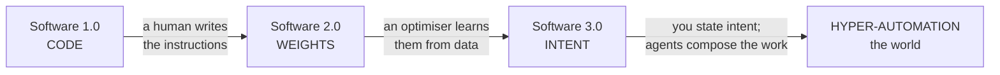

{/* ===================================================================
    BUILD SCAFFOLD — draft:true until ≥15,000 words + all instruments land.
    Word budgets per section sum to ≈15,300. Plate tags are added as each
    component is built + registered in mdx-components.tsx.
   =================================================================== */}

By the spring of 2040, the word *company* has quietly changed what it means, and you can watch the change happen at dawn.

Consider one morning. In a converted bakery in Lisbon, a woman named Inês wakes at six and *reads* — not writes, reads — the overnight work of the firm she founded. It serves a little over forty million people. It has, depending on how you count, between one and four employees: Inês; her partner, who handles the few things that still need a human signature; and two specialists who drop in for a handful of hours a week. Everything else — the code behind the product, the support that answers in nineteen languages, the design, the bookkeeping, the slow grind of compliance across forty jurisdictions — is carried out by a standing population of software agents she does not manage so much as *conduct*. She states intent; they compose the execution. While she slept, they shipped a feature that in 2027 would have taken a team of thirty an entire quarter.

None of this is science fiction, and that is the unsettling part. Every component already exists in 2026 — in prototype, at a price falling by an order of magnitude a year. What changes between now and 2040 is not the arrival of some new miracle but the *compounding* of curves we can already measure: the cost of intelligence, the cost of energy, the price-performance of computation, bending downward year after year until quantity becomes a difference in kind. A thing that is a thousand times cheaper is not the same thing, cheaper. <PullQuote>A thing that is a thousand times cheaper is not the same thing, cheaper. It is a new thing.</PullQuote> It is a new thing.

Widen the lens past Inês and the same dawn is breaking everywhere at once. On a night shift in a factory outside Zagreb, a humanoid robot finishes a task no one rostered a person for, because at its price the arithmetic of hiring it has quietly inverted. In a clinic in Nairobi a doctor reads a patient's whole genome, sequenced overnight for less than the cost of the coffee on her desk. A few hundred kilometres overhead, a rack of processors trains a model in uninterrupted sunlight, cooled by the vacuum, because the cheapest place to put a data centre has — improbably, and only at the margin — started to be off the planet. The automation has left the screen. It is in the building, in the body, in orbit.

I want to be honest about the texture of that world, because the breathless version is a lie. The same forces that let Inês reach forty million people emptied the floor that used to hold her thirty-person team, and the people on that floor did not all become founders. Whole categories of work that anchored the middle of the income distribution thinned out inside a decade, faster than the institutions built to cushion such things could move. The genome in Nairobi is cheap; the question of who is allowed to act on what it says is not settled. The robot in Zagreb works the night shift the union spent forty years making humane. None of the curves in this essay care about any of that, which is exactly why the curves are not the whole story.

So this is not a utopia, and it is not the apocalypse the doom literature keeps promising either. It is something stranger and, I will argue, more plausible than both: an age of **hyper-automation** in which the marginal cost of intelligence, and then of a great many physical things downstream of intelligence, falls toward zero — and in which the decisive question stops being *will there be enough* and becomes *who owns the abundance, and what, then, are people for.* The answer the loudest voices give — a universal cheque that turns most of humanity into the managed pensioners of a small ownership class — is only one branch of the tree, and to my eye the least imaginative one. There is a better branch. Reaching it is a choice, not a fate.

This essay is the case for that branch, and it is built like an instrument rather than an argument you take on trust. Every leap is pinned to a curve you can drag with your own hand. So before the argument, the map. The dial below is the whole essay in one figure: six rings — code, models, agents, robots, biology, and the frontier off-world — crossed with the years from now to 2040, and a conductor's core that never moves, because it is the one thing the machine turns around. Drag the year-hand and the future arrives ring by ring, each forecast attributed to whoever was rash enough to make it. Then we will walk the rings, one at a time, and I will show you why the most boring, best-measured trend lines in the world add up to something that ought to take your breath away.

<TwentyFortyPlanisphere />

## Software 1.0, 2.0, 3.0

The clearest way into all of this was drawn, almost in passing, by the engineer Andrej Karpathy — and once you have seen it you cannot unsee it.

For most of computing's history there was only one kind of software, the kind we now have to call **Software 1.0**: explicit instructions, written by a human, in a language the machine can follow. *If the balance is below zero, refuse the transaction.* Every rule that governs the program is a rule somebody typed. This is the software that built the modern world, and it has a ceiling everyone who has worked in a large codebase has felt in their bones — the ceiling of what a human can specify, line by line, before the system grows too large for any single mind to hold.<Sidenote>The widening gap between a system's complexity and any one person's capacity to comprehend it is the subject of an [earlier essay](/blog/a-nervous-system-for-software) — and the reason the next two layers of software had to be invented.</Sidenote>

In 2017 Karpathy named the thing that was beginning to replace it. **Software 2.0** is not written; it is *trained.* The program is the set of weights inside a neural network, and those weights are found rather than authored — wrung out of data by an optimiser running on a great deal of compute. The programmer's job shifts from writing the logic to curating the dataset and shaping the objective; the source code, in a real sense, becomes the data. AlexNet, in 2012, was the proof of concept. By the early 2020s, 2.0 had swallowed image recognition, translation, speech and protein folding whole. Nobody wrote a cat detector. They showed a network ten million cats.

Then, around 2025, Karpathy named the third era — the one we have just entered. **Software 3.0** is programmed in English. The program is a *prompt* — a specification of intent in ordinary language — and the runtime that executes it is a large language model. The remarkable, slightly vertiginous consequence is that the population of people who can now command a computer to do something genuinely new is no longer the few million who can write code; it is, in principle, everyone who can describe what they want. The interface to computation has become the most widely held human skill there is: language.

Switch the eras in the figure below and watch the same program change phase — a lattice of hand-written code, then a mesh of learned weights, then a single point of stated intent radiating out into the agents that carry it out. The thing being represented does not change. What changes is *who writes it*: a human engineer, then an optimiser fed on data, then you, in a sentence.
<ThreeErasOfSoftware />

Notice what each step does to the *bottleneck.* In 1.0, the scarce resource is engineers — people who can translate intent into precise instructions. In 2.0, the scarce resource shifts to data and compute. In 3.0, the bottleneck moves again, and this is the move that matters for everything that follows: once intent is the interface, the scarce resource becomes *intent itself* — taste, judgement, the knowing of what is worth doing. Execution, the thing we have organised entire economies and educations and identities around, falls in price toward the cost of the electricity it takes to run the model.

This is why I do not think "Software 3.0" is merely a better way to write apps, and why the title of this essay pairs it with a second phrase. **Hyper-automation** is what happens when the 3.0 pattern — state intent, let a machine compose the execution — stops being confined to the screen and crosses into the physical world. An agent that can write the software to run a warehouse is one short step from an agent that can direct the robots *in* the warehouse; a model that can read every paper on a protein is one step from a system that can run the wet-lab robotics to test what it proposes; a planner that can schedule a data centre's workloads is one step from one that can site the data centre itself — on the ground, or, as we will see, in orbit. The same descending signal — a stated intent, a small specification, a "make it so" — reaches further down the stack each year, from code into models, into agents, into machines, into biology, into the off-world frontier. Each ring of the dial is the same gesture, reaching one shell further out.

That is the whole thesis in one sentence: *the interface to the world is collapsing to intent, and everything downstream of intent is becoming automatable.* The rest of this essay is the evidence — and, just as importantly, the places where the evidence runs out. But to believe any of it you first have to believe that the trend has legs, that it is not about to flatten into the disappointing S-curve that every previous wave of automation eventually became. For that, we have to go back to a machine built in 1958, and trace the seventy-year arc that brought us here.

## From Rosenblatt to Hinton to now

The reason to trust the trend is that it has already survived its own funeral. Twice.

In 1958 a Cornell psychologist named Frank Rosenblatt described the Perceptron, the first machine that could *learn* — adjust itself from examples rather than follow instructions a human had written out in advance. Two years later he wired up a physical version, the Mark I, a cabinet of motors and photocells that taught itself to tell shapes apart, and the press did what the press still does. *The New York Times*, briefed by the Navy that funded it, announced the perceptron as the embryo of a computer that would one day walk, talk, see, write, reproduce itself and be conscious of its existence. The year was 1958. The hype cycle is older than most of the people now warning about it.

In 1969 the hype met its first wall. Marvin Minsky and Seymour Papert, two founders of the field, published *Perceptrons*, a book that proved with cold rigour that a single-layer network could not learn even the simple logical operation called *exclusive-or.* The proof was correct; the conclusion the field drew from it — that the whole approach was a dead end — was not, but that hardly mattered. Funding evaporated. The first **AI winter** set in, and for the better part of two decades the idea that you could build something like intelligence by training networks of simple units was, in respectable computer science, faintly embarrassing.

The thaw came from people who kept working through the cold. The mathematics that answered Minsky and Papert — *backpropagation*, a way to train networks of many layers — was derived by Paul Werbos in a 1974 doctoral thesis that sat largely unread, and made famous in 1986 by David Rumelhart, Geoffrey Hinton and Ronald Williams in a short paper in *Nature.* Deep networks could learn after all. But the machines of the 1980s were too slow and the datasets too small to show what the idea could do; the expert-systems boom that had crowded it out collapsed commercially; and the field slid into a **second winter.** Twice now, the thing had been pronounced finished.

What ended the second winter was not a cleverer idea. It was scale. In 2012 a network called **AlexNet** — built by Hinton and two of his students, Alex Krizhevsky and Ilya Sutskever, and trained on a pair of gaming graphics cards — won the ImageNet image-recognition contest by a margin so wide it stopped resembling a contest. The lesson, which the researcher Richard Sutton would later call the *bitter lesson*, was that general methods which scale with computation beat clever methods hand-tuned by humans, and beat them not by a little. Five years later, in 2017, a team at Google published *Attention Is All You Need* and handed that scaling a near-perfect engine: the **Transformer**, an architecture that got better — reliably, predictably — the more data and compute you fed it.

Trace the whole seventy-year arc in the spiral below. It winds outward from a 1958 seed at the core; the early decades crowd the tight inner coils, dimmed through the two winters; and then, from 2012, the modern era fans across the rim, each year a longer stride than the one before.

<AILongArc />

After the Transformer the story accelerates so fast it is hard to credit that it is only nine years long. **GPT-1**, in 2018, showed that a Transformer pre-trained on raw text learned language in general rather than one task at a time. **GPT-3**, in 2020, made the machine a *few-shot* learner — describe a task in the prompt and it would attempt it — and in the same year a quiet, consequential paper by Jared Kaplan and colleagues established the **scaling laws**: the finding that a model's capability improves as a smooth, predictable function of its size, its data and its compute. That is the sentence that changed the industry's psychology. Capability stopped being a breakthrough you hoped for and became a resource you could budget. In 2022 a DeepMind team refined the recipe — the *Chinchilla* result, that data and model size should grow in step — and at the end of that November, OpenAI wrapped the technology in a chat box. **ChatGPT** reached a hundred million people faster than any consumer product in history, and the seventy-year argument about whether any of this would ever amount to anything was, for most of the public, settled over a single weekend.

There is a human thread running through all of it, and his name is Geoffrey Hinton. He is on the 1986 backpropagation paper; he is on AlexNet in 2012; and in 2024 he was awarded the Nobel Prize in Physics for the body of work that made neural networks possible — having, the year before, left Google so that he could warn, without commercial conflict, about where the thing he had spent his life building might be heading. That one career should span the popularising of the method, its scaling breakthrough, its highest honour and its most credible alarm tells you how compressed this history really is. It is not an ancient field. The whole arc fits inside a single working life.

And the most recent turn is the one that matters most here. Since 2023 the frontier has moved from systems that *answer* to systems that *act* — models that reason in steps, call tools, write and run their own code, and chain those abilities into agents that pursue a goal across many moves without a human approving each one. This is the agentic turn, and it is what makes "Software 3.0" more than a slogan: it is the moment the machine stopped being a thing you query and became a thing you *delegate to.*

I have rushed through seventy years because the details are not the point; the *shape* is. Twice the field was buried, and twice it came back — faster, on the back of more computation and more data rather than more genius. That is the single most useful fact for anyone trying to forecast the next fifteen years, because it tells you exactly what to watch. The question is not whether the cleverness keeps arriving; cleverness is unpredictable. The question is whether the *inputs* keep getting cheaper — compute, data, energy. And that, it turns out, is not a question about genius at all. It is a question about two of the most relentless curves in the history of technology.

## The two curves that make it inevitable

The two curves are the price of computation and the price of intelligence. Once you have looked at them honestly — neither flinching at the magnitude nor pretending they run on forever — almost everything else in this essay follows.

Begin with computation. Ray Kurzweil has spent forty years plotting a single line: the number of calculations per second that a thousand dollars will buy, across the whole twentieth century and into ours. The striking thing about the line is that it is smooth through five entirely different underlying technologies — electromechanical relays, vacuum tubes, discrete transistors, integrated circuits, and the parallel silicon of the present — as if the substrate were merely the costume and the exponential the actor underneath. Moore's Law, the famous doubling of transistors on a chip, turns out to be just the fifth act of a much older play. Read off the line and a striking crossover arrives around 2023: a thousand dollars now buys roughly the raw operations-per-second of a single human brain. Kurzweil's reading of where the line points is famous and unembarrassed — human-level AI by 2029, a "singularity" by 2045.

I plot his curve below because it is the right backbone for the argument, and I want to be just as clear about how to read it as he is not. It is an order-of-magnitude sketch, not a precision instrument; the y-axis spans thirty decades and the eye should treat the trend, not the points. And the dates are the most contested thing in futurism: skeptics from Paul Allen to the textbook authors Russell and Norvig argue that exponentials are really the early half of S-curves that flatten, and Kurzweil's own scorecard is mixed — his information-technology predictions have aged well, his timelines for artificial general intelligence, nanomedicine and radical longevity rather less so. The honest summary is that the *trajectory* has been right for a century and the *dates* run optimistic. Hold both in your head at once.

<ComputePricePerformance />

But raw compute per dollar is the input, not the thing anyone actually buys. What a person or a company buys is *intelligence* — a unit of useful cognitive work, a passable draft, a correct answer, a solved ticket. And when you measure the price of *that*, the recent numbers are so steep they look like a typo.

<CostOfIntelligence />

Hold a level of capability fixed — say, the quality of the original GPT-3 — and ask what it costs to buy it. In late 2021 it ran about sixty dollars per million words of output. Three years later you could buy the same quality for six cents. That is a thousandfold collapse in thirty-six months, roughly tenfold a year, and the venture firm Andreessen Horowitz gave it a fittingly absurd name: *LLMflation.* It is the single most important number in this essay, and it is also where I have to spend my honesty, because the naïve thing to do with a tenfold-a-year curve is extend it to 2040, and the naïve thing is wrong in two different ways.

The first is the floor. Extend ten-times-a-year out to 2040 and you reach prices with eighteen zeros after the decimal point — numbers so small they would imply running a civilisation's worth of thought on less energy than a light bulb, which physics does not permit. Every act of computation has to move electrons and shed heat, and below some price the curve stops being about cleverness and starts being about joules and silicon. So the real curve must **bend**: it keeps falling, but it flattens toward an energy-and-materials floor it has not yet reached. The faint ghost line plunging off the bottom of the figure is the fantasy; the curve that bends above it is the forecast. Intelligence becomes astonishingly cheap. It does not become free.

The second is subtler and, for the thesis, more important. Cheaper per unit has never meant *less spent in total.* In 1865 the economist William Stanley Jevons noticed that more efficient steam engines did not reduce Britain's coal consumption — they increased it, because cheaper steam made steam worth using for a thousand things it had never been worth using for before. The same thing is happening to thought. As intelligence got cheaper per token, we did not buy less of it; we built agents that chew through hundreds of thousands of tokens to do a task where a chatbot once spent two thousand, and Goldman Sachs already projects total token demand rising some twenty-four-fold by 2030 even as the unit price keeps falling. <PullQuote>Abundance does not arrive as "intelligence becomes free." It arrives as intelligence becoming so cheap, per unit, that we point it at a million things we never could before.</PullQuote> This is what abundance actually looks like, and it is worth saying slowly, because almost everyone gets it backwards. Abundance does not arrive as *intelligence becomes free.* It arrives as intelligence becoming so cheap, per unit, that we point it at a million problems it was never economic to touch. The deflation is in the price of a unit; the explosion is in the number of units. The two together are the engine of everything downstream.

So "inevitable," in my title's spirit, does not mean infinite, and it does not mean soon-and-smooth. It means something narrower and far sturdier: the two inputs that gate every frontier in this essay — computation, and the intelligence built on top of it — have been getting cheaper for decades, and will keep getting cheaper for years yet, bending toward a floor we are nowhere near. You do not need a singularity to remake an economy. You need only a few more turns of a curve that is visibly still turning. And the first place those turns show up is not in a laboratory or a benchmark. It is in the most basic unit of economic life — the firm.

## The firm reinvented

{/* ~1,800w — workflows → agents → 10×/100× micro-companies; mass entrepreneurship, not mass unemployment. */}
<FirmMorph />

<OutputPerPerson />

## Automation leaves the screen

{/* ~1,600w — humanoids & embodied AI; ARK $26T bull case + consensus counter. */}
<HumanoidAdoption />

## Biology becomes engineering

{/* ~1,500w — multi-omics, the genome cost curve, AI drug discovery, longevity. */}
<GenomeCostCurve />

## The industrial base goes off-world

{/* ~1,700w — orbital AI data centres → lunar ISRU → Mars/terraforming long horizon (sober). */}
<OffWorldStack />

{/* MERMAID: the hyper-automation stack — intent → agents → tools → robots → world */}

## The near-zero-marginal-cost economy

{/* ~1,800w — abundance, deflation; why not UBI-dependency nor doom; broadened ownership / who holds the deed. */}
<AbundanceProjection />

## Honest uncertainty

{/* ~1,100w — what could break it: energy, regulation, geopolitics, alignment, social rupture. */}

## Coda — the silver lining

{/* ~800w — AI as the thread; 2040 a waypoint, not a finish; human meaning. One italic close. */}

---

## Go deeper

{/* Footer links: /synaptic/symphony · /blog/a-nervous-system-for-software · the two curves' sources · etc. */}
