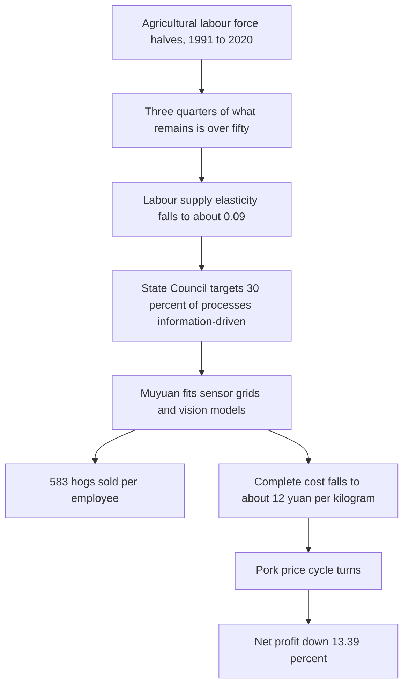

# The Sow Barn's Missing Hands

Three point three million sets of intelligent equipment across the entire pig industry chain, and two billion pieces of data a day. Those figures sit inside [Alibaba Cloud's July 2026 review of its first-half milestones](https://www.alibabacloud.com/blog/alibaba-positions-for-accelerated-ai-growth-in-second-half-of-2026_603316), given as the starting condition Muyuan Foods brought to the joint Pig Farming Big Model the two firms signed on 1 June 2026. That is vendor arithmetic. I would treat the second number the way you treat any figure a cloud provider quotes about the customer whose bill it wants to grow: interesting, load-bearing for the story the vendor wants told, but not something a Muyuan finance team would print in a filing without qualification. The first number is easier to trust, because you can see the barns.

## the hands are gone

Start with the human number. Between 1991 and 2020, China's agricultural labour force fell from 390.98 million to 177.15 million, and the share of primary-sector workers in total employment fell from 60.1 percent to 23.6 percent, [per a Frontiers in Sustainable Food Systems paper published this year on rural aging and agricultural technology progress](https://www.frontiersin.org/journals/sustainable-food-systems/articles/10.3389/fsufs.2026.1806363/full). Inside what remained, the age curve inverted. Among rural agricultural workers over 16, the share aged 65 and over rose from 2.39 percent to 18.54 percent, and the 50-to-64 cohort rose from 13.53 percent to 42.39 percent. Those two shifts together leave a labour force roughly half its 1991 size, with three quarters of what remains over fifty.

The paper is unsentimental about the productivity consequence. Rural population aging reduced farm size by around 4 percent through land transfer and abandonment, with agricultural output and labour productivity falling by about 5 and 4 percent respectively. In districts where the age curve is worst, the elasticity of labour supply to income collapses from about 0.28 to about 0.09, meaning that even where the money is there to hire, the bodies to hire are not. The paper is a straight description of the constraint the country is now farming inside.

The [2025 Smart Agriculture Action Plan](https://en.people.cn/n3/2025/0729/c90000-20346330.html), which the State Council uses to steer the direction of the sector, puts the target of the current phase in a single line: by the end of 2026, initial public-service capacity for smart agriculture in place, more than 30 percent of agricultural production processes information-driven, and a smart-agriculture market that grew past 100 billion yuan in 2024 with a 120-billion-yuan projection for 2025. Set against the demographic curve, the plan is a pricing exercise: how much digital labour it takes to stand in for the human labour that has left the sector.

## muyuan's arithmetic

Take Muyuan as the case that matters, because Muyuan is where the substitution is farthest along and where the numbers are auditable rather than aspirational. In the [2024 annual report summary filed in March 2025 under Shenzhen stock code 002714](https://file.finance.qq.com/finance/hs/pdf/2025/03/20/1222845029.PDF), the company reported 133,642 employees at year-end. In the twelve months to December 2025, [as compiled from the March 2026 filings](https://finance.biggo.com/news/1M_WMZ0BQ45Y7dX6MxLh), the company sold 77.981 million commercial hogs, slaughtered 28.663 million head, and moved 3.23 million tons of fresh and frozen pork. Complete cost of pig farming fell to around 12 yuan per kilogram, down about 2 yuan from a year earlier. Revenue grew 4.49 percent to 144.15 billion yuan.

Divide 77.981 million pigs by 133,642 workers and one Muyuan employee's rounds cover roughly 583 head sold in a year. Nobody, thirty years ago, would have described that as a plausible ratio for a large integrated hog operation. The equivalent number for a mid-2010s Dutch pig farm, the ones I used to walk through when a client was benchmarking, sat closer to 500 pigs per worker on the finishing side and materially lower once you added the sow barns. Muyuan's ratio only exists because there is a computer, a sensor, or a vision model in almost every part of the barn that used to have a person in it.

Despite the cost fall and the operating discipline, Muyuan's net profit attributable to shareholders declined 13.39 percent to 15.49 billion yuan in 2025, dragged by the pork price cycle. Digital labour bought a two-yuan-per-kilogram cost improvement. It did not buy freedom from the market. The AI dashboard cannot promise a better hog price the way the vendor pitch implies. That gap is the productivity-paradox literature seen from inside a barn, and [it is the same shape the Solow paradox took on when Fortune revisited it in February 2026](https://fortune.com/2026/02/17/ai-productivity-paradox-ceo-study-robert-solow-information-technology-age/), thirty-nine years after Solow himself wrote his line about computers everywhere except in the productivity statistics. Perceived productivity is not the same as measured productivity, and neither of them is the same as retained earnings once the market moves against you.

## the geometry under the sensors

I owe a hearing to the argument that says none of this is progress at all. [GRAIN's long-standing analysis of China and Vietnam's industrial pig strategy](https://grain.org/en/article/6941-china-and-vietnam-s-questionable-strategy-to-control-asia-s-pig-pandemic) makes an uncomfortable case that many of the largest African swine fever outbreaks began inside modern industrial farms with the best biosecurity infrastructure, the very sites now being retrofitted with sensor grids and vision models. The technology was in place. The failure was geometric: putting hundreds of thousands of animals under one roof is a disease-transmission strategy no software has yet talked itself out of.

That is the counter I would want any operator quoting Muyuan's ratio to answer plainly. The Pig Farming Big Model is sold on feed nutrition, breeding stock improvement and livestock management. The geometry of hundreds of thousands of animals under one roof sits outside that scope, and so does the hope that ventilation, sensors and a vision model will catch what a stockman used to catch by ear. On the operational layer, image recognition [has been shown to lower piglet mortality by about 3 percent](https://www.mdpi.com/2077-0472/16/3/334) in a recent MDPI review of robotic technologies in smart pig farms, a real improvement and one nobody in the barn would refuse. The MDPI finding lands at the sensor layer and GRAIN's critique at the systemic layer. Both can be true at once.

## drones over the smallholdings

Away from the mega-farm, the smallholder story runs on a different vehicle. [XAG's P150 Max, launched in February 2026](https://www.global-agriculture.com/mechanization-technology/xags-new-p150-max-agricultural-drone-sets-a-higher-bar-for-autonomous-operation/), sprays 50 to 60 acres an hour in ordinary conditions, and one operator can supervise two units in swarm mode. XAG reports 9.3 million flight hours logged on its P-series since 2022 and more than 140,000 smart-agriculture professionals trained across China. Against the 177 million remaining agricultural workers, the drone does plainly what the Ministry document said it should. One aging farmer covers the work of several.

The smart-farm barrier at the household level is real, and worth naming to keep the picture honest. [An MDPI paper on climate-smart agriculture adoption in Northeast China's black-soil region](https://www.mdpi.com/2077-0472/15/21/2236) puts the annual incremental cost of machinery-service fees at 1,871 to 2,339 yuan per household, or 6.7 to 8.4 percent of agricultural income. That is a meaningful drag on the smallest farms, which is exactly where the aging is heaviest. Subsidies close some of the gap and not the rest.

## whose barn now runs on what

I stood in a Dutch finisher barn in the spring of 2019, walking behind a rotation manager who could tell you from twenty paces which animal was off feed. He told me, without irony, that the sensor rig his co-op had just installed did the same job in the abstract and none of the job in the particular. It flagged a tenth of what he would flag by ear, and its false positives cost him half a Sunday to run down. Seven years on, the vision-model side of that comparison has moved much farther than the human side. The Muyuan barn today runs closer to what the Dutch rotation manager was pushed to accept than to what he was still doing when I met him. Whether a computer can do a stockman's rounds is settled. What is open is how much of the barn the stockman signs off on rather than walks himself.

That is the workforce-productivity number Beijing's planners are chasing. It sits between the 133,642 employees and the 77.981 million hogs, and no filing states it directly.

## 583 hogs per worker

One Muyuan worker's rounds now cover 583 hogs sold in a year, [from the company's 2025 disclosures](https://finance.biggo.com/news/1M_WMZ0BQ45Y7dX6MxLh).

---

Tarry Singh is the founder and CEO of [Real AI](https://realai.eu), an enterprise AI advisory and deployment firm working with global enterprises on production agent systems, model risk, and AI sovereignty strategy. He also leads [Earthscan](https://earthscan.io) for Energy AI startup, and is a founding contributor to the EU-funded HCAIM and PANORAIMA programmes for responsible AI education across European universities. He writes at tarrysingh.com.
