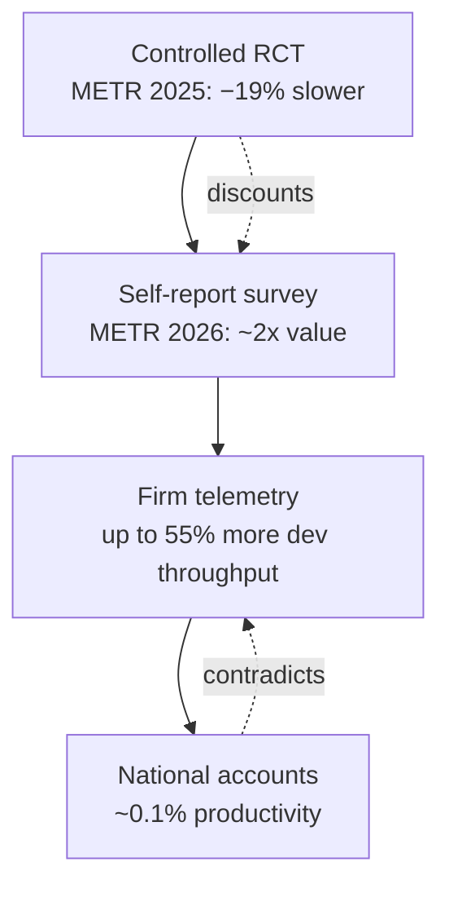

Three weeks ago Bank of America's global economics team published a note telling anyone sceptical of the AI build-out that they were thinking too small.

It's not like electricity or even the internet, the team wrote. It is more powerful than both, and the productivity boom it will eventually deliver could be 10x larger than anything the economy is currently showing.

The report landed around 21 May 2026. It is a confident document.

The number that should have been the headline sits further down. The economy is currently showing 0.1%, which the bank itself called "a small aggregate effect relative to all the excitement around AI." It barely registers against global growth of 3.5%.

Ten times, against 0.1%. The entire bull case is the multiplication. The gap between the two figures is a measurement problem before it is an economics problem, and after thirty years of watching technology cycles get sold on the strength of the wrong metric, I read the measurement before I read the conclusion.

## same technology, four different rulers

You can measure the productivity of AI at four levels, and each level gives you a different answer in good faith. That is what makes the domain genuinely hard.

Start at the bottom, with a controlled trial. Last July, METR, a non-profit that runs randomised trials on frontier models, published the result nobody wanted.

Before starting, the experienced open-source developers forecast that AI would cut their completion time by 24%. Afterwards they estimated it had cut it by 20%. In fact, allowing AI increased completion time by 19%.

The tools slowed them down, and the developers couldn't feel it. That is the cleanest finding in the entire field and it points the wrong way for the vendors.

Now go up a level, to self-report. On 11 May 2026 METR published a survey of technical workers.

Using the same question wording, respondents retrospectively estimated 1.3x value of work in March 2025, 2x in March 2026, and forecast 2.5x for March 2027.

A 2x value gain, 20x the macro number. And to METR's enormous credit, they attached the asterisk themselves.

METR's own staff gave the lowest change-in-value answers of any subgroup, which the researchers expect is because staff have past findings of gaps between perceived and actual productivity in mind.

The people who know the measurement problem best trust the self-reports least.

Go up again, to firm-level telemetry, and the picture shifts a third time. The numbers BofA cites for the micro layer come from this world.

The report said software development productivity rose by as much as 55% and writing-related tasks improved by roughly 40%.

These are real measurements of real pipelines. But notice what's being measured: throughput, tickets closed, lines shipped. Value delivered is not in there, and GDP is nowhere near it.

Then the top level: the national accounts. 0.1%.

The signal doesn't merely shrink as you climb. It changes sign between the trial and the survey, and contradicts itself between the firm and the macro. Anyone quoting one of these layers as *the* productivity number is, knowingly or not, picking the ruler that flatters their thesis.

## the atlanta fed's productivity paradox

The most useful single result in the academic literature this year comes from the Atlanta Fed. Surveying nearly 750 corporate executives, the authors found something they named directly.

They document a productivity paradox, in which perceived productivity gains are larger than measured productivity gains, likely reflecting a delay in revenue realisations.

That is the honest version of what's happening, and it has two readings. The optimistic one, which is BofA's, is that the J-curve is real and the measured gains are coming, just lagged.

The bank's case rests heavily on the view that AI will follow the same J-curve, delayed impact followed by rapid acceleration.

The pessimistic reading is that perception runs ahead of reality because people are bad at estimating their own output, which is exactly what the METR trial demonstrated under controlled conditions.

Both can be partly true. But a board cannot spend capital on "partly true." It has to decide which reading governs the budget.

## calls deflected

If you want to see how the measurement problem becomes a governance problem, look at banking, where the numbers carry real money.

On 8 June 2026, Bank of America's CEO Brian Moynihan gave an interview that, almost in passing, exposed the rot in most AI productivity reporting. The argument was about accuracy versus efficiency.

Where banks put efficiency first, some use "calls deflected" as a metric. You can provide an inaccurate but quick answer with the bot that scores well on the metrics and shows up as a productivity gain, while the customer on the receiving end does not get the accurate answer they need.

"Calls deflected" is a metric you can hit by giving wrong answers fast. It will appear in a slide deck as a productivity win. It is, in the only sense that matters to the customer, a productivity loss. The same bank reports genuine wins on the other side: the internal employee assistant has led to a 55% drop in calls to the IT help desk.

The number you celebrate depends entirely on which one you decided to count.

That is the oldest trick in enterprise software, and banking has no special claim on it. Whatever you instrument becomes the target, and the target stops measuring what you cared about.

## what Microsoft's number actually measures

Which brings me to the Work Trend Index, published 5 May 2026, and the statistic that anchored every summary of it.

Microsoft found that organisational factors account for 67% of reported AI impact versus 32% for individual mindset, named the result the "Transformation Paradox," and concluded employees are ready but their organisations aren't.

I think the directional claim is correct. Systems beat individuals, and I've watched that be true since the 2017 Microsoft 365 adoption playbook said the same thing in nearly the same words. But the number itself deserves a sceptical sentence, because Microsoft supplies one.

The 67-to-32 split comes from a single survey in which the same respondent rated their own AI use, their organisation's culture, their manager's behaviour and the value they get from AI all in the same sitting. Microsoft acknowledges in its methodology that the relationships are statistical associations rather than causal effects.

The "AI Impact" outcome is itself a composite of job-satisfaction items with AI framing layered on. Of course it correlates with manager support. So does every engagement survey ever fielded.

That's not fraud. It's a vendor measuring the thing its products are sold to fix, and reporting the correlation as a discovery.

## the before-and-after test

The only productivity figure worth signing off on this year is a before-and-after on an objective metric the team did not get to choose for itself. Self-reported speed will not do, and neither will calls deflected or "work I couldn't have produced a year ago." Those are perceptions and selected metrics, and the cleanest evidence we have says perception runs ahead of reality by an order of magnitude.

None of that is AI-scepticism. The gains are real at the task level and I deploy these systems for a living. The measurement layer is simply where the deception now lives, sometimes deliberately and mostly not. The Atlanta Fed paradox, the METR asterisk, Moynihan's deflected calls and Microsoft's same-sitting survey are four versions of one warning: the productivity number is only as honest as the ruler, and right now almost everyone is holding the ruler that pays them.

BofA's 10x and the economy's 0.1% sit side by side without contradicting each other. They measure different things and call both "productivity." The strategist Joachim Klement, eight days before the BofA note, made the uncomfortable counter-case: that the AI cycle is a bubble still waiting to pop, already 60% larger than the dot-com peak, with tech investment accounting for 93% of all U.S. GDP growth.

He may be wrong about the timing. But he's measuring the spend, which is real today, against the return, which is mostly a forecast. That's the honest comparison.

The micro gains are happening. The macro payoff is a promissory note. Don't let anyone collapse the two into a single slide.

* * *

Tarry Singh is the founder and CEO of Real AI (realai.eu), an enterprise AI advisory and deployment firm working with global enterprises on production agent systems, model risk, and AI sovereignty strategy. He also leads Earthscan (earthscan.io) for Energy AI, and is a founding contributor to the EU-funded HCAIM and PANORAIMA programmes for responsible AI education across European universities. He writes at tarrysingh.com.
