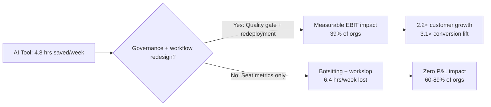

Gartner published two surveys in May 2026 that should be uncomfortable reading for every chief executive with an AI line item in their 2027 budget. 

The first, released 13 May, found that 19% of employees surveyed in Q1 2026 reported no time saved with AI, a result drawn from 12,004 employees and managers across 40 countries.

The second, released 19 May, found that while AI saves sellers an average of 4.8 hours per week, sales organisations that reinvest that time into high-impact activities are 2.2× more likely to exceed customer growth goals. Read separately, each looks like a vendor cheerleading deck. Read together, they describe a measurement crisis that most enterprises have not yet named: we can count time saved, we cannot yet explain why the profit does not arrive.

I have defended enough pilot budgets to know when a metric is hiding a governance failure. That 19% gets read as an adoption problem. It is closer to a confession that the productivity question we are asking, 'Did you save time?', is the wrong level of abstraction for enterprise decision-making. Time saved is a task metric. It becomes a business metric only when the organisation can redeploy that time, measure the output quality of the redeployed capacity, and attribute margin movement to the shift. Most boards I work with have none of those three controls in place. They have seat counts, prompt volumes, and vibes.

## What the surveys actually captured

BCG's research found 60% of companies globally were not generating material value from AI despite substantial investment, which aligns with McKinsey's finding of only 39% of organisations reaping EBIT impact. 

A landmark NBER survey of nearly 6,000 senior executives across the United States, United Kingdom, Germany, and Australia found 69% of businesses actively use AI, yet 89–90% of those firms report no detectable impact on employment or productivity over the prior three years. That gap between 'we use it' and 'it moved the number' is where $644 billion in 2025 GenAI spending went to find an addressable use case.

But the controlled task studies tell the opposite story. 

In Harvard Business School studies, workers completed tasks 25.1% faster, with quality ratings more than 40% higher. Nielsen Norman Group put programmer output at 126% more code per week. Research involving 4,800 developers had them completing tasks 55% faster with GitHub Copilot. The divergence is not subtle: individual contributors report extraordinary gains, finance reports flat productivity.

The honest explanation is that we are measuring different things and calling them by the same name. 

Microsoft provides productivity metrics through Copilot usage reports: usage frequency, features accessed, user activity data. Those metrics measure adoption rather than value. A user interacting with Copilot regularly does not demonstrate that the interactions are producing business outcomes that justify the investment.

Microsoft updated its M365 Copilot usage reporting in mid-July 2026 to refresh faster (48 hours), change the default reporting window to 28 days, separate agent metrics into a dedicated report, and roll out worldwide by late July 2026. The change is administrative, faster dashboards and cleaner attribution, and it points straight at the underlying problem.

GitHub updated Copilot usage metrics on 2 July 2026 to improve reporting accuracy by adding CLI suggested-line telemetry and correcting AI credit attribution that previously showed real usage as 0.0; the change is an admission that AI developer tooling has outgrown the neat accounting models built for seat-based software, and Copilot now lives in editors, terminals, cloud-side workflows, pull requests, and agentic features. Usage is fragmenting faster than the instrumentation can follow it.

## The 'time saved but not redeployed' trap

Sales organisations that achieve moderate to large AI time savings and then reinvest that time into high-impact sales activities are 2.2× more likely to exceed customer growth goals and 3.1× more likely to exceed lead-to-opportunity conversion goals, according to Gartner's survey of 210 CSOs conducted in January and February 2026. That 'and then reinvest' clause is doing the analytical work. 

Gartner's Dan Gottlieb stated: 'AI is not the hero of this story; AI is the accelerant. The opportunity is not simply using AI to improve sales productivity. It is using AI to break through the constraints that limit sales output'.

The constraint is organisational.

Without governance (permission remediation, sensitivity labels, adoption programmes) most deployments see zero measurable ROI, and the licence spend is absorbed as an IT expense with no business outcome. EPC Group observes 60–80% of Copilot deployments fall into this ungoverned category. That range is consistent with every large-scale deployment I have reviewed in the past year. The tool works. The workflow redesign required to convert task-speed into margin does not happen.

The Work AI Index 2026 surveyed 6,000 workers and found 87% using AI, 11 hours saved per week, and only 13% of organisations getting real business value; the gap is where the value is being absorbed. 

'Botsitting' (re-pasting documents into prompts, supervising output, debugging confident-but-wrong answers) consumes an average of 6.4 hours per week, more time than workers spend producing work. 

Stanford and BetterUp researchers coined the term 'workslop': AI-generated content that is unhelpful, low-effort, or low-quality; 40% of workers received workslop in the past month, spending nearly 2 hours per incident deciphering or correcting it, costing $186 per employee per month in lost productivity.

For a board that has spent eight figures on Copilot seats in 2026, the line that matters is this: time saved per seat is real, but unmanaged output quality destroys the margin before finance can book it. The risk sits in the missing quality gate between 'the AI said it' and 'we shipped it'.

## The enablement illusion

A December 2025 Gartner survey of 197 CxOs and senior business leaders revealed only 27% of executives have a comprehensive AI strategy, and just 20% believe their workforce is truly AI-ready. 

Swagatam Basu, Senior Director Analyst at Gartner, said: 'The survey revealed that in the shift to an AI-powered workforce, most leaders are mistaking basic access or adoption metrics for transformation. This "enablement illusion" is hiding risks and draining ROI'.

The deeper illusion is the belief that time saved is productivity gained.

AI can improve productivity before it transforms workflows, but not everyone observes these distinctions; only about a tenth of workers agree that AI is transformative for their organisations while three times that amount of C-level executives believe they have achieved sustained, enterprise-wide impact from AI; at least some of these leaders are confusing individual efficiency gains with enterprise reinvention.

Gallup's Q1 2026 data shows 65% of employees say AI has improved their productivity, but only 12% say it has transformed work. That is a 5.4× perception gap, wider than any measurement error could account for.

Employees who are proficient with AI across multiple use cases are twice as likely to be highly productive, 2.3 times more likely to deliver high-quality work, and 3.2 times more likely to drive effective process improvements; leaders should move beyond tracking basic adoption and implement a 'True ROI Index' focused on the depth and diversity of AI use.

Depth and diversity of use is the first honest metric I have seen in a Gartner deck this cycle. Measuring 'how many people prompted' is as useful as measuring 'how many people opened Excel'. The question is whether the prompt improved a decision, shortened a cycle, or eliminated a manual reconciliation that was costing you margin. Most organisations cannot answer that question because they never instrumented the workflow to measure it.

## The developer productivity wedge: faster *and* slower

The cleanest controlled experiment came from the coding domain, and the result should make every CTO revisit their Copilot ROI model. 

A randomised controlled trial by METR found experienced developers required 19% more time to complete coding tasks when using AI tools than without them. They reported a 20% perceived speed increase, which puts the perception-reality gap at roughly 39–44%. Before beginning, the same developers had predicted a 24% speed increase.

Developers *believed* they were 20% faster. The stopwatch said they were 19% slower. The gap is not rounding error; it is a cognitive mismatch between effort and outcome that every performance dashboard is currently blind to.

GitHub Copilot's code acceptance rate averages between 27% and 30%. Developers retain 88% of accepted code in final submissions, which suggests the output is production-ready rather than a starting point requiring extensive modification.

Acceptance rate and cycle time measure different things. If you accept 30% of suggestions and each suggestion costs you review overhead, you can be *accepting more code* and *shipping more slowly* at the same time.

GitHub Copilot now generates 46% of code written by developers and Microsoft CEO Satya Nadella confirmed that Copilot now represents a larger business than GitHub itself at the time of the 2018 acquisition. That revenue milestone tells you the product has commercial traction. It does not tell you whether the *buyers* are measuring cycle time, defect rates, or just seat utilisation. My guess is that most are measuring seats.

## The six numbers worth instrumenting

A measurement brief for a client deploying Copilot or any LLM-based assistant at scale in 2026 would bin the vendor dashboards and track these six instead:

1. **Cycle time by work type**, not average time saved. Measure 'days from brief to shipped feature' for engineering, 'hours from request to closed ticket' for support, 'days from RFP to submitted proposal' for sales. If AI is working, cycle time should compress. If it is flat or rising, you are botsitting.

2. **Rework rate**. What percentage of AI-drafted content required material human correction before it could ship? If that number is above 30%, your quality gate is a human doing the work twice: once to prompt, once to fix.

3. **Headcount redeployment**. Did you reassign capacity freed by AI to higher-margin work, or did people fill the time with more of the same? 

A financial services executive told Fortune: 'A product development cycle tracking to take 24 to 36 months was completed in six months once his team incorporated AI capabilities; rather than reduce staff, he redeployed those developers to additional projects'. That is the reinvestment Gartner is measuring. Most firms I work with are not doing it.

4. **Agent-mediated margin contribution**. For any autonomous or semi-autonomous agent, measure: revenue per agent-hour, cost per agent-hour, and net margin per agent-hour. Compare to the human baseline. If you cannot do this calculation, you do not know if the agent is profitable.

5. **Shadow AI surface area**. 

Only 21% of workers use AI daily, though 91% of organisations claim to use it. 56% of workers received no AI training. And 73.8% of workplace ChatGPT accounts are personal unsecured accounts, which is the governance time bomb in that list.

6. **Executive–worker perception delta**. 

Only about a tenth of workers agree AI is transformative for their organisations, while three times that amount of C-level executives believe they have achieved sustained, enterprise-wide impact. If your board believes AI is transformative and your IC population does not, someone is looking at the wrong dashboard.

None of these are in the default Copilot admin centre report, and that is the point. The vendors will give you adoption, engagement, and prompt volume. You have to build the instrumentation that tells you whether any of it mattered.

## Agents in production by 2027

Gartner forecasts 40% of enterprise applications will embed task-specific agents by end-2026, up from under 5% in 2025. It also forecasts that over 40% of agentic AI projects will be cancelled by 2027. Both predictions can be true. Embedding is cheap: wrap an LLM call in a workflow trigger and call it an agent. Graduating from pilot to production requires measurement discipline that most enterprises do not have, so the cancellation rate will be high.

Allocating capital in this cycle, I would stay well clear of vendors selling 'time saved' as a proxy for ROI, and I would look hard at the 13% of organisations that have built the workflow redesign and quality controls required to convert task-speed into margin. Those are the firms getting real business value while 87% of their workers use AI and save 11 hours a week.

What they run is a better system around the model. They know what good output looks like, they have a process to reject bad output before it ships, and they have redeployed the saved capacity to work that moves the EBIT line.

The '19% reporting no time saved' problem is a governance problem. It shows up as a measurement problem, and it gets reported as a failure of the models. Fix the governance, instrument the workflow, measure the cycle time and the margin instead of the prompt count, and the productivity will follow. Or keep counting seats and wondering why the number your CEO cites in the all-hands does not match the number your CFO sees on the P&L.

---

Tarry Singh is the founder and CEO of Real AI (realai.eu), an enterprise AI advisory and deployment firm working with global enterprises on production agent systems, model risk, and AI sovereignty strategy. He also leads Earthscan (earthscan.io) for Energy AI, and is a founding contributor to the EU-funded HCAIM and PANORAIMA programmes for responsible AI education across European universities. He writes at tarrysingh.com.
