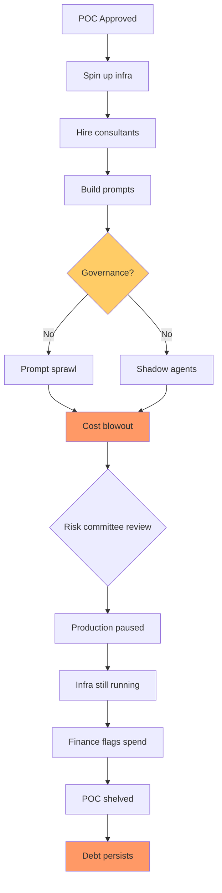

An enterprise client spent $500 million in a single month on AI services after failing to implement usage controls or cost monitoring.

 No one had reviewed consumption patterns until the invoice arrived in June 2026. That is not a hypothetical vendor horror story. It happened. 

Axios reported it the same week Sam Altman told a room full of enterprise customers that cost had become "a huge issue," saying "my company spent my entire 2026 budget in Q1."

This is the moment where AI slop debt — the half-finished POCs, the unevaluated agents, the prompt sprawl no one catalogued — stops being an engineering irritation and starts showing up in earnings calls. I've sat in enough post-mortems to recognize the shape of this mess, and it looks worse than the cloud bill shock of 2017. At least then we knew what a VM cost per hour. Today, most finance teams cannot answer "how much does our AI actually cost?" with a number they would defend under questioning.

## The new arithmetic of failure

73 percent of surveyed organizations report that their AI costs have blown their original budget planning, according to the State of FinOps 2026 Report.

 That is not margin creep. 

A review of 127 enterprise agentic AI implementations found that 73% went over budget, with some blowing through their original estimates by more than 2.4×—burning roughly $2.3 million on costs nobody anticipated.

The pattern is consistent. 

Forty-two percent of enterprises abandoned most of their AI initiatives in 2025, up from 17% in 2024, a near-tripling in a single year.

 

The average organization scrapped 46% of AI proofs of concept before reaching production.

 But — and here is where the debt stacks — they scrapped them *after* spending. After spinning up GPU instances. After replicating data. After hiring consultants to tune prompts that now sit in SharePoint. After integrating APIs that are still running.

The FinOps Foundation calls it: 

98% now manage AI spend, up from 31% two years ago.

 That universality is not evidence of maturity. It is evidence that the fire spread faster than anyone could build extinguishers. 

KPMG's Global AI Pulse found 49% of organizations have delayed or scaled back AI because of cost, and Flexera's 2026 State of ITAM Report found 59% say wasted AI spend rose year over year.

## The slop layer: what pilot purgatory leaves behind

MIT's NANDA initiative reveals that about 5% of AI pilot programs achieve rapid revenue acceleration; the vast majority stall, delivering little to no measurable impact on P&L.

 If you believe the vendor pitch decks, that 95% just "needs more model capability." If you have actually worked inside an enterprise, you know what it really is: organisational waste codified as YAML.

Every stalled POC leaves artifacts. A vector database that cost $18,000 to populate with embeddings nobody ever queries. Prompt libraries stored in three different repos because three different teams tried three different frameworks. Agent workflows that call $0.06-per-token APIs on tasks a regex would handle. 

Prompt sprawl crept up silently, turning content teams into firefighters battling version control nightmares, with each team member using different prompts for the same task, generating wildly inconsistent outputs.

Prompts are quietly becoming enterprise interfaces, but without the governance structures we instinctively apply to data, code or systems, and prompt sprawl creates reliability issues, inefficiency and risk long before leadership realizes what's happening.

 

Governed prompts are repeatable, auditable, and improvable. Ungoverned ones are none of the three. The shift from prompt sprawl to prompt governance is what allows an organisation to scale AI adoption without proportionally scaling the risk.

But most teams skipped governance. They were told to move fast. They moved fast. Now they have agent sprawl. 

LangChain, LangGraph, Pydantic AI, Vercel AI SDK adoption went from 9% of organizations in early 2025 to nearly 18% by 2026, and services using agentic frameworks more than doubled.

 

78% of enterprises run AI agent pilots but fewer than 15% reach production scale.

 The delta between those two numbers is slop debt. The agents that *almost* worked. The frameworks that *almost* scaled. The observability layer that was *going to be added next sprint* before the project got shelved pending budget review.

## IBM just told us what happens next

IBM CEO Arvind Krishna attributed much of the company's revenue shortfall to an abrupt shift in customer capital spending during the final weeks of June, with enterprise customers moving spending toward servers, storage and memory to secure supply-constrained infrastructure before anticipated price increases, reducing spending on IBM's Z mainframes and the associated transaction-processing software.

That is the canary. When enterprises reprioritize CapEx *away* from transactional workloads to secure AI infrastructure supply, then discover they cannot afford to run what they just bought, something breaks. The companies that locked in $700 billion in hyperscale buildout commitments — 

with capital expenditures reaching $650 billion in 2026 and surpassing $1.1 trillion in 2027

 — are betting that enterprises will absorb the inference cost. But 

the FinOps Foundation locates 80 to 90 percent of AI expenditures in inference, not in training, yet GPU utilization during operation often ranges from 15 to 30 percent.

That is the FinOps reckoning. Paying premium rates for capacity you use at 20%. Paying consumption-based pricing for agents you cannot turn off because no one documented which API calls are production-critical and which are leftover from a demo. Paying for three different LLM providers because three different teams picked three different models and no one centralized routing.

## What the 5% that succeed actually did differently

The enterprises running production-grade agents at scale — the ones *not* in pilot purgatory — did not wait for better models. 

They define governance before they write code. They design for failure, not just for the happy path. And they treat the agent architecture as a system to be maintained, not a project to be shipped.

Narrow single-function agents scale more reliably than broad multi-function ones, with successful deployments starting with agents scoped to a single, well-defined task, and scope expansion happening only after the narrow version proved stable for 90+ days, according to a March 2026 survey.

 

Every time teams said "we'll add logging later," later meant debugging a failure with no data. The cost of adding structured logging to a prototype is low. The cost of reconstructing what happened in a production failure without it is high.

If an AI agent achieves 85% accuracy per action, a 10-step workflow only succeeds about 20% of the time. At 95% per-step accuracy, a 10-step workflow still has only a 60% success rate. Per-step accuracy and workflow success rate are not the same number, and confusing them is one of the most expensive mistakes in agentic AI deployment.

 The teams that understand compound error probabilities build circuit breakers. The teams that do not understand it build abandoned pilots that still show up on the Azure bill.

## The debt stack is now a board-level question

AI spending is now a board-level cost, crossing the threshold from rounding error to board-level line item in Q1 2026.

 If I were sitting in a quarterly business review today, I would ask three questions:

1. Can you produce an audited list of every agent, POC, and prompt library consuming tokens in production or pre-production, with named owners and termination conditions?  
2. What percentage of current AI spend can you attribute to a specific P&L outcome measured in the last 60 days?  
3. Who in this building has the authority to kill an agent that is burning $40,000 a month on a use case no one remembers approving?

Most boards cannot answer those questions. That is the debt stack. Not the technical debt of poorly architected systems. Not the opportunity cost of abandoned pilots. The *financial* debt — sunk cost, recurring cost, zombie cost — that accrues when governance is deferred and "we'll clean it up later" becomes "we have no idea what is still running."

A 2025 study by the IBM Institute for Business Value found that those who reported their companies ignored the issue of technical debt saw returns on projects drop by 18% to 29%, with timelines expanding by as much as 22%.

 The AI layer accelerates that. 

AI coding tools are accelerating productivity, but they're also spawning duplicated code, phantom dependencies and hidden technical debt, and experts warn telcos face especially high stakes if AI is layered onto outdated systems.

I'd bet the next twelve months will produce at least three more $100M+ writedowns attributed to "AI rationalization" or "strategic portfolio review." The euphemism does not matter. What matters is whether your CFO is stress-testing the AI cost base *now*, or waiting for Axios to call.

---

Tarry Singh is the founder and CEO of Real AI (realai.eu), an enterprise AI advisory and deployment firm working with global enterprises on production agent systems, model risk, and AI sovereignty strategy. He also leads Earthscan (earthscan.io) for Energy AI, and is a founding contributor to the EU-funded HCAIM and PANORAIMA programmes for responsible AI education across European universities. He writes at tarrysingh.com.
