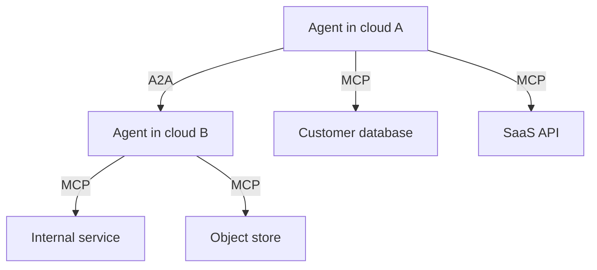

There is a particular sound the technology industry makes when a fragmented market consolidates around a standard. It is not the sound of a launch event. It is the quiet, almost boring sound of plumbing being laid: protocol drafts, foundation governance documents, GitHub release notes, donation announcements. I have been watching technology stacks form and re‑form for three decades, and the pattern is invariant: the headline goes to the model, the long compounding goes to the wire format underneath it.

That wire format, for agentic AI, finally exists. As of May 2026, the two protocols that matter, Anthropic's **Model Context Protocol (MCP)** for connecting agents to tools and Google's **Agent2Agent (A2A)** protocol for connecting agents to each other, both sit under the **Linux Foundation's Agentic AI Foundation (AAIF)**, both run in production at hundreds of enterprises, and both have crossed adoption thresholds that make them very hard to displace.

Most boards are still planning agent strategies as if the standards war were in front of them. It is behind them. Sources throughout: in a topic this hyped, the only thing worth reading is the part that's substantiated.

## The plumbing layer that nobody noticed

MCP, which Anthropic open‑sourced in November 2024, has crossed **97 million monthly SDK downloads** and **over 10,000 public servers** as of early 2026 ([Linux Foundation](https://www.linuxfoundation.org/press/linux-foundation-announces-the-formation-of-the-agentic-ai-foundation), [Anthropic](https://www.anthropic.com/news/donating-the-model-context-protocol-and-establishing-of-the-agentic-ai-foundation)). Anthropic's Claude alone processes **over a billion MCP tool calls per month** ([AI2Work](https://ai2.work/blog/model-context-protocol-hits-97m-installs-as-linux-foundation-takes-over)). Native MCP support now ships in Claude, ChatGPT, Gemini, Microsoft Copilot, Cursor, Windsurf, Replit, VS Code (via GitHub Copilot), Zed and roughly 300 other clients ([Wikipedia: Model Context Protocol](https://en.wikipedia.org/wiki/Model_Context_Protocol)). On December 9, 2025, Anthropic formally donated MCP, alongside Block's `goose` and OpenAI's `AGENTS.md`, to the newly formed **Agentic AI Foundation** under the Linux Foundation, with platinum backing from Google, Microsoft, AWS, Cloudflare and Bloomberg ([Linux Foundation](https://www.linuxfoundation.org/press/linux-foundation-announces-the-formation-of-the-agentic-ai-foundation), [GitHub Blog](https://github.blog/open-source/maintainers/mcp-joins-the-linux-foundation-what-this-means-for-developers-building-the-next-era-of-ai-tools-and-agents/)).

MCP is no longer Anthropic's product. It is a vendor‑neutral, foundation‑governed open standard, controlled by a community process. The last comparable inflection point in enterprise infrastructure was Kubernetes graduating into the CNCF in 2018. The vendors who stuck with proprietary orchestrators spent the next five years quietly retiring them. I see nothing in MCP's position today that points to a different ending.

Meanwhile, **A2A**, Google's protocol for letting agents discover, authenticate to and collaborate with other agents across platforms, went GA at Google Cloud Next in April 2025, was donated to the Linux Foundation in June 2025, and as of its first anniversary in April 2026 had crossed **150 organisations running it in production**, with Microsoft, AWS, Salesforce, SAP and ServiceNow among them ([Linux Foundation](https://www.linuxfoundation.org/press/a2a-protocol-surpasses-150-organizations-lands-in-major-cloud-platforms-and-sees-enterprise-production-use-in-first-year), [HPCwire / AIwire](https://www.hpcwire.com/aiwire/2026/04/09/linux-foundation-a2a-protocol-marks-one-year-with-broad-enterprise-and-cloud-adoption/)). A2A v1.0 hardened the spec into production‑grade in early 2026 and is already at v1.2, adding cryptographically signed agent cards for domain verification ([n1n.ai](https://explore.n1n.ai/blog/google-adk-1-0-a2a-protocol-multi-agent-standard-2026-05-04)).

The architectural picture is this. MCP is the *vertical* protocol. An agent reaches *down* through MCP into a tool, a database, a SaaS API. A2A is the *horizontal* protocol. An agent reaches *across* through A2A to another agent that may live in a different cloud, a different vendor, or a different company. Together they form the two‑layer stack that is rapidly becoming the architectural default for enterprise agent deployments ([Digital Applied](https://www.digitalapplied.com/blog/ai-agent-protocol-ecosystem-map-2026-mcp-a2a-acp-ucp), [Turion.ai](https://turion.ai/blog/ai-agent-protocol-stack-2026/)).

Five years ago, that sentence would have been a marketing slide. Today it is shipping software.

## Why this consolidated faster than anyone expected

Every previous attempt at an "agent standard", from FIPA in the late 1990s to a string of proprietary frameworks in the 2010s, failed for the same reason: nobody using them had enough gravity to force interop. What changed between 2024 and 2026 is that the gravity is now concentrated in about six places: Anthropic, OpenAI, Google, Microsoft, AWS, and the major enterprise SaaS suites. They all reached the same conclusion in the same eighteen months. The cost of *not* having a shared protocol was higher than the cost of giving up proprietary control over the wire.

Anthropic spelled this out plainly when it donated MCP. The next era of AI, it wrote, "demands interoperability and trust", qualities "no single company can build alone" ([Anthropic](https://www.anthropic.com/news/donating-the-model-context-protocol-and-establishing-of-the-agentic-ai-foundation)). That reads like boilerplate. It is not. It is what you say when you have looked at the customer pipeline and concluded that the deals get bigger if you give up the moat than if you keep it.

## The gap between adoption and production

Now the unflattering half.

Gartner's August 2025 forecast, which I have seen repeatedly misrepresented, was that **40% of enterprise applications will be integrated with task‑specific AI agents by end of 2026**, up from less than 5% a year earlier ([Gartner](https://www.gartner.com/en/newsroom/press-releases/2025-08-26-gartner-predicts-40-percent-of-enterprise-apps-will-feature-task-specific-ai-agents-by-2026-up-from-less-than-5-percent-in-2025)). That is a real and rapid acceleration. But Gartner's *other* widely‑cited 2026 prediction is the one that does not get repeated in board decks: **more than 40% of agentic AI projects will be cancelled by end of 2027**, primarily because of escalating costs, unclear business value, and inadequate risk controls ([Gartner](https://www.gartner.com/en/newsroom/press-releases/2025-06-25-gartner-predicts-over-40-percent-of-agentic-ai-projects-will-be-canceled-by-end-of-2027)).

Both can be true simultaneously, and in my experience they are. Embedding an agent into an application is now a checkbox; making that agent reliably useful, governed and economically defensible is not. The MIT–Boston study that floated through enterprise AI circles last year found that **95% of enterprise AI pilots delivered zero measurable ROI**. That was an early warning. The protocol layer being standardised does not, by itself, fix it. It just removes one excuse.

The deepest risk, and the one I now spend the most boardroom time on, is **cascading hallucination in multi‑agent systems**. Once you have agents talking to agents through A2A, a single fabricated fact written into shared memory by one upstream agent can propagate, unchallenged, through every downstream agent that queries it ([Princeton IT Services](https://princetonits.com/blog/artificial-intelligence-ai/ai-hallucination-in-multi-agent-systems-the-hidden-risk-in-enterprise-workflows/)). Counter‑intuitively, training models for stronger reasoning via reinforcement learning has been observed to *increase* tool‑hallucination rates in lockstep with capability gains ([Atlan](https://atlan.com/know/why-ai-agents-fail-in-production/)). And in one widely‑cited industry survey, **47% of enterprise AI users reported basing at least one major business decision on hallucinated content** ([Atlan](https://atlan.com/know/ai-agent-risks-guardrails/)).

Standards solve interoperability. They do not solve veracity. Anyone selling you the opposite is selling you a problem.

## What this means for the platform layer

The protocol consolidation is reshaping the competitive dynamics of the platform layer in real time. Salesforce's **Agentforce**, Microsoft's **Copilot Studio with Agent 365**, ServiceNow's **AI Agent Orchestrator**, SAP's Joule and AWS's Bedrock Agents are now all on the same horizontal wire format. That means a customer running Agentforce for CRM and Copilot for productivity can, for the first time, have those agents coordinate without a custom integration ([Microsoft Tech Community](https://techcommunity.microsoft.com/blog/azurearchitectureblog/agentic-integration-with-sap-servicenow-and-salesforce/4466049), [Ezintegrations](https://ezintegrations.ai/agentic-ai-platform-comparison/)).

The competitive differentiation is therefore moving up the stack, to reasoning quality, governance tooling, observability, audit trails, identity and entitlement, and the depth of vertical models. The vendors who spent the last two years arguing about whose agent runtime was best are about to discover the same thing the application server vendors discovered after J2EE: runtimes commoditise; the money is in everything around them.

The aggregate prize is still extraordinary. Gartner's best‑case scenario projects that agentic AI could drive **approximately 30% of enterprise application software revenue by 2035, over $450 billion** ([Gartner](https://www.gartner.com/en/newsroom/press-releases/2025-08-26-gartner-predicts-40-percent-of-enterprise-apps-will-feature-task-specific-ai-agents-by-2026-up-from-less-than-5-percent-in-2025)). I usually halve Gartner's ten‑year scenarios on principle. Even halved, that is the largest software category formation since SaaS.

## Where the CIO work is this quarter

Three concrete recommendations, drawn from what I am actually telling clients across [realai.eu](https://realai.eu), where my team and I do hands‑on enterprise AI delivery in Europe, and at [earthscan.io](https://earthscan.io), where we apply agentic systems to environmental intelligence problems where a hallucinated fact has very real‑world consequences.

First, **declare MCP and A2A as the default integration patterns in your AI architecture, and start retiring bespoke connectors**. Every custom REST wrapper your team writes around an LLM this year is technical debt by next year. The standards are mature enough; act accordingly.

Second, **invest in context governance before you invest in agent count**. The 95% of enterprise pilots that produced no ROI failed because the context the agents ran on was assumed rather than governed. Model weakness was rarely the binding constraint. Build a single source of truth for entitlements, data lineage, prompt provenance and tool authorisation, and then let agents plug into it via MCP. Skip this step and you will fund your own cancellation in 2027.

Third, **treat multi‑agent topologies the way you treat distributed systems**, because that is what they are. Idempotency, retries, circuit breakers, audit logs, blast‑radius controls, replay. The teams that win the next eighteen months will be the ones with site‑reliability discipline applied to agent fleets. Impressive demos will not carry it.

## The deeper shift

Standards are boring. They are also the only thing that survives a hype cycle. When the AAIF was announced in December, the press coverage was modest; the consequence will not be. We have just watched the agentic AI industry quietly cross the threshold from product to protocol, from vendor lock‑in to shared substrate.

The headlines for the rest of 2026 will continue to be about model launches and benchmarks and the next billion‑dollar funding round. Read those for entertainment. The thing that will actually determine which enterprises capture value from agents over the next five years is whether they treat MCP and A2A as the load‑bearing wall they now are, and whether they build the governance, context and reliability discipline that lets agents run on that wall without bringing the house down.

I have seen this movie three times before, in three different decades. The standards always win. The companies that internalise them early always win bigger. The ones that wait until 2028 to "figure out their agent strategy" usually become a case study in someone else's keynote.

You can find more of my writing at [tarrysingh.com](https://tarrysingh.com).

---

*Tarry Singh has spent three decades building, advising and investing in enterprise AI systems. He writes at [tarrysingh.com](https://tarrysingh.com), and runs [realai.eu](https://realai.eu) (enterprise AI delivery for European industry) and [earthscan.io](https://earthscan.io) (agentic AI for environmental intelligence). All figures in this post are linked to primary sources; if you find a number you cannot trace back to one, tell me. I will fix it.*
