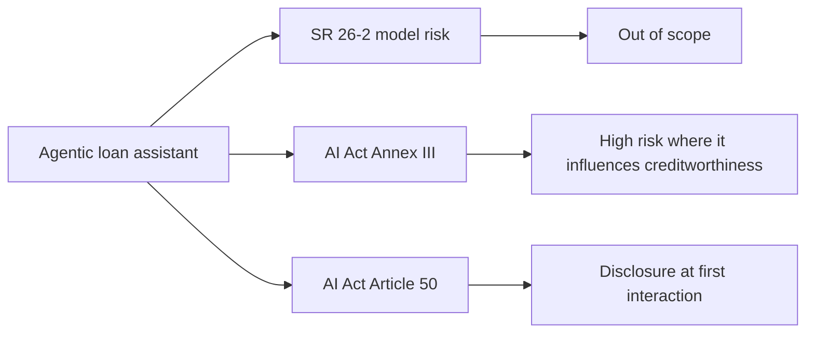

The Federal Reserve placed agentic AI outside its model-risk framework in April. The European Commission told banks to disclose it to customers two weeks ago. Neither regulator knows how these systems work in production, and the banks deploying them are writing governance in the dark.

On 17 April 2026, the Federal Reserve issued SR 26-2, superseding SR 11-7, the fifteen-year-old model-risk guidance that governed how every major bank validates quantitative models. 

SR 26-2 places generative AI and agentic AI models outside the scope of the guidance, calling them 'novel and rapidly evolving'. Three months later, on 20 July 2026, the European Commission adopted guidelines on the transparency obligations for certain AI systems under Article 50 of the AI Act. 

The AI Act's transparency rules apply from 2 August 2026, less than two weeks after the guidance landed.

For banks operating in both jurisdictions, the collision is immediate. A fraud-detection agent that autonomously freezes a suspicious account now sits outside the US MRM framework entirely but must disclose itself to EU customers at first interaction. The same system. Different answers to who is accountable, what evidence is required, and whether the institution can explain the decision. I've sat through enough board risk-committee meetings to recognise the pattern: when two frameworks demand contradictory postures, the default is paralysis.

## The SR 26-2 footnote everyone is reading

The decisive language is in footnote three of the interagency guidance. 

Generative AI and agentic AI models are novel and rapidly evolving. As such, they are not within the scope of this guidance. Nonetheless, a banking organization's risk management and governance practices should guide the determination of appropriate governance and controls for any tools, processes, or systems not covered in this document.

That last sentence is the problem. It delegates governance design to each institution without specifying what 'appropriate' means, and it does so at the moment when deployment is accelerating. 

52% of financial institutions are piloting or deploying agentic AI, according to [Cambridge Centre for Alternative Finance research](https://www.jbs.cam.ac.uk/faculty-research/centres/alternative-finance/publications/2026-global-ai-in-financial-services-report/) published in May. 

Agentic AI use cases in banking: autonomous agents automate fraud detection, loan underwriting, compliance monitoring, and customer service workflows.

The carve-out is not relief; it is risk transfer. 

Agentic AI falls into the gap between three functions that each partly own it. Model risk excludes it. Third-party risk reaches the vendor but not the behavior. Cybersecurity covers the perimeter but not the decision. Failure settles where each function assumes another is holding the control. Put bluntly: the institution owns the liability and has no examiner checklist to defend itself with.

By carving out GenAI and agentic AI, SR 26-2 didn't shrink the governance problem; it expanded it. The carveout pushes responsibility onto enterprise risk frameworks that don't exist yet at most banks. Read plainly, that footnote is an instruction to build evidence the regulator has not yet defined, and the first failure will clarify the standard retroactively.

## The EU guidance that landed too late

Two weeks before the [EU AI Act's transparency rules took effect on 2 August](https://www.regulation-ai.eu/en/blog/european-commission-transparency-obligations-guidelines-ai-act/), the Commission published fifty-one pages clarifying what providers and deployers must do. 

These obligations require providers and deployers of AI systems to be transparent about the use of AI in four key areas: i) direct interaction with individuals; ii) AI-generated content; iii) emotion recognition and biometric categorisation; and iv) deep fakes and AI-generated text on public-interest matters. 

Non-compliance can attract fines of up to EUR 15 million or 3% of worldwide annual turnover.

The timing exposes a regulatory tactic I've seen too many times: publish guidance close enough to the deadline that compliance teams cannot push back, then enforce from day one. 

The guidance lands less than two weeks before Article 50 itself enters into application on 2 August 2026. That deadline reaches far more organizations than the high-risk obligations under Title III, since it applies to any provider or deployer whose systems fall within scope, regardless of risk classification.

For a bank deploying an agentic customer-service system, this means determining whether the agent is 'directly interactive', a concept the [Commission interprets broadly](https://www.pymnts.com/news/artificial-intelligence/2026/eu-ai-act-transparency-rules-put-financial-institutions-on-compliance-front-line/), and whether disclosure is 'obvious from the context'. 

Those deployments now fall squarely within the AI Act's transparency framework. The European Commission's guidance, published in July, makes clear that providers must ensure users are informed whenever they interact directly with an AI system unless that fact is obvious from the context.

The phrase 'obvious from the context' is the new frontier for compliance interpretation. A chatbot with a name and a smiling avatar? Probably obvious. A voice agent that sounds human, routed through the same IVR as human staff, autonomously pulling account history and authorising refunds? Not obvious at all. And if the agent invokes a traditional credit-scoring model during the interaction, those underlying models remain fully within the scope of the guidance. Whenever a generative AI layer interfaces with an underlying credit-scoring or pricing model, the traditional model must still undergo full validation under whatever framework still applies: SR 26-2 in the US, existing EBA loan-origination guidelines in the EU.

## Why governance in the dark fails

Neither regulator understands how these systems behave in production. Agentic systems do not execute fixed procedures; they plan, reason, select tools, and adapt. 

Agentic AI receives a goal, figures out the steps, and executes them without someone guiding each move. In banking, these agents handle multi-step workflows like investigating fraud alerts or processing loan applications from start to finish. In the SR 11-7 sense that is not a 'model' at all, but software that makes operational decisions without deterministic control flow.

The supervision gap is largest in the reasoning layer. 

The hardest problem now sits in the reasoning layer, where operational meaning forms before action, rather than in the model output or the execution record. An agent might interpret 'high-value customer' to mean annual revenue, lifetime deposits, or cross-sell opportunity, depending on context it pulls from embeddings, vector search, and implicit reward signals. That interpretation is not logged, not validated, and not auditable under any framework in force today.

Procuring the model from a third party does not move the liability; the examiner holds the institution, not the supplier. Every vendor contract I have reviewed in the last twelve months tries to allocate AI accountability to the platform provider. The legal reality is simpler: if the agent makes a credit decision, approves a wire, or freezes an account, the institution owns it. The vendor provides tools; the bank deploys a system. That distinction holds under both SR 26-2 and the AI Act.

## What the evidence gap looks like

The immediate compliance challenge is **what to document**. Under SR 11-7, model-risk management required conceptual-soundness review, ongoing monitoring, and independent validation. 

The new guidance preserves the foundational principles of sound model risk management, but shifts supervisory expectations toward tailoring, materiality, and practical implementation based on each institution's model risk profile. For traditional models (credit scores, anti-money-laundering transaction surveillance, capital stress tests) the three-pillar architecture still applies. But for agentic systems carved out of scope, there is no three-pillar template.

Banks are improvising. Some are extending their model-inventory tooling to log agent workflows as 'non-models subject to operational risk'. Others are building separate AI governance programmes anchored in ISO/IEC 42001 or the NIST AI Risk Management Framework. A few are doing nothing, waiting for the Federal Reserve's anticipated RFI on generative and agentic AI governance. 

The revised interagency MRM guidance explicitly excludes generative AI and agentic AI from scope as 'novel and rapidly evolving.' Expect a forthcoming RFI from the FRB, OCC and FDIC that addresses AI/GenAI/agentic-AI MRM directly.

In the EU, the EBA will undertake specific activities to support the implementation of the AI Act in the EU banking and payments sector, by promoting a common supervisory approach and supervisory cooperation among national competent authorities. The EBA has not yet published AI-specific guidelines for banks; instead, it directs institutions to existing frameworks on internal governance and loan origination, layered with the [AI Act's Article 50 transparency requirements](https://www.hunton.com/privacy-and-cybersecurity-law-blog/european-commission-issues-eu-ai-act-transparency-guidelines). The result is a patchwork: high-risk classification for credit-scoring AI under Annex III, transparency disclosure under Article 50, operational resilience under DORA, and model governance under whatever the member-state supervisor considers 'appropriate'.

I do not expect any institution to produce coherent cross-border evidence under this stack before Q2 2027. The frameworks do not align on definitions, timelines, or accountability. An agentic loan assistant that pre-fills an application is 'high-risk' under the AI Act if it influences creditworthiness; it is out of scope under SR 26-2; and it triggers Article 50 transparency if it interacts directly with the applicant. Three frameworks, three compliance teams, no shared data model.

## The production gap: deploying faster than governing

Deployment is not slowing. 

Early agentic AI use cases have shown significant potential, enabling zero-touch operations and reducing manual workloads by 30%-50%. In 2025 alone, 50 of the world's largest banks announced more than 160 use cases, according to [McKinsey research cited in June](https://neurons-lab.com/articles/agentic-ai-in-financial-services-2026/). 

The industry-wide AI fraud detection market is projected to save global banks over $9.6 billion annually by 2026.

The pitch is compelling: an agent that autonomously triages fraud alerts, pulls transaction history, runs link analysis, and escalates to investigators cuts case-resolution time by half. But that same agent sits in the governance gap. It is not a model under SR 26-2. It might be 'directly interactive' under Article 50. It certainly invokes models that are in scope, among them AML transaction-monitoring scores, entity-resolution graphs and behavioural anomaly detectors. But the orchestration layer that decides which model to call, in which sequence, with what threshold, is nowhere in the compliance perimeter.

Agentic AI, meaning autonomous systems capable of decision‑making, adaptation and self‑directed action, is enabling criminals to run fraud operations at machine speed. These AI agents generate hyper-realistic deepfakes, conduct contextualized phishing, adapt their behavior based on failed attempts. One emerging challenge banks are encountering is that agentic fraud outpaces the rules and also exposes weaknesses in existing machine learning operating models. The asymmetry is acute: attackers deploy agentic fraud with no compliance overhead; defenders deploy agentic countermeasures into a framework that cannot validate them.

The defensible move for a fraud operation at a Tier 1 bank is to deploy the agent and document the risk acceptance. The cost of not deploying (fraud losses, customer attrition, regulatory criticism for ineffective controls) is quantifiable and immediate. The cost of deploying without a validation framework is hypothetical and deferred. That calculus will hold until the first consent order.

## What breaks first

On my reading, the first regulatory action will come for missing documentation rather than for a badly deployed agent. An examiner will ask why the institution judged deployment safe, and at most banks the answer does not exist on paper.

The carve-out is not a free pass; the same supervisory expectations of safe deployment, customer protection, and operational risk management still apply. What it means in practice is that banks deploying GenAI or agentic AI now must build controls the supervisory letter does not specify.

The institution that survives examination is the one that built evidence of deliberate governance choices: tiering criteria, human-oversight triggers, incident thresholds, rollback procedures, adversarial testing, semantic-drift monitoring. None of this is specified in SR 26-2 or the Article 50 guidelines, but all of it will be expected when the examiner asks, 'How did you determine this system was safe?'

The UK published its [Financial Services AI Adoption Plan](https://www.regulationtomorrow.com/2026/07/hmt-publishes-financial-services-ai-adoption-plan/) on 14 July, calling for a review of the regulatory perimeter and stronger AI resilience without prescribing architecture. 

There is strong consensus that a review of the regulatory perimeter must now be prioritised to introduce proportionate guardrails for AI-enabled services. HMT has intentionally not defined or prescribed what the next phase of this regulatory framework should look like, as it recognises there are multiple viable strategic and architectural approaches. That is diplomatic phrasing for 'we do not know how to write this rule yet'.

Neither does the Fed. Neither does the Commission. The difference is that the Commission published guidance anyway, two weeks before enforcement, and called it sufficient. That timeline will be hard to defend once the first deepfake-driven account takeover walks through a compliant but ineffective disclosure.

Agentic AI in financial services is not experimental. It is in production, handling live customer funds, credit decisions, and fraud escalations. The governance frameworks are fifteen months behind. The question is not whether this ends in enforcement; it is which institution provides the test case, and whether the rest of the industry learns before their own examination cycle.

---

Tarry Singh is the founder and CEO of Real AI (realai.eu), an enterprise AI advisory and deployment firm working with global enterprises on production agent systems, model risk, and AI sovereignty strategy. He also leads Earthscan (earthscan.io) for Energy AI, and is a founding contributor to the EU-funded HCAIM and PANORAIMA programmes for responsible AI education across European universities. He writes at tarrysingh.com.
