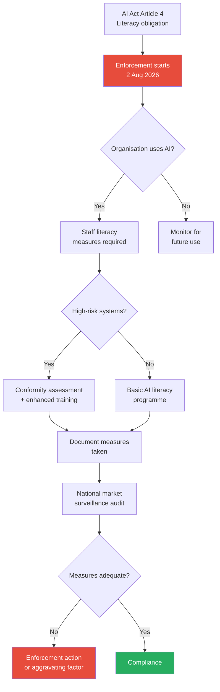

On 2 August 2026 — yesterday, as I write this — 

national market surveillance authorities across the EU began supervising and enforcing Article 4 of the AI Act

: the AI literacy obligation. Not the high-risk systems (those are deferred to late 2027 and mid-2028). Not general-purpose models. The part that obligates 

every provider and deployer of AI systems to take measures to support the development of AI literacy of their staff

.

Most universities missed this entirely.

I've spent the last eighteen months as a founding contributor to HCAIM and its successor, PANORAIMA — two EU-funded programmes building human-centred AI curricula for ICT and non-ICT students across European universities. The ground-level view from Budapest, Utrecht, Naples, and Dublin is unambiguous: higher education has confused *talking about AI* with *actually ensuring staff can handle it*. 

The Commission makes the point that, in many cases, simply asking staff to read an AI system's instructions for use may be ineffective and insufficient

. That sentence should terrify every provost who thinks a two-hour faculty seminar in May ticked the box.

The clock didn't start yesterday. 

Article 4 entered into application on 2 February 2025, therefore the obligation to take measures to support the development of AI literacy of their staff already applies

. What changed on 2 August is enforcement. 

The AI Act was later amended via the Digital Omnibus on AI that entered into force in mid-July 2026

, softening the standard from a guaranteed outcome to "measures… taken". But if your measures are absent or cosmetic, the softening does you no good.

## What the law actually requires

Thomas Jørgensen, director of policy coordination and foresight at the European University Association, singled out the growing practice of academics using tools such as ChatGPT to assess student work as a particular concern, noting such informal uses of AI could potentially fall foul of the EU Artificial Intelligence Act

. That's not hypothetical. Under Annex III, 

AI systems used for admissions decisions and assessment tools — for example, any AI systems that evaluate learning outcomes, automate scoring, or assess student performance — fall under the high-risk category

.

The trap is this: a lecturer pasting essays into a free LLM to spot plagiarism or grade coherence is deploying an AI system for assessment without transparency about training data, without conformity documentation, without human oversight protocols. 

Experts warn that informal use—such as a lecturer pasting student work into a free AI chatbot—likely violates requirements for transparency about training data and decision logic, rendering it potentially illegal post-2026

. Most institutions don't even have a register of who's doing this, let alone training.

The literacy obligation is separate but connected. 

The Commission's answer is "it depends": it depends on factors such as the role of each organisation in the AI value chain, the risk level of the systems used, and the current knowledge of staff

. Translation: a philosophy department deploying generative AI for grading faces different obligations than a computer-science lab fine-tuning LLMs — but both face *some* obligation, and neither can claim ignorance.

## The curriculum gap

Here's where PANORAIMA becomes relevant. 

PANORAIMA is an ambitious EU-funded initiative under the DIGITAL-SKILLS-5 call, officially launched on 29–30 January 2025 at HU University of Applied Sciences Utrecht, building on the foundation set by the Human-Centred AI Master's (HCAIM) project, expanding AI education beyond ICT students to professionals in diverse sectors

. The programme targets 

healthcare, media, law, management, and finance professionals — key sectors where responsible AI integration is crucial

.

Why those sectors? Because the first HCAIM cohorts at Budapest University of Technology and Economics revealed a structural problem. 

About 90 BME students have joined the programme since its inception, with eight graduating in 2023 and five in spring 2024, but the dropout rate is around 50%, as students have to acquire extra credits, which often do not fit into their two-year master's degree

. That 50-per-cent attrition tells you the 60-credit HCAI track is academically serious — but it also tells you the curriculum model doesn't scale to the 80-per-cent-AI-literate target the EU has set for 2030.

Only 55.6% of the EU's population has at least basic digital skills and, at the current pace, the number of ICT specialists will reach just 12 million by 2030

 — a shortfall against the target. 

Analysis from the European Parliament Think Tank in 2025–2026 paints a sobering picture: at the current rate of progress, the EU will reach only 60% by 2030 — a 20-percentage-point shortfall

.

PANORAIMA's answer is modular specialisation tracks. 

Profile definitions started in 2025, market analysis in 2025, programme development in late 2025-2026, with first pilot runs of developed specialisation tracks starting in September 2026 and full availability (including online modules) from September 2027

. That's well-timed for the high-risk compliance deadlines in 2027–28, but it does nothing for institutions staring at a literacy audit *now*.

## The enforcement picture

National market surveillance authorities are not going to raid lecture halls in September. 

A lack of AI staff training/guidance will likely be seen by regulators as an aggravating factor in wider enforcement for other breaches of the EU AI Act – this is probably more likely than standalone enforcement of the AI literacy requirement

. But that's worse, not better. It means the first penalty will hit when a university deploys a non-compliant proctoring tool or admissions screener, and the regulator discovers the staff had no literacy programme in place. The fine for 

placing a non-compliant high-risk AI system on the market can result in fines of up to 15 million euros or 3 percent of global annual turnover, whichever is higher

.

I'd bet the first test case comes from exam proctoring. 

A remote examination platform deploying facial recognition or behaviour analysis to detect cheating

 is unambiguously high-risk. If the university has no documentation that invigilators understand how the model categorises behaviour, no protocol for challenging automated flags, and no training log — that's a compounding violation.

## What to do before October

First, run an asset inventory. Every department, every administrative unit: what AI tools are in production use? Not what's mentioned in strategy slides — what's running. That includes vendor-provided SaaS (learning management dashboards with "AI-powered insights"), open-weight models a PhD candidate is using for literature review, and yes, ChatGPT Plus subscriptions expensed by lecturers.

Second, map roles to risk. A librarian using AI to summarise research trends is not the same as a faculty member using it to grade essays. The former may need basic prompt-literacy; the latter needs to understand training data provenance, bias vectors, how to interpret confidence scores, and what constitutes valid human oversight. 

If your organisation uses a "high-risk" system which, from August 2026, will require human oversight, those individuals will need to have the necessary training and support for that task

.

Third, document your measures. The Omnibus softened the standard, but the trade-off is you now have to show *what you did*. A board resolution to "promote AI literacy" is not a measure. A four-hour workshop delivered to 60 per cent of faculty, with sign-in sheets and post-session assessments — that's a measure. It may not be sufficient, but it's defensible.

Fourth, if you're running high-risk systems, start the conformity process now. 

Thomas Jørgensen from the European University Association notes that major LLMs fail criteria due to opaque datasets, urging institutions to pivot toward auditable, Europe-centric alternatives, and AI-driven admissions processes, which sift applications or predict success based on profiles, must now undergo conformity assessments

. That pivot takes months, not weeks.

## The deeper problem

The enforcement date is a forcing function, but the underlying challenge is older and harder: European universities have not taken AI seriously as an institutional competence. They've taken it seriously as a research domain (excellent AI labs across the continent), as a student-facing service layer (chatbots, adaptive learning dashboards), and as a risk to be managed in plagiarism detection. They have not taken it seriously as something the institution *itself* must be competent in — at every level, from procurement to pedagogy to administrative workflow.

Over two-thirds of European universities report AI use among doctoral students

, but how many have trained their ethics review boards to assess model-selection decisions? How many have equipped their legal teams to read a vendor's Article 13 transparency disclosure? How many librarians can explain the difference between retrieval-augmented generation and fine-tuning when a faculty member asks which approach is safer for student data?

The AI Skills Academy 

started operations as of 1 May 2026, funded by the Digital Europe Programme, offering education and training programmes on AI and in particular generative AI, to upskill and reskill students and professionals — including in SMEs — in key sectors (including at AI literacy level) and develop a pilot generative AI-focused degree

. That's good. But it's three months old, targeting future cohorts. It doesn't help the institution that needs compliance evidence in time for the next audit cycle.

PANORAIMA's real contribution isn't the degree tracks — it's the existence proof that you can teach non-ICT professionals to work *with* AI systems rather than simply *around* them. 

PANORAIMA brings together 16 organisations — 8 universities, 4 research centres and 4 SMEs — to co-design modular curricula and self-standing upskilling/reskilling units aligned to market needs, with SME partners contributing practical industry use-cases and expertise in analytics, data quality and governance to help graduates and professionals apply AI ethically, lawfully and robustly in real-world settings

. If I were running faculty development at a mid-sized European university right now, I'd be on the phone to the PANORAIMA consortium asking for a pilot module tailored to assessment and admissions — because that's where the immediate legal exposure sits.

I suspect most institutions will wait for the first penalty before moving. That's the pattern from GDPR (everyone waited for British Airways), from accessibility compliance, from research-ethics reform after every scandal. The difference here is velocity: AI deployment in education is moving faster than procurement cycles, faster than curriculum-reform timelines, faster than the average tenure of a faculty-development officer. By the time the first 15-million-euro fine hits the press, half the sector will already be non-compliant in ways they haven't yet inventoried.

If I were on a university board today, I would ask three questions at the next meeting. One: do we have a complete list of AI systems in production use across the institution? Two: do we have documented training for every member of staff whose role involves deploying or overseeing those systems? Three: if a regulator walked in tomorrow and asked for our Article 4 compliance file, could we produce it within 24 hours? If the answer to any of those is no, the literacy obligation is the least of your problems.

---

Tarry Singh is the founder and CEO of Real AI (realai.eu), an enterprise AI advisory and deployment firm working with global enterprises on production agent systems, model risk, and AI sovereignty strategy. He also leads Earthscan (earthscan.io) for Energy AI, and is a founding contributor to the EU-funded HCAIM and PANORAIMA programmes for responsible AI education across European universities. He writes at tarrysingh.com.
