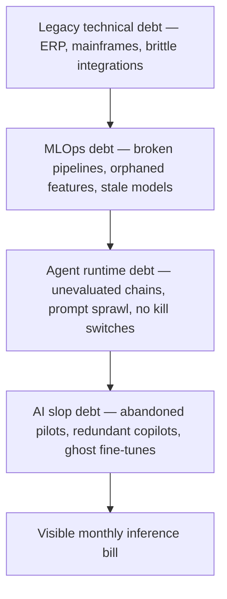

## The bill nobody booked

The most expensive line item in your AI budget for the next two years is the one your finance team has not yet named.

It is sitting in your environment already. It is in the half-built RAG system that someone in retail ops put together with a contractor in 2024 and nobody has touched since. It is in the fine-tuned 7B model that one analyst trained for a forecasting use case that quietly got abandoned. It is in the eighteen different internal copilots each business unit signed up for, each calling the same three APIs, each paying their own seat fee. It is in the eval suite nobody runs because the engineer who wrote it left. It is in the prompt library scattered across Confluence pages with no owner.

I have a name for this. **AI slop debt**: the accumulating liability of half-finished pilots, unevaluated agent fleets, RAG systems with no clear owner, prompt sprawl across business units, and orphaned fine-tunes nobody can reproduce. It sits on top of, and entangled with, the legacy technical debt your CIO has been quietly carrying since well before any of this started.

Sometime in the next eighteen months, somebody on your board is going to ask what it costs. The answer most companies have ready right now is wrong by an order of magnitude.

## The arithmetic, briefly

Start with the public numbers. The [MIT NANDA report](https://fortune.com/2025/08/18/mit-report-95-percent-generative-ai-pilots-at-companies-failing-cfo/), surveying 300 deployments and 350 employees in late 2025, found that 95 percent of generative AI pilots delivered no measurable P&L impact. The [RAND Corporation's meta-analysis](https://www.rand.org/pubs/research_reports/RRA2680-1.html), spanning 65 documented enterprise initiatives over three years, put the failure rate at 80.3 percent — roughly twice the rate of non-AI IT projects. [Gartner's June 2025 forecast](https://www.gartner.com/en/newsroom/press-releases/2025-06-25-gartner-predicts-over-40-percent-of-agentic-ai-projects-will-be-canceled-by-end-of-2027) projected that more than 40 percent of agentic AI projects will be cancelled by end of 2027, citing escalating costs, unclear business value, and inadequate risk controls.

These are vendor and analyst numbers. I would apply some skepticism to all three. Survey populations are self-selecting, "failure" is loosely defined, and the framing serves a consulting market that needs you alarmed. But the direction is consistent across three independently-derived datasets, and it matches what I see in production environments. The question is not whether a substantial fraction of current AI investment is going to be written off. It is whether your finance organisation knows it yet.

## What slop is actually costing

The visible part of the bill is inference. The [FinOps Foundation's working group on AI](https://www.finops.org/wg/finops-for-ai-overview/) has documented that for most enterprises now in production, inference accounts for roughly 60 to 85 percent of total AI run cost — not training, not data, not engineering payroll. Agentic loops compound this fast: one autonomous workflow can hit a model fifteen or twenty times to complete a task the user perceives as a single click. RAG pipelines pile context tokens onto every call. Always-on monitoring agents consume compute when no human is in the loop.

Do the FinOps maths on a single mid-sized deployment. An agent that costs three cents per task, called five hundred times an hour by an automation that runs across two thousand support tickets a day, becomes a thirty-thousand-dollar monthly line item on its own — and that is before anyone counts the redundant copy of the same agent built by a sister team that nobody knew about. Multiply that by the seven to twelve concurrent pilots running in any large enterprise right now and the slop layer is no longer a rounding error.

The invisible part is the debt stack underneath.

Each layer makes the one above it more expensive. A retrieval pipeline sitting on top of a legacy product database with no schema documentation will quietly multiply its inference cost because nobody knows how to prune the index. An agent runtime layered on top of MLOps nobody owns will hit the model more often because nobody has measured how often it needs to. The slop layer is where the entire stack capitalises itself into your monthly cloud invoice.

## The hyperscaler problem, externalised

This is where the macroeconomics gets uncomfortable. Big tech AI capex for 2026 is now [projected at roughly $700 billion combined](https://www.cnbc.com/2026/02/06/google-microsoft-meta-amazon-ai-cash.html) across Amazon, Alphabet, Microsoft, and Meta — a number that has roughly doubled in two years. Some analyst desks put the combined figure as high as [$725 billion](https://www.tomshardware.com/tech-industry/big-tech/big-techs-ai-spending-plans-reach-725-billion). [Om Malik's April analysis](https://om.co/2026/04/30/what-i-learned-about-hyperscalers-ai-spend/) noted that two-thirds of Microsoft's recent capex went to short-lived assets — primarily GPUs that will depreciate over three to five years — while the remainder goes to long-lived assets with fifteen-plus year schedules. Amazon's trailing-twelve-month free cash flow has fallen from roughly $26 billion to about $1.2 billion. Microsoft's is down 22 percent. Alphabet's down 38.

That short-cycle depreciation does not stay on the hyperscaler balance sheet. It gets passed through as compute pricing. The list-price drop on flagship inference has slowed sharply in the last two quarters because the supply side is now paying down hardware that loses 30 percent of book value a year. The hyperscalers will absorb some of it; the rest comes through to you on a renewal cycle nobody in your shop is modelling yet.

## Why governance is the load-bearing wall

If you skipped owning the slop layer, you also skipped owning who is allowed to spend on it. [Gartner's 26 May release](https://www.gartner.com/en/newsroom/press-releases/2026-05-26-gartner-says-applying-uniform-governance-across-ai-agents-will-lead-to-enterprise-ai-agent-failure) on uniform agent governance is worth reading carefully — their argument is that one-size-fits-all controls will themselves cause failures, which is fair. But the data underneath says something blunter: independent research [from Kiteworks](https://www.kiteworks.com/cybersecurity-risk-management/ai-agent-data-governance-why-organizations-cant-stop-their-own-ai/) found that 51 percent of surveyed organisations have agents in production while only 37 to 40 percent have the containment controls — purpose binding, kill switches, network isolation — to govern them. That is not a regulatory problem yet. It is a budgetary one. You cannot decommission what you cannot identify.

## A note from a previous cleanup

I have been through one of these cycles before. Between 2003 and 2005, after Sarbanes-Oxley came into force, every large enterprise I worked with had to inventory the IT systems touching financial reporting. Most of them discovered they were running fifty to seventy percent more applications than the official architecture diagram admitted. Shadow databases. Departmental spreadsheets being used as systems of record. Reports nobody could trace. The cleanup was painful and expensive. It was also the most useful piece of operating discipline of that decade, because once you knew what you actually owned, you could decide what to retire.

The current AI cycle has put us in the same position, faster. The inventory has to happen. The earlier you run it, the smaller the write-down.

## What I would actually push for

If I were on a board reading the FY26 AI line right now, I would not be asking for more ROI charts. I would be asking my CIO and CFO, jointly, for three artefacts by the end of Q3.

First, a **pilot register**: every active AI initiative, with monthly run-rate cost, owner, business sponsor, eval state, and a documented decommissioning trigger. Not a slide. A database. At Real AI we have run this exercise inside two Tier-1 European institutions in the last six months. The median finding was that 28 to 34 percent of active pilots had no measurable activity in the preceding 90 days but were still incurring monthly cost.

Second, a **per-workflow cost ceiling**, set per business unit, with automatic throttling at 80 percent of budget. The technology to do this exists. The political will usually does not.

Third, a **named owner** for every agent in production, with explicit authority to kill it. The Kiteworks finding — that 63 percent of organisations cannot stop their own AI — is not a technology problem. It is an org-design problem dressed up as a technology problem.

The McKinsey [State of AI report](https://www.mckinsey.com/capabilities/quantumblack/our-insights/the-state-of-ai-how-organizations-are-rewiring-to-capture-value) found that more than 80 percent of respondents report no enterprise-level EBIT impact from generative AI, with only 17 percent seeing 5 percent or more attributable to it. That gap is not going to close with another platform purchase. It will close by writing off the half of the stack that does not work, and instrumenting the half that does.

The bill is coming either way. The companies that put it on the books themselves, before their auditors do, will pay it at a discount. The ones that wait will pay full retail, and they will pay it in a quarter when their cloud renewal also falls due.

I would not want to be the CFO explaining that one.

* * *

*Tarry Singh is the founder and CEO of* [*Real AI*](https://realai.eu)*, an enterprise AI advisory and deployment firm working with global enterprises on production agent systems, model risk, and AI sovereignty strategy. He also leads* [*Earthscan*](https://earthscan.io) *for Energy AI, and is a founding contributor to the EU-funded HCAIM and PANORAIMA programmes for responsible AI education across European universities. He writes at* [*tarrysingh.com*](https://tarrysingh.com)*.*
