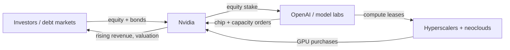

Start with a number that has lost the ability to shock anyone. 

Google, Amazon, Microsoft, and Meta collectively plan to spend $725 billion on capex in 2026, up 77% from last year's record $410 billion, according to first-quarter earnings compiled by the Financial Times.

 Add Oracle, the neoclouds, Chinese hyperscalers and the sovereign funds, and the cycle clears $1 trillion of compute spend in a single calendar year.

That part is settled. We can audit it. It lands on balance sheets, in bond prospectuses, in concrete poured across Texas and Ohio and northern Virginia.

Here is the part nobody can audit: the return.

A capital programme of this size is, in theory, justified by a net present value calculation: future cash flows, discounted, exceeding the cost. I have built and defended those models in front of boards for thirty years. They have a numerator and a denominator. Right now the denominator, the spend, is precise to the dollar. The numerator, the cash the spend will generate, is a guess dressed as a forecast. And in the last three weeks, the people actually buying this stuff started saying so out loud.

## the tell came from a buyer

On 22 May 2026, Uber's president and COO Andrew Macdonald sat on a podcast and said the quiet thing. 

Macdonald said it is hard to draw a connection between the company's rising use of Claude Code and innovations meant to serve consumers. "That link is not there yet," he said.

 This is a man whose engineers are not dabbling. 

Claude Code went from 32% of Uber engineers in February to 84% classified as agentic users by March. By spring, 95% of engineers were using AI tools monthly. Roughly 70% of committed code originated from them.

And the spend ran away from them. 

Despite spending $3.4 billion on R&D, Uber had already exhausted its planned AI budget months into 2026, with CTO Praveen Neppalli Naga telling The Information the company was "back to the drawing board" after a surge in coding-tool usage blew past internal expectations.

Adoption is genuine. This is Jevons paradox arriving on schedule, cheaper tokens driving wildly higher consumption. But the firm cannot yet tie that consumption to a single dollar of incremental revenue. Usage is the numerator's input. Value is its output. Uber has the first and not the second. That is the entire AI capex thesis compressed into one company's procurement spreadsheet.

It is also why the pricing floor is rising under everyone. 

The quandary in enterprise AI adoption is that increasing AI use comes with higher costs, even as per-unit AI pricing falls.

 The 2024–25 era of subsidised free tiers is closing. Even Microsoft saw the problem in its own house. It reportedly began cancelling most of its direct Claude Code licences, moving engineers toward GitHub Copilot CLI instead.

## the bull case is now openly a bubble case

The striking thing about the May commentary is that the optimists stopped pretending. On 12 May 2026, a Wells Fargo strategist told clients to buy the thing while calling it what it is. 

"You can't own anything but AI," he wrote. "That's how a bubble forms." He expected limited downside until growth slows or core inflation meaningfully accelerates.

 The bank reached for the mid-1800s railway mania as its analogue: vast sums raised to build networks before over-valued stocks collapsed. It also noted that Q1 2026 AI capex totalled $174 billion, up 72.8% year on year.

When the buy-side rationale is "it's a bubble, get in early," the NPV has left the building. You are no longer underwriting cash flows. You are underwriting the next buyer.

Meanwhile the analysts who actually model balance sheets are flagging where this snaps. 

CreditSights put Oracle's 2026 capex-to-sales at 86%. Meta follows at 54% and Microsoft at 47%. Alphabet is at 46%, Amazon at 25%.

 Those are not the ratios of companies harvesting a known return. They are the ratios of companies racing to occupy ground before the demand curve is even drawn.

## the loop that makes the numerator look bigger than it is

The loop is what makes the NPV problem structural. A meaningful slice of the "demand" propping up these models is the industry buying from itself.

The cleanest example unwound in plain sight. The headline $100 billion Nvidia–OpenAI arrangement collapsed into something smaller. 

The $30 billion equity investment now sits on Nvidia's balance sheet, with a five-gigawatt compute commitment providing hardware-demand visibility into 2027.

 But the restructuring did not fix the thing critics actually worried about. 

It did not resolve the circular capital flows: Nvidia invested $30 billion into OpenAI, OpenAI is expected to spend a significant portion of that capital purchasing Nvidia chips, and investors should not double-count the equity stake as incremental hardware demand.

 And the customer underneath it all is not yet self-funding.

OpenAI's projected 2026 cash burn is roughly $14 billion, and it does not expect to be cash-flow positive before 2030.

The money can complete a lap without a single external customer paying for a finished product. From outside, every lap reads as growth. Inside an NPV model, the same dollar gets counted as demand at three different nodes. Nobody has to lie for that to happen, which in some ways makes it harder to correct than fraud would be. The double count is a measurement error baked into the consensus.

## depreciation: the numerator's other soft spot

Even granting the cash flows, there is the question of what the assets are worth while they earn. Michael Burry made the loud version last November and it still hangs over every hyperscaler print. 

He called understating depreciation by extending useful life "one of the more common frauds of the modern era." He estimated that from 2026 through 2028 the manoeuvre would understate depreciation by about $176 billion.

I think "fraud" is the wrong word and the wrong fight. The filings are public. 

Alphabet moved compute and network useful lives from three years in 2020 to six by 2023; Microsoft went from three-year assumptions in 2020 to six from 2022 onward.

 The real question is whether a chip on Nvidia's annual cadence genuinely earns for six years via cascading lower-tier workloads, or whether a wave of write-downs lands in 2027. If Burry is even half right, reported AI earnings are flattering by tens of billions a year. Those earnings feed every forward NPV.

## the financing has quietly changed character

For most of the cloud era, this spend came from operating cash flow. Not anymore. 

Hyperscalers are increasingly using credit markets to fund AI capex, a shift investors say challenges the "fortress balance sheet" status and rips up the "unspoken contract" that kept speculative spending out of debt markets.

Some of it has moved off the balance sheet entirely. The Bank for International Settlements described the mechanics in March: a dedicated vehicle acquires the data-centre assets, the hyperscaler holds a minority stake and commits to long-term leases or capacity offtake, which substitutes upfront capex with multi-year operating expenses while keeping most of the debt off its books.

 Clever. Also exactly how you make a capital cycle look cheaper than it is.

The market is charging for the doubt. 

Meta, Alphabet, Amazon and Oracle's combined weight in the Bloomberg US Corporate IG index nearly doubled over the year to 1 April 2026, from 2.2% to 4.1%.

 And the physical world is pushing back: electricity shortages, rising costs and local opposition are delaying nearly half of planned AI data centres for 2026.

 Delayed capacity is delayed revenue. The numerator slips right while the denominator is already spent.

## the missing disclosures

The defensible move for a hyperscaler board is to stop pretending the NPV exists in any rigorous form and to manage the downside instead.

Start with customer concentration, disclosed the way a bank discloses single-name exposure. If a meaningful share of a hyperscaler's AI backlog traces to two pre-profit labs, shareholders deserve that number rather than a backlog headline. Then publish the depreciation sensitivity: what reported operating income looks like at a three-year GPU life versus six. If management believes six, prove it with utilisation data. And ringfence the off-balance-sheet vehicles in plain English, because the BIS already understands them and your investors should too.

On the evidence available now, I doubt that 2027 cash flows will justify 2026 spend at the multiples currently priced. AI works. Uber's engineers prove the demand is real. But a return nobody can yet measure, funded by debt everyone can, against assets that may depreciate twice as fast as the books assume, is priced today as though the music keeps playing. The capex is the most concrete thing in technology right now. The NPV is the most fictional. Size your exposure accordingly.

---

Tarry Singh is the founder and CEO of Real AI (realai.eu), an enterprise AI advisory and deployment firm working with global enterprises on production agent systems, model risk, and AI sovereignty strategy. He also leads Earthscan (earthscan.io) for Energy AI, and is a founding contributor to the EU-funded HCAIM and PANORAIMA programmes for responsible AI education across European universities. He writes at tarrysingh.com.
