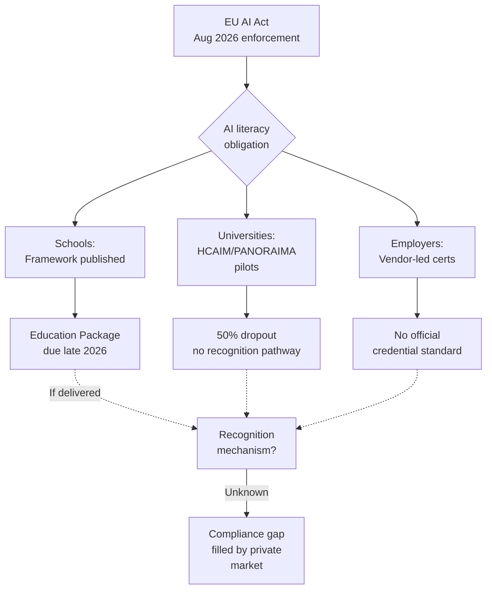

On 18 June, the European Commission and the OECD presented an AI Literacy Framework for primary and secondary education. Translations into all

24 official EU languages are expected by July 2026. Ten days later, at the Digital Skills EU Days in Brussels, the Commission launched three new Digital Skills Academies for Quantum, GenAI, and Virtual Worlds.

It also presented the 2026 European Digital Skills Awards. The institutional machinery is now publishing frameworks, opening academies, and handing out awards.

But thirty days from now, on 2 August, key provisions of the EU AI Act take effect, including the high-risk classification for AI systems used in admissions decisions. And European universities, at least according to Thomas Jørgensen at the European University Association, may need to 'change everything' about how they currently use AI. The Commission has given member states a literacy framework for schools, a digital-skills event for stakeholders, and an ethics update for educators. It has not published a credentialing standard that employers, universities or regulators can point to as proof of compliance. The result is a compliance vacuum that vendors are filling faster than any public body can audit.

## The vendor scramble

AI literacy obligations have been in force since February 2025; enforcement through national market surveillance authorities follows from August 2026. The obligation reaches ordinary tools, ChatGPT and M365 Copilot included.

If you deploy AI, you are in scope. HR departments know this, and certification vendors know HR knows. PECB launched a Certified EU AI Governance Professional training course. DPO Europe is pitching an Artificial Intelligence Compliance Professional for Europe (AICP-E) certificate that can be shared on LinkedIn. TÜV, IHK, and Fraunhofer are selling credentials with 'DACH-ready governance' or 'AZAV education-voucher funding'.

Most of these are not fraudulent. Some are excellent. None has been officially endorsed by the Commission.

70% of market demand will be for certified professional programmes rather than general classes, yet only 12% of workers feel fully competent with the AI tools they use today. The gap is real, the incentive to pay for credentials is real, and the regulatory clarity on what counts is not.

## What universities are deploying

I sit on programme boards in the Netherlands and Italy. We track what colleagues at Budapest Technical, TU Dublin, Federico II, and Utrecht are actually putting in classrooms. Press releases are a different document.

HCAIM graduates are now flowing from Budapest, Utrecht, Naples and TU Dublin. The PANORAIMA project, launched on 29–30 January 2025 at HU Utrecht, extends responsible AI education beyond ICT to healthcare, media, law, management, and finance, with 16 consortium members, comprising 8 universities, 4 research centres and 4 SMEs. PANORAIMA's first pilot tracks start in September 2026.

But the dropout rate from the HCAIM cohorts is around 50%; students have to acquire extra credits, which often do not fit into their two-year master's degree. That number is not a failure of pedagogy. It is a failure of credentialing integration. Students who do the work have no assurance the credential will be recognised by national ministries, professional bodies, or recruiters in adjacent member states. Compare that with the EU-OECD framework's four domains: Engage with AI, Create with AI, Manage AI, and Shape AI.

Those domains are beautifully structured and pedagogy-tested. They also arrive unaccompanied by a machine-readable competence mapping that feeds into the European Qualifications Framework, Europass, or the national recognition databases.

The Commission is publishing the framework as part of the Union of Skills strategy, with a broader Education Package due later in 2026 to operationalise it through teacher training, curriculum guidance, and recognition pathways. That package will matter more than the framework itself.

The Education Package will determine whether the framework becomes a delivery instrument or a high-quality reference document. My expectation is that it ends up a reference document. No member state wants Brussels to tell it which master's module counts.

## PANORAIMA and modular credentials

Real AI (realai.eu), the firm I run, is an SME partner in PANORAIMA. That gives me a front-row seat and a conflict. I will declare it: we are contracted to contribute practical use cases, governance patterns, and data-quality frameworks, and we earn revenue if the programme scales. The reason I agreed to join is that PANORAIMA is the only EU-funded education programme I have seen that names credentialing fragmentation as a problem rather than leaving it as an implied downstream issue.

PANORAIMA will introduce self-standing modules for upskilling and reskilling professionals, making AI education more accessible across Europe. Self-standing means you do not need to enrol in a 60-credit master's to demonstrate competence. It also means that unless the Commission mandates mutual recognition, a module from Utrecht may not be accepted for re-credentialing by a professional body in Italy or an employer in France. The project runs from January 2025 to January 2029.

That is four years to test whether modular, cross-border, multi-sector AI credentials can actually work before the labour-market deadline arrives.

Roxana Mînzatu, Executive Vice-President for Social Rights and Skills, Quality Jobs and Preparedness, has stated plainly: 'AI literacy is a foundational competence for our young people. Understanding and using AI responsibly is essential for Europe's competitiveness and for protecting our democracy and social cohesion, and it starts in our classrooms'. That is accurate. It is also stage-managed. The political commitment is clear; the implementation mechanism is not.

## Before enforcement begins

A European university board, or a multi-member-state employer federation, can act now without waiting for Brussels:

1.  **Map existing credentials to EQF descriptors now.** Do not wait for the Education Package. Take the four OECD-Commission domains and the HCAIM/PANORAIMA learning outcomes and manually map them to EQF levels 5–8 descriptors. Publish that mapping as an open institutional document. It will not have legal force, but it will have evidentiary weight when a regulator or auditor asks what you did to ensure staff AI literacy.

2.  **Demand that the Commission publish a credentialing interoperability standard in Q3 2026.** The

Council called on member states in May 2026 to integrate AI literacy into teacher training, but integration without recognition is theatre. The Digital Education Hub has convened working groups; those groups should publish a technical specification for how AI-literacy modules from different providers can assert equivalence and be machine-verified.

3.  **Stop buying vendor credentials that do not reference the AI Act annexes.**

Article 4 of the AI Act (in force from 2 February 2025) requires AI literacy proof, and since August 2026, enforcement applies. Any vendor offering 'EU AI compliance training' that does not explicitly map its syllabus to Annex III risk classifications and to the transparency obligations under Article 50 is selling a brand.

4.  **Treat the PANORAIMA modular pilots as the reference architecture.** Even if recognition remains fragmented by 2029, the 16-member consortium design is the part worth copying:

8 universities, 4 research centres, 4 SMEs co-designing modular curricula aligned to market needs.

That structure is the closest thing Europe has to a credentialing prototype that crosses sectoral and national lines. Fund parallel experiments in your institution.

## Gradualism against a deadline

Many EU member states focus on broad digital literacy, gradually including AI-specific education; efforts include embedding AI concepts in school curricula, offering adult reskilling programmes, and introducing AI-focused training programmes. The gradualism is the problem. The AI Act enforcement is not gradual.

High-risk obligations for education AI enter full effect in August 2026. The window for orderly preparation is closing.

The Commission has done the work on content: frameworks, exemplars, teacher guidelines. But content does not move labour markets. Recognition does. Without a machine-readable, cross-border credentialing standard, the August 2026 deadline will produce a market for expensive certificates that universities do not trust, regulators cannot audit, and students cannot port. The private sector will provide supply. It always does. The question is whether the Commission will allow it to also provide the standard.

* * *

Tarry Singh is the founder and CEO of Real AI (realai.eu), an enterprise AI advisory and deployment firm working with global enterprises on production agent systems, model risk, and AI sovereignty strategy. He also leads Earthscan (earthscan.io) for Energy AI, and is a founding contributor to the EU-funded HCAIM and PANORAIMA programmes for responsible AI education across European universities. He writes at tarrysingh.com.
