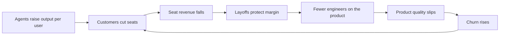

ClickUp just cut 22% of its headcount. Again.

The $4 billion productivity platform's CEO Zeb Evans announced the layoffs in a post on X, framing them not as a cost-cutting exercise but as a structural bet on AI.

 He calls it the "100x org." 

The company is restructuring around a model where AI agents outnumber employees 3:1.

ClickUp is introducing salary bands that reach $1 million per year in cash, open to nearly anyone who produces "100x impact" by creating or managing AI systems.

This is panic dressed in a suit.

## Three rounds of layoffs

In July 2023, ClickUp laid off 10% of its workforce, approximately 90 people out of about 900, to become "more efficient" and prepare for a public listing ([TechCrunch](https://techcrunch.com/2023/07/04/clickup-layoffs/)). 

Before that, in 2022, the company had already cut 7% of staff as a "one-time decision" to stay on track toward profitability.

Three rounds. 7%, then 10%. Now 22%. Each with a different narrative: profitability, efficiency, AI revolution. The denominator keeps getting smaller. The explanations keep getting grander.

Whether the 100x figure is real is the open question. The execution risk is whether ClickUp's product roadmap actually accelerates after the cut, or whether the company has simply moved 22% of its capacity onto its remaining engineers' review queues.

 ([StartupHub.ai](https://www.startuphub.ai/ai-news/artificial-intelligence/2026/clickup-100x-org-zeb-evans-restructure))

I've used ClickUp. I've watched teams try to use ClickUp. The product was, and remains, brutally overcomplicated: a feature zoo that tried to be Jira, Notion, Asana, and Airtable simultaneously, and ended up being none of them well. The "100x org" narrative conveniently sidesteps the possibility that ClickUp's problem was always product-market clarity. Agents don't fix that.

## The whole model is fracturing

ClickUp isn't dying alone. The entire mid-tier SaaS category is getting squeezed from both sides: from above by agentic AI that makes the per-seat pricing model structurally incoherent, and from below by vibe-coded bespoke tools that enterprises can now stand up in days.

The numbers are stark. 

Between January 15 and February 14, 2026, approximately $2 trillion in market capitalisation evaporated from the software sector. The term "SaaSpocalypse" emerged to describe the rapid decline as AI agents began replacing entire product categories, with multiple enterprise software companies acknowledging AI agent competition on earnings calls.

 ([DigitalApplied](https://www.digitalapplied.com/blog/saaspocalypse-ai-agents-software-industry-analysis))

While Wall Street closed 2025 as one of the best years in its history, the SaaS index fell 6.5%, compared with a 17.6% rise in the S&P 500.

Nearly all the hot names of the past decade, from Intuit and Atlassian to HubSpot, showed sustained weakness, with most posting double-digit losses in the first two weeks of 2026.

 ([Calcalist](https://www.calcalistech.com/ctechnews/article/hjlvyl7lze))

The incumbents are bleeding too:

- **Salesforce** quietly laid off nearly 1,000 roles in February 2026. 

In August 2025, CEO Marc Benioff revealed the company had cut 4,000 customer support roles, bluntly stating it needed fewer employees as it deployed AI agents to handle support tasks.

 ([FinalRoundAI](https://www.finalroundai.com/blog/salesforce-layoffs-2026)) The irony is thick: 

Salesforce confirmed approximately 1,000 further positions were eliminated, even as it celebrated record-breaking growth and massive adoption of its Agentforce platform. It restructured the very teams that built those tools.

- **Oracle** laid off between 20,000 and 30,000 employees starting 31 March 2026. 

The cuts affected roughly 18% of its 162,000-person global workforce, driven by a strategic pivot toward AI data centre infrastructure, with a $2.1 billion restructuring charge and $50 billion in new debt.

 ([CIO.com](https://www.cio.com/article/4153113/oracle-cuts-up-to-30000-jobs-globally-putting-enterprise-support-and-roadmaps-at-risk.html))

- **GitLab** announced a major restructuring on 11 May 2026. 

The company will flatten management, cut its country footprint by 30%, and reorganise R&D into 60 autonomous teams. CEO Bill Staples called it an investment in the "agentic era."

 ([The Next Web](https://thenextweb.com/news/gitlab-layoffs-agentic-era-devops-ai))

Every one of these announcements shares the same choreography: record revenue, layoffs, an AI narrative. It's becoming a genre.

## Where agents are actually eating SaaS in the enterprise

The theoretical threat is old news. What's changed is that real enterprises are acting on it.

Publicis Sapient is already reducing traditional SaaS licences by approximately 50%, Adobe included, substituting them with generative AI tools. A Databricks 2026 survey found multi-agent system usage spiked by 327% over just four months.

 ([Orbilon Tech](https://orbilontech.com/ai-agents-replacing-saas-tools-2026/))

When Reuters reported in September 2025 that Klarna moved away from Salesforce, citing approximately $2 million in annual savings as part of a shift toward internally developed, AI-enabled tools, the reaction was predictable, and correct. ([Engineering.com](https://www.engineering.com/klarna-dropped-salesforce-but-that-doesnt-mean-ai-replaces-plm/))

Deloitte's 2025 Tech Value survey found that 57% of respondents were putting between 21% and 50% of their annual digital transformation budgets into AI automation. Another 20% were investing 50% or more. Deloitte predicts that up to half of organisations will put more than 50% of their digital transformation budgets toward AI automation in 2026.

 ([Deloitte](https://www.deloitte.com/us/en/insights/industry/technology/technology-media-and-telecom-predictions/2026/saas-ai-agents.html))

Gartner expects 35% of point-product SaaS tools to be replaced by AI agents or absorbed within larger ecosystems by 2030.

 That's the polite version. From where I sit, the number will be higher for anything that's essentially a glorified CRUD application with a monthly invoice.

## The pricing model is the real casualty

When one user equipped with AI agents can accomplish the work of five traditional employees, the per-seat pricing model that has underpinned SaaS economics for two decades begins to collapse.

 The evidence is already in the Q4 numbers. 

Multiple SaaS companies reported slowing growth in Q4 2025 earnings, precisely because AI succeeded too well: customers are reducing software seats rather than adding them.

This creates a doom loop: fewer seats means less revenue, less revenue means layoffs to protect margins, layoffs mean fewer people to fix the product, worse product means more customer churn. Repeat.

Deloitte themselves note that this evolution should disrupt traditional pricing models, and that subscriptions and seat-based licensing could give way to hybrid approaches blending usage- and outcome-based pricing.

 But that transition has to be made while carrying legacy ARR commitments, existing customer expectations, and investors who have been trained to worship net revenue retention above all else. It is threading a needle at motorway speed.

## Inside the 100x org

The compensation numbers are the distraction. 

A Fortune profile published days before the layoffs revealed that ClickUp now runs roughly 3,000 internal AI agents across its departments, a 3:1 ratio of agents to employees. Evans had already mandated that staff go through an AI agent trained to stand in his place before contacting him directly.

 ([The Next Web](https://thenextweb.com/news/clickup-layoffs-22-percent-ai-100x-org-million-salary))

The CEO replaced *himself* with a chatbot as a first point of contact for his own employees.

The announcement lands in the middle of a brutal stretch for tech workers, with the industry shedding more than 100,000 jobs across roughly 250 events in 2026 so far.

 ClickUp is following the pattern, with better PR copy.

I do not expect the "100x org" thesis to hold as Evans frames it. AI agents will change how software gets built; they already are. But calling your restructuring a revolution does not make a confused product any less confused. ClickUp tried to be everything to everyone and ended up being nothing to most. No number of agents fixes that.

## The actual opportunity

The old SaaS model is dying: seat-based, feature-bloated, land-and-expand-at-all-costs. Good. It deserved to. Bolting "AI" onto a pricing page will not be enough to replace it. What replaces it will be orchestration layers, composable agents, and outcome-based commercial models where the buyer pays for results instead of log-ins.

A SaaS board has one question worth its agenda time: what does your product *actually do* that an agent can't? Price that thing ruthlessly. Everything else is runway to a dead end.

Markets are calling this a correction. Corrections reverse; reclassifications do not. And the companies presenting their layoffs as strategy, when the layoffs are a symptom, are the ones worth watching most carefully.

---

Tarry Singh is the founder and CEO of Real AI (realai.eu), an enterprise AI advisory and deployment firm working with global enterprises on production agent systems, model risk, and AI sovereignty strategy. He also leads Earthscan (earthscan.io) for Energy AI, and is a founding contributor to the EU-funded HCAIM and PANORAIMA programmes for responsible AI education across European universities. He writes at tarrysingh.com.
