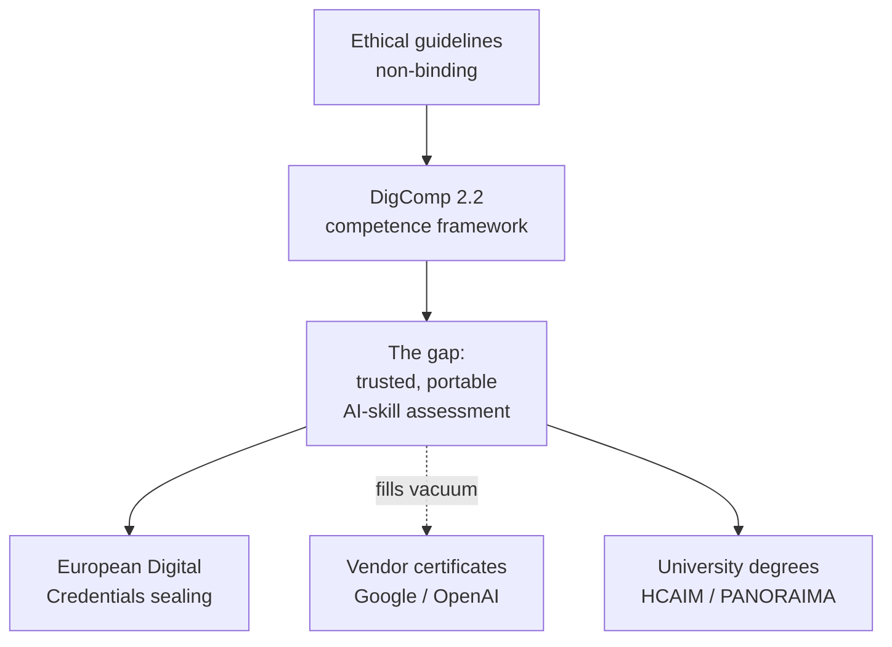

On 9 June 2026 the European Commission did the thing it does best. It updated a document. The [ethical guidelines on the use of AI and data in teaching and learning](https://education.ec.europa.eu/focus-topics/digital-education/actions/plan/ethical-guidelines-for-educators-on-using-artificial-intelligence), first issued in 2022 and now revised, landed in English with translations to follow, prepared by a working group convened through the European Digital Education Hub.

The update was prepared by the Working Group on the Ethical Use of AI and Data in Education, convened through the European Digital Education Hub, and was last updated 9 June 2026.

I've read it. It's a good document: guiding questions, classroom scenarios, a glossary.

It includes guiding questions and classroom scenarios, explanations of key principles behind responsible AI use, and an updated glossary defining AI and data-related terms.

It is also non-binding, aimed mostly at primary and secondary teachers, and it does not move a single one of the numbers Europe is actually failing on.

These guidelines are non-binding and are intended to support teachers, school leaders and education authorities.

I've spent thirty years watching institutions confuse publishing a framework with changing an outcome. The two are barely related.

## the 80% target

Start with the target everyone cites and nobody is on track for.

The EU aims to achieve a digitally skilled population by 2030, where at least 80% of those aged 16-74 have at least basic digital skills.

Actual attainment sits well below that.

Only 55.6% of the EU's population have at least basic digital skills.

Twenty-four points of daylight separate the target from the outcome.

The professional side is worse in absolute terms.

At least 20 million ICT specialists should be employed in the EU by 2030; in 2024 there were an estimated 10.3 million, accounting for 5% of the workforce.

Europe needs to roughly double the specialist workforce in under four years. One independent analysis put it bluntly: at the current pace, the EU would need to increase digital skills adoption nearly 9x faster to meet its 80% target by 2030.

The exact multiple depends on which baseline year you anchor to. The direction is not in dispute. Ten member states are reportedly moving backwards.

So when I see another set of ethical guidelines, however competent, I ask which of those two curves it bends. Neither, directly. Guidance is necessary. It is nowhere near sufficient.

## the credentialing question

The bottleneck isn't awareness.

In 2024, 37% of lower secondary teachers reported using AI in their work, according to OECD's TALIS survey.

People are already using the tools.

In recent surveys, 87% believe that all teachers should be equipped with the skills to use and understand AI.

The demand signal is loud. What's missing is a portable, trusted way to certify that someone actually has the skill.

Europe has been circling this for years. The European Digital Skills Certificate was scoped back in 2021, built on DigComp, with a feasibility study and a pilot.

The EDSC is built upon the European Digital Competence Framework (DigComp), and in September 2022 a feasibility study was launched to explore its feasibility.

Four years on, the operational reality that has actually shipped is the adjacent infrastructure: [European Digital Credentials for Learning](https://europass.europa.eu/en/european-digital-credentials-learning), tamper-evident and electronically sealed records.

A European Digital Credential for Learning is a verifiable digital version of a credential issued to a learner; these include diplomas, training certificates, micro-credentials, and certificates of participation, signed with an electronic seal.

Quality and Qualifications Ireland was running launch sessions on it as recently as mid-May 2026. Useful plumbing. But plumbing signs whatever you decide AI competence means. It does not tell you *what* it means.

Into that vacuum walk the vendors. In March 2026 Google launched AI Works for Europe and told us it would bring its professional certificate to the continent.

At the Future of Work Forum in Riga, Google launched AI Works for Europe, with a first commitment including $30 million of additional support for Google.org's European AI Opportunity Fund and the Google AI Professional Certificate available in ten European languages.

OpenAI went bigger in its EU blueprint, proposing to train 100 million Europeans in foundational AI skills by 2030 through freely accessible online courses in all official EU languages.

A 100 million is a press-release number. Attendance is not attainment, and a completion certificate from a model vendor is a marketing asset before it's a labour-market signal. If "100 million AI citizens" means 100 million people who watched some videos, it will move the curves above by approximately nothing. I doubt the figure will mean much unless it is tied to an independent assessment standard Europe owns, and right now Europe doesn't have one that is operational at scale.

## inside HCAIM and PANORAIMA

I have a stake here, so I'll declare it. My firm, Real AI, is one of the four SME partners in PANORAIMA, and I was a founding contributor to its predecessor, HCAIM.

HCAIM, the Human-Centred AI Master's, was the serious attempt at the degree-level end.

Launched in 2021, it ended in 2024; a consortium of universities, excellence centres and companies from five EU countries developed a 60-credit English-language master's curriculum, run at BME from 2022, mainly for ICT students.

Its successor, [PANORAIMA](https://ceadar.ie/blog/ceadar-participates-in-panoraima-project/), pushes the same human-centred content out beyond computer science.

PANORAIMA extends AI education to healthcare, media, law, management and finance professionals. It brings together 16 consortium members (8 European universities, 4 research centres and 4 SMEs) to develop AI curricula aligned with market needs.

The pilot specialisation tracks are due to begin this autumn.

First pilot runs of the developed specialisation tracks start in September 2026, with full availability including online modules from September 2027.

HCAIM's internal accounting is unusually candid: about 90 BME students joined the programme since inception, with three qualifying in 2022, eight in 2023 and five in spring 2024. There was also a relatively high dropout rate of around 50%, as students had to acquire extra credits that often didn't fit their two-year master's.

A rigorous, well-funded, multi-university programme graduated people in the low dozens and lost half its starters to structural friction. That is the actual difficulty of producing certified AI competence, set beside a 100-million headline. It is slow, expensive, and it does not scale by decree.

I wouldn't have put Real AI's name on PANORAIMA if that accounting were an argument against it. It is an argument for honesty about the gradient. The modular, self-standing upskilling units PANORAIMA is building matter precisely because the full master's is too heavy for a working radiographer or compliance officer to carry.

## the field note

The Council, to its credit, framed the politics correctly in May.

Its conclusions call for an ethical, safe and human-centred approach to AI in education focused on strengthening digital skills and AI literacy, guaranteeing inclusion and fairness, and empowering teachers.

Agreed, all of it. But "empowering teachers" means a budget line and an assessment standard before it means a value statement.

The team preparing the [State of the Digital Decade Report 2026](https://digital-strategy.ec.europa.eu/en/events/annual-digital-decade-strategic-workshop-2026) is stress-testing interim findings against the competitiveness and sovereignty agenda right now. One priority belongs above the rest: finish the European AI-skills credential, make it independently assessed, make it portable across all 27 states, and make it the thing a Google or an OpenAI course *maps to* rather than competes with. Sovereignty in AI education isn't owning the courseware. It's owning the standard that says what counts.

Europe has the frameworks. It has the guidelines, four fresh sets of them.

In a single release the Commission put out four sets of guidelines, two new and two updated, covering ethical AI use, digital literacy, quality content selection, and teaching informatics.

What it still doesn't have, in operational form, is the credential in the middle of that stack. Until it does, the 80% target stays twenty-four points away and the 100-million headline stays a headline.

The memo is written. Build the credential.

* * *

Tarry Singh is the founder and CEO of Real AI (realai.eu), an enterprise AI advisory and deployment firm working with global enterprises on production agent systems, model risk, and AI sovereignty strategy. He also leads Earthscan (earthscan.io) for Energy AI, and is a founding contributor to the EU-funded HCAIM and PANORAIMA programmes for responsible AI education across European universities. He writes at tarrysingh.com.
