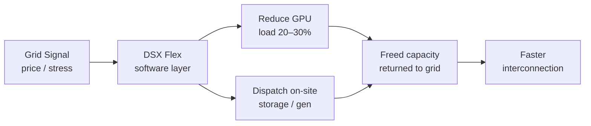

Three things landed on my desk in May that, taken together, tell a single story about energy and AI. The story isn't comfortable.

First:

on 6 May 2026, PJM Interconnection (the largest US grid operator, serving 13 states) proposed three broad frameworks for reforming its wholesale electricity markets. The white paper, titled *Powering Reliability Through Market Design*, reads like a crisis document.

PJM CEO David Mills stated bluntly: "The current situation is not tenable."

Capacity prices in PJM's region have spiked by more than 1,000% over the last two auctions, and PJM has warned of an electricity shortfall as early as 2027.

Second: a fresh [Rystad Energy analysis](https://www.rystadenergy.com/insights/ai-in-upstream-oil-and-gas) published the week of 22 May estimates that digitalisation and AI will create close to $500 billion in cumulative value for E&P companies between 2026 and 2030.

Norway's Equinor generated around $200 million in AI-related savings between 2021 and 2024, then reported $130 million in 2025 alone.

Good numbers. Real numbers.

Third: NVIDIA and a startup called Emerald AI are building something that sits squarely at the intersection of the first two.

## The PJM crisis is an AI crisis

PJM's territory includes Virginia's Data Center Alley, home to roughly one-quarter of US data centres. When the grid operator says it's broken, it's telling the hyperscalers and their GPU clusters that the power they're counting on may not show up.

Since PJM recently reopened its interconnection queue, power companies and developers have filed more than 800 requests for 220 GW of new generation.

That is not a typo. Two hundred and twenty gigawatts.

PJM's own long-term load forecast projects summer peak demand will rise to 253 GW by 2046, up from 160 GW in 2025. That is a 58% increase driven primarily by data centres.

The white paper lays out three paths.

Path A stabilises the existing capacity market. Path B rations grid reliability among customer classes or regions. Path C shifts toward an energy-and-ancillary-services market and away from the capacity model altogether.

Path B, in plain language, means that customers who pay less could get their power cut first during peak events.

Meanwhile, American Electric Power (AEP) is considering pulling out of PJM entirely.

Path A looks to me like the weakest of the three. Patching a market whose prices have spiked 10× in two auction cycles is stalling dressed as reform. The real question is whether PJM can execute Path C's multi-year transition before something breaks.

PJM itself concedes it "may be operating on multiple tracks simultaneously" through 2030.

## $500 billion, with an asterisk\*

The Rystad report is the most granular attempt I've seen to quantify what AI is worth to upstream oil and gas specifically.

The value is captured through cost reductions from more efficient operations, production increases from higher uptime and increased recovery, and compressed development timelines.

E&P players currently investing in digital and AI are expected to capture an additional $80 billion per annum by 2030 compared to 2025.

The asterisk:

most current AI applications in upstream rely on traditional machine learning models trained on equipment- and workflow-specific data, which takes years to accumulate, and models rarely transfer across assets without significant rework. You don't drop a foundation model onto a drilling rig the way you drop ChatGPT onto a customer support desk.

A consistent finding across all four workflow categories is that AI typically does not raise the upper limit for the best performers. The main obstacle to capturing value is not technology availability but large-scale deployment.

Rystad estimates that for US land wells, the average improvement potential is around 10%. For complex deepwater wells, savings can exceed 50% in extreme cases, though 15–20% is more representative. That range matters. A board hearing "50%" and a board hearing "15%" will fund very different programmes.

E&Ps are estimated to have spent around $25 billion on digital and AI purchases last year.

The market for those tools and services is expected to grow by more than $10 billion by 2030, surpassing $35 billion in total annual size.

The question is whether the marginal dollar in digital capex yields more value than the marginal dollar in a conventional well intervention. For most operators, that arithmetic hasn't been done properly.

## Flexible AI factories

At [CERAWeek in Houston on 23 March 2026](https://nvidianews.nvidia.com/news/nvidia-and-emerald-ai-join-leading-energy-companies-to-pioneer-flexible-ai-factories-as-grid-assets),

NVIDIA and Emerald AI announced a collaboration with AES, Constellation, Invenergy, NextEra Energy, Nscale Energy & Power and Vistra to build a new class of "AI factories" that connect to the grid faster and operate as flexible energy assets. The architecture is called Vera Rubin DSX, and the key piece is a software library, DSX Flex, that enables AI facilities to operate as flexible energy assets, balancing high-performance compute workloads with real-time grid responsiveness.

In an Oregon pilot under real CAISO market signals, the system demonstrated 20% load curtailment during a freezing rain event, 25%+ reduction sustained over six hours during a multi-day heat dome scenario, and 24-hour emergency response capability.

A peer-reviewed paper from an earlier Phoenix trial with Oracle was published in *Nature Energy*.

That's more validation than most infrastructure announcements can claim.

The CERAWeek announcement is light on firm project commitments or timelines, which suggests that for now the effort is more a framework for collaboration than a buildout plan.

A 30% power reduction on a Blackwell cluster is a 30% throughput reduction on whatever workload is running. For inference serving, that means slower responses or dropped requests.

Any hyperscaler with a fully loaded cluster and binding SLAs is going to push back hard on which jobs get paused.

The first commercial-scale flexible AI factory is NVIDIA's own 96 MW Aurora data centre in Manassas, Virginia, with deployment involving Digital Realty and PJM. Launch is expected later in 2026.

Note: in PJM's territory. That's not a coincidence.

## Funding a digital programme

A mid-cap E&P weighing a $200 million digital investment should attach conditions before signing. Start with contractually ring-fenced pilot-to-production gates, with kill switches tied to measurable value per barrel. Then a sober assessment of data debt: how many years of sensor data you actually have, and how much rework your ML models will need per asset class. Then explicit modelling of the power-availability risk. Your shiny cloud-native subsurface platform doesn't run without electrons, and the grid you're plugged into may be rationing them within eighteen months.

The NVIDIA–Emerald AI approach is the first serious engineering attempt to make data centres part of the solution rather than just the demand curve. But it's pre-revenue, lightly committed, and dependent on regulatory frameworks that don't yet exist in most US utility territories. On the engineering, I expect it to work. Whether it works politically, inside PJM's stakeholder process, inside FERC filings, inside utility rate cases, is a different question entirely.

AI in energy now sits on both sides of the ledger. It's the tool that could compress seismic interpretation from months to days and cut drilling non-productive time by double digits. It's also the workload that's breaking the grid it depends on. Anyone selling you one half of that story is selling you half a story.

* * *

Tarry Singh is the founder and CEO of Real AI (realai.eu), an enterprise AI advisory and deployment firm working with global enterprises on production agent systems, model risk, and AI sovereignty strategy. He also leads Earthscan (earthscan.io) for Energy AI, and is a founding contributor to the EU-funded HCAIM and PANORAIMA programmes for responsible AI education across European universities. He writes at tarrysingh.com.
