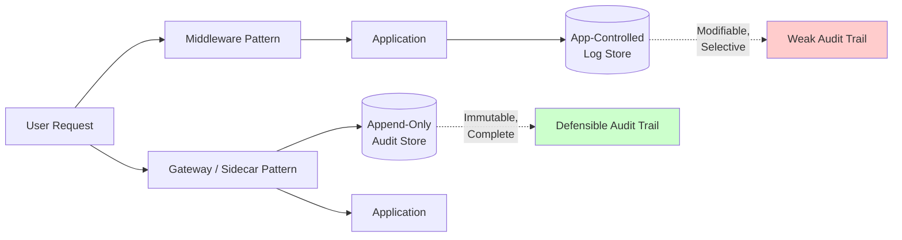

The EU AI Act (Regulation 2024/1689) enters full enforcement on 2 August 2026. Article 12 requires high-risk AI systems to support automatic logging of events throughout their lifecycle, with logs that enable traceability of the system's operation. Miss it and the penalty is up to €15 million or 3% of worldwide annual turnover, whichever is higher.

I am the person who walks in eight months from now and asks to see those logs. Not the slide deck. The actual records. Timestamped, attributed, tamper-evident, covering every request the system processed since you went live. There is no finalized technical standard for Article 12 logging yet. You are building to a regulation that defines outcomes without specifying how. That leaves me looking at architecture, because architecture is the only thing that tells me whether compliance was ever possible.

## where the log gets written

Production guardrails are deployed as sidecars, middleware, or gateway plugins. The difference is not cosmetic. Middleware runs inside the application server. The application controls when the middleware fires, what it sees, and what lands in the audit trail. A developer under deadline pressure to ship can log selectively, suppress verbose output, or send audit records to a store the application can later modify. None of that is malicious. All of it is common.

The architectural fix is to move audit writing out of the application and into the gateway that sits between the caller and the LLM endpoint. The gateway writes the record from a position the application cannot modify after the fact. A sidecar or gateway pattern places the guardrail service outside the request path the application team deploys. The guardrail service runs as a separate microservice alongside the LLM. Use it when you have multiple LLM-powered features sharing the same safety rules. The application makes a call. The gateway intercepts it, logs it, applies policy, writes the decision, forwards or blocks the request, captures the response, logs again. The application never touches the audit pipeline.

Model-level logs capture prompts and responses, not what shaped them. Retrieval logs show which documents were fetched, not whether they were current or actually used. Infrastructure monitoring shows latency and errors, not reasoning. Article 12 demands decision-level traceability. When I audit a system that logs inside the application, I am looking at evidence the defendant prepared. When I audit a system that logs at the gateway, the evidence was written by a component the application could not reach. That distinction is why a guardrail failure in 2026 can mean a bad action: data deleted, money transferred, privileged information forwarded.

## the pattern enterprises are actually using

The best AI guardrails platforms in 2026 share one architectural answer: enforce policies once at the gateway, apply them everywhere, and produce audit evidence by default. Bifrost delivers that pattern as an open-source AI gateway with native integrations to AWS Bedrock, Azure Content Safety, Crowdstrike, Patronus AI, and GraySwan, dual-stage input and output validation, CEL-based rules, and a 14-day free trial of the enterprise edition. I cite Bifrost not as endorsement but as illustration. The vendors shipping compliance-ready guardrails in 2026 converged on the same architecture: single enforcement point, policy written once, evidence generated automatically.

Guardrails actively intervene during runtime, blocking or transforming unsafe content before it reaches end users, typically within 200 to 300 millisecond latency budgets. Run independent guardrail checks simultaneously to minimize latency stacking. A 200 millisecond serial pipeline becomes 70 milliseconds when parallelized. Speed matters because organisations facing the August deadline are retrofitting systems that shipped months ago without audit infrastructure. LLM-as-judge evaluation costs roughly 30–50% of your inference cost. For a $4,000/month inference budget, expect $1,200-2,000 per month in eval costs. The ROI is preventing a single production incident that would cost engineer-weeks to debug or trust-damage to recover from. After the first prevented incident, eval pays for itself indefinitely.

The teams that deployed guardrail-as-sidecar from the start write one policy file and enforce it across ten LLM endpoints serving fifteen internal applications. The teams that embedded guardrails in each application now maintain fifteen different implementations of the same rule, written by seven developers, with no single view of what the rules actually do. When I ask for the audit trail on a specific user request, the first group gives me a query against a single append-only log store. The second group gives me a Jira ticket to aggregate logs from six services.

## what context-layer controls mean for the audit

Effective guardrails for enterprise AI agents focus on the context layer, governing what data enters the agent context window at retrieval time, rather than relying solely on prompt instructions or model-level safety filters, which can be circumvented or which operate too late in the pipeline to satisfy regulatory data governance requirements. The EU AI Act (Regulation 2024/1689, enforcement August 2026) requires that high-risk AI systems meet: data governance documentation under Article 10, logging and auditability of AI decisions under Article 12, human oversight mechanisms under Article 14, and registration in an AI system register under Article 49.

Context-layer guardrails operate before data reaches the agent, enforcing agent access control at retrieval time, versioning context bundles, and tagging data with classification labels before delivery. Model-level controls cannot satisfy the EU AI Act compliance requirements under Article 10. Context-layer controls can. This is the technical detail that separates a defensible deployment from one that cannot be defended. If the guardrail sits after retrieval, I see a log that says the model received three documents. I do not see which version of those documents, whether they were classified correctly, whether the user had rights to them, or whether they were current at the time the decision was made. If the guardrail sits before retrieval, the audit record contains the access decision, the data lineage, the version hash, and the timestamp. All of it immutable, written before the LLM ever saw the query.

Every regulated enterprise running an AI system is sitting on a discovery liability it cannot see. Retrieval-augmented generation, commonly referred to as RAG, is the architecture that lets large language models pull from internal document repositories before generating a response. Yet legal teams are rarely aware of the liabilities that lurk there. The retrieval step is where sensitive data enters the system. It is also where most logs go silent. Organisations instrument the model, the prompt, the final output. They do not instrument the sixteen-document context bundle that shaped the answer, because the application assembled it after the user made the request and the logging layer never saw it. A guardrail deployed as a sidecar sees the retrieval call. It logs what was fetched, from where, under which classification tags, at what timestamp. That record is what turns a litigation hold into something you can actually execute.

## the retrofit problem

Organisations consistently spend three to 5x more fixing compliance failures after enforcement than building compliant systems before it. The technical complexity of retrofitting AI decision logging is significantly higher than retrofitting data processing records. I have reviewed eight production AI deployments in the last four months. Six had logging. Two had logging that could survive an audit. The delta was not effort. The delta was where the logging layer lived. The two that passed had deployed a gateway pattern before they wrote the first application. The logging spec was finished before the product roadmap. When the application team shipped features, audit compliance came for free.

The six that did not pass logged inside the application, wrote logs to a general-purpose observability platform, and discovered during my review that the store retained records for 30 days, well short of the six-month retention requirement. The fix is not to extend retention. The fix is to separate the audit pipeline from the application pipeline so that compliance constraints cannot be overridden by a developer configuring a monitoring tool. Manual audit processes, periodic snapshots, and after-the-fact reconstruction do not satisfy the requirement. It is an architectural obligation, not a monitoring one.

CTOs are being asked to move faster on Agentic AI while reducing risk, cost, and surprises. Here is the pragmatic play: drive AI accuracy first with retrieval and reasoning techniques that measurably cut hallucinations, then apply AI guardrails in layers matched to business risk. This sequence keeps agents responsive for everyday work while adding deeper verification only when stakes are high. That recommendation assumes you have time. If your high-risk system goes live before 2 August, you do not. The fastest path to compliance is to deploy the gateway now, route all AI traffic through it, and instrument audit logging before you add policy enforcement. The logging schema matters more than the rules, because hash-chained, append-only audit records with cryptographic fingerprints satisfy every requirement without storing sensitive content.

## what I need to see when I walk in

A register of every AI system in scope. Annex III identifies eight areas: biometric identification, management of critical infrastructure, education and vocational training, employment and worker management, access to essential services (credit, insurance, public services), law enforcement, migration management. If your system makes decisions in any of those domains, it is in scope. The register tells me you knew that.

The logging schema. Article 19 names the fields the record has to contain. At a minimum: request ID, timestamp, authenticated identity of the requester, input, output, model version, policy applied, decision, retrieval context if applicable. The schema tells me you understood the obligation before you wrote code.

The audit store. Append-only, immutable, separate from the application deployment. Six-month retention or longer. Queryable by request ID, user identity, time range. The architecture of the store tells me whether you can produce records under legal hold.

The gateway config. Which policy ran, when it was deployed, who approved the change, what the rule evaluated. Version-controlled, deployed through CI/CD, tagged with approval metadata. The config history tells me whether the system I am auditing today is the same system that ran three months ago.

The access log for the audit store itself. Who queried it, when, for which user records. That log tells me whether your staff accessed user data without oversight, and whether you will notice if someone tries.

Deloitte's 2026 AI report found only 20% of organisations have mature governance models. The gap is not governance documentation. Every organisation has principles. The gap is evidence, and evidence requires architecture. Langfuse was acquired by ClickHouse, OpenAI acquired Promptfoo and is shutting down its own hosted Evals product on November 30, Cisco moved to acquire Galileo, and Helicone was folded into Mintlify and put in maintenance mode. Vendor consolidation in the eval and observability space means the platform you chose last quarter may not be available in two quarters. The guardrail-as-sidecar pattern survives vendor churn because the policy logic and audit pipeline live in infrastructure you control, not in a hosted service that may disappear.

NIST RMF is widely used as a technical companion framework for AI Act compliance. It is widely adopted by US companies, referenced by regulators, and used globally as a foundation for AI governance and AI Act readiness. Bifrost ships native Prometheus metrics, OpenTelemetry traces, and structured violation records that integrate cleanly into Grafana, Datadog, and SIEM pipelines, which is essential for both NIST AI RMF's Measure function and EU AI Act audit trails. Enterprise deployments can use Bifrost's audit logs for SOC 2 Type II, HIPAA, and ISO 27001 evidence. A sidecar pattern that emits OpenTelemetry spans survives changes to your observability backend, your LLM provider, your application framework, and your compliance team. You built to a standard, not to a vendor.

The audit does not start when I arrive. It starts when you choose where the guardrail runs. If it runs inside the application, the audit will surface gaps you cannot close without rewriting the application. If it runs outside the application, as a sidecar or gateway, the audit will surface gaps you can close by updating policy config. One of those architectures lets you respond to findings in a sprint. The other requires a quarter and three engineering teams. Sixty-two days from now, the difference becomes enforceable.

---

Tarry Singh is the founder and CEO of Real AI (realai.eu), an enterprise AI advisory and deployment firm working with global enterprises on production agent systems, model risk, and AI sovereignty strategy. He also leads Earthscan (earthscan.io) for Energy AI, and is a founding contributor to the EU-funded HCAIM and PANORAIMA programmes for responsible AI education across European universities. He writes at tarrysingh.com.
