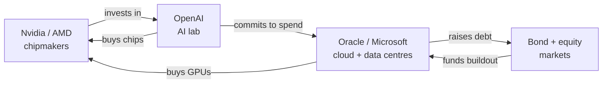

A bubble is not the same thing as a lie. That distinction gets lost in most of the writing about AI right now, which lurches between true-believer rapture and short-seller glee. I've watched four of these cycles up close: Y2K remediation, the dotcom unwind, the telecom fibre glut, the 2008 credit machine. The pattern rhymes every time. There is a real technology. The technology gets oversold. The financing built on top of the overselling becomes the actual fragility. By the time the music stops, the people asking "is this a bubble?" are asking the wrong question. The right one is: who's holding the debt when demand disappoints?

Luke Munn's piece in *The Conversation*, [republished on TechXplore last week](https://techxplore.com/news/2026-06-ai-hype-experts.html), lays out the sceptical case cleanly: sky-high promises, sky-high spend, and a public that is decidedly less enthusiastic than the keynote circuit. I want to take his frame and push on the part that matters most to anyone sitting on a board or a balance sheet: the money.

## the numbers don't reconcile

Start with the spending, because that's the part that's hard to spin. The four largest US hyperscalers, Amazon, Alphabet, Microsoft and Meta, have guided to roughly $700 billion in capital expenditure for 2026. 

The four hyperscalers now expect combined spending of close to $700 billion, and reaching those numbers means a big drop in free cash flow, with Amazon projected to turn negative this year.

 That is up from a record [$388 billion in 2025](https://datacenterrichness.substack.com/p/hyperscalers-plan-630-billion-in). Call it a 60–70% jump in a single year. 

Amazon has projected $200 billion in capex for 2026, Google $175 to $185 billion, Meta $115 to $135 billion, and Microsoft $110 to $120 billion.

Now the demand side. 

Pure-play AI vendors led by OpenAI and Anthropic are posting rapid revenue growth, though their combined revenues remain a fraction of the infrastructure investment being deployed on their behalf.

 OpenAI itself, the bellwether, was forecast to do around $12.7 billion in revenue in 2025 and [doesn't expect cash flow to turn positive until 2029](https://www.calcalistech.com/ctechnews/article/bjfztiftjl). The gap between what's being built and what's being earned is the whole story. Deutsche Bank has put a figure on the divergence: the AI sector may face an $800 billion annual revenue gap by 2030, while tech stocks have driven about 50% of S&P 500 gains in 2025.

Giant tech companies have spent so much on data centres in 2025 that their spending is now contributing more to US economic growth than consumer spending, long considered the nation's economic engine.

 Pantheon Macroeconomics goes further: AI-linked capex and the wealth effect from gains in tech stocks probably accounted for a third of headline GDP growth towards the end of last year, which would leave the economy vulnerable if investors started to doubt the AI story.

 When one capex theme is holding up the macro print, the macro print is no longer independent confirmation that the theme is healthy. It's circular reasoning dressed as data.

## the financing loop

The financing has started to feed on itself.

The mechanics are now well documented. 

A chip or cloud vendor invests in an AI lab; the lab spends that money buying the vendor's products; the money circles a small cohort, inflating apparent demand.

 Analysts in 2026 [put the total at north of $800 billion in such arrangements](https://alatirok.com/ai-circular-financing-explained/). Nvidia's pledge to OpenAI, once floated at $100 billion, has already wobbled: Jensen Huang said his company "will invest a great deal of money" in OpenAI while making clear the $100 billion figure shouldn't be treated as a literal cheque.

That contingency is the exposed nerve. 

If OpenAI's financing is contingent or delayed, what happens to the infrastructure already built to match the supposed demand? The question matters most to companies like Oracle or Microsoft that have taken on leverage to meet it.

 Oracle has already shown the strain. 

It expects to raise $45 billion to $50 billion in 2026 to expand capacity, about half from equity or equity-linked issuance and the rest from senior unsecured bonds.

 That is borrowing against demand that depends on a customer whose own funding is non-binding. It is the daisy chain that snapped in telecom in 2001.

The number to ask a leveraged builder for is the percentage of bookings that come from outside the circle. Any backlog figure that doesn't survive that test should be discounted. The bull case, that this is healthy vendor financing locking in scarce supply, has a defender in [Janus Henderson](https://www.bloomberg.com/graphics/2026-ai-circular-deals/), who call it a "virtuous circle" that helps line up suppliers, builders and customers to meet exploding demand for computing power.

 Maybe. Vendor finance built the railroads and the mobile networks. It also built WorldCom. The difference is always whether end demand shows up on time.

## the productivity ghost

End demand is the test, and the evidence there is uncomfortable for the believers. I say that as someone who deploys this technology for a living.

The widely-cited [MIT NANDA study](https://fortune.com/2025/08/18/mit-report-95-percent-generative-ai-pilots-at-companies-failing-cfo/) reported that about 5% of AI pilot programmes achieve rapid revenue acceleration; the vast majority stall, delivering little to no measurable impact on P&L.

 I'd treat that 95% headline with some care. It's based on interviews and 300 public deployments rather than a clean panel, and the lead author was clear the failure was about integration rather than models. 

The issue was the learning gap rather than the quality of the AI models; generic tools like ChatGPT excel for individuals but stall in enterprise use since they don't adapt to workflows.

 That's a real finding and it matches what I see in the field. The models are good. The plumbing around them is mostly absent.

The sturdier evidence is the [NBER survey of nearly 6,000 executives](https://www.nber.org/papers/w34836) across the US, UK, Germany and Australia. 

69% of firms actively use AI and more than two-thirds of executives use it regularly, but only about 1.5 hours a week. Nine in ten report no impact on employment or productivity over the last three years.

 A peer-reviewed working paper from a serious institution is worth more than a hundred vendor case studies, and it's saying the quiet part: adoption is broad, impact is invisible. Economists have a name for this. 

In the 1980s, Robert Solow observed that you can see the computer age everywhere except in the productivity statistics.

 Computers eventually delivered, a decade later. The honest position is that AI probably will too. The dishonest position is pretending the returns are already here to justify $700 billion a year now.

## Altman on the kernel of truth

The most candid voice on this is the one with the most to lose from saying it. [Sam Altman told reporters last August](https://www.cnbc.com/2025/08/18/openai-sam-altman-warns-ai-market-is-in-a-bubble.html) that "when bubbles happen, smart people get overexcited about a kernel of truth," and asked whether investors as a whole are overexcited about AI, his opinion was yes.

 In the same breath, while warning that valuations are out of control, he said you should expect OpenAI to spend trillions of dollars on datacentre construction in the not very distant future.

 That is not a contradiction. That is the strategy stated out loud: yes it's a bubble, and I intend to be the entity still standing when it deflates, holding the compute everyone else overpaid to build. He's not wrong to play it that way. He raised [$40 billion in March 2025](https://www.cnbc.com/2025/03/31/openai-closes-40-billion-in-funding-the-largest-private-fundraise-in-history-softbank-chatgpt.html) and then [$110 billion this February](https://news.crunchbase.com/venture/openai-raise-largest-ai-venture-deal-ever/) at an $840 billion valuation. When you can raise on those terms, you build.

## so what pops, and what survives

Bubbles don't destroy the underlying technology. The dotcom crash wiped out many speculative ventures, but it also left behind the infrastructure and companies that shaped the modern internet.

 The fibre laid in 1999 carried Netflix in 2010. The data centres going up in Texas and west Sydney will carry whatever comes next, regardless of who goes bankrupt building them.

What pops is the financing layer: the contingent commitments, the leveraged builders, the three-people-and-an-idea startups funded at a billion. The public mood Munn describes, with grassroots campaigns against the Sydney buildout and 81% of Australians wanting stronger AI rules, is a real cost that the spreadsheets ignore, because power and planning permission have become the binding constraint ahead of chips or capital. My own expectation, held loosely: the 2026 capex guidance gets cut before it gets met, and the first crack shows up in a leveraged builder's bond spread well before it shows up in a model benchmark. I'd be surprised if every dollar of that $700 billion gets spent. The technology is real. The kernel of truth is real. The financing is where I'd run my fingers along the seams.

---

Tarry Singh is the founder and CEO of Real AI (realai.eu), an enterprise AI advisory and deployment firm working with global enterprises on production agent systems, model risk, and AI sovereignty strategy. He also leads Earthscan (earthscan.io) for Energy AI, and is a founding contributor to the EU-funded HCAIM and PANORAIMA programmes for responsible AI education across European universities. He writes at tarrysingh.com.
