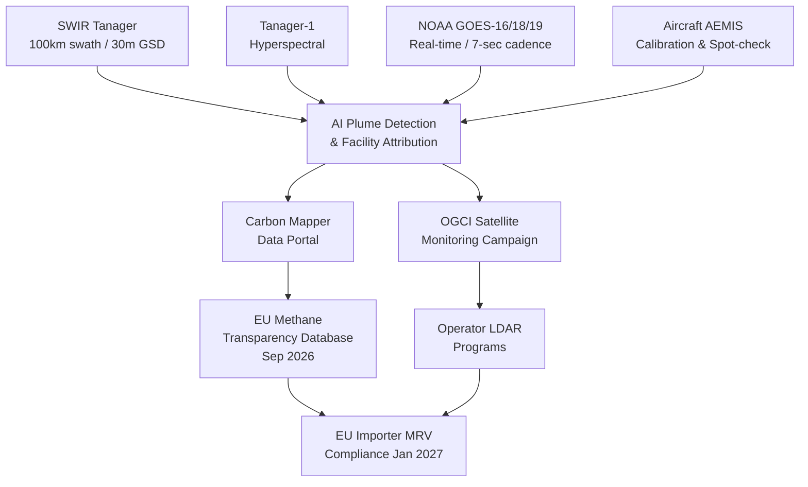

Earlier this month, trade reporting circled back to an April announcement that had not received the attention it deserved: Planet Labs and Carbon Mapper [signed an agreement](https://www.businesswire.com/news/home/20260430512259/en/Planet-and-Carbon-Mapper-Sign-Agreement-for-New-Tanager-Spacecraft) to design a new version of the Tanager spacecraft optimised exclusively for shortwave infrared detection. No visible-light channels. No near-infrared surface mapping. Just the spectral bands that make methane and other trace gases light up from orbit.

That is a pointed engineering decision. It is also, not coincidentally, timed against one of the most consequential regulatory clocks in the energy sector right now.

## 1. what tanager-1 already found

The original Tanager-1, a hyperspectral satellite launched in August 2024 as a joint effort between Planet, Carbon Mapper, and JPL, has already [identified more than 11,000 methane plumes from nearly 5,000 sources worldwide](https://www.businesswire.com/news/home/20260430512259/en/Planet-and-Carbon-Mapper-Sign-Agreement-for-New-Tanager-Spacecraft). One satellite, under two years in orbit, covering a fraction of any given basin on any given pass, and it has already flagged 5,000 distinct emission sources worth acting on.

Those 5,000 are only what one narrow swath happened to fly over.

Coverage is what limits Tanager-1. Its hyperspectral design, hundreds of spectral bands spanning visible light through shortwave infrared, is scientifically rich but geometrically narrow. Wide capability, thin swath. You cannot monitor every compressor station in the Permian Basin on a weekly cadence with one satellite doing that much spectral work per square kilometre.

## 2. the SWIR-only upgrade: what changes

The new SWIR-only Tanager strips out everything except the bands most relevant to atmospheric gas detection. The trade-off yields a significant reward: [5x the area coverage of Tanager-1, with an imagery swath expanded to 100 kilometres while retaining a 30-metre ground sample distance](https://www.spacewar.com/reports/Planet_and_Carbon_Mapper_Plan_SWIR_Only_Tanager_Satellite_for_Wider_Methane_Detection_999.html). Sensitivity to methane super-emitters doubles. JPL is co-developing the underlying instrument, the Advanced Emissions Monitoring Imaging Spectrometer, or AEMIS. [Carbon Mapper will fly it on aircraft first, and Planet then integrates the same sensor technology on the orbital platform](https://www.prnewswire.com/news-releases/carbon-mapper-unveils-plan-for-next-generation-methane-detection-technology-to-cut-climates-strongest-pollutant-302758334.html).

That aircraft-first step is sensible. It is the calibration phase, the chance to build confidence in detection performance before committing to an asset with a decade-plus orbital lifespan. Planet also [intends to build at least three additional original-design Tanagers alongside at least one SWIR-only unit](https://www.spacewar.com/reports/Planet_and_Carbon_Mapper_Plan_SWIR_Only_Tanager_Satellite_for_Wider_Methane_Detection_999.html). This is the beginning of a dedicated methane-monitoring constellation. The space-based emissions world needed it badly after MethaneSAT went silent in July 2025, [just 15 months into its planned five-year mission](https://www.nature.com/articles/d41586-025-02119-3). Single-asset dependencies in orbit carry existential risk.

## 3. the geostationary layer

A second orbital tier sits above the polar orbiters. NOAA's GOES-16, GOES-18, and GOES-19 geostationary satellites carry an Advanced Baseline Imager that can [pinpoint large methane venting events as often as every 7 seconds](https://www.nesdis.noaa.gov/news/noaas-goes-satellites-can-provide-quicker-detection-of-large-methane-emissions). It cannot resolve smaller plumes in the tens-of-kilograms-per-hour range. But for catastrophic blowdowns, pipeline failures, and the super-emitter events the EU's Rapid Alert Mechanism was built to catch, continuous geostationary coverage at seven-second intervals is something no low-Earth-orbit constellation can match. Polar-orbiting satellites give you granularity; geostationary gives you continuity. You need both, and the architecture above only makes sense as a stack.

## 4. the eu regulatory clock

The EU Methane Emissions Regulation entered into force in August 2024. Most corporate planning teams quietly filed it under "long implementation timeline." That reading is partially correct, and dangerously partial.

The European Commission is [scheduled to launch the EU Methane Transparency Database in September 2026](https://energy.ec.europa.eu/topics/carbon-management-and-fossil-fuels/methane-emissions_en). Three months from today. That database aggregates emissions reported by EU operators and importers, creating a public ledger of methane performance visible to regulators, counterparties, and journalists simultaneously. From January 2027, importers will be [required to demonstrate that the countries or producers supplying them with natural gas and crude oil meet Monitoring, Reporting and Verification requirements equivalent to EU standards](https://www.iea.org/policies/18209-eu-regulation-on-the-reduction-of-methane-emissions-in-the-energy-sector).

A [March 2026 Wood Mackenzie study commissioned by IOGP Europe estimated that around 114 billion cubic metres of natural gas and 9.8 million barrels per day of crude oil could fail the importer requirements as currently written](https://iogpeurope.org/projects/the-impact-of-the-eu-methane-regulation/). The reason is that only 7% of global gas and crude oil production currently meets producer-level equivalence standards. The industry lobby used this to argue for regulatory adjustment. EDF countered that compliant supply already exceeds EU demand projections for 2027. Both arguments have merit, which is precisely the problem: nobody has a settled answer, and the compliance clock is running regardless.

## 5. the 2028 satellite versus the 2027 deadline

The SWIR-only Tanager launches [as early as 2028](https://www.businesswire.com/news/home/20260430512259/en/Planet-and-Carbon-Mapper-Sign-Agreement-for-New-Tanager-Spacecraft). The EU importer requirements start January 2027. That is a gap. It is not a fatal one. Tanager-1 is already in orbit, AEMIS will fly on aircraft before the satellite launches, and the Oil and Gas Climate Initiative's satellite monitoring campaign has been [providing emissions data to operators in Iraq, Kazakhstan, Algeria, and Egypt since 2021](https://www.ogci.com/news/ogci-and-carbon-mapper-team-up-to-reduce-methane-emissions-from-the-oil-and-gas-sector/). The infrastructure for measurement exists, even if coverage is uneven.

But gaps get filled by whatever is available, not by whatever is optimal. Drone-based LDAR contractors, ground-sensor networks, and operator-funded aerial surveys will absorb much of the 2026–2028 compliance workload. Some of that work will be rigorous. A significant portion will be point-in-time snapshots presented as continuous monitoring. The regulation does not envisage that, and the satellite data will not validate it.

A European LNG importer, or a midcap refinery dependent on non-OGMP supply chains, should be asking counterparties for satellite-validated measurement data now. Waiting until late 2026, when the Transparency Database goes live, leaves no room to fix what the data shows. In practice the September 2026 launch will shame operators who have not done the groundwork, and "we did not know" will not survive audit.

## 6. the AI attribution layer

The satellite hardware is necessary but not sufficient. Tanager-1's 11,000 detected plumes became actionable because of the machine learning that ran against the raw spectral imagery. The AI detects differential absorption signatures of methane against background surface reflectance. That is a pattern-recognition problem at scale.

The harder step is attribution. [Google's algorithms were applied to satellite and aerial imagery to map oil and gas infrastructure (well pads, pump jacks, storage tanks) so that plume detections can be co-registered against specific facility types](https://blog.google/outreach-initiatives/sustainability/how-satellites-algorithms-and-ai-can-help-map-and-trace-methane-sources/). That mapping step matters enormously because [millions of oil and gas operations worldwide have location information that is tightly guarded and, where available, expensive to access](https://www.technologyreview.com/2024/02/14/1088198/satellite-google-ai-map-methane-leaks/). Without attribution, you have a plume. With it, you have a compliance event tied to a specific asset, an operator, and an import contract registered with an EU competent authority.

The distinction between "interesting data" and "legal document" is what makes the AI attribution layer commercially defensible. It is also the part of the stack most worth building in 2026. Satellite manufacturing demands capital, launch risk and orbital patience. Sensor hardware commoditises within a decade. The durable position is the attribution and verification layer that sits between raw spectral data and the audit trail regulators will eventually demand.

## 7. self-policing meets independent verification

The OGCI's member companies, major IOCs who chose to join voluntarily, [reduced their aggregate upstream methane emissions by 63% since 2017 and cut routine flaring by 72% since 2018](https://www.ogci.com/news/ogci-and-carbon-mapper-team-up-to-reduce-methane-emissions-from-the-oil-and-gas-sector/). That is genuine progress. But those numbers derive from operator self-reporting cross-checked by the satellite campaigns those same operators signed up to participate in. The regulation mandates independent verification at continental scale. The industry's willingness to police itself has just been replaced by a legal structure that assumes it will not.

A methane monitoring business built primarily on ground sensors and periodic aerial surveys looks badly placed to win the EU compliance market. The SWIR Tanager and the AI attribution layer above it are constructing a continuous, persistent, and globally verifiable baseline. Within five years, the ground measurement that contradicts satellite data will be the one that has to justify itself.

California's CalSMP programme already shows the operational model working: [the first major initiative to deploy satellite methane detection in a non-research setting](https://ww2.arb.ca.gov/news/californias-methane-satellite-helps-stop-10-large-leaks), with CARB notifying operators and confirming repairs against a public-facing dashboard. The EU is building the same thing at continental scale and wiring it into import law.

The hardware is catching up. The regulation is already here.

---

Tarry Singh is the founder and CEO of Real AI (realai.eu), an enterprise AI advisory and deployment firm working with global enterprises on production agent systems, model risk, and AI sovereignty strategy. He also leads Earthscan (earthscan.io) for Energy AI, and is a founding contributor to the EU-funded HCAIM and PANORAIMA programmes for responsible AI education across European universities. He writes at tarrysingh.com.
