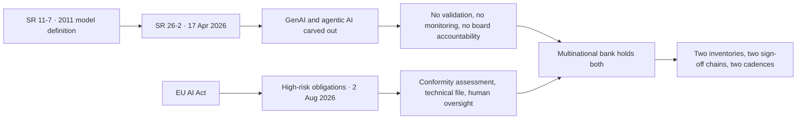

On 17 April 2026, the Federal Reserve issued SR 26-2, superseding SR 11-7, the model-risk management guidance that has governed quantitative decision-making in American banking since 2011. The replacement preserves the original's three-lines-of-defence architecture (model developers, independent validation, internal audit) but introduces a revision that would have seemed heretical five years ago. 

The Fed, alongside the OCC and FDIC, explicitly carved out generative and agentic AI from the updated guidance's scope, acknowledging that "rapidly evolving and novel technologies like AI may require a different approach." 

That carve-out is temporary. Its consequences will outlast it.

What it signals is regulatory uncertainty at scale. 

While SR 26-2 preserves foundational model-risk principles and introduces a more risk-based, scalable framework, the exclusion means that the autonomous AI systems now handling fraud triage, transaction approval, AML alert disposition, and customer outreach at dozens of US regional and money-centre banks sit outside the only supervisory framework the industry has relied upon for model governance. No validation protocol. No ongoing monitoring requirement. No board-level accountability model that examiners can point to. 

The stated reason is that SR 11-7's original model definition (inputs, transformations, outputs, static assumptions, linear causality) does not accommodate systems that evolve in production, ingest unstructured data, generate probabilistic outputs, and act without deterministic logic. Fair. The Fed is acknowledging reality. But acknowledging reality without replacing the supervision model leaves a placeholder where a plan should be.

Meanwhile, on 2 August, ten days from publication of this piece, the EU AI Act's high-risk obligations take effect. 

All high-risk systems in production must achieve full compliance by that date, regardless of when they were built or launched. 

According to the European Banking Authority's November 2025 report, the majority of AI use cases at EBA-supervised institutions fall into the high-risk category: credit scoring, fraud detection, insurance pricing, AML transaction monitoring. 

Non-compliance penalties reach up to €35 million or 7% of worldwide turnover. For a midsize insurer or payments processor, that is an extinction-level event.

If you are a European bank with a US parent, you now face a supervision paradox. Your EU subsidiary must produce conformity assessments, technical documentation, risk management files, post-market monitoring logs, and human-oversight evidence for systems that your US headquarters does not yet classify as models under any enforceable framework. The governance does not map. The approval chains do not map. The evidence you need for Brussels does not yet exist in a form that New York would recognise as binding.

I have sat in enough model-validation committee meetings to know what happens when regulatory frameworks diverge at this level of specificity. You do not harmonise. You duplicate. You build parallel governance stacks, one for each jurisdiction, with separate inventory systems, separate sign-off authorities, separate monitoring cadences. The operational drag is measurable. Validation cycles lengthen. Deployment velocity collapses. And the irony is that neither framework actually solves the underlying control problem. How do you validate conceptual soundness when the concept is a 70-billion-parameter language model you did not train, hosted by a vendor whose API you call but whose training data you have never seen?

## What SR 26-2 actually changed

SR 26-2 shifts supervisory expectations toward tailoring, materiality, and practical implementation based on each institution's model-risk profile. Translation: not all models are created equal, and a community bank running vendor-supplied credit scorecards should not face the same validation burden as a global systematically important bank running proprietary derivatives pricing engines. That is sensible, and fifteen years late.

The problem is that the carve-out does not tell you what *does* apply. The Fed has indicated it will issue a Request for Information on AI/GenAI/agentic-AI model risk. When? No date. What form will that guidance take? No indication. Will it fold back into SR 26-2 via an addendum, or will it become a standalone framework like the Treasury's Financial Services AI Risk Management Framework? Unknown.

That Treasury framework, released in February 2026, provides institutions with a matrix of 230 control objectives to manage risks across the AI lifecycle, with controls categorised by adoption stage. 

It adapts the NIST AI Risk Management Framework to the specific operational, regulatory, and consumer-protection considerations of financial services. It is voluntary. It is also the closest thing American banks have to a specified control set right now, because it at least names the controls: model inventory, data lineage, drift monitoring, bias testing, explainability thresholds, human-override protocols.

But "voluntary" is doing a lot of work in that sentence. In practice, examiners will ask whether you have adopted it. If you have not, they will ask what you adopted instead. If the answer is "nothing specific to AI", that becomes a Matter Requiring Attention in your next report. Voluntary frameworks have a way of becoming de facto mandatory when the alternative is defending a blank page to the Board of Governors.

## The Mills Review and what the UK is seeing

On 6 July 2026, the Financial Conduct Authority published the Mills Review into artificial intelligence and the future of retail financial services. 

The review highlights that agentic AI is enabling a shift from assistance to delegation, with systems taking on longer tasks and more actions within firm and consumer workflows. That is a polite way of saying: your customers think they are talking to a chatbot; the chatbot is initiating wire transfers.

The regulatory response to AI in financial services has been accelerating in recent months, as regulators work out what AI, from traditional machine learning to generative and agentic systems, means for market integrity, consumer protection, financial stability, and operational resilience. The UK is not waiting for a unified framework. 

On 14 July 2026, HM Treasury published its Financial Services AI Adoption Plan, emphasising the need to prioritise a review of the regulatory perimeter to introduce proportionate guardrails for AI-enabled services.

What the Mills Review makes clear is that regulators are no longer debating *whether* to regulate agentic systems. They are debating *how fast* the perimeter needs to move to keep up with deployment. And the answer, increasingly, is: faster than industry wants.

## The EBA's frontier-AI warning

In its Spring 2026 Risk Assessment Report published on 18 June, the European Banking Authority flagged frontier AI large language models as a growing threat to the financial system. 

The core concern: these models are getting good enough to find and exploit software vulnerabilities faster than human security teams can patch them. That is observable capability today.

The EBA is urging banks to strengthen operational resilience, cybersecurity measures, and contingency planning. But you cannot have operational resilience for a system you do not inventory, cybersecurity measures for a model you have not validated, or a contingency plan for behaviour you cannot predict. The control environment assumes visibility. Agentic AI, as currently deployed, replaces it with *outcomes*, correct or catastrophically wrong.

## Where fraud detection is already autonomous

In 2025 alone, 50 of the world's largest banks announced more than 160 agentic AI use cases, according to McKinsey. 

Early deployments have shown the potential to enable zero-touch operations and reduce manual workloads by 30–50%. Those are production systems making real decisions about real money.

This year, 82% of midsize companies and 95% of private-equity firms have either begun or plan to implement agentic AI in their operations in 2026, per Citizens Bank research. 

Top use cases include cybersecurity, fraud detection, and financial planning and analysis. 

Business Email Compromise, phishing, and data breaches claimed $14.3 billion last year, rising at a 19.6% annualised rate from 2023 to 2025, according to Nasdaq Verafin's 2026 Global Financial Crime Report.

Fraud is the use case where agentic autonomy delivers immediate, measurable returns. It is also the use case where model failure has the highest reputational cost. A false positive locks a customer out of their account at the airport. A false negative lets a synthetic-identity ring drain $4 million before anyone notices. Both failures show up in the same quarterly earnings call, but only one makes the front page of the FT.

Neither SR 26-2 nor the EU AI Act answers the questions a bank's model-risk committee has to settle this year:

1. Who owns the validation of a vendor-supplied agent that evolves via retrieval-augmented generation on data the vendor hosts?  
2. What evidence threshold satisfies both EU conformity assessment and US effective-challenge requirements when the system's logic is not static?  
3. At what drift magnitude do we re-validate, and who defines that threshold in the absence of regulatory prescription?

The answers will determine whether your deployment schedule holds or your examiner writes you up.

## What happens on 2 August

The EU AI Act deadline is a measurement point. 

A high-risk system needs a documented risk-management process, data governance and bias controls, technical documentation, automatic event logging, meaningful human oversight, and demonstrated accuracy and robustness. 

Before it reaches the market it has to pass a conformity assessment. Most banks I speak to have inventoried their high-risk systems. Fewer have completed technical documentation to the Act's standard. Almost none have operationalised continuous conformity in a way that survives the first major model retrain.

The asymmetry with the US is now structural. American banks have time but no clarity. European banks have clarity but no time. And multinational groups have the worst of both: duplicated governance overhead without harmonised outcomes.

My guess is that the first serious enforcement action under the EU AI Act lands somewhere dull. A legacy credit model that someone forgot to document, or a fraud system that drifted past its original risk classification without a conformity re-assessment. Boring failures. Expensive penalties.

The Fed's carve-out was the right technical call. Agentic AI does not fit SR 11-7's model definition. But leaving that void open while banks deploy at scale is a regulatory gamble. If the forthcoming RFI does not land by Q4 2026 with binding expectations, US supervisors will find themselves negotiating model risk case by case with no shared baseline. And negotiation does not scale.

---

Tarry Singh is the founder and CEO of Real AI (realai.eu), an enterprise AI advisory and deployment firm working with global enterprises on production agent systems, model risk, and AI sovereignty strategy. He also leads Earthscan (earthscan.io) for Energy AI, and is a founding contributor to the EU-funded HCAIM and PANORAIMA programmes for responsible AI education across European universities. He writes at tarrysingh.com.
