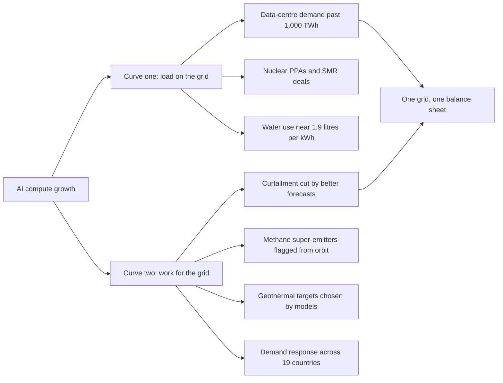

Two charts dominate the press kit for AI and energy in 2026. Both are correct. Only one is on the front page.

The first chart, the one in every CEO deck and most regulator briefings, shows global data-centre electricity demand pushing past 1,000 terawatt-hours this year, about Japan's annual consumption, on its way to a base case of 1,200 TWh by 2035, according to the IEA's [Energy and AI](https://www.iea.org/reports/energy-and-ai/executive-summary) report. AI-focused data centres alone grew electricity consumption 50 per cent in 2025, and the IEA's Electricity 2026 [demand chapter](https://www.iea.org/reports/electricity-2026/demand) projects a tripling of AI-data-centre load by 2030. That is the curve that explains the parade of nuclear deals. As of May 2026, every major hyperscaler has at least one nuclear contract on the books; [SMR Intel counts thirteen announced projects worth more than 9.8 GW of capacity](https://smrintel.com/nuclear-data-center-deals/) signed in the current cycle, with Meta's 6.6 GW agreement, reported by [Latitude Media](https://www.latitudemedia.com/news/meta-strikes-6-6-gw-nuclear-deal-to-fuel-its-ai-supercluster/), the single most aggressive commitment to date.

The second chart, less circulated and far more interesting, shows what AI is doing to the rest of the energy system on the way to its own generation contract. Methane leaks pinned by satellite. Wind output forecast 36 hours out with errors small enough to monetise. Renewable curtailment compressed. Geothermal wells targeted by models. Demand-response programmes run from a software platform that now spans 19 countries.

We are arguing about the first curve while the second curve does most of the real work. The mistake, and it is showing up in board rooms, in policy hearings, in the EU's Omnibus drafting room, is to treat the first curve as the whole story. It is only the part you can put on a slide.

## the curve that made the front page

The data-centre demand story is not wrong. I want to say that plainly before I argue with it. AI inference and training are pulling on grids that were not built to be pulled on, and the response is rational at the scale of an individual hyperscaler: long-dated power purchase agreements, restarts of mothballed nuclear capacity, gas turbines bought against future delivery. Microsoft's 20-year deal to restart Three Mile Island's Unit 1 will eventually deliver about 7 million MWh a year against an AI footprint that, internally, the company already treats as its hardest planning variable. Amazon's Susquehanna arrangement is similar. Google's Kairos SMR commitment, and a separate 115-megawatt PPA with Fervo's Corsac Station, bracket the same problem from two different physics.

The water number is where the curve gets uncomfortable. The [Environmental Law Institute's January 2026 fact sheet](https://www.eli.org/sites/default/files/files-pdf/Data%20Centers%20and%20Water%20Fact%20Sheet%20ELI%20January%202026%20\(1\).pdf) puts average data-centre Water Usage Effectiveness at about 1.9 litres per kWh, with hot-and-dry-region facilities running materially higher. UC Berkeley's Center for Law, Energy & the Environment is now [drafting a regulatory framework specifically for California data-centre water use](https://www.law.berkeley.edu/research/clee/research/wheeler/water-innovation/data-center-water-use/), and the recent arXiv paper, ["Small Bottle, Big Pipe"](https://arxiv.org/pdf/2603.02705), quantifies the impact a single hyperscale campus can have on a municipal water system. Treat these as serious. Do not treat them as a vendor case against AI; treat them as a planning constraint, the same way a steel mill's siting committee thinks about cooling intake.

What is wrong is the framing: that the data-centre curve is what AI does to energy. It is what one part of AI does to one part of energy. In the same year a hyperscaler signs a 6.6 GW nuclear contract, the AI systems sitting on the other side of the meter are doing more, in absolute terawatt-hour terms, to reduce wasted generation, locate methane, accelerate geothermal, and bend domestic demand than the headline numbers acknowledge. The press has not caught up to that arithmetic. Boards should.

## the curve that did not

Start with curtailment. Between 5 and 15 per cent of all renewable energy generated on major grids in Europe and China is currently curtailed. It is produced and discarded because the grid cannot absorb it the moment it lands. POWER Magazine's [recent coverage](https://www.powermag.com/ai-powered-grid-management-reducing-renewable-electricity-curtailment/) frames AI curtailment prediction as one of the highest-ROI applications now in deployment. The mechanism is mundane: better short-horizon forecasts of wind and solar output let dispatchers pre-route the excess into storage, into electrolysers, into industrial loads with flexible schedules. The forecasts have already crossed the threshold. The UK's National Grid, working with the Alan Turing Institute, improved solar prediction by 33 per cent using machine learning with 80 input variables. Open Climate Fix, partnered with Google DeepMind, has reduced large forecasting errors by about 10 per cent and mean error by 5 per cent across the 24-to-48-hour window, numbers carried in their [recent insights post](https://www.openclimatefix.org/insights/ai-based-weather-forecasting-is-enabling-the-renewable-energy-transition). In Texas, DeepMind's algorithms forecast wind 36 hours ahead and pushed the economic value of wind energy up by 20 per cent.

That last number is the one I want stuck on the wall. A 20 per cent increase in the market value of an installed asset, achieved with software, without a single additional turbine, is the kind of capital efficiency the AI investment thesis is supposed to produce. It is happening on the energy side, while most of the press writes about the productivity-software side.

Then move to demand response. Octopus Energy's Kraken platform, being spun out at an [$8.65 billion valuation](https://esgnews.com/octopus-energy-spins-out-kraken-in-1-billion-raise-valuing-utility-ai-platform-at-8-65-billion/) on a $1 billion raise, now serves more than 70 million utility accounts across 19 countries. The mechanism, again, is unglamorous: shift household consumption a few hours, in aggregate, in response to wholesale price signals; pay the household a fraction of the saved system cost; orchestrate it through software with enough behavioural granularity that the customer barely notices. The Kraken Flex virtual power plant is managing more than 2 GW of distributed flexibility, larger than a mid-sized peaker plant, built out of devices that already existed in people's homes.

I do not see this curve in the same board rooms that argue over PPAs. It deserves more agenda time than it gets.

## the methane line item

Methane is where the asymmetry shows most starkly. A tonne of methane is roughly 80 times worse than a tonne of CO₂ over a 20-year window, and a small number of super-emitter oil and gas sites account for a disproportionate share of total industrial methane release. Fixing those leaks is, by any reasonable cost-of-abatement calculation, the cheapest large-impact climate intervention available. The cost is sometimes negative, because captured methane is itself a saleable hydrocarbon.

The bottleneck was visibility. You cannot fix what you cannot see.

The visibility now exists, and AI is most of the reason. GHGSat operates 16 satellites with 25-by-25-metre resolution sensors that can detect plumes as small as roughly 100 kilograms per hour, with a further nine launches planned by the end of 2026, covered by [Waste Dive's recent report](https://www.wastedive.com/news/ghgsat-methane-satellite-launch-cop30/806773/). [Kayrros Methane Watch](https://methanewatch.kayrros.com/) ingests Sentinel-5P, Sentinel-2 and other public satellite feeds and runs the imagery through models that flag super-emitters in near-real-time, against named oilfield operators, with timestamps a regulator can use. Globally, more than 25 active methane-capable satellites are in orbit. The MethaneSAT loss in 2025 was a setback, and Nature was right to cover it as bluntly as it did, but the constellation as a whole is more resilient than any individual mission.

At Earthscan we map the year-on-year change in methane intensity at major operators across the Permian and several Eurasian basins, and the inflection in 2024–2025 lines up almost exactly with the broader rollout of AI-flagged super-emitter alerts from Kayrros, GHGSat and the public-satellite tooling around them. Causation is not proven by that timing alone, but the correlation is too clean to ignore.

The case worth making in any energy board room this quarter is straightforward. AI's largest near-term contribution to greenhouse-gas reduction sits in the airborne and orbital detection systems that turn invisible leaks into ticketable events, well ahead of anything in a data centre's carbon accounting. The investment numbers required to scale that work are a rounding error against hyperscaler capex. Political will to act on the detections is the constraint.

## the rocks are now part of the model

Fervo Energy's IPO on 13 May 2026, covered by [TechCrunch the same day](https://techcrunch.com/2026/05/13/geothermal-startup-fervo-energy-pops-33-in-ipo-debut-fueled-by-ai-data-center-demand/) and given a $10 billion valuation in [Fortune's follow-up](https://fortune.com/2026/05/14/fervo-clean-energy-biggest-ipo-10b-valuation-powered-earths-heat-ai-hunger/), is the most legible single signal of the year that the AI-energy story has flipped from a one-way demand grab into a two-way relationship. Fervo raised $1.89 billion on the offering, priced above the initial range, and traded up 33 per cent on the first day. The Cleantech Group's read is sharper than most: [Fervo's IPO establishes enhanced geothermal as a viable baseload class](https://cleantech.com/fervo-energys-ipo-a-validation-of-geothermal-as-category/), competitive with fission for the specific use case of round-the-clock, carbon-free firm capacity. Google has already contracted for 115 MW of Fervo's Corsac Station output in Nevada.

What gets lost in the IPO narrative is what is doing the drilling. Fervo uses AI to fuse geological, seismic and thermal data into target selection, an exercise that until very recently took human geologists weeks per well and ran on intuition as much as inference. The same workflow now compresses to days, and it runs against the same hot well Fervo announced in February 2026 in Utah: 290°C at roughly 11,200 feet, above the threshold the company considers commercially viable. Eavor's closed-loop system is a different architecture; the Geretsried plant in Germany has been operating on combined heat and power under a different theory of risk: no induced seismicity, lower output, longer well runs. The two approaches will not converge, and they should not have to. The category is real either way.

There is a recursion in this worth spelling out. The same AI capacity creating the demand for round-the-clock firm power is also accelerating the discovery and engineering of round-the-clock firm geothermal power. The system is, in part, learning to feed itself with the right kind of electrons. That is the only honest read of who is buying Fervo's output and why.

## what to discount, what to fund

For a utility, an industrial buyer or a sovereign fund this June, the defensible stance runs as follows.

I would discount the headline panic about data-centre demand without dismissing it. The IEA's 1,000-TWh number is real and useful for siting decisions, but treating it as a unidirectional crisis lets vendors sell you nuclear options at premium pricing while you under-invest in distributed-flex opportunities that price an order of magnitude cheaper per megawatt deferred. Octopus's Kraken Flex is not glamorous, but its unit economics undercut any greenfield SMR coming online before 2032. The grid will be saved by software before it is saved by atoms. Almost certainly by both, but in that order.

I would fund methane detection at the largest scale political cover allows, and treat it as the highest-ROI climate intervention in the AI portfolio. A satellite constellation flagging super-emitters is the cheapest tonne of CO₂-equivalent abated anywhere in the system once a regulator is willing to act on the data. The technology is already in orbit; lawmaking is the bottleneck.

I would treat enhanced geothermal as the most underweight asset class in the public markets right now. Fervo's pop is investors pricing in the realisation that AI's hardest constraint, firm 24/7 carbon-free power that can be sited near demand, has exactly one mature non-nuclear solution. The Cleantech Group is correct to argue that the category is established today.

I would not, though, capitulate to the FinOps story that inference cost will fall faster than energy cost. That is a vendor talking point. Per-token inference economics are improving, yes, but [Anthropic's Economic Index work](https://www.anthropic.com/research/economic-index-march-2026-report) shows query volumes scaling several multiples faster than per-query costs are falling. The net energy bill rises even on optimistic per-token curves. A board that prices in declining unit cost without pricing in exploding volume is sleepwalking into a 2027 budget surprise.

And I would be sceptical of any pitch that frames AI-on-energy as a charity story. Octopus's Kraken is a software business with more than $500m in contracted revenue at last raise. Fervo is a power generation business with a multibillion-dollar IPO behind it. GHGSat is a commercial constellation. The mistake here would be to treat the demand-side curve as the rich uncle paying for the supply-side curve. They are separate businesses with their own unit economics. The system effect of both running in parallel is what is worth investing into.

## the measurement problem, again

There is a feature of this whole topic that mirrors something I have written about elsewhere: the honest measurement problem. Nobody yet has a defensible integrated number for AI's net energy effect. The IEA can model the demand side and national stat agencies can track generation, but no body in any major economy is yet producing an authoritative quarterly figure that says: in this quarter, AI applications reduced curtailment by X TWh, AI-driven methane leak detection avoided Y tonnes of CO₂-equivalent, and AI-orchestrated demand response shifted Z GWh; against which AI-driven data-centre load grew by W TWh. Until that ledger exists, every press conference on either curve is selling you a partial view.

It is not even clear which agency should hold the pen. The IEA leans toward the supply side. The IPCC leans toward the abatement side. Regulators in the EU under the AI Act's high-risk tier have an interest in transparency obligations for AI-managed grids, but the enforcement clock for that tier is now contested following the May 7 Omnibus discussions in Brussels. The right unit of analysis is grid-by-grid, sector-by-sector, with audited disclosure from operators on both sides. We are years from getting it. In the meantime, the absence of the integrated number is itself a policy condition: it lets each side keep telling its preferred story.

## the centaur configuration

The frame I keep coming back to is the centaur one. The grid in 2026 is not being run by AI, and it is not being run despite AI. It is being run by humans and AI in a particular kind of collaboration, with a particular distribution of judgement and execution. The dispatcher still calls the trade. The model produces the forecast. The trader picks the trades that earn the spread. The methane analyst still has to file the report. The satellite finds the plume. The geologist still chooses the drill target. The model narrows the search space.

The autopilot version of this would be a grid where the human is removed and the algorithms run the whole system. We are not anywhere near able to deliver that safely, and the centaur version is producing more value per quarter than any autopilot pilot. That is the configuration to fund. That is the configuration to teach in the engineering schools that the EU-funded HCAIM and PANORAIMA programmes are seeding across European universities. And it is the configuration the press narrative around the data-centre curve is doing the most to obscure.

The first curve is what AI is doing to the grid. The second curve is what AI is doing for the grid. The first will dominate the news cycle for another two years. The second is where the actual policy and investment work belongs now.

* * *

*Tarry Singh is the founder and CEO of* [*Real AI*](https://realai.eu)*, an enterprise AI advisory and deployment firm working with global enterprises on production agent systems, model risk, and AI sovereignty strategy. He also leads* [*Earthscan*](https://earthscan.io)*, an Energy AI startup, and is a founding contributor to the EU-funded HCAIM and PANORAIMA programmes for responsible AI education across European universities. He writes at tarrysingh.com.*
