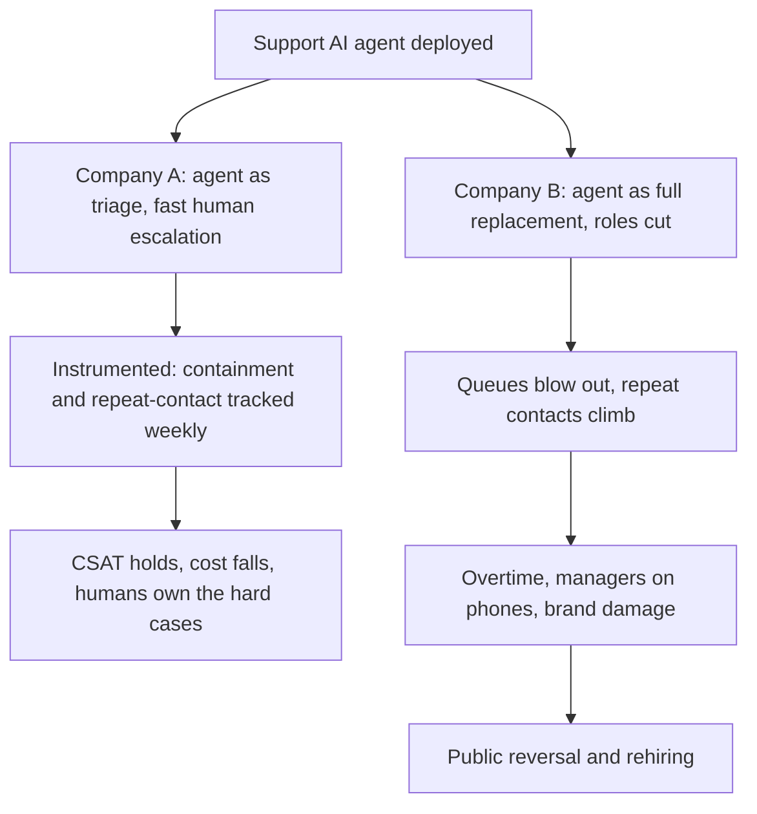
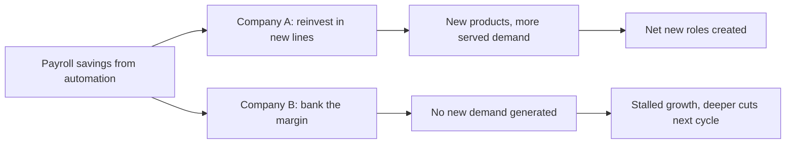

Let me start with the number that ends most of these arguments before they begin.

American tech companies have eliminated **more than 142,000 jobs** 🤯 in the first five months of 2026 — a 33% increase over the same period last year — even as the same employers post record revenues and commit to the largest concentrated infrastructure buildout in tech history.

That is not a recession signal. Recessions don't come with record capex.

I've watched four of these cycles up close — Y2K spend-and-purge, the dotcom unwind, 2008, the cloud migration. This one rhymes with none of them. The firing and the spending are happening in the same memo.

The companies executing the largest cuts are explicitly redirecting payroll savings toward AI infrastructure spending.

**Meta said the quiet part in writing** — the companies executing the largest cuts are explicitly redirecting payroll savings toward AI infrastructure spending, and Meta's internal communications described its May 2026 layoffs as enabling the company to offset the cost of AI investments.

Strip away the press-release language and it's blunt: fire people, buy GPUs with the difference.

## The washing was real — for the first couple of rounds

I'm not going to pretend the cynics were wrong. They weren't. The 2022–2024 cuts wore an AI costume over a post-pandemic hangover.

Oxford Economics concluded in January 2026 that firms "don't appear to be replacing workers with AI on a significant scale," suggesting that some companies may be using artificial intelligence as cover for routine cost-cutting.

Sam Altman, hardly a man with an incentive to talk down AI, conceded: "there's some AI washing where people are blaming AI for layoffs that they would otherwise do, and then there's some real displacement by AI of different kinds of jobs."

Jensen Huang went further and called the whole narrative lazy.

In a recent interview he said that blaming AI for layoffs is "lazy" and that some executives were tying layoffs to AI to "sound smart."

He has a point about the costume. He's wrong about what's underneath it now.

Because the framing shifted this year, and it shifted in a direction that matters. The 2025 cuts were excuses. The 2026 cuts are intentions.

In 2025 Amazon's CEO said he expected the company to shrink its number of white-collar jobs as it invests in AI "agents" over the next few years in search of efficiency gains — the technology is having more of an impact on hiring than layoffs, with companies pulling back as they realise they can do more with less.

That's not retroactive justification. That's a forward operating plan. And the data behind it is now hard:

while 80% of those surveyed who have piloted an AI or autonomous technology reported workforce reductions, the businesses cut jobs due to automation regardless of whether the technology was actually generating returns.

So here's my calibrated position, and I'll defend it in front of any board: **the owners are directionally correct that they can run with far fewer people. They are very often wrong about which people, how fast, and what it costs to get there.** Those two things are not in tension. They're the whole story.

## Right idea, wrong execution — and the graveyard is filling up

Being right about the destination tells you nothing about surviving the journey.

Just one in four AI projects delivers on the return on investment it promised, according to an IBM survey of 2,000 CEOs, and an even smaller portion, 16%, are scaled across the enterprise.

So the move is intuitively right and most attempts still fail. Both true.

Klarna is the cleanest cautionary tale. They went all-in, then walked it back.

While chatbots are cheaper, they're just not as good as humans for some jobs — "as cost unfortunately seems to have been a too predominant evaluation factor when organising this, what you end up having is lower quality."

**The CEO's own words**:

he acknowledged that Klarna overestimated AI's capabilities and underappreciated the human aspects of service delivery, that "we went too far," noting that the focus on efficiency and cost ultimately reduced the quality of the company's offerings and eroded trust with customers.

Commonwealth Bank did the same dance, faster and more publicly.

CBA reversed a decision to cut 45 customer service roles due to new artificial intelligence technology after pressure from the country's main financial services union.

The detail that should haunt every transformation officer:

the bank had told the union its AI agents had been reducing call volumes — but based on feedback from its members, the union disputed the claim.

Call volumes were actually rising. Managers ended up back on the phones. They admitted the redundancy assessment was an error.

These weren't bad ideas. They were good ideas deployed by people who measured cost and forgot to measure quality. The firms that win do the opposite.

The difference isn't the model. Company A and Company B can buy the identical agent. Company A instruments it — containment rate, repeat-contact within seven days, escalation health — and keeps a human bench for nuance. Company B reads the vendor deck, counts heads, and cuts. One compounds. The other ends up on a tribunal docket.

## The savings are real. What you do with them is the test.

There's a second axis where intuition and outcome diverge, and it's the one that decides whether displacement becomes catastrophe or just churn. It's not whether you save the money. It's what you do next.

This is the Jevons logic that Satya Nadella keeps invoking and most CFOs ignore. Cheaper output expands demand if — and only if — you point the savings at something. The firm that banks the margin to flatter one quarter's operating line is the firm doing the next, deeper round of layoffs in eighteen months, because it never built the thing that needed more people.

## The only question that actually matters

Tarry's frame, and I'll hold to it: displacement is coming regardless. The live question is the velocity of replacement. Can we manifest new work faster than we vaporise the old?

The headline forecast is reassuring on paper. The World Economic Forum projects

170 million new roles set to be created and 92 million displaced by 2030, resulting in a net increase of 78 million jobs.

Net positive. Fine. But a net number hides the carnage in the distribution.

That net figure masks enormous sectoral and geographic variation, and the binding constraint is brutally specific:

nearly 40% of job skills are expected to change and 63% of employers cite the skills gap as their primary challenge.

A laid-off support agent in one country is not automatically the big-data specialist a firm needs in another. Net-positive at the planetary level can still mean a lost decade for the individual standing in front of you.

## Job-proofing, without the LinkedIn pablum

So what do you actually tell people? Three routes, all real.

**Be AI-first inside the firm.** Not the person being automated — the person doing the automating. The demand is screaming and unmet. The same companies cutting generalists are posting aggressively for exactly these capabilities, often in the same quarter they let experienced generalists go.

**Start something.** A two-person company with agentic infrastructure now does what took thirty. That's the actual gift of this cycle, and it accrues to founders, not employees.

**Join generation toolbelt — and stop sneering at it.** This is the route the commentariat keeps missing.

More than half of Gen Z workers, 53%, are seriously considering blue-collar or skilled trade work.

And the economics have already flipped:

the median pay for new construction hires rose 5.1% to $48,089, while new hires in professional services earned $39,520 — the fourth year that median annual pay for new construction hires has eclipsed earnings for new hires in both the professional services and information sectors.

An electrician's diagnostic call is not getting automated this decade. A junior analyst's deck already is.

Here's my stake. If I were on the board of a company planning to "do more with far less" this year, I would not block the cuts — the owners are right about the direction and I'd lose that argument anyway. I'd push for one thing instead: no role gets cut until the agent replacing it has run instrumented, in production, for a full quarter, with quality metrics owned by someone whose bonus depends on customers, not on headcount. Klarna and CBA didn't fail because automation can't work. They failed because they fired first and measured never. The owners who survive this will be the ones who were right about the destination *and* humble about the road. That's a much shorter list than the press releases suggest.

* * *

Tarry Singh is the founder and CEO of Real AI (realai.eu), an enterprise AI advisory and deployment firm working with global enterprises on production agent systems, model risk, and AI sovereignty strategy. He also leads Earthscan (earthscan.io) for Energy AI, and is a founding contributor to the EU-funded HCAIM and PANORAIMA programmes for responsible AI education across European universities. He writes at tarrysingh.com.
