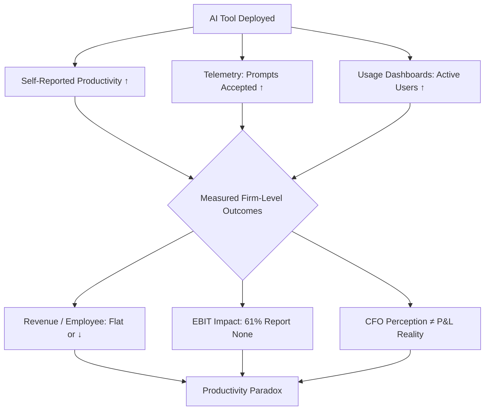

Gartner surveyed employees in Q1 2026 and found that 19 per cent reported no time saved with AI, despite their employers tracking 'hours saved' as the primary success metric. That number sits awkwardly next to the 65 per cent of workers in AI-adopting organisations who say artificial intelligence has improved their productivity and efficiency.

 One of those figures is wrong, or we have discovered a productivity measurement problem so deep it makes the 1987 Solow Paradox look quaint.

Probably both.

For three decades I have watched enterprises measure the wrong things confidently. Y2K remediation hours logged but not system stability. Cloud migration tasks completed but not workload portability. Agile story points burned down but not customer outcomes delivered. The AI productivity conversation in mid-2026 is repeating the same structural error, only faster and with larger cheques written to Satya Nadella.

## What the headline numbers claim

McKinsey's 2026 Global AI Survey reports a median 6.4 hours saved weekly for knowledge workers using production AI agents, a figure echoed across 

Salesforce (6.7 hours), Slack (6.1), Anthropic (7.2), and Microsoft (5.9).

 That convergence is statistically unusual. Or it tells you that everyone is measuring the same category error and calling it data.

Microsoft reports that 58 per cent of AI users say they are producing work they could not have produced a year ago, a claim that collapses the moment you ask what 'work' means and whether the organisation wanted twelve variations of a slide deck or one decision. 

Forrester's commissioned TEI study for Microsoft Copilot estimated a 116 per cent ROI, $19.7 million NPV, and nine hours saved per user per month, for a composite organisation that does not exist and probably never will.

Vendors are not lying. Self-reported time savings, telemetry on prompts accepted, and total-economic-impact models built on idealised deployment paths measure activity, sentiment and optimism. None of the three measures productivity. 

Microsoft provides usage frequency and feature-access data through Copilot admin reports, but those metrics measure adoption rather than value; the fact that a user interacts with Copilot regularly does not demonstrate that those interactions are producing business outcomes that justify the investment.

## The perception-reality wedge in software development

The cleanest controlled evidence comes from coding assistants, where task boundaries are sharp and output is version-controlled. 

A 2025 randomised trial by METR found that experienced developers required 19 per cent more time to complete coding tasks when using AI tools, despite believing they were 20 per cent faster.

 That is a forty-percentage-point perception gap on a measurable task with a defined deliverable.

A multi-company study covering over 5,000 developers found that Copilot increased task completion by 26 per cent (measured by completed pull requests), a 13.55 per cent increase in commits, and a 38.38 per cent increase in builds.

But adoption was never universal: 30 to 40 per cent of developers opted not to adopt Copilot even when access was provided.

 The productivity gain is real for adopters. The adoption ceiling is also real, and no vendor deck mentions it.

A Norwegian public-sector case study analysing 26,317 commits from 703 repositories found no statistically significant change in commit-based activity for Copilot users after adoption, although survey respondents reported subjective productivity gains.

 Translation: developers feel faster; the repository does not agree.

None of this argues against AI-assisted development. It argues that hours-saved and lines-of-code-accepted measure throughput, and throughput without a quality or outcome anchor is just exhaust.

## The firm-level paradox: adoption without impact

McKinsey's November 2025 State of AI survey found that only six per cent of respondents qualify as 'high performers', defined as attributing five per cent or more EBIT impact to AI and reporting significant value, even though 

88 per cent of organisations report regular AI use in at least one business function, but only 39 per cent attribute any EBIT impact to AI.

This echoes the Solow Paradox: adoption is growing, investment is accelerating, but sustained impact on performance is elusive, with 94 per cent of respondents reporting they are not seeing 'significant' value from AI investments.

A March 2026 NBER working paper surveying nearly 6,000 corporate executives across four economies is more precise. 

CFO-reported improvements in labour productivity due to AI are substantially larger than the revenue-based productivity gains implied by observed changes in revenue and employment, with firms in high-skill services (particularly finance) experiencing implied annual labour productivity growth of about 0.8 per cent.

Executives expect productivity gains to grow considerably in 2026, but the wedge between perceived and measured productivity reflects delayed output realisation and quality improvements not yet captured in revenues, a classic productivity paradox.

NVIDIA's State of AI survey found that 30 per cent of respondents cited lack of clarity on AI's ROI as a top challenge, in part because improved productivity can be a subjective measurement for the everyday office worker.

 When half your workforce reports productivity gains and a fifth reports none, and revenue-per-employee stays flat, you do not have a measurement instrument. You have a Rorschach test.

## Why executives keep measuring the wrong thing

The Gartner finding is uncomfortable because it names the silent majority. 

Employees proficient with AI across multiple use cases are twice as likely to be highly productive, 2.3 times more likely to deliver high-quality work, and 3.2 times more likely to drive effective process improvements.

But that proficiency is not evenly spread: 73 per cent of highly productive AI users are managers or executives; individual contributors, who are responsible for the majority of automatable tasks, are often underserved with support and guidance, and AI's benefits remain concentrated at the top.

That distribution explains the measurement gap. Executives experience AI as a cognitive assistant that helps them draft strategy memos, summarise meeting transcripts, and explore scenario branches faster. That feels like productivity, and for senior decision-makers with high autonomy and shallow task dependencies, it often is. 

Microsoft's 2026 Work Trend Index describes this as the 'Transformation Paradox': 65 per cent of AI users fear falling behind if they do not adapt quickly, while only 13 per cent say they are rewarded for reinventing work with AI when short-term results fall short.

The organisation, meanwhile, is a system. Productivity at the system level is output divided by input, and AI currently increases input (more drafts, more meetings summarised, more variants explored) faster than it increases valued output (decisions made, revenue booked, cost structure improved). 

Qatalog's research found that AI adoption hit 80 per cent but focus efficiency dropped to a three-year low of 60 per cent, with collaboration time surging 34 per cent and multitasking climbing 12 per cent. More AI tools created more outputs to manage, more meetings, and less productive time for focused work.

An AI business case should not survive without answers to the questions the vendor deck skips. What decision will we make faster or better? What cost line will move, and by when? What happens to the 19 per cent who report zero time saved: do we train them, move them, or decide their roles were non-productive theatre all along?

## What honest measurement looks like

Gartner recommends that leaders move beyond tracking basic adoption and implement a 'True ROI Index' focused on the depth and diversity of AI use, supported by a central repository for AI use cases to capture lessons learned and minimise duplication.

 Sensible, but incomplete. A use-case repository measures activity. It does not measure whether the use case should exist.

Meaningful Copilot value measurement requires defining specific, measurable use cases before deployment, establishing baseline performance metrics against which Copilot-assisted performance can be compared, and measuring outcomes rather than activity.

 Baseline is the word that vendor ROI studies skip. You cannot measure productivity improvement without knowing what productivity was. And for most knowledge work, we never instrumented it honestly.

The firms seeing real returns share a set of habits the surveys obscure. They measure cycle time and error rate instead of hours saved. 

A Harness case study found a 10.6 per cent increase in pull requests and a 3.5-hour reduction in cycle time after GitHub Copilot adoption, both of which feed velocity and can be cross-checked against sprint delivery and defect escape. They also staff evaluation and governance. 

Gartner forecasts that evaluation and governance will grow from 18–24 per cent of total agent programme budgets today to 28–34 per cent by mid-2027 as audit requirements harden; programmes that defer this investment will face a step-function increase and likely a partial rebuild.

 And they accept that 30–40 per cent of the workforce will not adopt, designing workflows around that fact instead of pretending universal uptake is achievable or desirable.

Deloitte's 2026 State of AI in the Enterprise found that 66 per cent of organisations report productivity and efficiency gains, but benefits thin out considerably after that: 53 per cent cite enhanced insights, 40 per cent report cost reductions, and just 20 per cent say AI has grown revenue.

 Efficiency is the threshold benefit. Revenue growth and competitive differentiation require workflow redesign, which is why productivity gains alone are becoming a distraction from the harder work of organisational redesign; without that redesign, enterprises risk merely implementing marginal improvements to efficiency inside outdated workflows instead of transforming them.

The 19 per cent who report zero time saved are not the problem. They are the signal. They are the workers whose tasks do not compress under autocomplete, whose judgement calls do not parallelise, whose value comes from things the prompt cannot specify. If your productivity measurement cannot see them, your measurement is wrong. The AI programme built on top of it will optimise for the appearance of work rather than the production of value.

---

Tarry Singh is the founder and CEO of Real AI (realai.eu), an enterprise AI advisory and deployment firm working with global enterprises on production agent systems, model risk, and AI sovereignty strategy. He also leads Earthscan (earthscan.io) for Energy AI, and is a founding contributor to the EU-funded HCAIM and PANORAIMA programmes for responsible AI education across European universities. He writes at tarrysingh.com.
