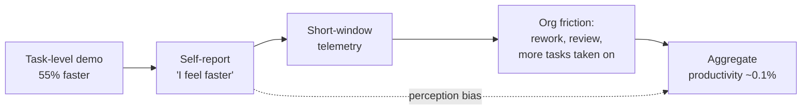

I have sat in enough quarterly reviews to know the tell. When a number is real, someone produces the baseline it was measured against, unprompted, because they are proud of it. When a number is soft, it arrives wrapped in a story about transformation. The AI productivity debate, as it stands in June 2026, is almost entirely the second kind. We have a torrent of percentages and almost no agreed method for producing them.

Two documents from the last three weeks make the problem unusually clean.

The first is a Bank of America research note that landed on 24 May. Its headline is that AI could eventually make us roughly ten times more productive than current data shows. The detail buried underneath is the one that matters: 

the economy is currently showing 0.1%, "a small aggregate effect relative to all the excitement around AI," the bank admitted — a number so small that it barely registers against global growth of 3.5%.

 So the same note that promises a tenfold boom concedes the measured contribution today rounds to nothing. 

The gap between AI's micro-level fireworks and its macro-level footprint is real, documented, and striking: software developers completing 55% more work with AI coding tools, customer support agents resolving 14% more tickets, professional writers finishing projects 37% to 40% faster.

 And yet none of it shows up in the aggregate.

That is not a contradiction the bank can hand-wave. It is the entire subject.

## where the vendor numbers come from

The second document is Microsoft's 28 May blog announcing a redesign of Microsoft 365 Copilot. Skip the marketing and read the footnotes, because the footnotes are an education in how productivity claims get manufactured. 

The product usage figures compare commercial users before and after rollout — for Word, Excel and PowerPoint, that's activity from 8–12 May 2026 versus 1–5 May 2026; for Outlook, daily active usage across a few weeks either side.

 Five trading days against five trading days. 

A separate claim rests on early qualitative research of 8 interviews and 79 survey responses from customers in a feedback programme — findings the company itself flags as "directional" and "not necessarily representative of all Copilot users."

I want to be fair: Microsoft labelled all of this honestly. The footnotes are doing their job. The trouble is that the footnotes never make it into the slide deck a CIO shows the board. The 69% who agreed Copilot improved their speed in the Australian government's own trial — 

the majority of post-use survey respondents agreed Copilot improved the speed at which they could complete tasks (69%) and uplifted the quality of their work (61%)

 — is a perception figure. Useful, but it is people reporting how they feel about a tool, not a stopwatch on output. The same evaluation admits the catch: 

editing was almost always needed to tailor content for the audience or context, thereby reducing total efficiency gains.

This is the measurement problem in one sentence. Almost every impressive AI productivity statistic in circulation is a self-report, a short-window telemetry comparison, or a controlled task that doesn't resemble real work — and the three rarely agree.

## the only randomised trial worth its salt found a slowdown

If you want to understand why I discount the perception numbers, look at the one study built to a clinical standard. METR ran a randomised controlled trial on experienced open-source developers working in their own repositories. 

When developers were allowed to use AI tools, they took 19% longer to complete issues — a significant slowdown — even though they had expected AI to speed them up by 24%, and even after experiencing the slowdown still believed AI had sped them up by 20%.

Read that again, because it is the load-bearing finding in this whole field. People who were measurably slower with AI walked away convinced they had been faster. 

The results reveal a large disconnect between perceived and actual AI impact on developer productivity.

 Every survey that asks "do you feel more productive?" is sampling that bias and reporting it as fact.

Then there is the postscript almost nobody quotes. METR tried to run a follow-up with a bigger pool and newer models, and in February 2026 they had to walk it back. 

They concluded the new experiment gave an unreliable signal, primarily because a significant number of developers refused to participate since they did not want to work without AI — which biases the estimate of AI-assisted speedup downwards.

 Sit with the irony. The honest measurement effort got harder precisely because the tools became habitual. You cannot run a clean control arm when the control condition feels like having a hand tied behind your back. Measurement gets less tractable the more embedded the technology becomes, not more.

## the gap is structural, and the honest research says so

Here is where I part company with the doom narrative as well as the hype. The aggregate number being near zero does not mean the tools are useless. The Atlanta Fed's survey of nearly 750 corporate executives, published in March, names the mechanism directly. 

They document a productivity paradox, in which perceived productivity gains are larger than measured productivity gains, likely reflecting a delay in revenue realisations.

 Same direction as METR, arrived at from the boardroom rather than the IDE. 

Their measured labour productivity gains are positive, vary across sectors, and reflect increases in revenue-based total factor productivity tied to innovation and demand, rather than capital deepening.

 Real, but smaller and slower than the survey enthusiasm implies.

Microsoft's own Work Trend Index, for all its framing, quietly concedes the same point. The genuinely useful disclosure is in the methodology: 

the agent telemetry runs March 2025 through March 2026, with all metrics expressed as shares and ratios — no absolute counts.

 A 15x growth figure with no denominator is not a measurement; it is a shape. And the headline that 

58% of AI users say they're producing work they couldn't have a year ago, rising to 80% among the "Frontier Professionals"

 is, once more, people reporting feelings about their own output.

The most defensible read of all this is unglamorous. AI delivers concentrated, real gains on specific tasks for specific people — strongest, the literature repeatedly finds, for less experienced workers — and those gains then get eaten on the way to the income statement by rework, verification, task-switching, and the simple fact that freed-up time gets filled with more work. The St. Louis Fed's estimate is the one I'd actually plan against: 

GenAI users save roughly 2.2 hours per week, a 5.4% time saving, which drops to 1.4% of total hours when averaged across all workers.

 Modest. Plausible. Boring. Probably true.

## what I'd tell a board

If I were sitting on a board right now and an executive walked in with a Copilot ROI slide, I'd ask three questions and refuse to move until I had answers. What is the baseline, measured how, over what window? Is this output or is it how people feel about output? And what happened to the time we supposedly saved — did it convert to revenue, or did it just get reabsorbed?

Most slides die on the first question. That is not a reason to stop deploying. 

Within organisations implementing AI, 65% of employees say AI has improved their productivity and efficiency

 — and even discounted heavily for self-report bias, that is not nothing. The mistake is treating perception as proof and then capitalising a balance sheet against it. BofA's own arithmetic shows the honest ceiling: 

McKinsey-style estimates suggest that if every eligible task were optimised you'd squeeze out a 0.66% productivity bump, which organisational friction, training deficits and inertia drag down to 0.1% in practice.

I'd bet against anyone claiming a clean, large, measured aggregate productivity gain from generative AI before 2028. Not because the technology fails — because we still have not built the instrument that would prove it either way. Until someone does, the rule holds: when the number is real, the baseline comes with it. Everything else is a story about the future wearing a percentage sign.

---

Tarry Singh is the founder and CEO of Real AI (realai.eu), an enterprise AI advisory and deployment firm working with global enterprises on production agent systems, model risk, and AI sovereignty strategy. He also leads Earthscan (earthscan.io) for Energy AI, and is a founding contributor to the EU-funded HCAIM and PANORAIMA programmes for responsible AI education across European universities. He writes at tarrysingh.com.
