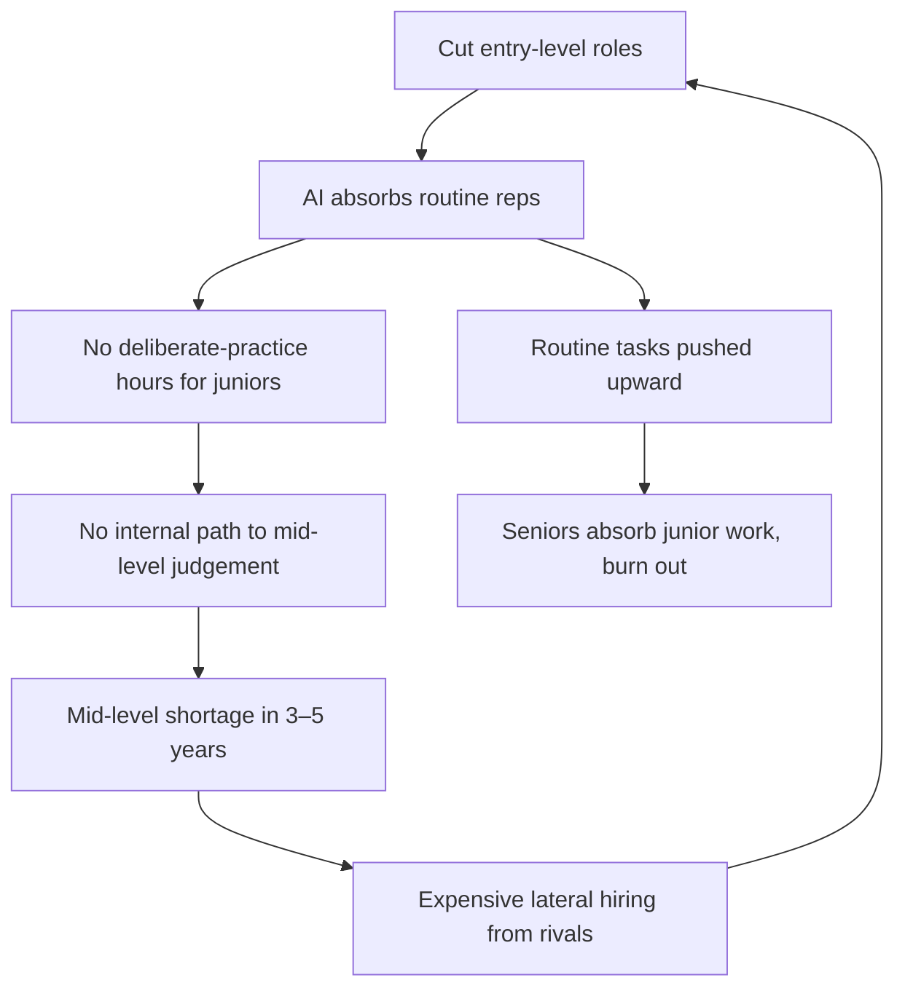

A number landed in late May that should bother anyone responsible for a workforce three years out. In the Oliver Wyman Forum's CFO survey, published roughly two weeks ago, finance chiefs told the researchers that the most common expected change to their workforce shape is a shift toward midlevel roles (41 per cent), followed by senior roles (23 per cent), with only 13 per cent expecting a shift toward more junior roles.

 The consultancy's tidy phrase for what this does to the org chart: 

the traditional finance pyramid is starting to flatten into more of a middle-heavy diamond.

That matches what their CEO sample said a month earlier. Across 415 chief executives, 

43 per cent expect to shift away from junior-level roles over the next two years, up from 17 per cent in 2025.

 A consultancy's survey is a survey. It measures intention, and intention is cheap on a webinar. But the direction is consistent across both samples, and it lines up with what we can see in the layoff data.

## the pyramid was never decoration

The talent pyramid isn't an accident of hierarchy. It's a manufacturing line for judgement. You take a graduate, you give them the boring reps (the document review, the first-draft code, the reconciliation, the call that goes nowhere) and over a few thousand hours those reps compound into the thing we call seniority. Pattern recognition. The ability to smell when a number is wrong before you can prove it. That capacity is earned through deliberate practice on tasks that, individually, look automatable.

Which is exactly why they're being automated first. The new ServiceNow and agent-stack pitch is that routine knowledge work gets absorbed; the entry-level rung is the most exposed because it's the most legible to a model. Fine. But if you remove the rung, you sever the path by which juniors become the mid-level managers the same CEOs say they want more of. The salary saving is the small part.

Gartner's Kaelyn Lowmaster put the mechanism more bluntly than the survey did: 

hire fewer early-career employees and you're essentially outsourcing your talent development to your competitors.

 If you stop growing people in-house, your internal talent pipelines dry up.

 That's the trap. The diamond is stable for about thirty-six months. Then the middle ages out, and there's nothing underneath it.

The WEF's own reporting flags the second-order effect: 

work assumed to be done by AI in early-career roles is simply being pushed upward, leaving middle management and senior talent overextended and increasingly disengaged.

 So the diamond isn't even stable in the present. You've handed your most expensive people the junior workload and called it efficiency.

## the practice problem under the practice problem

This wave differs from previous automation waves in a second way. Juniors lose the reps, and the tool meant to help them may be quietly weakening the muscle those reps are supposed to build.

The MIT Media Lab study that went viral last year (Kosmyna and colleagues, still an arXiv preprint and not yet peer-reviewed, which matters) divided 54 people into ChatGPT, search-engine and brain-only groups for an essay task. 

EEG showed brain-only participants with the strongest, most distributed neural networks; search users moderate; LLM users the weakest connectivity.

 The authors framed it as "cognitive debt" and a likely decrease in learning skills.

 The detail that should worry any L&D head is the crossover: 

when ChatGPT users were forced to write without AI, they performed worse than people who had never used AI at all.

I'd treat the precise effect sizes with caution. Small sample, EEG is a blunt proxy for "thinking," and several of the related studies are unpublished. The sceptics are right to push back. But the directional finding is uncomfortable and well-replicated in spirit: passive offloading reduces the engagement that builds durable skill, while participants with prior brain-only experience used the AI more strategically later. That suggests foundational skill first creates better conditions for productive AI collaboration.

The sequence matters. Build the skill, *then* add the tool. We are, at scale, doing it backwards, handing autocomplete to people who never wrote the function by hand, and calling the output proficiency.

## the centaur tell

A plan to gut junior hiring is a signal that the company has *not* figured out how to deploy AI well.

The firms actually getting returns are doing the opposite. In the same Oliver Wyman data, 

AI ROI leaders are shifting toward junior workers at a higher rate (24 per cent) than those still struggling to see returns (17 per cent).

 The contrarian read is the correct one: if you've genuinely built a human-plus-AI operating model, a centaur instead of an autopilot, junior talent becomes *more* valuable, because someone has to supervise, correct, and exercise the judgement the model doesn't have.

IBM said this out loud in February and is putting headcount behind it, planning to roughly triple US entry-level hiring this year. The CHRO, Nickle LaMoreaux, didn't hedge: 

"and yes, it's for all these jobs that we're being told AI can do."

 The roles are redesigned: junior developers spend less time on standard coding, which AI handles, and more time interacting with customers.

 Her warning is the same as Gartner's: 

companies that gut entry-level pipelines face mid-level shortages in three to five years.

 McKinsey, separately, is planning a 12 per cent increase in North American hiring in 2026 and insists entry-level roles are evolving instead of disappearing.

Whether IBM is right or merely well-marketed, we'll know by 2028. The asymmetry is what matters. Cut juniors and you're wrong: you rebuild a pipeline from scratch at lateral-hire prices. Keep them and you're wrong: you carried some salary cost for two years. Those are not symmetric mistakes.

## the optimists and the cutters

The optimistic camp leans on Forrester's finding that 

57 per cent of generative-AI decision-makers expect AI to increase employment at their organisations.

 Maybe. But the same body of work shows how thin actual capability is. Forrester's "AIQ" readiness measure had only 16 per cent of individual workers scoring high in 2025, predicted to reach just 25 per cent in 2026.

 Skill signalling is racing ahead of skill: LinkedIn reported a 177 per cent increase in AI-literacy skills added by members in the last year, led by ChatGPT and prompt engineering.

 Adding "prompt engineering" to a profile is not the same as judgement.

And the cutters are flying blind on whether any of this pays. Mercer's 2026 talent survey of 825 executives found only 32 per cent believe their companies can effectively combine human labour with AI systems.

 They are pushing hard for AI to deliver returns all the same. Uber's COO admitted the company burned through its annual AI budget in four months and that the link between spend and value "is not there yet."

 GitLab, this month, restructured into what it called "Act 2" for the agentic era, flattening management by up to three layers, exiting 22 countries, and using AI agents to automate reviews and approvals.

 The diamond, in real time.

The WEF and PwC are publishing their full global report on AI and early careers this month, following the Davos briefing. The early data is sobering enough: 

US unemployment among 22–27-year-olds sits at 7.1 per cent, about three points above the overall workforce, and 

19 per cent of the class of 2026 report feeling "very pessimistic" about the job market.

We're optimising the entry rung out of existence at the exact moment the evidence says foundational practice is what makes the tools safe to use, and at the exact moment we can't yet prove the tools pay for themselves. That's not strategy. That's a cost cut wearing a strategy's clothes. Keep the juniors. Redesign the work around supervision and judgement. Make them write the function by hand before you give them the autocomplete. The board that does this looks slow for two years and right for the next ten.

---

Tarry Singh is the founder and CEO of Real AI (realai.eu), an enterprise AI advisory and deployment firm working with global enterprises on production agent systems, model risk, and AI sovereignty strategy. He also leads Earthscan (earthscan.io) for Energy AI, and is a founding contributor to the EU-funded HCAIM and PANORAIMA programmes for responsible AI education across European universities. He writes at tarrysingh.com.
