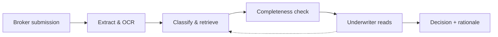

The most defensible AI design pattern in insurance right now is the one where the model does not make the decision.

That is a strong claim, and it has to be defended against a corpus of vendor material that says otherwise. Nearly every RAG-and-agents paper in the last year has drifted toward straight-through underwriting as its endpoint, and every insurance-software vendor's Q2 briefing reaches for the phrase. Read carefully what the deployments actually ship and you find something narrower. The model reads first. It sorts. It flags what is missing. Then a human writes their name against the outcome. Every serious deployment in Japan and Korea I can locate this month runs on this shape.

## Samsung Life, the way it worded the build

On April 5, 2026, Seoul Economic Daily [reported Samsung Life's plan](https://en.sedaily.com/finance/2026/04/05/samsung-life-to-build-ai-underwriting-claims-payment-system) to designate 2026 the first year of its AI transformation, and to build "a structure in which AI-based automatic underwriting and claims payment are organically linked." The sentence sounds like straight-through. Read the sentence that follows in the source. The plan focuses on the data input stage: OCR upgrades to reduce document input errors, database systematisation so the AI can identify and classify claims eligible for automated underwriting. The word that does the heavy lifting is "classify." Not decide. Classify.

Four months later, on August 3, 2026, [Samsung Life adopted the Korea Financial Telecommunications & Clearings Institute's FaceKey biometric service](https://www.asiae.co.kr/en/article/2026080308472474676), the first insurer in the country to do so. The same design pattern applied differently: the model authenticates, and the underwriter or claims officer still decides the payout. The pattern extends further. On September 8, 2026, [Samsung Life patented a system that instantly checks insurance eligibility](https://en.sedaily.com/finance/2026/09/08/samsung-life-patents-system-that-instantly-checks-insurance). A patent for an eligibility check is a patent for a triage function; it is not a patent for automated denial.

Read the whole Samsung Life 2026 stack as one architectural choice. Automate the intake. Instrument the audit trail. Keep the risk decision on the human side of the split.

## Where the machine's work stops

The clearest public expression of the split is the [December 18, 2025 press release](https://www.globenewswire.com/news-release/2025/12/18/3207780/4836/en/Tokio-Marine-HCC-Announces-Strategic-Collaboration-with-Cytora-to-Enhance-Underwriting-Workflow-Efficiency.html) from Tokio Marine HCC's Cyber & Professional Lines Group on its collaboration with Cytora. Read the third paragraph. "All risk interpretation, underwriting insights, pricing, and decision-making remain solely with CPLG's underwriters, ensuring human expertise remains central to the process." Cytora handles the ingestion of submission materials, the extraction and validation of data, the routing of the most promising opportunities to the right underwriter. The underwriter reads second.

Read the broader Tokio Marine Group [DX-Stock reporting for 2026](https://www.tokiomarinehd.com/en/newsroom/release/f5hrqd0000007o7c-att/20260612_DX_Stock_2026_e.pdf), and the same shape appears at group level. One-AI, the group's proprietary generative AI built with PKSHA Technology and Microsoft Japan, has been used more than 2.3 million times in a single division, primarily on document processing, contract management, and inquiry handling. Nowhere in the group's own reporting does that usage cross the line into unassisted underwriting or claims decisioning.

This is not a compromise pattern. It is not an interim step on the road to something more autonomous. It is the pattern that survives the regulatory reading of both Tokyo and Seoul this year, and the pattern that survives the actuarial reading of what LLMs actually do well.

## Why the FSA and the FSC land at the same split

Japan's Financial Services Agency released [Version 1.1 of its AI Discussion Paper on March 3, 2026](https://www.fsa.go.jp/en/news/2026/20260303/aidp.html), titled "Preliminary Discussion Points for Promoting the Sound Utilization of AI in the Financial Sector." The document is careful and its language is deliberate. Explainability is centred. The FSA's expectation, worded plainly, is that a decision reached with the assistance of an AI system be reproducible in a form a supervisor and a customer can both follow. That is a hard constraint for any model that decides on its own. It is a softer constraint for a model that only extracts and classifies. The Version 1.1 revision, built on the FSA AI Public-Private Forum's own findings, sharpens the point rather than softens it.

The Korea Financial Services Commission [opened its AI-Based Insurance Fraud Prevention System Task Force on June 4, 2026](https://www.asiainsurancereview.com/News/View-NewsLetter-Article/id/96225/type/eDaily/Korea-FSC-to-establish-AI-powered-insurance-fraud-prevention-infrastructure), with a September 2026 deadline for the platform-development plan. Read what the task force is asked to build. Not an autonomous denial engine. A comprehensive detection layer that supports "pre-emptive prevention, real-time detection, and post-fraud action," all phrasings that leave the decision on a human's desk. The Financial Supervisory Service's own data, cited in the FSC release, shows insurers paid out 1.16 trillion won on fraudulent claims in 2025; that is the pressure the platform is built against, not the ideology that fixes the split.

Tokyo asks for explainability and lands on the split. Seoul asks for fraud reduction under public trust and lands on the split. Different premises. Same architectural conclusion.

## The stake

The stake belongs here, not at the end. Any pitch a vendor brings to a Japanese or Korean life or non-life insurer this quarter that promises full-cycle decisioning — underwriting, claims adjudication, and payout authorisation all under a single agentic model with no human sign-off — is, on the record, not a compliant deployment. It is also not the pattern the strongest actuarial writing in the field is asking for. The [Society of Actuaries' primer on generative AI for actuaries](https://www.soa.org/resources/research-reports/2024/generative-ai-for-actuaries/) is unambiguous: begin with document-heavy, high-volume work, keep the actuary's judgment on the decision, use the tool as augmentation. Two years later, the [July 8, 2026 arXiv paper on agentic RAG in straight-through underwriting](https://arxiv.org/abs/2607.07858) makes the same call: transparency, auditability, human-in-the-loop governance. Even the paper about straight-through underwriting builds its architecture around the split.

If your architecture depends on the model making the risk call, your architecture is a year ahead of the regulation that has to certify it and roughly the same distance ahead of the actuarial evidence that has to justify it.

## Where a serious disconfirming view sits

EIOPA's [February 2, 2026 survey](https://www.eiopa.europa.eu/eiopa-survey-generative-ai-shows-swift-cautious-adoption-among-europes-insurers-2026-02-02_en) of 347 European insurers is the strongest disconfirming reading in the public record. Nearly two-thirds of respondents report active use of generative AI. Adoption is moving faster than the split-pattern story implies, and a good share of that adoption is inside underwriting-adjacent decision paths. EIOPA warns, correctly, that supervisory attention is not keeping pace. The response is not that the split pattern is wrong. The response is that a share of the adoption inside that survey is running ahead of what the internal controls can defend, and when the first serious loss lands, the split pattern is what the audit trail will reconstruct after the fact.

Better to design it in from the beginning than to reverse-engineer it under a supervisory visit.

## What gets built on the intake side

Four things get built, in this order. First, the extraction layer: OCR that survives handwriting and stamp overlap, entity resolution across the customer's document set, structured JSON on the other side. Second, the classification layer: policy-fit routing, claims-type triage, fraud-risk pre-screen, all with confidence scores logged. Third, the retrieval layer: the model pulls the policy clauses, the reinsurance treaty terms, the medical guidelines, and hands the underwriter or the claims officer a decision-ready packet. Fourth, and this is the part vendors underweight, the completeness check: what documents are missing, what data is stale, what jurisdiction-specific fields the packet cannot fill without a phone call.

Where the underwriter needs more, the retrieval layer runs again against the freshly refined question. That is the feedback loop the dashed arrow in the diagram carries. The pattern makes the loop cheap because the retrieval is grounded in structured extraction rather than free-text prompting into a wall of documents.

[Tokio Marine HCC's own release](https://www.tmhcc.com/en-us/news-and-articles/company-news/tokio-marine-hcc-announces-strategic-collaboration-with-cytora) names three of the four layers explicitly. The Samsung Life build, as reported, names all four. [Sompo's December 2025 group-wide AI plan](https://www.sompo-hd.com/-/media/hd/en/files/news/2025/e_20251226_1.pdf) names them differently, but the shape is recognisable. Where a vendor's pitch skips the fourth layer, the deployment breaks in month six, when the underwriter's queue is full of packets that need one more phone call the model did not know to make.

## The plain summary

The pattern is stable. The intake side of the underwriting or claims workflow is model work. The decision side is human work. The split lives in the extract-and-classify layer, which is where the audit trail begins and where the regulator's file eventually opens. Japan's insurers and Korea's insurers arrived at this arrangement independently. Their regulators, from separate directions, gave them the same permission structure. Vendors will keep describing more autonomous futures. The deployments that ship this year, and the ones that will survive their first supervisory examination in Tokyo or Seoul next year, are the ones that split the work at the intake line and put a named underwriter's signature after the model has done its reading.

---

*Tarry Singh is the founder and CEO of [Real AI](https://realai.eu), an enterprise AI advisory and deployment firm working with global enterprises on production agent systems, model risk, and AI sovereignty strategy. He also leads [Earthscan](https://earthscan.io) for Energy AI startup, and is a founding contributor to the EU-funded HCAIM and PANORAIMA programmes for responsible AI education across European universities. He writes at [tarrysingh.com](https://tarrysingh.com).*
