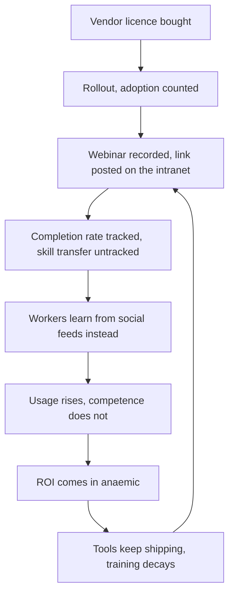

CompTIA released its inaugural AI Skills Tracker on 21 July 2026, surveying more than 1,000 business and technology leaders. The headline reads like every other workforce-readiness report: 80% of professionals use AI tools multiple times per month, but only 29% say they have a high level of familiarity with AI technologies. Standard-issue skills gap. Further down, the report says where that familiarity is coming from: most workers are learning AI on their own rather than through employer-sponsored training, with more than six in ten relying on general social tools, which are disconnected from corporate policies and training priorities and lack any formal way to document or validate skills.

Calling this a training gap is too kind. The honest word is abdication. We have effectively outsourced enterprise upskilling to TikTok, Reddit threads, and whatever prompt-engineering guru has the slickest YouTube thumbnail this week.

No infrastructure budget should depend on that pipeline.

## The arithmetic does not work

The maths here is uncomfortable. 

IDC projects that over 90% of enterprises will face critical AI skills shortages in 2026, representing an estimated $5.5 trillion in unrealised productivity. 

Kyndryl's 2026 People Readiness Report found that just 23% of organisations consider their workforce fully ready for AI, a six-point drop from 2025, even as 57% report AI is already embedded in core business processes. We are deploying faster than we are training. That delta is where the value evaporates.

A 2026 DataCamp study found that 82% of enterprise leaders say their organisation provides some form of AI training, yet 59% still report an AI skills gap. If most firms claim to be training, yet most still report gaps, the training itself is the problem. 

Only 35% of leaders report having a mature, organisation-wide AI upskilling programme; most training is fragmented, optional, and disconnected from actual job tasks.

The incentive structure explains it. A vendor sells you GitHub Copilot or Microsoft 365 Copilot or Anthropic Claude for Business. You roll it out. You count adoption. You do not count *competent* adoption because competent is expensive to measure. Your L&D team runs a few webinars, records them, posts the link on the intranet. Completion rate: 40%. Skill transfer rate: untracked. The tools ship, the training decays, and six months later you are surprised the ROI is anaemic.

A larger share of leaders who reported positive ROI on their investments also reported having more mature AI literacy efforts in place. Training is the difference between a line item and a line of business. But training at scale, proper training with feedback loops and domain adaptation, is a multi-quarter, people-heavy programme. So most firms skip it, deploy the software, and hope usage equals capability.

It does not.

## The Copilot studies are more depressing than the vendor decks suggest

A May 2026 study from Microsoft's Cloud+AI organisation analysed 43 weeks of data from 16,223 software engineers, using engineer fixed effects to compare each engineer against themselves rather than against other engineers. The study design is good. It controls for skill differences and tries to isolate whether Copilot-heavy weeks are productive weeks or merely *busy* weeks where everything ticks up.

Elsewhere, a longitudinal mixed-methods study of 25 Copilot users in a Norwegian public-sector organisation found that individuals who used Copilot were consistently more active than non-users even prior to Copilot's introduction, and did not find any statistically significant changes in commit-based activity after they adopted the tool. The developers *felt* more productive. The commit log disagreed. 

Another study found that developers estimated they were sped up by 20% on average when using AI, meaning they were mistaken about AI's impact on their productivity.

This is not an argument against the tools. 

Controlled experiments show developers completed JavaScript HTTP server tasks 55% faster when using Copilot, and pull request time dropped from 9.6 days to 2.4 days. The productivity is real for well-scoped tasks with tight feedback. But the perception gap is also real, and it matters because perception drives behaviour. If I think I am 20% faster but the data says I am not, I am spending cognitive budget elsewhere, probably on things the tool cannot do, like architectural decisions or cross-team coordination. That is fine if I know it. It is dangerous if I do not.

The deeper risk: research shows that when people use AI assistance, they become less engaged with their work and reduce the effort they put into doing it, offloading their thinking to AI, and it is unclear whether this cognitive offloading can prevent people from growing their skills on the job. 

Studies report developers do not always complete tasks faster due to more time spent crafting prompts and understanding, editing, and debugging AI output, with increased review effort and a role shift from direct production toward assessing and integrating suggestions.

In other words: even when the tool works, you have traded writing code for *editing* code. If you learned to code by editing someone else's mediocre React components, architecture never came up. You learned patch management. Scale that across a few cohorts of juniors and you have a skills hollow in three years.

## who self-directed learning leaves behind

CompTIA's research highlights a growing divide between workers who are proactively developing their career capabilities and those relying on a more casual approach: among respondents who say they are actively building job skills, 47% report a high level of familiarity with AI, compared with 29% overall. Call this the centaur/autopilot split. The centaurs (developers, analysts, product managers who treat the tool as an accelerant) get faster and better. The autopilots get dependent and stall out.

The problem is that you do not get to choose which cohort your organisation builds. If your training is a Slack channel and a Coursera licence, the self-motivated will self-select into competence and everyone else will cargo-cult their way through prompt templates until the next RIF.

TrustedTech's research from mid-July 2026 exposes a workforce fracture that is not driven by aptitude or ambition, but by a near-total failure of employer-led training, with the workers most exposed to AI displacement receiving the least support to adapt. That is a governance failure. If you are deploying tools that reshape half your workflows but your training budget is a rounding error, you are assuming the market will produce the skills for free and your firm will scoop them up later. Maybe. If someone else does not.

I have seen this movie. In 2011 every bank wanted "big data" and "Hadoop" and hired people who had watched three YouTube videos and put Spark on their CV. By 2014 half those projects were written off. The difference now is speed and surface area. The tools are better, the adoption is faster, and the jobs-to-be-done span every function, not just engineering. You cannot hire your way out at this velocity. You train in place or you lose capability in place.

## what works

The most effective enterprise AI upskilling programmes share instructor-led training, which consistently outperforms self-paced content for complex technical skills. Not a revelation. The implementation is where it bites: pair live instruction with job-embedded practice. The content reads "here is how you use Claude to rewrite this SQL query for the production ETL pipeline you already own", instead of "here is how Claude works." Role-specific, task-specific, feedback-heavy.

The most important finding from the AI Skills Tracker is that workers want more practical guidance on how AI applies to their jobs, with respondents expressing the greatest interest in learning about secure usage, doing data analysis, understanding general AI concepts, and using AI to extend core skills of their current or future job roles, training that will help them apply AI in real-world situations. Give them that. Do not give them a MOOC and call it upskilling.

Inside a 10,000-person enterprise, the programme that works looks like this.

**Embed training in workflow, not in the LMS.** Your people will not carve out 4 hours for a course. They will carve out 20 minutes if it solves the problem in front of them. Build a library of job-specific, task-specific playbooks: "Underwriting with AI", "QA test generation", "Customer segmentation for this CRM". Make them short, make them useful, make them discoverable at the moment of need.

**Measure skill transfer, not completion.** If 200 people finish your prompt-engineering module but only 15 start using the techniques in production work, your metric is a lie. Track downstream behaviour: are they using the tools more effectively, are review cycles shorter, are defect rates stable, are they asking better questions in office hours? Measure what matters.

**Ring-fence budget for instructor-led cohorts in high-leverage roles.** Self-paced works for the top quartile. Everyone else needs a human in the loop. Identify your 50–100 highest-leverage roles (senior ICs, team leads, domain experts who multiply across teams), run them through intensive, hands-on cohorts with real projects and real coaching, and turn them into your internal faculty. Let them teach the next layer down. This is how skills scale without collapsing into cargo cult.

The uncomfortable implication: real upskilling at enterprise scale is a five-year, eight-figure programme with executive sponsorship and multi-quarter cycles. It is not a SaaS contract. If that number makes your CFO wince, your alternative is to keep deploying tools into an underskilled workforce and watch $5.5 trillion in productivity walk out the door one unreviewed commit at a time.

Of the two, the five-year programme is the cheaper.

---

Tarry Singh is the founder and CEO of Real AI (realai.eu), an enterprise AI advisory and deployment firm working with global enterprises on production agent systems, model risk, and AI sovereignty strategy. He also leads Earthscan (earthscan.io) for Energy AI, and is a founding contributor to the EU-funded HCAIM and PANORAIMA programmes for responsible AI education across European universities. He writes at tarrysingh.com.
