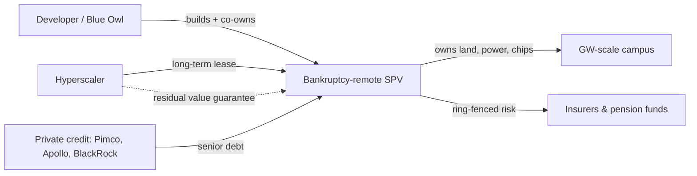

I have watched a few capital cycles up close. The telecom fibre build at the turn of the century. The data-centre wave after 2010. Each had a moment when the spending stopped being a line item in a model and became the whole story. We are past that moment now.

On 20 May 2026, Nvidia reported its fiscal first quarter.

Record revenue of $81.6 billion, up 85% from a year ago, with data-centre revenue of $75.2 billion

— and an $80 billion bump to the buyback authorisation, courtesy of the [company's own filing](https://www.sec.gov/Archives/edgar/data/0001045810/000104581026000051/q1fy27pr.htm). Jensen Huang used the call to do what he does every quarter: raise the ceiling. He put hyperscaler compute spend on a path toward [three to four trillion dollars](https://www.kiplinger.com/investing/live/nvidia-earnings-live-updates-and-commentary-may-2026), framing it with a line as tidy as it is self-serving —

"Compute is profit."

He would say that. Nvidia captures the lion's share of the spend he is forecasting. Take the number as a vendor talking his book, not a fact.

But the broader trajectory isn't his to invent. In the three weeks around that call, the sell-side caught up. Morgan Stanley [lifted its 2026 forecast](https://finance.yahoo.com/economy/articles/david-sacks-says-ai-could-220110765.html) for the five largest spenders:

Amazon, Alphabet, Meta, Microsoft and Oracle now expected to spend roughly $805 billion in 2026, up from a prior $765 billion estimate

. Goldman went the same direction, with economist Elsie Peng writing that [AI spending](https://www.benzinga.com/analyst-stock-ratings/analyst-color/26/05/52778706/ai-capex-800-billion-goldman-2026-forecast) would

boost true capex growth by about 3.3 percentage points in 2026

while adding almost nothing to measured GDP, because much of the equipment is imported and undercounted.

A year ago consensus for 2026 sat near $365 billion. We have roughly doubled the estimate in twelve months. That is not a forecast revision. That is a forecast that lost its anchor.

## the part that should worry a board

Here's what changed, and why it's the actual story rather than the headline number.

For most of the cloud era, hyperscaler capex was funded out of pocket. These companies threw off enough cash to build, buy back stock, and still bank the difference. That arrangement has quietly broken.

Aggregate capex for the big five, after buybacks and dividends, is now above projected cash flows, which forces them to external funding.

Capex is rising faster than the cash coming in the door — the gap that defines the 2026 funding need.

So they are borrowing. And the borrowing has reshaped the investment-grade market. Breckinridge notes that recent issuance pushed [Meta, Alphabet, Amazon and Oracle's](https://www.breckinridge.com/insights/the-price-of-ai-how-capex-is-rewriting-tech-balance-sheets) collective weight in the Bloomberg US Corporate IG Index to

nearly double over the year ending 1 April 2026, from 2.2 percent to 4.1 percent

. The same note states the obvious uncomfortable truth:

issuance is increasing leverage in the near term, because companies must finance buildouts in advance of returns from customers such as OpenAI and Anthropic.

Read that twice. Investment-grade balance sheets are levering up to build capacity whose demand signal rests substantially on two private companies that are themselves loss-making.

## the structure under the structure

The cleverest piece — and the one I'd put under the harshest light if I sat on one of these boards — is that a growing share of the debt never touches the parent balance sheet at all.

The template is the Meta–Blue Owl Hyperion campus in Louisiana.

A bankruptcy-remote special-purpose vehicle called Beignet Investor priced about $27.3 billion of senior secured notes due 2049, rated A+ by S&P in a single-agency 144A-for-life format.

The economics that follow are the point.

The $30 billion did not appear as debt on Meta's balance sheet, which let the company raise a further $30 billion in the corporate bond market shortly afterwards — while retaining 20% of the SPV and the obligation to cover losses if the facility's value falls below a threshold.

This is not fraud. It is project finance, a structure that has funded airports and power plants for decades. But the [Financial Times tally](https://www.techerati.com/features-hub/ais-hidden-price-tag-record-debt-and-off-balance-sheet-financing/) is striking:

more than $120 billion of AI data-centre spending has moved off corporate balance sheets through SPVs funded by investors including Pimco, BlackRock and Apollo.

Morgan Stanley expects [the hyperscalers and their joint ventures](https://www.insurancejournal.com/news/international/2026/02/03/856623.htm) to issue

$250 billion to $300 billion in 2026 alone

.

The flow looks like this, and the shape matters more than any single deal.

The residual value guarantee is the tell. The operator keeps the upside and a slice of equity, hands the construction debt to lenders, and the long-dated paper ends up with insurers matching it against annuity liabilities.

Paul Kedrosky has called deals like Hyperion "speculative finance," citing thin equity cushions around 8–10% and potential obsolescence within five to seven years — if workloads stumble, the parallel is the dark-fibre overbuild of the 1990s.

I lived through that one. The fibre was real, the demand curve was real, and the timing was off by half a decade. Companies died in the gap.

## the NPV problem hiding in the depreciation line

Now the bit that ties spend to value. Every one of these models lives or dies on how long the GPUs earn.

In November 2025, Michael Burry took the niche accounting question mainstream. His argument, [laid out across his posts and picked up by CNBC](https://natlawreview.com/article/deep-quarry-useful-lives-gpus-key-considerations), is that hyperscalers depreciate Nvidia hardware over five to six years while the real economic life is closer to two or three.

He estimated the cumulative impact could exceed $176 billion in understated depreciation and overstated profits for 2026–2028.

By his own arithmetic,

that understatement reaches $176 billion over 2026–2028, with Oracle overstating earnings by roughly 27% and Meta by roughly 21% by 2028.

I don't accept the framing wholesale — the cash left the building when the chip was bought, and depreciation policy doesn't change free cash flow. The counter-case is fair too: a chip that's uneconomic for frontier training can still serve inference for years in a cascade, and the [schedules are audited and defended](https://www.levelheadedinvesting.com/p/are-ai-chips-useful-lives-creating-useless-earnings) with utilisation data. But here's where it gets uncomfortable. Meta already nudged the other way, raising server useful life to 5.5 years, which by reported figures

lowered its depreciation expense by $2.3 billion over the first nine months of 2025.

When you stretch the asset life precisely as you ramp the asset base, the earnings flattery compounds — and the NPV that justifies a 2049 bond rests on assumptions about 2029 hardware nobody can defend yet.

## and the talent line keeps climbing

The third drain is people, and it has gone somewhere I've not seen in thirty years.

Meta launched its Superintelligence Labs hiring spree offering packages worth as much as $300 million over four years, with liquid compensation that vastly exceeded the multi-year vesting structures elsewhere.

The signal case:

Andrew Tulloch reportedly joined Meta on a deal the WSJ valued near $1.5 billion over six years — a description Meta called "inaccurate and ridiculous" without denying the hire.

The median has moved with it. [Levels.fyi data](https://www.levels.fyi/companies/openai/salaries/software-engineer) puts OpenAI software-engineer comp at

$251K at L2 up to $1.22M at L6, with a median package of $555K.

And the same company writing billion-dollar offers is funding them brutally:

Meta laid off 8,000 employees to fund its AI capex.

## where I'd put my stake

I'd bet against the useful-life assumptions holding through 2028 without at least one large impairment. Not because the accounting is fraudulent — it isn't — but because the financing now demands that the chips earn for six years to make the bonds, the leases and the reported margins all true at once, and Nvidia's own annual cadence is the argument against it. You cannot ship Blackwell, then Vera Rubin, then Rubin Ultra in consecutive years and simultaneously insist the 2024 fleet is a six-year asset. One of those two claims is marketing.

If I were on one of these boards, I'd push for the depreciation schedule to be marked to the real product cycle now, take the earnings hit while the multiple can absorb it, and stop pretending the SPV ring-fence makes the residual-value guarantee disappear. The spend may well be justified. The demand may well arrive. But the structures being built around the spend are designed to look safer than the underlying bet, and that gap is exactly where the last two cycles broke.

The fibre got used eventually. It just bankrupted the people who laid it on the early timetable.

* * *

Tarry Singh is the founder and CEO of Real AI (realai.eu), an enterprise AI advisory and deployment firm working with global enterprises on production agent systems, model risk, and AI sovereignty strategy. He also leads Earthscan (earthscan.io) for Energy AI, and is a founding contributor to the EU-funded HCAIM and PANORAIMA programmes for responsible AI education across European universities. He writes at tarrysingh.com.
