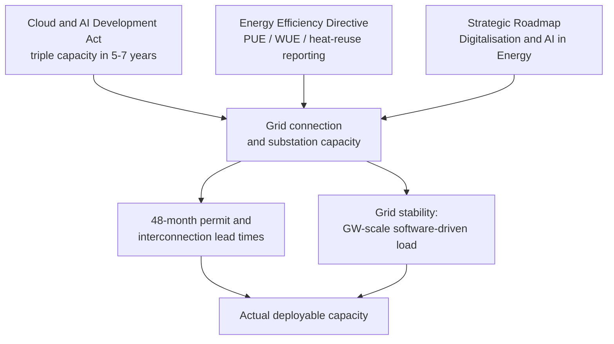

On Wednesday 3 June 2026, the European Commission did the thing it does best. It shipped a package, the European Technological Sovereignty Package.

The Commission presented a set of measures to strengthen Europe's capacity in semiconductors, AI, cloud and open source, including two legislative proposals (the Chips Act 2.0 and the Cloud and AI Development Act) as well as the Open Source Strategy and a Strategic Roadmap for Digitalisation and AI in Energy.

The framing is geopolitical and, for once, honest about the starting position.

The European Union currently relies on non-EU countries for over 80 per cent of key digital products, services, infrastructure and intellectual property.

Von der Leyen's line about not wanting anyone to hold a "kill switch" over Europe's hospitals and grids made the headlines. Fine. I've sat through enough sovereignty speeches to know the speech is the easy part.

The act aims to triple European data centre capacity over the next five to seven years.

Triple. In a region where the average time to obtain a permit and the related environmental authorisations for building a datacentre often lies upwards of 48 months.

I want to be clear about what I think, up front: the tripling target is not a capacity problem dressed as a policy problem. It's a power problem dressed as a permitting problem. I doubt it lands on its stated timeline. Brussels has the will. What it lacks is a route past the substation queue, and no permitting portal clears that.

## the load curve behind the target

Start with the demand the act is chasing.

McKinsey estimates total datacenter demand in Europe will grow from some 10 GW in IT load in 2024 to 35 GW by 2030, with the bulk of this demand increase fuelled by AI, which is why the Commission set the goal to triple the EU's data centre capacity over the next 5-7 years.

The target is the Commission trying to keep pace with a load curve that is already running.

Now the supply reality. The IEA's latest read, published this spring, is not subtle.

Electricity demand from data centres soared by 17 per cent in 2025, well outpacing growth in global electricity demand of 3 per cent, and consumption from data centres is set to double by 2030, with power use from those focused on AI poised to triple.

The agency is blunt about where the friction is: planning and regulatory systems are being stretched by the wave of project applications for data centres, amid a broader trend of rapid load growth and electrification.

The grid operators themselves have stopped being polite about it. ENTSO-E, the body that represents Europe's transmission system operators, published a report at the end of April that reads like a warning shot.

Individual campuses can reach several hundred megawatts, and clusters in concentrated regions can exceed one gigawatt, comparable to the dimensions of European frequency reserves.

A single AI campus is now sized like a chunk of the continent's emergency balancing capacity. And these loads don't behave like a steel mill.

Even when the grid is operating normally, data centres can act as a source of disturbance, because their power consumption is driven by internal software logic rather than external conditions, so the resulting fluctuations are invisible to conventional monitoring and difficult to anticipate in operational planning.

This is the part that gets lost in the sovereignty theatre. Red tape is only half of what slows Europe down. The rest is physics and lead times. Dublin and Amsterdam have had construction moratoriums precisely because local grids hit the wall, and in Ireland datacentres already draw more than a fifth of national electricity. The IEA's diagnosis cuts the other way from Brussels' optimism: even where developers reach for onsite gas to skip the queue, providing reliable onsite gas-fired electricity to meet critical and variable data centre load requires overbuilding onsite generation infrastructure by 30 per cent to 70 per cent relative to demand.

There's no free lane.

## the green strings that fight the speed pledge

The Commission knows the grid is the choke point, which is why the package tries to bribe its way past it.

Reuters noted that data centres built with European-manufactured chips or with reduced energy footprints would qualify for priority grid connections and lower network fees under an expedited permitting pathway proposed by the Commission.

Sensible on paper. Those same green conditions are exactly what slows projects down.

Consider what's already on the statute books. Under the recast Energy Efficiency Directive, data centres with IT power demand of 500 kW or greater must report annually on their energy performance and on the sustainability indicators: Power Usage Effectiveness, Water Usage Effectiveness, Energy Reuse Factor and Renewable Energy Factor.

That reporting cycle just turned. As Sweden's energy agency spells out, reporting in the EU database had to be completed by 15 May 2026, with the data covering the full year 2025.

And the Commission timed a Data Centre Energy Efficiency Package to land alongside the sovereignty package itself.

It introduces a rating scheme for data centres in Europe and launches the work on minimum performance standards.

Germany has gone further and faster. Its Energy Efficiency Act imposes 100 per cent renewable electricity by January 2027, mandatory waste-heat reuse and PUE caps. Good policy for the climate. But every one of those obligations adds cost and calendar time to a build at the precise moment the Cloud and AI Development Act wants shovels moving. You cannot floor the accelerator and stand on the brake and then act surprised that the car lurches.

## the energy roadmap and AI.grids

The most useful document of the three got the least airtime.

Published on 3 June 2026, the Strategic Roadmap for Digitalisation and AI in the energy sector aims to accelerate the rollout of digital solutions, including European sovereign AI models, in areas such as electricity grid optimisation and demand-side flexibility, and it covers the sustainable integration of data centres within the EU energy system.

Translation: make the datacentres themselves part of the grid solution rather than only a load on it.

To its credit, this is being built with the people who actually run the wires.

Fourteen European associations signed a Declaration of Intent and six companies a Declaration of Support, and the event launched the "AI.grids" project to develop EU sovereign AI models together with 48 partners including grid operators and research institutes to improve the management and planning of energy grids.

Co-locating compute with renewables, treating datacentre demand as flexible, mapping grid capacity transparently: these are the levers that matter. They're also slow, unglamorous and dependent on TSO-DSO coordination that has eluded Europe for two decades.

## the interconnection queue

Real AI sits across exactly these decisions for enterprises siting European compute, and permitting is the wrong headline metric. The interconnection queue and the firm-power timeline are the gating items, because that is where projects die quietly. The sovereignty tiers are a separate fight.

Virkkunen has already conceded it will be challenging for US companies to reach the highest sovereignty tiers because the US Cloud Act creates a structural barrier.

That's a defensible industrial-policy choice. Just don't pretend it doesn't narrow the field of who can finance 35 GW.

And the comparison that should sit on every desk in the Berlaymont:

the US is on track to triple its datacentre capacity between 2024 and 2028, adding more than 55 GW of critical IT power.

America is doing in four years what Europe is proposing to attempt in five-to-seven, from a far larger base, with cheaper power and a grid culture that says yes first and litigates later.

Europe needs clean firm power delivered fast, and a grid that treats a one-gigawatt AI campus as a dispatchable asset rather than a guest who keeps tripping the fuses. A faster portal will not do it. The package names the right problems. The substations will decide whether any of it ships.

* * *

Tarry Singh is the founder and CEO of Real AI (realai.eu), an enterprise AI advisory and deployment firm working with global enterprises on production agent systems, model risk, and AI sovereignty strategy. He also leads Earthscan (earthscan.io) for Energy AI, and is a founding contributor to the EU-funded HCAIM and PANORAIMA programmes for responsible AI education across European universities. He writes at tarrysingh.com.
