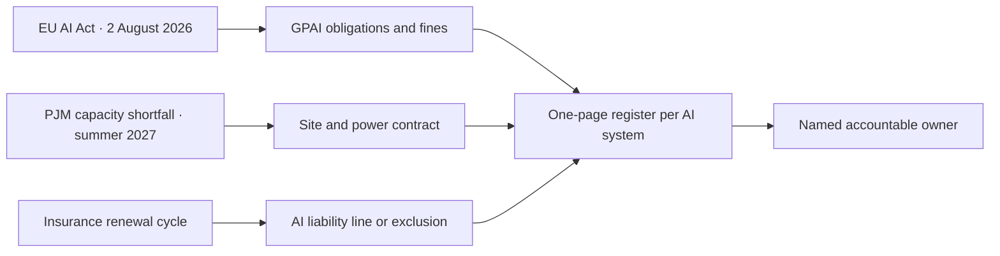

# Three Clocks Ticking on the Same AI Quarter

Forty-six days from this morning, on 2 August 2026, the European AI Office acquires the power to demand documentation from any provider of a general-purpose AI model, run evaluations against published benchmarks, order specific compliance and risk-mitigation measures, and impose fines of up to 3% of global turnover or €15 million, whichever is higher, per [Article 101 of the AI Act as Latham & Watkins reads it](https://www.lw.com/en/insights/eu-ai-act-gpai-model-obligations-in-force-and-final-gpai-code-of-practice-in-place). The schedule was set last year and held intact through the May 2026 Omnibus negotiations. Nothing about the date moved.

Two more clocks are running alongside that one. One belongs to the people who keep the lights on. The other belongs to the people who decide whether your AI program is insurable. Most boards I sit across from are tracking the first with mild concern, glancing at the second, and have no idea the third exists.

## the regulator's clock

Twenty-four model providers have signed the General-Purpose AI Code of Practice: Anthropic, Google, Microsoft, OpenAI, IBM, Mistral, Cohere, Amazon, ServiceNow, Black Forest Labs, Almawave, Aleph Alpha, WRITER, and others, [per MLex's compiled list](https://www.mlex.com/mlex/articles/2372120/ai-developers-see-eu-code-of-practice-confirmed-initial-signatories-released). Meta declined to sign. xAI signed only the Safety and Security chapter. The European Commission is being unusually direct about what this distinction will cost: signing does not exempt you from a fine, but the AI Office will weigh adherence when calibrating sanctions, and [its own guidance](https://artificialintelligenceact.eu/code-of-practice-overview/) treats the Code as the procedural floor for demonstrating compliance.

This is the part most American legal teams are still mishearing as advisory. It is not advisory in any operational sense once the Office can issue formal information requests. If you ship a frontier model into the EU on 3 August and your transparency, copyright, and systemic-risk documentation does not exist in a form an examiner can read in two working days, you are exposed. Six weeks of preparation, on a working-week count, is not a comfortable cushion for a company that has been writing model cards as marketing artefacts rather than regulatory ones.

## the grid's clock

The second clock is harder to wish away.

PJM Interconnection runs the grid from Chicago to the Atlantic and supplies 65 million people. For the first time in its history it came up short in its December 2025 capacity auction, by [6,625 megawatts](https://introl.com/blog/pjm-grid-crisis-6gw-shortfall-data-center-power-2027). Summer 2027 is the first season the operator expects insufficient capacity to meet reliability targets, with data-centre growth outpacing new generation roughly two to one. In ERCOT, [198 gigawatts of large-load applications arrived in Q1 2026 alone](https://www.ascendanalytics.com/blog/large-load-interconnection-queues-data-center-grid-access), more than 70% from data-centre developers. Across the US the [interconnection queue stands near 2,600 GW](https://enkiai.com/data-center/ai-data-center-energy-2026-2600-gw-queue-pjm-plan/), with five-year waits now common.

The IEA has the upstream view. In its [latest analysis](https://www.iea.org/news/data-centre-electricity-use-surged-in-2025-even-with-tightening-bottlenecks-driving-a-scramble-for-solutions), global data-centre electricity consumption grew 17% in 2025, while demand from AI-focused facilities surged 50%. Total data-centre power use is on track to double by 2030; AI-focused demand specifically is on track to triple. Vendor enthusiasm aside, those are the numbers the grid planners are working from.

Water is the under-discussed twin. The 2024 [Berkeley Lab study commissioned by the Department of Energy](https://newscenter.lbl.gov/2025/01/15/berkeley-lab-report-evaluates-increase-in-electricity-demand-from-data-centers/) put US data-centre direct water consumption at 17 billion gallons in 2023, with an additional 211 billion gallons consumed indirectly through the power plants that feed them. Both figures are projected to double or quadruple by 2028. Tom's Hardware compiled the geography that goes with those numbers: [two-thirds of the 809 new US AI data-centre projects announced](https://www.tomshardware.com/tech-industry/most-new-us-ai-data-centers-are-going-up-on-drought-land) sit in regions already classed as drought-stressed. In Phoenix alone, [Inside Climate News documents](https://insideclimatenews.org/news/10042026/texas-data-center-developers-play-offense-on-water-claiming-huge-cuts-in-usage/) projected cooling demand rising 870% over the next decade, from 385 million gallons a year to 3.7 billion.

The politics is where this turns hostile. In early June 2026, Virginia Beach unanimously [barred future large-scale data-centre development](https://goodjobsfirst.org/data-center-moratorium-bills-are-spreading-in-2026/); New York is moving toward a statewide moratorium; Monterey Park looks set to enact California's first city-level ban. These are not marginal jurisdictions. They are the second-tier sites the hyperscalers were planning to use because the first tier (Ashburn, Loudoun, Quincy) is already saturated, politically or physically.

The hyperscalers have heard the message and answered with private power deals. [SMR Intel's running list](https://smrintel.com/nuclear-data-center-deals/) is the map I now hand to boards: Microsoft's $16 billion twenty-year PPA for the 3 Mile Island restart (835 MW from 2027); Amazon's $1.8 billion Talen agreement plus a $700 million X-energy SMR commitment; Google's 500 MW from Kairos; Meta committing up to 6.6 gigawatts across TerraPower, Oklo, Vistra and Constellation. Roughly 9.8 GW of nuclear capacity is now under contract across thirteen announced projects. The earliest meaningful electrons do not arrive until 2027. The grid clock does not care that you have a contract.

## the underwriter's clock

The third clock is the quietest and, I think, the one that will reshape AI governance fastest in the next year.

In April 2025, Armilla wrote the first standalone AI liability policy at Lloyd's of London, syndicated through Chaucer Group. By January 2026 Armilla had raised its limits to [$25 million per organisation](https://ffnews.com/newsarticle/insurtech/armilla-ai-raises-lloyds-backed-coverage-to-25m-as-traditional-insurers-retreat-from-ai-risk/). In February 2026 Armilla and Chaucer launched Vanguard AI, [pairing cyber and technology E&O with the standalone AI line](https://www.armilla.ai/ai-insurance). Testudo opened as a Lloyd's-coverholder MGA in January 2026, focused on mid-market US enterprises. The coverage is contingent on measurable performance. If a deployed model's accuracy drops below the underwritten baseline, the policy can be triggered; the worked example Armilla publishes is a chatbot moving from 95% to 85%.

Every Armilla policy includes independent AI-system certification informed by hundreds of evaluations across regulated industries. The underwriter is, in practice, demanding the eval suite the vendor has been telling you was unnecessary. Traditional general-liability carriers are moving in the opposite direction: AI-specific exclusions are appearing in renewal language across professional indemnity, E&O, and cyber. Coverage is becoming a positive act. You affirmatively buy AI liability, or you discover at the first incident that you are uninsured.

Sitting alongside the insurance market is the standards market. ISO/IEC 42001 is the AI Management System standard that pairs cleanly with ISO 27001 and 9001, and [the NIST community crosswalk](https://www.nist.gov/itl/ai-risk-management-framework) to the AI RMF runs to seventy-two rows. On 7 April 2026, NIST released a concept note for an AI RMF Profile on Trustworthy AI in Critical Infrastructure. The frameworks are converging on the same posture: a documented inventory of AI uses, an evaluation regime mapped to each, a risk register reviewed at board level, and a named accountable owner for each system. ISO 42001 certification is voluntary today. It will be the table-stakes question on the next Lloyd's renewal cycle, and it will probably become the table-stakes question on the next big SaaS RFP too.

## the four-column register

The honest measurement problem in the boardroom is no longer about productivity uplift. It is about whether anyone in the building knows which of their AI systems are exposed to which clock. I have sat in quarterly steering committees where the AI program runs to fourteen slides on capability, one slide on "compliance," and the compliance slide carries a single tick mark against GDPR.

The simplest useful document, and one that should exist before September, is a one-page register mapping every production AI use to four columns. Which GPAI obligation, if any, applies to the model under the EU rules. Which physical site and which power contract supports the workload. Which insurance line carries the residual liability. Which named owner inside the company is accountable for each. Most enterprises cannot produce that page today. The half-finished POCs, the unevaluated agent fleets, the RAG systems no one owns and the prompt sprawl across business units (what I have been calling *AI slop debt*) sit in exactly the gap that the four-column page would expose.

The regulator's deadline is fixed by treaty. The grid's deadline is fixed by physics. The underwriter's deadline arrives at the next renewal. None of those clocks responds to a press release, and none of them moves because your model card got a longer system prompt last week.

---

Tarry Singh is the founder and CEO of [Real AI](https://realai.eu), an enterprise AI advisory and deployment firm working with global enterprises on production agent systems, model risk, and AI sovereignty strategy. He also leads [Earthscan](https://earthscan.io) for Energy AI startup, and is a founding contributor to the EU-funded HCAIM and PANORAIMA programmes for responsible AI education across European universities. He writes at tarrysingh.com.
