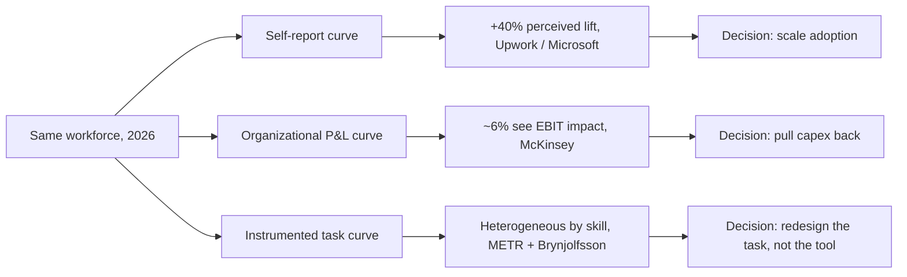

The 2026 productivity literature on AI has reached an unusual condition: the three most credible measurement traditions, applied to roughly the same population of knowledge workers, in roughly the same year, produce conclusions that cannot all be true.

The first tradition is the self-report. Microsoft's [2026 Work Trend Index](https://news.microsoft.com/annual-work-trend-index-2026/), now built on anonymized Microsoft 365 telemetry plus a 20,000-worker survey across ten countries, says that 66% of AI users feel they spend more time on high-value work and 58% say they are producing things they could not produce a year ago. Among the cohort Microsoft calls "frontier professionals" the second number rises to 80%. [Upwork's 2026 In-Demand Skills report](https://investors.upwork.com/news-releases/news-release-details/upworks-demand-skills-2026-demand-top-ai-skills-more-doubles-ai) puts the average self-reported productivity boost among AI-using employees at 40%. If you believed only this curve, you would conclude the diffusion of generative AI is already the largest knowledge-work uplift since the spreadsheet.

The second tradition is the organizational ledger. [McKinsey's State of AI](https://www.mckinsey.com/capabilities/quantumblack/our-insights/the-state-of-ai-how-organizations-are-rewiring-to-capture-value) finds that more than 80% of respondents say their organizations are not seeing tangible enterprise-level EBIT impact from generative AI, with only about 6% reporting meaningful value. [The MIT NANDA initiative](https://fortune.com/2025/08/18/mit-report-95-percent-generative-ai-pilots-at-companies-failing-cfo/) put the share of enterprise generative AI pilots failing to deliver measurable returns at 95%, drawing on 300 deployments and a hundred and fifty leadership surveys. [Gallup's 2026 State of the Global Workplace](https://www.gallup.com/workplace/349484/state-of-the-global-workplace.aspx) cites an NBER survey of executives in the United States, the United Kingdom, Germany and Australia in which 89% of leaders said they had seen no impact of AI on their company's labor productivity over the prior three years. [Daron Acemoglu's task-based macro estimate](https://www.nber.org/papers/w32487), the floor of the credible range, projects total factor productivity gains from AI of less than 0.7 percentage points over a decade. If you believed only this curve, the entire generative AI capex cycle is mispriced by an order of magnitude.

The third tradition is the instrumented field study, where someone actually watches the work happen. [METR's randomized controlled trial of experienced open-source developers](https://metr.org/blog/2025-07-10-early-2025-ai-experienced-os-dev-study/), published in mid-2025, found that AI tools made the participating developers 19% slower on real tasks in their own codebases. The same developers, surveyed after the experiment, believed AI had made them 20% faster. [METR's February 2026 follow-up](https://metr.org/blog/2026-02-24-uplift-update/), using late-2025 tools, found a point estimate of -18% for the original cohort and -4% for newly recruited developers, both with confidence intervals wide enough that the honest answer is "we still do not know." [Brynjolfsson, Li and Raymond's field experiment with 5,179 customer support agents](https://www.nber.org/papers/w31161), now published in the Quarterly Journal of Economics, found a clean 14% average lift in issues resolved per hour, but the gain was concentrated in novice and low-skill workers (+34%) with no detectable improvement for the most experienced. [Anthropic's March 2026 Economic Index](https://www.anthropic.com/research/economic-index-march-2026-report) reports that 49% of US occupations now show at least a quarter of their tasks touched by Claude. Enterprise API traffic runs 75% automated. Consumer traffic runs roughly 52% augmentation and 45% automation. If you believed only this curve, you would conclude that AI moves productivity by task and by skill tier, that the average is meaningless, and that the self-reports are systematically wrong about direction.

None of these traditions is wrong on its own terms. They measure three different things, and the discourse (vendor decks, board presentations, government strategies) treats the three as if they were measuring the same thing.

The curves separate like this.

The first reason these curves diverge is that the self-report measures feeling, not output. Workers reporting a 40% productivity gain are reporting a sense of cognitive relief: fewer blank pages, faster boilerplate, less context switching to look things up. That sense is real, and useful, but it is not the same variable that shows up in EBIT, in tickets-closed, in defects-shipped, in time-to-merge. The METR experiment is the cleanest demonstration of the gap: developers using AI on the same tasks they had done unaided rated themselves 20% faster, while the stopwatch said they were 19% slower. The gap is 40 percentage points wide, in the same person, on the same code. Any productivity claim that does not separate perceived from instrumented is theatre. I will keep saying this until the McKinsey-Microsoft slide stops being repeated in board decks.

The second reason is that the organizational curve is measuring an effect downstream of multiple bottlenecks the model never sees. Microsoft's [accompanying analysis](https://www.microsoft.com/en-us/worklab/work-trend-index/agents-human-agency-and-the-opportunity-for-every-organization) is unusually candid on this point: in their own framing, organizational factors (culture, manager support, talent practices, workflow redesign) account for roughly two-thirds of the variance in realized AI impact, while individual user behavior accounts for about a third. That is consistent with what the MIT NANDA report concluded when it traced its 95% failure rate to organizational mismanagement rather than weak models. Gallup's data adds a sharper edge: manager engagement collapsed from 31% to 22% between 2022 and 2025, and employees whose manager actively supports AI use are 8.7x more likely to report transformed work. Fewer than a third of US employees in AI-implementing organizations describe their manager as providing that support. So the modal enterprise has tools that work, workers who like them, managers who are disengaged, and a P&L that does not move. This is not a model problem. It is a redesign problem, and most enterprises are not staffed for it.

The third reason is that the instrumented curve is honest about heterogeneity in a way the others are not. Brynjolfsson's 14% number, which gets quoted as if it were a universal lift, was an average over a population where junior agents moved 34% faster and senior agents barely moved at all. The Anthropic Economic Index shows the same shape from a different direction: occupations with high task overlap (coding, writing, analysis, customer service) absorb AI fast and visibly, while occupations dominated by physical presence, judgment, or relationship work barely register. [Stanford's 2026 AI Index Economy chapter](https://hai.stanford.edu/ai-index/2026-ai-index-report/economy) tabulates the same pattern: 14% in customer support and 26% in software development. Marketing output shows 50%, while the long tail of work that does not decompose into AI-tractable subtasks shows near zero. The instrumented curve has the most credibility because it does the unglamorous thing of measuring outputs against a baseline, but it is also the curve least likely to be cited at a vendor keynote because the headline number changes by job family, skill tier and tool.

Once you take these three curves seriously as separate measurements of separate things, the discourse stops sounding contradictory and starts sounding diagnostic. The self-report curve tells you whether the workforce has accepted the tools. The instrumented curve tells you whether the tools change the unit of work. The organizational curve tells you whether the firm has redesigned itself around the new unit of work. Those are three sequential gates. Most enterprises are stuck at gate two, with self-report stuck cheerfully at gate one and EBIT waiting at gate three.

This is the honest measurement problem. AI capability is not on trial here, and neither is the legacy operating model. What matters is that the three numbers get reported alongside each other, with the gaps between them treated as the actual managerial signal. A firm where the self-report is high and the instrumented number is flat has a tool adoption story without a productivity story. It has bought morale rather than throughput. A firm where the instrumented number is high and the organizational number is flat has a workflow story without a redesign story. It has bought speed in the parts of the pipeline that were not the binding constraint. A firm where the organizational number has moved without much improvement in the other two has almost certainly cut headcount and called it AI, which is a different thing entirely and should be disclosed as such.

This is also where the centaur-versus-autopilot framing earns its keep. The autopilot bet, meaning full automation of a workflow with agentic systems running end-to-end, is what the Anthropic data is increasingly showing inside enterprise API traffic, where automation runs at 75% of usage. The centaur bet, human plus AI with decision authority retained, is what Microsoft's Copilot telemetry mostly captures, where the model produces a draft rather than a verdict and 86% of users treat AI output as a starting point. These two bets do not show up on the same productivity curve. Autopilot moves the organizational curve and barely touches the self-report curve, because there are fewer humans to ask. Centaur moves the self-report curve dramatically, moves the instrumented curve modestly, and depends on managerial redesign to move the organizational curve. Firms running both bets simultaneously, without separating them in measurement, end up with a portfolio of effects they cannot decompose. The same dashboard ends up averaging two distinct economic regimes, and the average tells you nothing about either one.

The macro picture inherits all of this confusion. Acemoglu's 0.7% over ten years and Goldman's 7% over the same horizon disagree about something other than model capability. The disagreement is about what fraction of work is task-decomposable, how quickly organizations will redesign, and whether the instrumented gains aggregate cleanly. Acemoglu's prior is that organizational redesign is slow, heterogeneity is high, and the median worker is in a job that does not decompose well. Goldman's prior is the opposite on all three. Looking at the gates I described above, Acemoglu's prior matches the data I see in the field: the binding constraint is redesign rather than capability. I think he is more likely right than wrong at the ten-year horizon, even though I expect the next five years to feel faster than his number implies because the self-report curve is moving fastest and the self-report curve is what shows up in headlines. The Stanford AI Index now reports 88% organizational AI adoption but fewer than 10% of organizations having scaled AI in any single business function. That 78-point gap between presence and production is the macroeconomic version of the same measurement problem. Adoption is not deployment, deployment is not throughput, and throughput is not earnings. Each step loses signal, and the loss is where the divergent forecasts live.

The implication for anyone running enterprise AI work in 2026 is sharper than the public discourse admits. The self-reported productivity gain is the wrong lead metric. Vendor case studies that quote only the instrumented curve are worth about as little, and a McKinsey "EBIT not moving yet" finding is a verdict on the org rather than on the models. So instrument the work. Measure a baseline before AI, then measure with-AI on the same task, by the same person, against the same definition of done, and report the gap between perceived and instrumented openly. Then build the redesign muscle inside the firm. That means redesigning the task and the role around the tool rather than procuring more tools, because redesign is what closes the gap between the instrumented gain and the P&L. The firms doing this are not yet visible in McKinsey's 6% bucket because it is early, but they are visible inside their own dashboards and they know who they are.

The deeper risk I want to flag is that we are about to enter the second phase of the AI labor cycle, in which the self-report curve detaches further from the instrumented curve as workers become more confident in their judgments of AI uplift and less able to evaluate them. METR's perception-versus-reality gap looks structural rather than incidental. It is what happens when you work with a tool whose outputs feel competent but whose marginal contribution to your throughput is, at the senior level, frequently negative or zero. The cognitive load of evaluating AI output is itself a tax that the self-report curve does not capture, because the worker is paying it in the same currency they are reporting on. I expect the 2027 and 2028 Microsoft and Upwork surveys to keep reporting higher self-reported lifts even as the instrumented evidence remains messy. The firms that quietly invest in workflow telemetry, meaning their own ground truth owned by the engineering and operations teams rather than a vendor dashboard bought by procurement, will be the ones that distinguish acceptance from throughput, autopilot from centaur, redesign from procurement. The firms that take the self-report curve at face value will produce earnings calls that read like the last decade of digital transformation press releases: heroic, plural and unfalsifiable.

Three curves. Three different decisions implied by each. The only mistake left, after a year of high-quality 2026 data, is to keep pretending they tell the same story.

---

Tarry Singh is the founder and CEO of [Real AI](https://realai.eu), an enterprise AI advisory and deployment firm working with global enterprises on production agent systems, model risk, and AI sovereignty strategy. He also leads [Earthscan](https://earthscan.io), an Energy AI venture, and is a founding contributor to the EU-funded HCAIM and PANORAIMA programmes for responsible AI education across European universities. He writes at tarrysingh.com.
