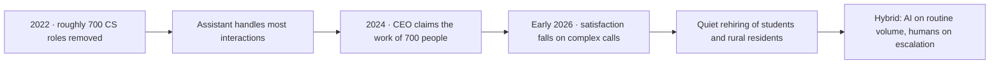

# Two Hundred Million to Study the Wave You're Making

On Wednesday June 10, Anthropic announced a $200 million research commitment and two policy frameworks aimed at the labor consequences of the technology it builds. The headline number is what most coverage seized on: [US News carried it cleanly](https://www.usnews.com/news/business/articles/2026-06-10/anthropic-pledges-200-million-to-research-ais-economic-impact-as-ceo-suggests-job-loss-solutions), [Business Standard a few hours later](https://www.business-standard.com/technology/tech-news/anthropic-pledges-200-million-to-study-ai-s-economic-impact-job-losses-126061100070_1.html). The document itself is more interesting, and you can read it for yourself in [Anthropic's own PDF](https://www-cdn.anthropic.com/files/4zrzovbb/website/9ea607a5dd67c168093829b701f3a0a6d21156d5.pdf). What it does, in plain English, is map three escalating scenarios (5 per cent unemployment, 10 per cent unemployment, and an "unprecedented" tier) and propose policy responses for each, including basic income, sovereign wealth structures, and equity-sharing if labor markets stop clearing.

You can read this two ways. The charitable reading is that a frontier lab is being responsible about externalities most of its competitors will not name. The less charitable one is that the company has now publicly priced in a scenario where its product makes a substantial fraction of office work unnecessary, and is funding the academic apparatus that will help governments respond when that happens. Both readings are true. I find the second more useful for thinking about your enterprise this quarter, because it tells you something the vendor decks will not.

## the gap is now numerical

Strip away the rhetoric and the productivity story in mid-2026 is converging on a single uncomfortable shape. Adoption is wide. Realization is narrow.

[McKinsey's State of AI Trust 2026](https://www.mckinsey.com/capabilities/tech-and-ai/our-insights/tech-forward/state-of-ai-trust-in-2026-shifting-to-the-agentic-era), drawn from roughly five hundred organizations surveyed late last year, puts regular AI use at 88 per cent of respondent firms. Generative-AI use stands at 72 per cent, up from 33 per cent two years earlier. The same survey reports that only about 6 per cent of organizations qualify as "AI high performers", meaning they attribute more than 5 per cent of EBIT to AI use. In developed markets a vanishing 1 per cent of executives describe their gen-AI rollouts as "mature." Almost everyone is using it. Almost nobody is making the numbers move enough to defend in front of an audit committee.

A separate piece of work from the [Atlanta Fed and a coalition of researchers, published as NBER Working Paper 34984](https://www.atlantafed.org/research-and-data/publications/working-papers/2026/03/25/04-artificial-intelligence-productivity-and-the-workforce-evidence-from-corporate-executives) earlier this year, surveyed roughly 750 corporate executives, mostly CFOs, and reached the same shape from the inside. Labor-productivity gains are positive, vary by sector, and are expected to strengthen through 2026, but the paper names what most boards have not yet been told plainly: a "productivity paradox in which perceived productivity gains are larger than measured productivity gains, likely reflecting a delay in revenue realizations." Translated: the people using the tools think they are faster. The income statement does not yet agree. That is the honest measurement problem, restated by 750 CFOs who have no incentive to invent it.

The macro side is duller and more aligned. The [Bureau of Labor Statistics' revised Q1 2026 release](https://www.bls.gov/news.release/prod2.nr0.htm) shows nonfarm-business labor productivity up 0.3 per cent on the quarter and 2.9 per cent on the year. The Q2 number drops on August 6. The trend through 2025 and into 2026 is positive but unspectacular. That is exactly what you would expect if the productivity-paradox literature (Brynjolfsson, Solow) is right and we are still in the install phase of a general-purpose technology, where the model and the model's economic dividend are separated by years of organizational rewiring.

## where the discipline lives, and where it doesn't

The piece of recent work worth your time is the [Stanford Enterprise AI Playbook](https://digitaleconomy.stanford.edu/app/uploads/2026/03/EnterpriseAIPlaybook_PereiraGraylinBrynjolfsson.pdf), by Pereira, Graylin, and Brynjolfsson, published in March. Fifty-one production deployments across forty-one organizations, seven countries, and roughly a million employees in aggregate. The finding that should be on every CIO's office wall: 95 per cent of AI transformation failures trace to organizational factors rather than technology. Workflow mapping before tool selection. Governance from day one. Observability before production. Leadership continuity through the first eighteen months, including through visible failure. None of that is glamorous, and none of it is what the typical vendor deck recommends.

The Stanford team also reports a median productivity gain of 71 per cent for agentic deployments and 40 per cent for high-automation systems. Treat those carefully: vendor-side numbers in spirit, drawn from cases self-selected as successful. The honest reading is that if you do the unglamorous work, the gains are real. If you don't, you join the 22 per cent of agent deployments that arrive at twelve months with negative ROI.

## the klarna reversal

Klarna is the case to remember from 2025-2026. Between 2022 and 2024 the Swedish fintech eliminated roughly 700 customer-service positions and replaced them with an OpenAI-backed assistant that, at peak, the company said was handling two-thirds to three-quarters of customer interactions. CEO Sebastian Siemiatkowski [told the world in 2024 that the AI was doing the work of 700 people](https://www.entrepreneur.com/business-news/klarna-ceo-reverses-course-by-hiring-more-humans-not-ai/491396). By early 2026, with customer-satisfaction scores deteriorating on complex calls, the company quietly began rehiring, targeting students and rural residents, and shifted to a hybrid model where AI handles routine queries and humans handle escalations.

I would not over-extract from one company's experience. The point is not that AI customer service "doesn't work." It is that the production reality is a centaur model (humans on escalation, AI on volume), and that the firms which announced the autopilot version loudest are the ones rebuilding the staff most quietly. The case is also a reminder that "the AI did the work of 700 people" was always a self-report from a CEO with an IPO to walk into, and that the right question to ask of any such claim is: what would the customer-satisfaction time-series look like if you charted it next to the headcount?

## the worker side of the ledger

A piece of evidence that does not get cited often enough sits in [ManpowerGroup's Global Talent Barometer 2026](https://www.manpowergroup.com/en/news-releases/news/global-talent-barometer-2026-ai-use-accelerates-as-worker-confidence-falls-and-job-hugging-takes-hold). Regular AI usage among workers jumped 13 percentage points to 45 per cent. In the same period, confidence in using technology fell 18 points, the first overall decline in worker confidence in three years. The drop was sharpest among Baby Boomers (-35) and Gen X (-25). Fifty-six per cent of the global workforce reported receiving no recent training. Forty-three per cent said they fear automation may replace their job within two years.

That pattern is unhealthy: mass usage in the absence of structured upskilling, with predictable consequences. A workforce that uses a tool more while trusting itself less is not producing centaurs. It is producing operators flying on autopilot they don't understand. And "autopilot you don't understand" is the configuration that, every time it has appeared in any high-consequence industry, has eventually broken expensively. Aviation learned this in the late 1980s with the early glass-cockpit era. Trading floors learned it in 2010. Knowledge work is about to learn it again, more diffusely, with a much longer tail of damage.

## three questions for the next board agenda

These are the questions I would push to the next board agenda this quarter, and I would not accept a vendor case study in lieu of an answer to any of them.

One: show me the instrumented baseline. Not survey data. Not "users say." A measured, pre-AI throughput number for the workflow you are claiming improvement on. If it does not exist, the gain does not exist; what exists is a feeling about a gain.

Two: where in the workflow is the human still doing what the model cannot? Name the escalation path. Klarna eventually named theirs. Most of your deployments still pretend the path is not needed.

Three: what is your training spend per AI-using employee, this year, in money? If the answer is meaningfully smaller than your tool license spend, you are running the ManpowerGroup experiment inside your own company. Treat the 56 per cent no-training figure as a forecast for your own audit findings in eighteen months rather than as a global statistic.

Read correctly, the Anthropic announcement is useful for exactly this reason. A frontier lab has now produced a document that takes seriously the possibility that the technology it sells could remove a meaningful fraction of paid work without a clean substitution path. That is a reason to make sure your deployment includes the workforce you intend to keep, rather than a reason to slow the deployment down.

---

Tarry Singh is the founder and CEO of Real AI ([realai.eu](https://realai.eu)), an enterprise AI advisory and deployment firm working with global enterprises on production agent systems, model risk, and AI sovereignty strategy. He also leads [Earthscan](https://earthscan.io), an Energy AI startup, and is a founding contributor to the EU-funded HCAIM and PANORAIMA programmes for responsible AI education across European universities. He writes at tarrysingh.com.
