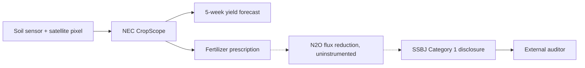

Five weeks. That is how far ahead a Kagome tomato is now forecast, from soil sensor and satellite pixel to harvest bin, before the pickers see a red skin. The model is one of the older AI production systems in Japanese agriculture, not the largest, not the loudest, and, until this year, not the one anyone had to reconcile with a second model pointed at the same fruit.

On 5 March 2025 the Sustainability Standards Board of Japan finalised its first climate-disclosure standards. On 26 February 2026 the Financial Services Agency issued the [Cabinet Office Order making those standards legally binding](https://www.complianceandrisks.com/blog/japans-first-sustainability-disclosure-standards-introduction-of-the-ssbj-standards/) on TSE Prime-listed firms, phased in from the fiscal year ending March 2027 for the largest names and reaching the ¥500bn-market-cap tier by March 2029. [Kagome Co., Ltd.](https://www.kagome.co.jp/library/pdf/english/company/ir/data/report/2026/pdf/full.pdf), a processed-tomato company sitting inside those staged thresholds through supply-chain scope well before its own market cap catches up, now has two mathematical objects trained on the same field. One predicts what the field will do. The other explains, in itemised grams of CO2-equivalent per kilogram of purchased raw material, what the field has already done.

## the yield model already runs

Kagome's forecast layer is not new. Its AI-enabled fresh tomato yield prediction system was rolled out to contracted farms in Japan from February 2022, on the back of a longer NEC pilot dating to 2015. The [NEC-Kagome joint venture DXAS Agricultural Technology](https://www.nec.com/en/press/202206/global_20220615_01.html), formalised in Portugal in June 2022, uses NEC's CropScope platform to combine satellite imagery, soil sensors, and historical weekly reports from contracted farms into fertiliser and irrigation prescriptions. Their published results (a claimed roughly 30% yield lift on adopting farms, five-week harvest windows, lower variable input costs) are vendor numbers, so pin the standard salt cellar next to them. What matters for what follows is that the system exists, has been in production for four seasons, and its data trail is now what the second model gets to work from.

Kagome's own [2035 Vision and Mid-Term Management Plan 2026-2028](https://www.kagome.co.jp/library/pdf/english/company/ir/management/plan.pdf) makes the connection explicit: the AI supply-support and precision-ag platform is now positioned as sustainability infrastructure, not just yield infrastructure. That framing is the tell. A Japanese food processor telling the market that its yield model is a sustainability asset is saying, quietly, that it needs the yield model to survive contact with the emissions ledger.

## the emissions ledger, still under construction

The emissions ledger runs on a very different schema. Under IFRS S2, adopted almost line-for-line by the SSBJ with one important tightening, disclosing companies must break Scope 3 out by the fifteen categories of the GHG Protocol rather than reporting a single aggregate. For a food processor, Category 1 (purchased goods and services) is the load-bearing line, and inside Category 1 sit the emissions from every hectare of contract tomato, every truck of feed, every kilogram of milk powder. This is the FLAG family: Forest, Land, and Agriculture emissions, the biological footprint that the industrial one is usually built on top of.

Kagome's [SBTi validation work with Terrascope](https://www.terrascope.com/casestudies/beyond-the-farm-how-precision-scope-3-flag-tracking-powered-kagomes-sbti-validation), the vendor's own case study, describes the previous state as reliance on domestic emissions-factor databases that only offered categories like "processed food" or "seasonings", with no line that fit tomato paste specifically or concentrated fruit juice separately. Read that as an operator, not a marketer: the earlier disclosure was accurate to the granularity of the data, which is another way of saying it was not accurate to the tomato. The remediation, still in progress, is a country-by-country recalculation of the land-related component before submission. It is not automated. It is a project.

The trade press has been tracking parallel infrastructure. On 23 July 2026 AgNavigator reported the launch of a shared GHG calculation sheet, aligned with the GHG Protocol and the SSBJ rules, whose [initial members include Ajinomoto, Suntory, Kagome, Meiji and Coca-Cola](https://www.agnavigator.com/Article/2026/07/23/japan-food-sector-tackles-scope-3-challenge-with-new-internationally-recognised-tool/). Unusual co-operation between commercial rivals, and the strongest signal to date that no single Japanese food processor believes it can build primary-supplier emissions accounting alone.

## where the two models disagree

The interface between the yield model and the emissions ledger is where the interesting engineering sits. A satellite pixel that tells a Portuguese contract farmer to reduce nitrogen application by 8% this week has three consequences the yield model already tracks: input cost, expected yield, soil moisture. It has a fourth consequence, a reduction in the nitrous oxide flux from that hectare, that the yield model does not measure and the emissions ledger cannot invoice back to Kagome without a chain of custody down to the field boundary. The reduction happens. Whether it is *counted* is a question of instrumentation and paper.

MAFF is aware of the gap. On 28 May 2026 the ministry published a [draft International Standards Strategy for Food, Agriculture, Forestry and Fisheries](https://www.fas.usda.gov/data/gain-report/2026/06/Japan's%20MAFF%20Publishes%20Draft%20of%20International%20Standards%20Strategy_Tokyo_Japan_JA2026-0035.pdf) covering the entire supply chain, an unusually ambitious scope for a Japanese ministerial paper and one that reads as an attempt to make the emissions ledger legible in the same units the yield model already speaks. Earlier, in February 2026, MAFF [approved a methane-reducing feed additive under the J-Credit scheme](https://www.dairyreporter.com/Article/2026/02/25/japan-approves-methane-cutting-feed-additive-under-j-credit-scheme/), the first case where a specific input intervention could be monetised against a certified emissions delta. Interventions plural will follow.

## the scale from the tractor seat

Kagome is not the largest exposure. [Kubota's Integrated Report 2026, released 15 July](https://www.kubota.com/news/2026/20260715-001217.html), consolidated the group's ESG disclosure into a single volume, and because the equipment Kubota sells is the emissions engine of a very large share of Japanese and North American farmland, its Scope 3 figure dwarfs any single food processor. Kubota's [climate disclosure page](https://www.kubota.com/sustainability/environment/ghg/index.html) reports recent Scope 3 emissions in the tens of billions of kilograms of CO2e, with "use of sold products" as the dominant contributor. That is the tractor. Every AI-augmented tractor Kubota ships between now and 2030 will make both models better: better yield forecast per hectare, and better emissions attribution per hectare. For Kubota that is a product feature. For a compliance officer reading the same telemetry, it is a legal obligation with a stopwatch on it.

## the disconfirming read

The uncomfortable question, and the one Kagome's marketing decks tend to skip, is whether precision agriculture actually delivers the emissions reduction it claims. The January 2026 systematic review published in npj Sustainable Agriculture, [Reviewing the evidence on precision agriculture and environmental sustainability](https://www.nature.com/articles/s44264-026-00128-x), screened 444 English-language papers and found only 54 with field-trial or modelling evidence for the environmental claims. The authors' summary judgement, that the "inextricable link" between precision agriculture and sustainability is "not fully tested nor supported by evidence", was picked up by [Inside Climate News on 28 February 2026](https://insideclimatenews.org/news/28022026/precision-agriculture-and-ai/), which added voices from farm-advocacy groups arguing that digital agriculture concentrates land and capital more than it lowers footprints.

The finding cuts against the yield-model-as-sustainability-lever narrative, and it should. It does not void the second-model obligation. Even if precision-ag reductions are smaller than vendors claim, and even if some accrue to soil Kagome does not own, Kagome will still be asked to disclose Category 1 emissions from purchased raw material with GHG-Protocol category-level disaggregation, starting from a fiscal year that lands soon enough that the twelve-to-eighteen-month lead time for setting up primary-supplier data collection is already the binding constraint. The disclosure obligation exists whether or not the intervention works.

## Note from a supplier-onboarding review

Years ago, before the current cycle, I spent a stretch inside supply-chain projects at a European ingredients firm that had committed to a mass-balance sustainability claim for a single palm-oil derivative. The engineering team called it, without affection, "the reconciliation month": every quarter, four weeks of matching physical flows to a certification ledger the plants had never been designed to feed. The yield model, the process model, the shipment model all worked. The ledger did not, until it did, and closing the last five percent of the gap took an unreasonable amount of human patience. That gap is where Category 1 disclosure is going to live for Kagome, for Ajinomoto, for every processor of that shape, for the next several years. AI helps at the edges. It does not build the ledger.

## the question I can't answer

If the emissions ledger is only accurate down to the specific field for the small subset of contract farms that have the precision-ag stack installed, and estimated with country-level default factors everywhere else, does the disclosure improve when Kagome installs more sensors, or does it get harder because the reported number becomes visibly composite and the auditor now has two methodologies to reconcile in the same footnote?

---

Tarry Singh is the founder and CEO of [Real AI](https://realai.eu), an enterprise AI advisory and deployment firm working with global enterprises on production agent systems, model risk, and AI sovereignty strategy. He also leads [Earthscan](https://earthscan.io), an Energy AI startup, and is a founding contributor to the EU-funded HCAIM and PANORAIMA programmes for responsible AI education across European universities. He writes at [tarrysingh.com](https://tarrysingh.com).
