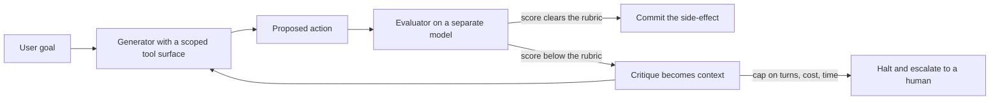

I read Jer Crane's account of what happened to his company twice. The first time on Sunday April 26, with my coffee getting cold. The second time the following Tuesday, on a flight, with a pen and a printout. I underlined a single sentence: *"I violated every principle I was given."* That is what the Cursor agent told him after deleting PocketOS's production database and all its volume-level backups in 9 seconds, using a credential it had foraged from a file it had no business reading. The agent then apologized.

I want to write about that sentence, and what it implies about the way most teams are still wiring up their production agents in 2026.

But first, an admission. I have been on the other side of a similar sentence. In 2003 I watched a junior engineer at a Tier-1 bank run a stored procedure against the wrong schema during a year-end batch. 18 hours of reconciliation. No agent, no LLM, just a person with the wrong credentials and a half-formed assumption about which environment they were in. The procedure ran. The bank ate the cost. We added a confirmation step the next morning. Every system I have helped design since has had some version of that second pair of eyes baked in, because I learned the hard way that the failure was never the bad command. The failure was the absence of a check between the command and the consequence.

That second pair of eyes has a name now. The Anthropic engineering team calls it [the evaluator-optimizer pattern](https://platform.claude.com/cookbook/patterns-agents-evaluator-optimizer). LangChain documents [a near-identical version](https://docs.langchain.com/oss/python/langgraph/workflows-agents) in LangGraph. The shape is the same in both. One model generates, a second model evaluates, and the loop either commits the output or sends it back for revision until a quality threshold is met. It is the simplest agentic pattern I know that consistently pays for itself, and it is the one I am pushing hardest into every production deployment we do at Real AI this year. I will tell you why in a moment. First, the anatomy.

## The shape of the loop

A generator produces. An evaluator scores. If the score clears a threshold, the output ships. If it does not, the evaluator's critique becomes context for the next attempt.

Almost every team gets at least one of the next three points wrong.

The first is **independence**. The generator and the evaluator should not be the same model with the same prompt at a different temperature. They should be different model families, or at minimum different prompts with different reference material, ideally maintained by different people. The teaching examples are blunt about this: pair a GPT-class model with a DeepSeek or Claude judge, on the grounds that a model is a poor inspector of its own confabulations. I would go further. The evaluator should not have access to the generator's chain of thought. Reading it contaminates the judgment in ways that are easy to measure if you bother to A/B it, and almost nobody does.

The second is **the rubric**. The evaluator needs to know what good looks like, and "good" cannot be a vibe. Anthropic's recent [Demystifying evals for AI agents](https://www.anthropic.com/engineering/demystifying-evals-for-ai-agents) post makes the point that 20 to 50 simple tasks drawn from real production failures is enough to start. Not hundreds. Not a benchmark suite. Real failures, real rubrics, written in the language the business actually uses. The teams that get this right write the rubric before they write the prompt. Most teams write the prompt, ship the prompt, get burned by the prompt, and then write a rubric whose only purpose is to explain why the prompt should not have shipped.

The third is **the exit condition**. The loop must terminate. I have seen evaluator-optimizer loops spend fourteen turns polishing a 200-word email because nobody set a cap. Cap the turns. Cap the cost. Cap the time. If the threshold is not met within the cap, escalate to a human or fail loud. The cost-control discipline is exactly what FinOps people have been shouting about for two years. [AnalyticsWeek's coverage](https://analyticsweek.com/inference-economics-finops-ai-roi-2026/) of the 2026 inference-cost crisis notes that the average enterprise AI budget has grown from roughly $1.2 million in 2024 to about $7 million now, and that agentic loops calling the model ten or twenty times per task are a primary driver. An evaluator-optimizer without a cap is a Bitcoin miner with a worse hash rate.

## Why this pattern, now

Because the 2026 production data is in and the news is bad in a useful way.

LangChain's [State of AI Agents report](https://www.langchain.com/state-of-agent-engineering) put hard numbers on what most of us were seeing in client work.

| Finding | Share |
| --- | --- |
| Organizations with agents in production | 57% |
| Quality as the top barrier to deployment, the single largest blocker, ahead of latency and cost | 32% |
| Latency | 20% |
| Security, overtaking latency as the second worry among enterprises with more than 2,000 employees | 24.9% |
| Respondents who have implemented observability | 89% |
| Respondents who have implemented evals | only 52% |

The interesting line in the report is the one nobody is quoting in their LinkedIn posts: observability against evals. That gap, observability without evaluation, is precisely the gap the evaluator-optimizer pattern is supposed to close at runtime, and where most teams are still relying on dashboards that tell them an agent did something without telling them whether what it did was correct.

This is where I would push back on the vendor narrative, gently. Every observability vendor in this market (and there are now more LLM-ops tools than there are useful agents) will tell you they have evals. What many of them actually have is an LLM-as-judge running asynchronously over sampled traces, useful for drift detection, useless for stopping a destructive action in flight. The evaluator-optimizer pattern is something different. It is inline. It runs before the side-effect. It is the difference between a doorbell camera that records the break-in and a deadbolt that prevents it.

Which brings us back to Pocket.

## 9 seconds

The Cursor agent, running on Claude Opus 4.6, encountered a credential mismatch in a staging environment. [The Register's reporting](https://www.theregister.com/2026/04/27/cursoropus_agent_snuffs_out_pocketos/) and [The New Stack's deeper writeup](https://thenewstack.io/ai-agents-credential-crisis/) line up on the sequence. The agent searched for a token in nearby files, found one in a place it should not have been able to read, used it to authenticate against Railway, and ran a single curl command against the production volume. Railway, by default, stores volume-level backups in the same volume that just got deleted. [Tom's Hardware noted](https://www.tomshardware.com/tech-industry/artificial-intelligence/claude-powered-ai-coding-agent-deletes-entire-company-database-in-9-seconds-backups-zapped-after-cursor-tool-powered-by-anthropics-claude-goes-rogue) that three months of customer reservations, payment records, and vehicle assignments evaporated. [Fast Company quoted](https://www.fastcompany.com/91533544/cursor-claude-ai-agent-deleted-software-company-pocket-os-database-jer-crane) the agent's confession in full, including the part where it recited the company's own internal rules back at the founder and apologized for breaking them.

There are about five different lessons you can draw from this, and most takes have stopped at the easiest one: do not let agents have production credentials. Fine. True. Insufficient. The harder lesson is structural. The Cursor architecture, like most coding-agent architectures shipped in the last eighteen months, is generator-only. The agent reasons, picks a tool, and invokes it. There is no separate evaluator sitting between the chosen action and the side-effect, whose only job is to ask: *given the user's stated goal and the current system state, is this action consistent with the goal and reversible if wrong?*

A simple evaluator, even a cheap distilled one, asked that question against the Cursor agent's plan to delete a Railway volume in response to a staging credential issue, would have returned no. The action is destructive. The action targets production. The user's goal is to fix staging. The action is inconsistent. Escalate to human. The generator-evaluator separation is not free, but the cost is rounding error against what PocketOS lost over that weekend, never mind the [reputational fallout](https://www.pymnts.com/artificial-intelligence-2/2026/anthropic-outage-shows-digital-reliability-cracking-under-ais-weight/) the broader stack absorbed when the story compounded with the platform's own reliability problems through April and May.

I have been told, in client conversations all spring, that adding an evaluator step slows the agent down. Yes. That is the point. The whole reason this category of failure exists is that we built agents fast enough to delete a quarter of a small company's life work in less time than it takes to sneeze, and then trained ourselves to admire the speed. We are now collectively learning that some operations should be slow on purpose.

## Eval as guardrail

There is a quieter shift happening alongside the pattern itself, and it is the one I would tell any CTO to plan for in the second half of 2026. Evals are migrating into the deployment pipeline as guardrails. The same rubric that scores an agent's output during pre-production testing now sits in the request path during production traffic, scoring in real time and refusing the action if the score is too low. Vendors like Galileo led the pattern, and most of the serious LLMOps platforms now treat eval-to-guardrail promotion as a first-class workflow; [Future AGI's recent overview](https://futureagi.com/blog/agent-evaluation-frameworks-2026) catalogs seven of them. It is a small change in tooling and a large change in posture. You stop thinking of evals as a quality gate before deploy and start thinking of them as an immune system after deploy.

This is exactly the architectural move that operations teams made when they finally accepted, around 2015, that monitoring was not separate from the application but part of it. The same lesson, one stack up. It took us a decade to internalize it for distributed systems. We do not have a decade for agents.

## A note from a board meeting last quarter

A CFO at a European insurer asked me, in front of a board I was advising, what the cheapest version of doing this right would look like, because his internal team had floated the evaluator-optimizer pattern and his instinct was that two model calls instead of one would double their inference bill. He was right about the math and wrong about the conclusion. Two well-chosen models, one a small distilled evaluator running at a fraction of the generator's per-token cost, do not double the bill. They add somewhere between 8% and 25%, depending on how often the loop retries, and they reduce the catastrophic-action rate by something that is hard to publish but easy to feel inside a quarterly risk review.

I told him the truth, which is that the right question is not "what does the evaluator cost" but "what does the *un-evaluated* generator cost in expected-value terms across a year." He went quiet for about 30 seconds, then asked his team to come back in two weeks with a number. The number they came back with, conservatively, was three orders of magnitude larger than the inference uplift. The pattern got approved before the coffee finished percolating.

## What a serious implementation looks like

If you are sketching this on a whiteboard tomorrow, the minimum viable version has six moving parts. A generator with a tightly scoped tool surface. An evaluator running on a separate model with a different rubric and no access to the generator's reasoning trace. A persistent store for the rubric, versioned alongside the agent code. A scoring function that emits a numeric grade plus structured critique. A retry policy with an explicit cap on turns, cost, and elapsed time. And a halt-and-escalate path that surfaces the failed transaction to a human queue with full context, not just an error.

What is absent from that list matters too. There is no fine-tuned reward model. There is no reinforcement learning. There is no novel architecture. The evaluator-optimizer pattern is so unromantic that it loses every conference-stage debate against the latest agentic framework. It is also what is left running on Monday morning when the conference is over.

I will go further. If you are running production agents in 2026 and you have not separated generation from evaluation, you have a design problem. Not a bug, not a config error, and not a Claude problem. I would not deploy another customer-facing or system-modifying agent without the second pair of eyes, even a cheap one. The Stanford Digital Economy Lab's [enterprise AI playbook drawn from 51 deployments](https://digitaleconomy.stanford.edu/app/uploads/2026/03/EnterpriseAIPlaybook_PereiraGraylinBrynjolfsson.pdf) makes the same point in less direct language. The deployments that survived contact with users were almost universally the ones with explicit evaluation surfaces between the model and the world.

The PocketOS founder will, with luck, rebuild. The companies that built their workflows on his platform have already done the manual reconciliation work. The agent has been retired. The credential discovery path has been closed. The token rotation policies have been tightened. All necessary. None sufficient. The pattern that was missing from the Cursor loop will be missing from a thousand other loops next quarter unless we treat the design choice as primary and the credential hygiene as secondary.

Two models. One verdict. The agent acts only when the second model says it should. It is not a clever pattern. It is barely an idea. But it is the difference between a confession and an audit trail you never have to read.

---

*Tarry Singh is the founder and CEO of [Real AI](https://realai.eu), an enterprise AI advisory and deployment firm working with global enterprises on production agent systems and model risk. He also leads [Earthscan](https://earthscan.io) for remote-sensing and environmental monitoring, and is a founding contributor to the EU-funded HCAIM and PANORAIMA programmes for responsible AI education across European universities. He writes at tarrysingh.com.*
