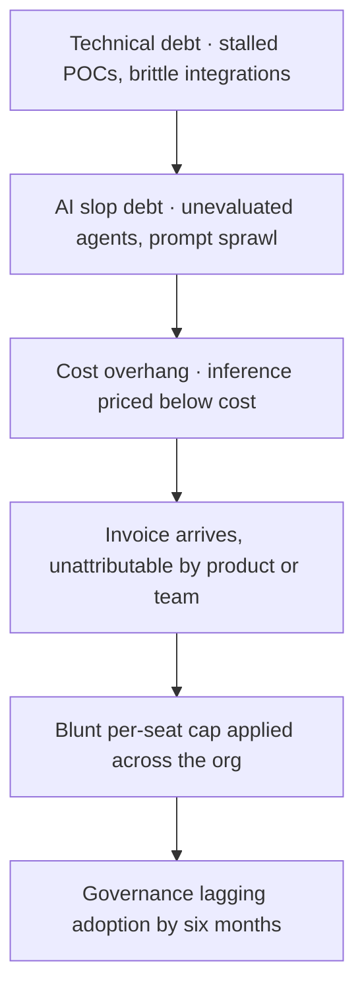

Uber's CTO recently disclosed that the company burned through its entire 2026 AI coding budget in four months.

By April. That single data point, published in [Forbes on 2 July 2026](https://www.forbes.com/sites/jemmagreen/2026/07/02/ai-costs-more-than-the-people-it-replaced/), is the punctuation mark on eighteen months of AI spending that moved faster than any FinOps discipline could follow.

Uber's COO and President, Andrew Macdonald, conceded publicly that token usage didn't seem to correlate directly with useful features shipped to users.

Microsoft, which has invested approximately $13 billion in OpenAI and writes up to 30% of its own code with generative AI, instructed engineers in a major division to stop using an AI coding assistant because the bills became untenable.

One unnamed company, per Axios, ran up a $500 million Claude bill in a single month after management forgot to set a usage cap.

Those failures happened inside organisations with mature FinOps functions and sophisticated treasury operations. Cost governance broke anyway. This is the debt stack: the compounding liabilities accrued when technical debt, AI slop debt, and cost overhang collide in the same fiscal year.

Two years ago, 31% of FinOps teams were managing AI spend. Today that number is 98%.

That shift didn't happen because AI became a boardroom priority. It happened because the invoices arrived and nobody was ready for them.

## The Three-Layer Problem

The debt stack has three surfaces, and each one makes the others worse.

**Technical debt**, the legacy variety, is well understood: unmaintained code, brittle integrations, architecture that nobody dares touch because the team who built it left in 2019. But AI introduces a new variant.

MIT's NANDA initiative reviewed over 300 publicly disclosed AI deployments and found that 95% of enterprise generative AI pilots delivered zero measurable return on the profit-and-loss statement. RAND Corporation reports that more than 80% of AI projects fail, roughly twice the failure rate of conventional IT projects.

Every stalled pilot carries sunk cost.

Gartner projects that 60% of AI projects lacking production-ready infrastructure will be abandoned through 2026, and finds that by the end of last year at least 50% of generative AI projects were already abandoned after proof of concept, due to poor data quality, inadequate risk controls, escalating costs or unclear business value.

What that means in practice is that enterprises now hold a library of half-finished POCs, each one a monument to optimism meeting messy data.

**AI slop debt** is the new middle layer. It includes unevaluated agents, prompt sprawl, and model routing that nobody can audit.

Prompts are quietly becoming enterprise interfaces, but without the governance structures we instinctively apply to data, code or systems. And like data sprawl before it, prompt sprawl creates reliability issues, inefficiency and risk long before leadership realises what is happening.

Governed prompts are repeatable, auditable, and improvable. Ungoverned ones are none of the three.

Half the engineering teams I speak with have no centralised prompt library. They have Slack threads, Notion docs, and individual engineers keeping "their best prompts" in local files.

Amazon built an internal leaderboard called KiroRank to track AI usage among engineering teams. It was quietly taken down after employees began gaming it, burning tokens on meaningless tasks solely to climb the rankings.

The leaderboard governed nothing and gave waste a scoreboard.

**Cost overhang** sits on top of both.

The prices companies are paying for AI usage now are not real prices. OpenAI, Anthropic, Google and Meta are all pricing inference below the cost of serving it, burning venture capital to buy market share. OpenAI spends nearly $2 for every dollar it earns on inference.

Sam Altman admitted publicly that the company loses money on its $200/month subscriptions.

The subsidy model started unwinding this year. In June 2026, the market noticed the gap between what inference sells for and what it costs to serve. Chipmakers lost roughly $1.3 trillion in market value in a single session, the steepest one-day drop for the PHLX semiconductor index since the pandemic crash of March 2020.

The enterprises that staffed entire teams on the premise that $20/month AI subscriptions would fund productivity gains are about to encounter the real cost curve.

Anthropic launched Claude Fable 5 and Mythos 5 on 9 June 2026 at $10/$50 per 1 million tokens, less than half the price of Mythos Preview.

That is a genuine *cut*. It is also inference priced for volume buyers who have already committed millions.

The $20/month flat-fee consumer plans were always priced below what heavy usage actually costs. They are loss leaders designed to drive adoption. Once a real business needs AI at scale, it moves to metered API pricing and burns through credits far faster than flat fees ever suggested.

## The FinOps Reckoning

Many organisations report being asked to self-fund AI investment out of optimisation savings. The pressure lands on engineering: find efficiency gains somewhere in the existing footprint, then redirect them to AI. That squeeze pushes optimisation urgency up even as the traditional waste opportunities run out.

The ask is structurally perverse. Finance wants AI ROI. Engineering wants budget. The solution, as articulated in boardrooms from Singapore to Stockholm, is "optimise the cloud estate to free up capital for AI pilots." But the pilots have a failure rate of 80–95%, the cloud optimisation curve flattened years ago, and the remaining waste is either politically untouchable or technically impossible to remove without re-architecting systems that are already in production. So FinOps teams are caught holding both sides of an equation that does not sum.

AI cost management is now the single most requested skillset in FinOps teams of every size. The spend grew that fast, and nobody is confident about how to allocate it.

But wanting the skillset and having it are different states.

Ask most FinOps or finance teams where their AI spend is going and they'll give you a number but not a breakdown. The spend shows up as a line item (OpenAI, Anthropic, AWS Bedrock, Azure OpenAI), but mapping that back to a product, a team or a business unit is a different problem entirely.

The cost attribution problem in AI is worse than cloud ever was, because the billing unit, the token, has no business-meaningful label attached to it. Nobody ships a "token." You ship a feature. But the invoice counts syllables, not outcomes.

Uber's response, reported in early June, was a hard cap of $1,500 per employee per month per tool, with Claude Code and Cursor capped separately. It is a blunt spending ceiling applied across the org because more granular controls do not yet exist. Capping was the right call. Needing a cap that crude admits governance lagged adoption by six months.

Gartner projects that more than 40% of agentic AI projects will be cancelled by the end of 2027, citing cost overruns, unclear business value, and inadequate risk controls as the primary drivers.

Those cancellations will happen *after* the capital and the engineering quarters have been spent. The debt accrues whether the agent ships or not.

## The Pattern That Keeps Repeating

The board-level tension heading into 2026 is this: enterprises are increasing AI budgets before they have solved AI production discipline. In financial services specifically, NVIDIA's 2026 report indicates that nearly all surveyed organisations expect AI spending to increase or stay flat, with 52% citing operational efficiency as a primary driver.

Big Tech has announced $740 billion in capital expenditure this year, a 69% increase from 2025. Gartner projects AI agent software spending alone will reach $207 billion in 2026, up 139% from the prior year.

That is the numerator. The denominator, proven production-grade AI delivering measurable P&L impact, remains stubbornly small.

The findings, based on a global survey of 1,800 professionals, show a widening gap between AI ambition and reality, one that is now carrying material consequences with up to $143 billion in client revenue at risk in the U.S. alone and talent considering leaving.

I have sat in enough post-mortem sessions to recognise the script. The pilot works in the demo. The data team is confident. Engineering signs off. Then production happens: latency spikes, hallucinations surface, the integration with the ERP system that was supposed to "just work" requires three months of contractor time, and the business owner who championed the project has moved to another role. Six months later, finance asks for the ROI deck, and the only honest answer is "we learned a lot."

According to 2026 industry data, 68% of AI projects exceed their initial budget estimates. The average overrun runs 42% above the original figure.

That is the central tendency, the middle of the distribution rather than its tail. If your AI budget does not include a 40% contingency line, you are planning to fail.

## What Actually Works

The enterprises getting this right remain a minority. They share four disciplines.

**They cap before they scale.**

Uber exhausted its full-year AI coding-tools budget in four months and capped spend at $1,500 per employee per month per tool.

Microsoft began cancelling Claude Code licences across a division by June 30. Both are dated, disclosed decisions at named firms.

Hard caps feel punitive. They are also the only proven pattern that prevents runaway spend when usage-based billing meets unmeasured enthusiasm.

**They route intelligently.**

The reason right-sizing works is that the price difference between tiers is enormous and the capability difference for most tasks is small. As of June 2026, Anthropic's prices per 1 million tokens:

| Model | Input | Output |
| --- | --- | --- |
| Haiku 4.5 | $1 | $5 |
| Sonnet 4.6 | $3 | $15 |
| Opus 4.8 | $5 | $25 |

Peer-reviewed research (RouteLLM, ICLR 2025) showed more than 85% cost reduction on a benchmark while preserving 95% of flagship quality. Production teams report bill reductions of 40–85% from intelligent model routing with no visible quality loss.

Most classification, extraction, and simple summarisation tasks do not require the premium tier. Paying for it anyway is fiscal nihilism.

**They kill bad pilots fast.**

Deloitte's 2026 State of AI in the Enterprise report names this specifically: organisations that have cycled through multiple stalled pilots progressively lose the institutional appetite and cultural momentum needed to complete a production transition. By the third failed pilot, executives stop attending reviews. Champions disengage. The fourth pilot launches into an organization that has already decided, implicitly, that AI does not work here.

The sunk-cost trap is lethal in AI, because the expense compounds monthly. If a pilot has not shown measurable value in 90 days, the correct answer is to stop, document what was learned, and move the capital to something that might work.

**They treat governance as architecture, not policy.**

Prompt governance is the framework of controls, version control, approval workflows, audit trails, and continuous monitoring that manages how prompts instruct enterprise AI systems. It extends data governance discipline to the instruction layer, so AI behaviour stays traceable, approved and reversible.

In 2026, the same governance principles that apply to custom software development now apply to prompt libraries: version control, access control, audit logs, and deployment pipelines.

If you would not deploy code to production without a commit history, do not deploy prompts without one either.

* * *

The debt stack will not resolve itself. The FinOps teams now managing AI spend are inheriting a cost structure built during a subsidy era that is ending, applied to pilots with a failure rate above 80%, compounded by governance gaps that make attribution impossible. The organisations that survive the next twelve months will be the ones that treat AI cost as an architectural concern from day one instead of a line item to optimise after the invoice arrives. The rest will spend 2027 explaining to their boards why they burned a year's budget in a quarter and have nothing in production to show for it.

* * *

Tarry Singh is the founder and CEO of Real AI (realai.eu), an enterprise AI advisory and deployment firm working with global enterprises on production agent systems, model risk, and AI sovereignty strategy. He also leads Earthscan (earthscan.io) for Energy AI, and is a founding contributor to the EU-funded HCAIM and PANORAIMA programmes for responsible AI education across European universities. He writes at tarrysingh.com.
