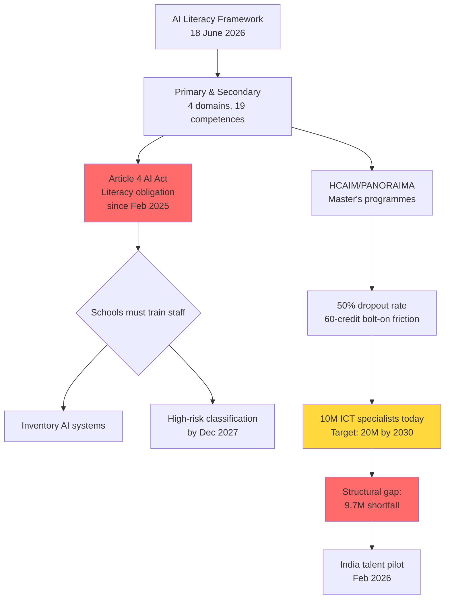

On 18 June, the European Commission and the OECD presented an AI Literacy Framework for primary and secondary education, codifying what has been a free-for-all in European schools since the first student pasted a ChatGPT essay into a submission box. 

The framework organises AI literacy into four domains and 19 competences, and brought together 150 policymakers, educators, and stakeholders in Brussels to announce it. The materials, currently available in English, French, and German, will be available in all 24 official EU languages in July 2026. There are practical classroom examples for primary and secondary levels, and offline and low-tech activities so schools without devices for every student can still teach the material. It is, in structure, the best framework of this type I have seen.

But here is where I become uncomfortable: the framework answers the *what* while dodging the *why* and ignoring the *who pays*. 

68% of teenagers already use AI, yet in 2026, over 60% of Europeans possess basic digital literacy, but in 2025, ICT specialists made up 5% of the total workforce—half of the 10% target in the EU's own Digital Decade strategy. 

The 2030 goal set for the EU is 20 million employed ICT specialists; in 2024, 10.3 million people were employed in ICT specialist occupations, a little over 9.7 million below the target. The skills gap is structural. No framework, however elegant, delivers bodies.

## The Act is live; the curriculum is optional

The AI literacy obligation of Article 4 has applied since 2 February 2025, which means every school using algorithmic admissions, adaptive-learning platforms, proctoring tools, or plagiarism-detection software has been under a legal obligation to train staff since February. 

High-risk requirements for stand-alone high-risk AI systems become applicable on 2 December 2027

—this was delayed by the 

Digital Omnibus approved by the Council on 29 June 2026. But the literacy requirement did not move.

The new framework is not law. It is guidance. It feeds into the upcoming Education Package, planned for later this year, and it supports the Digital Education Action Plan and the Union of Skills. But a school in Sofia or Naples that has yet to inventory which AI systems sit in its back office cannot satisfy Article 4 by downloading a PDF. 

Every month of waiting is a month in which staff work with AI without a framework.

I have spent the last year working with engineering faculties on PANORAIMA— the Pan-European Network for Responsible Artificial Intelligence Multisector Masters, launched on 29–30 January 2025 at HU University of Applied Sciences Utrecht, funded under the DIGITAL-SKILLS-5 call, bringing together 16 organisations—8 universities, 4 research centres and 4 SMEs—to co-design modular curricula and self-standing upskilling/reskilling units aligned to market needs. PANORAIMA builds on 

HCAIM (Human-Centred AI Master's), which started in 2021 and ended in 2024, with consortium members from five EU countries developing a curriculum in human-centred artificial intelligence. 

The 60-credit programme was launched as a complementary master's programme at the Budapest University of Technology and Economics in 2022; 

about 90 students have joined since inception; the number of dropouts is around 50%, as students have to acquire extra credits which often do not fit into their two-year master's degree. The tension is visible: you cannot bolt a responsible-AI module onto an already-compressed master's without paying the ergonomic cost.

The literacy framework solves a prior problem—what to teach at Year 7 before the student reaches a university master's at all. 

The framework is built around four domains: Engage with AI, Create with AI, Manage AI, and Shape AI, covering 'awareness, creative use, responsible decision making, and how AI systems are shaped by human values'. 

Learner expectations are set at basic, intermediate and advanced levels so the same competence can be taught across year groups. That is sensible. What is missing is this: *who teaches it when primary-school teacher training budgets are zero and half the secondary teachers using ChatGPT to mark homework have no technical degree?*

## The 2030 cliff edge is in forty-three months

The EU's Digital Decade targets call for 80% of adults to have at least basic digital skills and 20 million employed ICT specialists by 2030, with increased women's participation. 

At the current pace, the number of ICT specialists will reach just 12 million by 2030. 

In 2025, more than 10 million people in the EU worked as ICT specialists, representing 5% of total employment. 

Women accounted for only 19.5% of ICT employment in 2024. We need to double the current specialist base in forty-three months—and increase it by fifty per cent again to hit twenty million—in an environment where 

Europe does not produce enough graduates in ICT, leading to bottlenecks in the labour market.

The literacy framework is primary and secondary. It does not credential. It does not guarantee a pipeline. 

A draft was opened for consultation in May 2025 and drew feedback from more than 2,000 teachers, education leaders, policymakers, learning designers, researchers and others across over 100 countries. That consultation breadth is admirable. But the Commission knows the mathematics: 

with the increased uptake of AI across virtually all key sectors, skills needs now exceed current workforce projections; the European Legal Gateway Office pilot in India, launched in February 2026, is a step recognising the need for the EU to attract global talent.

If I were on this board, I would redirect half the framework development budget to teacher upskilling at scale and the other half to removing the friction that caused HCAIM's 50% dropout rate. The framework is a public good. But unless there is a funded path from "Shape AI" in Year 10 to a master's track that does not cost students two extra semesters and €15,000 in forgone wages, we are building a front door with no building.

## What the Act actually requires—and what it does not

AI systems used in education and vocational training that determine access, assess learning outcomes, or influence the educational path of individuals fall under the AI Act's high-risk category, specifically under Annex III. 

A university using an AI-powered admissions screening tool to rank applicants based on academic potential constitutes a high-risk system because its output directly affects access to education. 

A remote examination platform deploying facial recognition or behaviour analysis to detect cheating faces obligations around bias testing, human oversight, and user notification. 

Emotion recognition in educational institutions—outside medical or safety purposes—is already prohibited.

The literacy obligation is broader. 

Providers and deployers of AI systems shall take measures to ensure a sufficient level of AI literacy of their staff, taking into account their technical knowledge, experience, education and training and the context the AI systems are to be used in. 

Article 4 entered into application on 2 February 2025; the supervision and enforcement rules apply from 3 August 2026 onwards. 

No direct fines apply for violating the AI literacy requirements under Article 4, but from 2 August 2025, providers and deployers may face civil liability if the use of AI systems by staff who have not been adequately trained causes harm.

There is no requirement to use the OECD framework. 

There is no obligation to measure employees' AI literacy levels, although it is important to record what training has been undertaken. 

The Commission's answer is 'it depends'—on factors such as the role of each organisation in the AI value chain, the risk level of the systems used, and the current knowledge of staff; in many cases, simply asking staff to read an AI system's instructions for use may be ineffective and insufficient.

The framework provides scaffolding. But compliance is organisation-specific. A gymnasieskola in Stockholm using adaptive maths software and a facultad in Granada running algorithmic exam integrity tools face different risk profiles, different vendor relationships, different staff baselines. The framework is generic by design. The compliance burden is particular by law.

## Norway has already moved the other way

Norway moved to restrict the use of generative AI by primary school students in the classroom; the announcement follows a documented drop in students' basic skills, including findings that one in four Norwegian students reads below the OECD minimum threshold for qualification for further education and work. That decision will prove controversial. But it reflects a hypothesis the Commission framework does not test: *does access to generative AI in primary improve or erode foundational literacy?* The Norwegian data suggests erosion.

The framework assumes AI is net-additive and that literacy mitigates risk. I would bet the evidence over the next three years is mixed. We know the European Commission's Working Group on the Ethical Use of AI and Data in Education prepared the 2026 update to the ethical guidelines, last updated 9 June 2026, and that they include clear explanations of the AI Act, GDPR, and the principles of responsible AI use. But we do not yet have longitudinal data on eleven-year-olds whose reading comprehension was scaffolded by a GPT-4 derivative versus those who read unaided text. If Norway's numbers hold, the literacy-first assumption collapses.

## Credentialing is the unanswered question

The Commission and OECD have produced a common framework for AI literacy, outlining desired outcomes for primary and secondary learners. But competences are not credentials. The framework is silent on certification, on portability across Member States, on recognition by employers or higher-education admissions committees. A sixteen-year-old in Kraków who completes "Shape AI" at advanced level has no stackable credential, no micro-credential issued by a recognised awarding body, no ECTS-equivalent module that transfers into the first semester of a bachelor's.

The EU has invested over €288 billion in digital projects. 

The Digital Europe Programme has invested over EUR 294 million to support skilling, upskilling and reskilling initiatives. Yet more than half of EU companies struggle to find employees with the right skills, resulting in vacancies going unfilled. The missing link is not more frameworks; it is a credentialing apparatus that universities, EdTechs, employers, and Member State qualification authorities recognise at the point of decision.

PANORAIMA is testing this at master's level. 

The project develops specialised tracks in Healthcare & Life Sciences, Media & Culture, Law & Compliance, and Management & Finance; next to the delivery of the specialised tracks, self-standing modules will be created to support the reskilling and upskilling of the existing workforce. 

First pilot runs of developed specialisation tracks start in September 2026; full availability including online modules from September 2027. If the dropout rate mirrors HCAIM, half of those who begin will not finish. The economic signal—two years plus friction—is too expensive.

## Where I would put the next euro

Fund teacher AI literacy at ten times current scale. Not principles—technical literacy. Enough that a geography teacher can open the black box on an adaptive-assessment system and understand whether the loss function penalises working-class postcodes.

Remove the ECTS penalty for students adding AI modules to existing programmes. Make it substitutive credit, not additive. HCAIM lost half its cohort to calendar Tetris; PANORAIMA will lose the same unless we fix the incentive.

Credential the framework. Partner with one awarding body per Member State to issue a stackable digital badge at basic, intermediate, advanced. Make it ECTS-equivalent at EQF Level 4. If it does not port into a bachelor's or onto a CV, teenagers will not prioritise it above the subjects their teachers actually assess.

Accept that Norway may be right. Run a controlled trial: two hundred primary schools, half with full generative-AI access, half with restriction, measure reading outcomes over twenty-four months. If the erosion hypothesis holds, we save a generation. If it does not, we have the data to defend deployment.

The 18 June framework is well constructed. It will be translated, downloaded, discussed. It will not, on its own, close the 9.7-million-person gap by 2030. That requires money, faculty time, curriculum substitution, and the political courage to treat skilling as critical infrastructure rather than a conference output. I have defended numbers in front of boards for thirty years. These numbers do not add up—yet.

---

Tarry Singh is the founder and CEO of Real AI (realai.eu), an enterprise AI advisory and deployment firm working with global enterprises on production agent systems, model risk, and AI sovereignty strategy. He also leads Earthscan (earthscan.io) for Energy AI, and is a founding contributor to the EU-funded HCAIM and PANORAIMA programmes for responsible AI education across European universities. He writes at tarrysingh.com.
