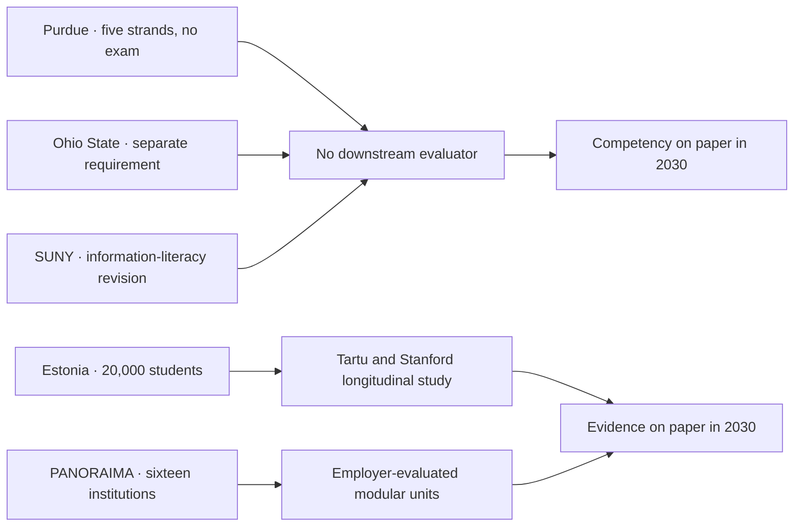

# What Purdue Required, Estonia Already Built

A Berkeley team [published the largest-yet study](https://news.berkeley.edu/2026/05/21/the-largest-study-of-ai-use-by-undergrads-is-in-revealing-disparities-in-access-and-in-cheating/) of how American undergraduates actually use generative AI on May 21. 95,000 students across twenty research-intensive public universities, run inside the University of California system. The numbers got summarised everywhere as a single line: roughly two-thirds of respondents use generative AI, about 40% use it monthly, and at least 9% of users admit to cheating with it. The deans I have spoken to since have read past those numbers to the paragraph nobody is quoting: the access gap is wider than the cheating gap, and separately reported survey work suggests nearly 94% of AI-generated assignments still go undetected.

In January, [Purdue's Board of Trustees](https://www.purdueexponent.org/campus/ai-purdue-trustees-artificial-intelligence/article_789c3eae-70b4-4cbf-b917-b42c43c0d0a4.html) became the first American university to require an "AI working competency" for graduation. Five strands: learning with AI, learning about AI, researching AI, using AI, partnering in AI. 44,000 undergraduates at West Lafayette and Indianapolis will pass through it, embedded into existing coursework, with no standalone exam. Ohio State announced a separate requirement using slightly different language a few months earlier. SUNY rewrote its information-literacy curriculum to include AI in early 2025. The American picture, briefly: most flagship public universities are now writing AI-competency requirements into degree audits without yet having a defensible idea of what "competent" looks like in practice.

That same January, OpenAI launched [Education for Countries](https://openai.com/index/edu-for-countries/). The first cohort named publicly included Estonia, Greece, Italy's Conference of University Rectors, Jordan, Kazakhstan, Slovakia, Trinidad and Tobago, and the United Arab Emirates. Estonia is the most-cited case because Estonia is the only one of the eight that has actually finished rolling out. Around half of the country's 20,000 upper-secondary students are already using a localised ChatGPT Edu platform. [The rest are due to join over the summer](https://www.aicerts.ai/news/openai-in-education-eight-countries-launch-classroom-ai-tools/). Vocational schools follow next academic year. The deployment runs through Estonia's Ministry of Education via an entity called the AI Leap Foundation. It also includes a longitudinal research partnership with the University of Tartu and Stanford to measure what 20,000 students using AI for three years actually learn. That partnership has drawn almost no coverage outside Estonia.

## the missing evaluator

The U.S. higher-education trade press from the past four months carries dozens of pieces about AI-competency mandates. On what universities are actually measuring downstream, it carries close to nothing. Change in writing quality on closed assessments, change in problem-solving on transfer tasks, change in the gap between assessed and instrumented skill: none of it is being reported. The closest serious work is a thin set of randomised controlled trials. A [Harvard study published in Scientific Reports](https://www.nature.com/articles/s41598-025-97652-6) last year found students using a well-designed AI tutor at home learned more, in less time, than in active in-class instruction. An [exploratory RCT in UK secondary classrooms](https://arxiv.org/pdf/2512.23633) ran from May to June 2025, comparing AI tutors to human tutors. Springer recently [published a CustomGPT trial](https://link.springer.com/article/10.1007/s10648-026-10133-8) on self-regulated learning. These are interesting pieces of evidence. They are not yet a measurement regime.

A measurement regime would look like Estonia's: 20,000 students, three years, two research universities running the analysis with pre-registered hypotheses, comparing instrumented usage data against grades, on-task performance, and, if the design team is careful, transfer tasks the students were never coached on. It is not glamorous work. It does not produce a one-line metric a press office can tweet. It is the only thing that will tell anyone, four years from now, whether the current rush to embed AI into school and university curricula did more harm than good. The Tartu side of that partnership is what makes the Estonian rollout worth watching from outside the country; Tartu's education-research group has the methods to detect grade inflation versus genuine learning gains, and the political distance from the Ministry of Education to call out either without losing the contract.

The American mandates have the opposite shape. They are competency requirements without an evaluator. Purdue's five strands describe the inputs (courses, assignments, advisor signoff) without describing the output condition. The Ohio State announcement does the same. The SUNY information-literacy revision does the same. A board can vote yes on any of these without ever being asked the harder question: at the end of four years, what specifically can the graduate do with an AI system that the non-graduate cannot do?

## the european tempo runs slower and lands different

The EU's instrument here is the [AI Continent Action Plan](https://digital-strategy.ec.europa.eu/en/factpages/ai-continent-action-plan), published in April 2025, and its [AI Skills Academy](https://digital-strategy.ec.europa.eu/en/policies/ai-talent-skills-and-literacy), which the Commission has framed as a one-stop training shop with two focal areas: sector deployment of generative AI, and AI-Factory-grade model development. Four sectoral skills academies under the Digital Europe Programme are funded for the 2025-2027 cycle.

Underneath that sit the Human-Centred AI Master's programme and its successor [PANORAIMA](https://www.bme.hu/en/news/241206/bme-vik-gtk-artificial-intelligence-panoraima-project): sixteen institutions, eight universities, four research centres and four SMEs, building specialisation tracks for non-ICT masters in healthcare, media, law, management and finance. Profile and market work ran through 2025. The first pilot tracks open in September 2026. Full availability is planned for September 2027.

The European model is slower and more bureaucratic. It is also building, by design, the assessment infrastructure the American mandates skipped. PANORAIMA's funded workstream includes market analysis, curriculum co-design with employers, and modular upskilling units that can be evaluated against real workforce outcomes rather than self-reported "AI competence." Whether the EU executes against its own design is a separate question. Brussels has a long history of beautiful frameworks and patchy delivery. The framework is the right shape.

The European Commission's communicated ambition is AI training across the bloc at national-population scale by 2030. The exact figure moves between drafts, but the order of magnitude is unambiguous. America's order of magnitude is institutional. A university with 44,000 undergraduates is a large American institution. It is roughly the population of one Estonian upper-secondary year-group, or most of the city of Tartu.

## what a defensible requirement would include

I doubt "AI competency requirements" as currently framed in U.S. higher education will hold up, unless they arrive with a longitudinal evaluation programme attached, funded for at least the length of the cohort. This is the honest measurement problem applied to education: the productivity claims being made on behalf of integrating AI into curricula are mostly self-reported, mostly post-rationalised, and almost never compared against an instrumented baseline. The few rigorous studies that exist point in encouraging but narrow directions and do not yet support the strong policy claims layered on top.

The hard part of this argument is that doing nothing is also wrong. The Berkeley data say two-thirds of students are already using these tools. [Anthropic's Claude for Education](https://www.anthropic.com/news/introducing-claude-for-education) and [OpenAI's ChatGPT Edu with workspace agents](https://www.edtechinnovationhub.com/news/openai-opens-codex-powered-workspace-agents-to-chatgpt-edu-and-teachers-plans) are now standard university procurement items, with credit-based pricing for the OpenAI product live since May 6 of this year. The question is no longer whether students will use these systems. The question is whether the institution will measure what happens after they do.

A defensible requirement would carry three commitments.

1. Pre-register, with an external research partner, the specific outcome you intend to track for the AI-using cohort: transfer-task performance, written-output quality on closed assessments, problem-solving on novel tasks the model was not exposed to.
2. Make AI use disclosed by default in every assignment, and score that disclosure as one of the assessment dimensions rather than as cheating-or-not. A student who shows their AI workings and a student who hides them are different teaching cases; the rubric should reflect that.
3. Fund a no-AI comparison cohort somewhere in the curriculum, as a measurement baseline rather than a withheld-treatment control, since withholding pedagogy from real students is unethical. Without one, the institution will never know what its assessment standards have drifted to.

Estonia is doing roughly that. Purdue and Ohio State are not yet. PANORAIMA is set up to. The American mandates are competency-on-paper. The Estonian and European systems are running the experiment with the measurement attached. Which of these approaches produces the most defensible graduates in 2030 is genuinely unsettled. But the one with only a press release behind it will have the hardest time proving its case.

---

Tarry Singh is the founder and CEO of [Real AI](https://realai.eu), an enterprise AI advisory and deployment firm working with global enterprises on production agent systems, model risk, and AI sovereignty strategy. He also leads [Earthscan](https://earthscan.io) for Energy AI, and is a founding contributor to the EU-funded HCAIM and PANORAIMA programmes for responsible AI education across European universities. He writes at tarrysingh.com.
