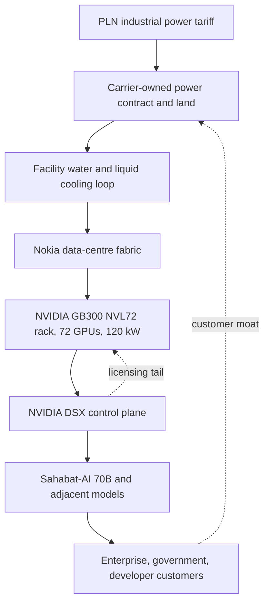

What does a telecommunications operator think it is signing up for when it commits approximately eight hundred million dollars against a gigawatt of AI factory capacity it will not fully operate itself, using a reference architecture it did not design, on industrial electricity subsidised at a level the state has not yet decided to defend for the next decade?

The question is not rhetorical. It is sitting on Southeast Asian carrier boardroom tables this quarter, and the way the different operators answer it varies more than the press releases suggest. The right way in is to read the release closely, then read the specification sheet, then read the tariff schedule the whole thing rests on.

## Read the Zankore release closely

On August 6, 2026, Indosat Ooredoo Hutchison, Ooredoo Group, Nokia and NVIDIA [announced Zankore by Indosat](https://www.nokia.com/newsroom/indosat-ooredoo-group-nokia-and-nvidia-launch-zankore-by-indosat-ready-to-serve-the-region-with-full-stack-ai-infra-platform/), an AI infrastructure platform aiming at one gigawatt of NVIDIA DSX AI Factory capacity, with roughly 200 megawatts online in the first half of 2027 using NVIDIA GB300 NVL72 systems. Ooredoo Group's [own release](https://www.ooredoo.com/en/media/news_view/ooredoo-group-scales-its-ai-compute-ambitions-through-investment-in-zankore-alongside-indosat-ooredoo-hutchison-nokia-and-nvidia/) committed approximately USD 800 million as lead investor. Zankore's [own press page](https://zankore.com/press-release-eng) frames the target inside a claim that this will be one of the region's largest AI factory platforms.

Indosat brings the Indonesian telecommunications footprint, operational capability, and a regulatory relationship a foreign hyperscaler would spend three years earning. Nokia brings the data-centre networking fabric. NVIDIA brings the reference architecture, the accelerator supply allocation, and the AI software ecosystem that runs on top of it. Ooredoo brings the balance-sheet capacity to hold GPU inventory for the decade it will take to depreciate at any reasonable utilisation rate.

Sit with the phrase "NVIDIA DSX reference architecture" for a moment. What the release calls a full-stack platform is, in engineering terms, a rack-scale system NVIDIA specifies from the switch fabric down to the coolant plumbing. Zankore, in that reading, is a licensing arrangement in which the licensee provides land, power contracts, and operating hands. The stack from the GB300 NVL72 rack up through the DSX MaxLPS power-orchestration control plane, which NVIDIA advertises at up to 40 percent more compute inside the same power budget, is not a Zankore design decision. It is a NVIDIA product decision Zankore adopted.

Indosat's own numbers say the demand curve is early but not zero. Its [H1 2026 results](https://technode.global/2026/07/29/indosat-first-half-profit-jumps-49-percent-on-ai-led-growth/) put AI Cloud revenue at USD 33 million for the first six months, already ahead of the USD 28 million booked for all of 2025. That is a real curve. Against an eight-hundred-million capital commitment and a one-gigawatt physical plant, it is also a demand base that has to compound at a pace no telco-owned data-centre business has yet demonstrated at this scale.

## What sits under the "sovereign" label

Read the specification sheet before the strategy note. A single GB300 NVL72 rack integrates 72 Blackwell Ultra GPUs and 36 Arm-based Grace CPUs, drawing [roughly 120 kilowatts and generating around 409,000 BTU per hour of heat](https://pantheon.run/learn/nvidia-gb200-nvl72-power-and-cooling), fully liquid-cooled at 100 percent utilisation with facility water supplied between 30 and 40 degrees Celsius, filtered to 50 microns. The [Lenovo product guide](https://lenovopress.lenovo.com/lp2357-lenovo-nvidia-gb300-nvl72-rack-scale-ai) puts the compute envelope at 1.1 exaFLOPS of FP4 and 20.7 terabytes of HBM3e. NVIDIA advertises up to a fiftyfold uplift over Hopper on inference-heavy workloads. Read that vendor number with a pinch of salt on the benchmark selection.

The physical fact worth holding is 120 kilowatts per rack in a tropical climate, on a grid whose spare industrial capacity is a policy variable. A 200 MW first phase is, in rack terms, roughly 1,600 GB300 NVL72 systems. At full 1 GW target, it is on the order of 8,000 racks. That is a manufacturing pipeline, not a data centre in the sense a colocation planner would use the word. It is instrumented compute on an industrial-plant time-scale, run by a workforce most Southeast Asian carriers have never had to hire.

The word "sovereign" gets a lot of work in these releases. It sits under the label the way a leased factory sits under the licensee's letterhead: the ground and the workforce are local, the drawings are not. The [Tech For Good Institute's piece on the sovereignty trap](https://techforgoodinstitute.org/insights/perspectives/the-sovereignty-trap-our-own-ai-may-leave-southeast-asia-weaker/) argues, on grounds any carrier engineer will recognise, that full-stack AI sovereignty is structurally infeasible for all but the largest powers. What a Southeast Asian carrier can buy is operating control, not architectural independence. Whether that trade is worth USD 800 million depends on where the residual demand and residual risk sit.

Read the diagram twice. The solid lines are what the carrier physically owns and staffs. The dotted lines are the licensing dependency and the customer moat. Layers B, C and H are the carrier's. Layers D, E and F are somebody else's, on somebody else's supply schedule and pricing power.

## The Nokia layer, the one nobody names

The fabric problem is the one the press releases skate over. Every large-scale training run is an all-reduce contest, where GPUs spend more time waiting on peer synchronisation than they do on FLOPS. What NVIDIA specifies inside a rack is NVLink at 130 TB/s across the GPU domain. What Zankore has to specify across racks, across pods, and across the whole 1 GW building envelope is the fabric connecting those NVLink domains at bandwidths and tail latencies that keep step with the compute. Nokia's role is to supply that east-west layer, the data-centre-networking piece that turns a pile of racks into an AI factory. NVIDIA and Nokia have been co-specifying this for the last three years, [publicly, through Nokia's AI networking innovation lab and its data-centre fabric product line](https://www.nokia.com/newsroom/nokia-launches-ai-networking-lab-to-drive-co-innovation-with-partners-and-accelerate-next-era-of-ai-native-data-center-networking/), and Zankore is one of the first commercial buildings of scale shipped under that co-specification.

The reason it matters for the carrier bet: the fabric is where a carrier could, in principle, contribute engineering value. Nokia is present because carriers know optical, and Nokia is a carrier vendor. Whether the joint-venture engineering actually stays inside Indosat, or migrates fully into vendor-supplied service, will decide how much operational knowledge the Indonesian side accumulates over the decade. That is the question a network engineer at Indosat should be asking her CTO before the ribbon-cutting.

## Viettel, from Hanoi, is running the same wager differently

The comparator matters. On February 6, 2026, [Viettel Group put into operation the first NVIDIA DGX B200 supercomputer system owned by Vietnam](https://viettelai.vn/en/tin-tuc/viettel-van-hanh-sieu-may-tinh-moi-nhat-cua-nvidia-dau-tien-tai-viet-nam), installed at its technical centre in Hoa Lac and operated by Viettel AI. The group now [runs a cluster of 22 DGX B200 systems](https://english.vov.vn/en/society/viettel-launches-vietnams-first-nvidia-dgx-b200-supercomputer-for-ai-development-post1267372.vov) alongside more than 100 server clusters built on NVIDIA H200 chips.

Viettel is a state-owned military-linked carrier. Its funding model is different from Indosat's. Its authority to raise industrial-tariff power is different. It signed the same NVIDIA reference architecture Zankore signed, one generation earlier, and did so without a fifty-percent foreign partner on the equity line. Viettel's H200-plus-B200 cluster is a smaller physical plant than Zankore's first-phase 200 MW target. It is also fully in-country, on state credit, staffed by state-tied engineers, and aimed at Vietnamese-language models and defence-adjacent inference workloads a foreign hyperscaler would not be permitted to host.

The two carriers made the same architectural decision on top of different sovereign postures. Indosat's Zankore is a commercial neocloud on foreign equity with NVIDIA as designer-of-record. Viettel's build is a state platform on state credit with the same designer-of-record. Both are betting the operating envelope is the durable moat, because the architecture is not.

## Batam is the honest test

Look at Batam alongside Jakarta. In June 2026, [NVIDIA-backed Firmus and Singapore-headquartered DayOne announced a 360 MW AI campus in Batam](https://www.datacenterdynamics.com/en/news/firmus-to-deploy-170000-gpu-cluster-in-batam-indonesia/) with an offtake target of up to 170,000 GPUs over an eight-year NVIDIA partnership, running operations from Q1 2027. Firmus's own release put expected offtake revenue between [USD 25 and 30 billion in the first six years](https://firmus.co/newsroom/firmus-to-build-170-000-gpu-ai-factor-y-campus-with-nvidia-for-global-ai-natives). The Batam power side rests on a [511 MVA power purchase agreement between PT PLN Batam and PT DayOne](https://www.thejakartapost.com/business/2026/04/20/batam-powers-ahead-as-southeast-asias-emerging-hyperscale-data-center-hub), equivalent to roughly 450 megawatts.

Read the geography. Batam is on Indonesian sovereign territory, but its grid is legally and operationally distinct from Java's, and its power is priced against a different set of political constraints. The offtake agreements are with foreign AI-native firms, hyperscalers, enterprise buyers, ISVs, who prefer Batam's regulatory perimeter to Singapore's grid ceiling. In Jakarta, Indosat's Zankore is aimed at Indonesian enterprise, government, and the Sahabat-AI-family models that [GoTo and Indosat launched at 70 billion parameters in June 2025](https://www.gotocompany.com/en/news/press/sahabat-ai-gets-smarter-indosat-and-goto-launch-new-70-billion-parameter-model-with-multilingual-chat-service).

The two projects together are Indonesia's answer to Singapore's grid-constrained end of moratorium. Batam plays the export-processing zone. Jakarta plays the domestic services layer. Both rely on the industrial tariff line where it currently is. That is the load-bearing assumption in every Southeast Asian carrier's AI-infrastructure business case, and it is not physical. It is fiscal.

## What does the disconfirming case say

Read [East Asia Forum's August 3, 2026 piece on Southeast Asia's costly AI bargain with US tech giants](https://eastasiaforum.org/2026/08/03/southeast-asias-costly-ai-bargain-with-us-tech-giants/) as the fairest disconfirming case in the public record. The argument is careful. Every AI programme in APAC leaning on NVIDIA's reference stack, the paper argues, deepens the dependency it was designed to reduce. Data harvested through these deals is repackaged and monetised under US-firm control. Partnerships with regional carriers give hyperscalers infrastructure and market access while control over AI development stays concentrated abroad.

The counter-argument is that a Southeast Asian carrier cannot build a domestic GPU industry in eight years. What it can do is buy a decade of operating rights on a plant sized for its own market and hedge the licensing tail with domestic-language models and domestic customer relationships. That is a smaller claim than sovereignty. It is a defensible one, provided the demand shows up.

The stronger disconfirming reading is on demand itself. Indonesia ranks fourth in Southeast Asia on baseline enterprise AI adoption, at [28 percent versus Singapore's 45 percent](https://techforgoodinstitute.org/insights/country-spotlights/consolidation-without-completion-indonesias-ai-developments-in-2026/), with only 26 percent of Indonesian organisations having implemented an AI tool despite 93 percent expressing confidence they can. Cast AI's [2026 State of Kubernetes Optimization Report](https://cast.ai/press-release/2026-state-of-kubernetes-optimization-report/) puts average enterprise GPU utilisation at 5 percent, against a rule-of-thumb 60 percent threshold below which cloud rental is cheaper than ownership. If the second number holds, the arithmetic on a 1 GW plant sold to enterprises that struggle to run their existing accelerator budgets past a tenth of nameplate is severe.

My reading of the carrier bet, plainly. A Batam or Jakarta AI factory operating on subsidised industrial power will beat the utilisation floor of an unsubsidised US or European build, because the operating cost line is lower and the local-language services layer captures customers hyperscalers cannot reach. That reading holds for the first three years. It is thinner in year seven, when the subsidy is under fiscal review and the local-language model has commoditised. The wager depends on year seven, not year three.

## Who ends up paying

There is a distributional question the release language does not touch. Indonesia's PLN [holds its Q1 2026 industrial tariff cap at Rp 996.74 per kWh for the ultra-large-voltage class](https://solarquarter.com/2026/01/06/indonesia-keeps-electricity-tariffs-unchanged-for-q1-2026-pln-affirms-service-reliability/), roughly USD 6 cents, under Ministry of ESDM Regulation No. 7 of 2024. The tariff has held through September 2026 without adjustment. A 1 GW AI factory operating at 60 percent utilisation draws in the order of 5.3 TWh a year. At six cents that is a USD 320 million electricity line per year. The subsidy pass-through, in an Indonesian budget where PLN receives explicit fiscal support, is a real cross-subsidy from the residential and commercial ratepayer base to the neocloud tenant, however that tenant labels itself.

Whether that trade is fair is a policy question. A carrier serving domestic enterprise deserves a case. A carrier reselling capacity to hyperscalers offshoring workloads from Singapore does not, at the same margin, deserve the same case. The tariff regime does not distinguish between the two. The regulator has not yet been asked to.

## Where the argument settles

The Southeast Asian carrier's AI-infrastructure play is a rational allocation of assets a carrier already has: state-of-relationship, land, backhaul, and a fiscal authority willing to underwrite industrial power for the medium term. The architectural stack sits under the sovereign label the way a leased factory sits under the licensee's letterhead. The moat is the domestic customer relationship. The compute is commodity. Enterprise adoption in the region is running at roughly a third of Singapore's rate. Utilisation on installed enterprise accelerators runs an order of magnitude below the level that would make the balance sheet whole under commercial rental economics. The industrial tariff is a political variable in a fiscal cycle that Jakarta will revisit before this decade closes.

The carrier that ends up winning this build-out will be the one that works the domestic services layer hardest and reads the reference architecture as commodity. The carrier that buys the architecture and waits for the demand to fill it will find itself with a very expensive plant to depreciate against a customer base that never scaled. That is the sober summary, without prescription. Whether the arithmetic clears at Zankore's scale, or at Viettel's, or at Firmus's, is a question the earnings calls from H2 2027 through 2029 will answer more clearly than any release note this quarter.

---

*Tarry Singh is the founder and CEO of [Real AI](https://realai.eu), an enterprise AI advisory and deployment firm working with global enterprises on production agent systems, model risk, and AI sovereignty strategy. He also leads [Earthscan](https://earthscan.io) for Energy AI startup, and is a founding contributor to the EU-funded HCAIM and PANORAIMA programmes for responsible AI education across European universities. He writes at [tarrysingh.com](https://tarrysingh.com).*
