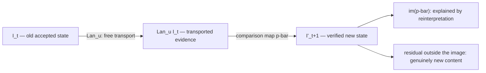

Your model is a world-class recombiner. That's not an insult — it's a category error to call it anything else.

Hand it the whole corpus of structural biology and it will produce fluent, plausible, occasionally correct recombinations of everything already written down. What it won't do, on its own, is notice that the *vocabulary* it's reasoning in is the thing that's wrong, tear it up, and prove the replacement earned its place. That gap finally has a name — and, for once, a piece of real mathematics behind it.

A new MIT preprint draws the line cleanly. Fiona Y. Wang and Markus J. Buehler lay out a formal, category-theoretic account of what it would take for an AI system to revise its own reasoning structures, not just optimise inside the rules it was handed. The paper is [*Self-Revising Discovery Systems for Science*](https://arxiv.org/abs/2606.01444), posted to arXiv on 31 May 2026. It's a preprint, not peer-reviewed, and the demonstrations are narrow materials-science cases — keep that firmly in mind before anyone sells you a "self-evolving AI scientist" on the strength of it.

But the spine of the argument is the most useful thing I've read on agentic systems in months. It tells you what discovery *is*, structurally, with no appeal to how surprised anyone felt.

## Why a builder should care

I build agent systems that have to survive an audit. Typed artifacts, provenance, gates in the path, and — the unglamorous one nobody funds — knowing whether a step actually *changed the model* or just overwrote a number. This paper is a formal account of exactly that distinction, which is why I'm writing about it instead of the week's model releases.

The authors separate three operations that practitioners constantly blur into one undifferentiated "the agent did stuff" log:

-   **Retrieval** adds an artifact your schema already knows how to express. You now *hold* something you could always have described.
    
-   **Search** finds a new *combination* inside a fixed vocabulary. The space of admissible things is unchanged; you found a better point in it.
    
-   **Discovery** changes the vocabulary itself — the types, operations, tools, or tests under which every future artifact will be judged.
    

The first two never alter what *kinds* of things can exist. Only the third does. That makes discovery a **structural fact about the system, not a feeling** — and a structural fact is auditable. That's the whole game.

The lineage is Popper, Kuhn, Lakatos: science as the revision of frameworks, not the accumulation of answers. The contribution here is making "revision of framework" precise enough to *check*.

## A discovery system's state is a copresheaf

Here's the modelling, light on symbols. A regime carries a *schema category* $\mathcal{S}_b$: its objects are the **types** of artifact you allow (a contact graph, a fitted model, a measurement, a failed run), and its arrows are the **operations** permitted between them. The system's state at time $t$ is a functor

$$
I_t : \mathcal{S}_b \longrightarrow \mathbf{Set}
$$

— a *copresheaf*. Read it concretely: for each type $A$, the set $I_t(A)$ holds the actual artifacts of that type you currently have; for each operation $f : A \to B$, the function $I_t(f)$ records how applying it turns an $A$\-artifact into a $B$\-artifact. The point of the functor is that it cleanly separates the *regime* (the schema, which can stay fixed) from its *contents* (the population, which grows).

Now the object worth slowing down for. Take the **category of elements** of that functor,

$$
\textstyle\int_{\mathcal{S}_b} I_t,
$$

whose nodes are individual artifacts $(A,x)$ and whose edges $(A,x)\to(B,y)$ exist exactly when some operation actually took $x$ to $y$. It does not *depict* a provenance graph. It **is** the typed provenance graph — every accepted artifact, its parents, and the operation that made it. Lineage stops being logging you bolt on afterwards and becomes the mathematical object you are computing in.

This is the part the vendors gloss. Everyone ships a "lineage view." Almost no one has lineage as the *substrate the reasoning actually runs on*.

> By the covariant Yoneda lemma, an artifact is known entirely by the typed operations it can enter and the things those operations make of it. In plain terms: a thing *is* what you can do with it and what comes out. That is exactly the discipline you want in an agent's memory — identity by lineage, not by vibes.

Bundle the regime as a tuple $b = (\mathcal{S}_b, \Gamma_b, V_b, L_b)$ — schema, generators, a **verifier**, and an optional description-length functional — and the whole live state becomes one object the paper calls a knowledge–computation graph: knowledge, computation, the gate that rejects, and the discourse around claims, all in a single executable, verifier-aware structure. Flatten it and you recover an ordinary knowledge graph; keep the production edges but drop the gates and you recover a workflow-provenance graph. The claim is that you want all of it at once.

## The audit contract most stacks quietly fail

Routine work inside a fixed regime is just an update on these states — an endofunctor

$$
\Phi_b : [\mathcal{S}_b,\mathbf{Set}] \longrightarrow [\mathcal{S}_b,\mathbf{Set}].
$$

And here is where the formalism earns its keep as engineering rather than ornament. Calling $\Phi_b$ an **endofunctor** is a real claim, not free notation. A raw program that maps one JSON ledger to another is merely an endomap. It becomes a *functor* only when it also preserves refinement: if a state $J$ extends a state $I$ by adding verified artifacts without overwriting prior provenance, then $\Phi_b(J)$ must extend $\Phi_b(I)$ the same way.

In practitioner terms, that contract is a checklist a real system passes or fails:

-   **stable artifact IDs** that are never reassigned,
    
-   **typed tool and skill signatures**,
    
-   **explicit parent lineage** on every artifact,
    
-   **append-only history with explicit supersession** instead of in-place overwrites,
    
-   **recorded status for failed and retried calls**,
    
-   and **no silent merge or delete** of accepted artifacts.
    

Miss any one and your "update" isn't a clean function on states — it's a thing that quietly forgets, and the audit you promised a regulator is fiction. The familiar version: *if you refactor the pipeline, old valid workflows must still compose.*

I'll put it more bluntly than the paper does. If your agent framework mutates records in place, reuses IDs, or drops failed calls on the floor, you don't have a discovery system. You have a confident text generator with a database bolted to it, and none of the mathematics below applies to you. Fix the contract first.

And before anyone objects that reality is stochastic — agents sample, tools fail, schedulers branch — the framework absorbs that without flinching: read $\Phi_b$ as a stochastic kernel, a morphism in the Kleisli category of a probability monad. The structural claims survive; the clean notation is just the clearest way to show them.

## Discovery = transport + residual

Now the real move. A genuine regime change is a schema map

$$
u : \mathcal{S}_b \longrightarrow \mathcal{S}_{b'}
$$

— a translation from the old vocabulary into a richer one. Old evidence isn't thrown away; it's carried across by the **left Kan extension** $\operatorname{Lan}_u I_t$. Think of it as the laziest *honest* re-reading of your old data in the new language: the most you can say in the new vocabulary using only what the old data already supported, and nothing more.

Then you compare. A comparison map

$$
\bar\rho : \operatorname{Lan}_u I_t \longrightarrow I'_{t+1}
$$

lands the transported old evidence inside the new state. Its image is what reinterpretation alone explains. Everything *outside* that image is genuinely new content — and because this is all set-valued, you can price it in bits.

The sharpest line in the paper is the **Kan obstruction**. If the new regime introduces a type $A'$ that no operation can reach from the old world, transport gives you nothing:

$$
(\operatorname{Lan}_u I_t)(A') = \varnothing.
$$

> You cannot conjure a new variable by reinterpreting old data. That single empty set is the formal wall between search and discovery.

An isolated new type — a quantity nothing old can produce — starts life genuinely empty. The only way to populate it is to go get new evidence, run a new tool, admit a new construction. Transport is honest about its own limits, which is more than most "novelty scores" manage.

Discovery, then, is **transport plus residual — never transport alone.**

## The protein example, end to end

Abstraction is cheap; the paper's most convincing section is a concrete run. A **Builder/Breaker** loop tries to learn a symbolic law for how flexible each residue in a protein is. A *Breaker* hunts for proteins that expose the current model's failures; a *Builder* edits a symbolic computation graph to fix them; a gate decides what survives.

The physics is the Gaussian Network Model — represent a protein as an elastic mass-and-spring network and a residue's mobility falls out of its contact topology alone. Build the contact graph at cutoff $r_c = 10\,\text{Å}$, form the Kirchhoff (graph-Laplacian) matrix $\Gamma_p$, take its eigenmodes

$$
\Gamma_p\,\mathbf{u}_{pk} = \lambda_{pk}\,\mathbf{u}_{pk},
$$

and read off a per-residue **compliance** — softness summed over every nonzero mode:

$$
C_{pi} = \sum_{\lambda_{pk}>0} \frac{u_{pik}^{2}}{\lambda_{pk}}.
$$

This isn't a learned feature; it's the harmonic mobility implied by the contacts, and standard GNM ties it straight to the crystallographic B-factor. The learning target is the per-chain z-scored B-factor, so the task is to explain the *pattern* of flexibility along a chain, not its absolute scale.

After paired refitting under the gate, the surviving law is strikingly compact:

$$
\widehat{B}^{(z)}_{pi} = \alpha + \beta\,\phi_{pi}\,\psi_{pi},
$$

with $\phi$ a compressed log-compliance coordinate, $\psi$ a clipped slow-mode participation weight, and gate-accepted constants $\alpha=-0.1332$, $\beta=0.2239$, $\theta=2.2678$. In words: *a residue's flexibility is its local compliance expressed through its participation in the dominant collective mode.* Soft but not aligned with the slow mode — down-weighted. Slow-mode participation without local compliance — not enough.

Now the categorical payoff, and it's genuinely illuminating. The discovery is *not* "the system used a normal mode" — modes were in the schema from the start. What changed is that the regime came to admit a new multi-input morphism,

$$
\texttt{LogNormCompliance} \times \texttt{ReLUModeAmpl} \longrightarrow \texttt{ModeConditionedCompliance}.
$$

Run a Kan-transport audit over each accepted step and every new type sorts into three buckets: **generator-reachable** (an old type hands it a one-step morphism), **composite-reachable** (it only appears once a new multi-input composition is admitted), or **isolated** (even composites can't reach it). The two ingredient features are generator-reachable — just new transforms of quantities already present. But the *product* is composite-reachable only: it cannot exist until the regime admits the operation that multiplies the two. **That product is the scientific commitment. That is the discovery, located to the morphism.**

And the honesty numbers are why I trust it. Across the three accepted regime transitions, the description-length accounting reads:

-   **0 → 1** (regime split) — admits a *boundary product*; model code $+39.1$ bits, net MDL gain $+9.0$ bits.
    
-   **1 → 2** (ontology break) — nothing new beyond the GNM base; model code $-14.4$ bits, net MDL gain $+37.3$ bits.
    
-   **2 → 3** (regime split) — admits *mode-conditioned compliance*; model code $-10.3$ bits, net MDL gain $+54.3$ bits.
    

Read the model-code and gain columns together and you catch something a naive "accuracy went up" story misses entirely: the later accepted transitions **shrink** the model code while delivering the **largest** compression gains. The law gets *simpler* even as it explains more. Discovery here includes retraction and compression, not just accretion.

The descriptive fit even wanders the wrong way — $R^2$ goes $0.48 \to 0.68 \to 0.54 \to 0.41$ — which under a monotone success metric looks like decay. It isn't. Each score is computed on a *harder, larger* evidence set as the Breaker keeps adding adversarial proteins (open and closed adenylate kinase, PDB 4AKE and 1AKE — a textbook hinge motion that punishes any model trusting a single static structure). Chasing monotone $R^2$ would just reward bolting on terms. Across the whole run the gate admits **25 of 388** proposed edits — about 6.4% — and structure-recombining moves survive far more often than bare feature additions. That selectivity is the system refusing to mistake fit for understanding.

## The gates: MDL and AIC

Everything above hinges on the verifier $V_b$ — the thing that refuses to commit an artifact just because an agent proposed it. The paper instantiates two classic gates.

The Builder/Breaker loop runs on **Minimum Description Length**: score a model by the total bits to state the model *and* the data given it,

$$
L(M, D) = L_{\text{model}}(M) + L_{\text{data}}(D \mid M),
$$

and admit a revision $M'$ only if it pays for itself on the *enlarged, shared* evidence after both models are refit on it:

$$
L(M', D \cup E) < L(M, D \cup E).
$$

That is the formal sense in which a productive failure becomes structure: a new law must explain the counterexamples well enough to cover its own extra bits. Because the comparison is paired and re-evaluated on each enlarged set, a single monotone score is exactly the *wrong* thing to track.

The second case study swaps in **Akaike**, $\mathrm{AIC} = 2k - 2\ln\hat{L}$ (lower wins), to select an anisotropic, orientation-tensor stiffness surrogate over a simpler isotropic fiber-count descriptor — and the rejected descriptor isn't deleted, it's kept as typed provenance. Of course it is. *That's the contract.* Model selection itself, including the road not taken, becomes part of the auditable graph.

## What this means if you ship agents

The mathematics does two jobs at once. As a *language*, it gives discovery a definition with no subjective novelty in it: a verified change of regime with non-trivial residual content, priced in bits. As a *specification*, it hands you an unforgiving checklist — type your artifacts and operations; make provenance the category of elements; put a principled gate in the path; transport old evidence explicitly and compute the residual; and when a new type's transport comes back empty, believe it and go get new data instead of reinterpreting old.

Here's the part that should change how you budget. Searching harder inside a fixed regime — however vast — is a *categorically different operation* from minting a new representational commitment and proving, against preserved old evidence, that it added something transport couldn't. A bigger model gets superhuman at recombination and may never, once, change the vocabulary. That is not a scale problem you spend your way out of. It's a structure problem, and the empty set $(\operatorname{Lan}_u I_t)(A') = \varnothing$ is the proof.

So read [the paper](https://arxiv.org/abs/2606.01444) — and then go check whether your stack could even pass the audit contract. Most can't. Mine has work to do too. That's the useful kind of paper: not the one that tells you you're winning, the one that hands you the test you've been failing without a name for it.

* * *

*Tarry Singh is the founder and CEO of Real AI (realai.eu), an enterprise AI advisory and deployment firm working with global enterprises on production agent systems, model risk, and AI sovereignty strategy. He also leads Earthscan (earthscan.io) for Energy AI, and is a founding contributor to the EU-funded HCAIM and PANORAIMA programmes for responsible AI education across European universities. He writes at tarrysingh.com.*
